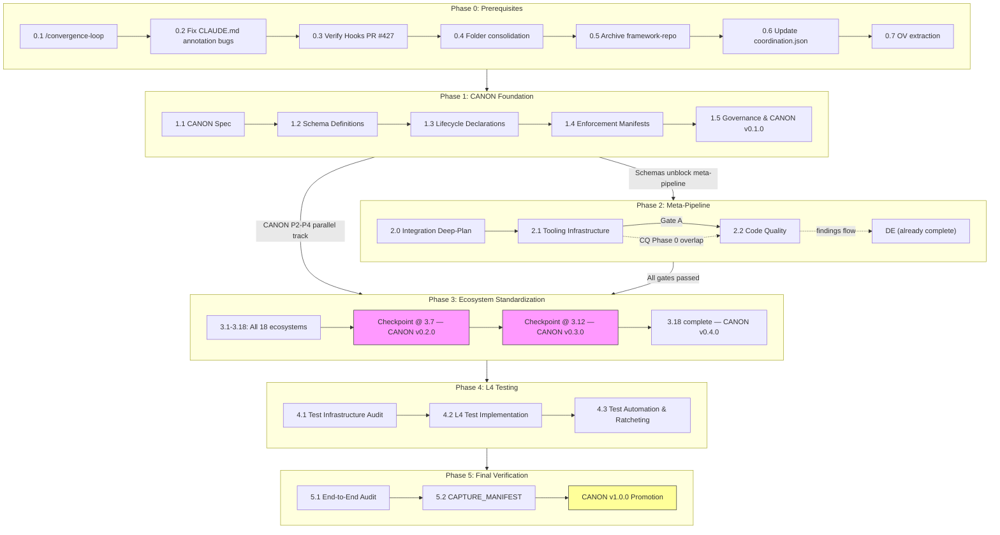

# System-Wide Standardization — Implementation Plan (v3)

<!-- prettier-ignore-start -->
**Document Version:** 3.0
**Last Updated:** 2026-03-14
**Status:** DRAFT — Pending Approval
**Supersedes:** PLAN.md (v1.1, 21-step sequential) and PLAN-v2.md (rejected draft)
**Decisions:** See [DECISIONS.md](./DECISIONS.md) (92 decisions, 19 tenets, 41 directives) and [DECISIONS-reeval.md](./DECISIONS-reeval.md) (33 Q-decisions from re-evaluation)
**Diagnosis:** See [DIAGNOSIS-v2.md](./DIAGNOSIS-v2.md) (T3-verified, 4-pass convergence)
<!-- prettier-ignore-end -->

---

## Summary

This plan implements the System-Wide Standardization overhaul: a phased
transformation of 18 ecosystems from their current maturity levels to target
levels. SWS is a **meta-plan** — it coordinates two child plans (Tooling
Infrastructure, Code Quality Overhaul) and defines the cross-cutting
infrastructure, sequencing, and gates that bind them together. Data
Effectiveness (Plan 3) is 95% complete and operates independently. The child
plans are execution appendices; SWS owns the structure, not their internal
content.

**Structure:** 6 phases replace the original 21-step sequential model [Q1]:

| Phase | Name                      | Purpose                                                       |
| ----- | ------------------------- | ------------------------------------------------------------- |
| 0     | Pre-Requisites            | Skill builds, bug fixes, folder cleanup                       |
| 1     | CANON Foundation          | Schemas, migration mechanics, testing, views                  |
| 2     | Meta-Pipeline Execution   | 2 child plans (overlapping with gate) + integration deep-plan |
| 3     | Ecosystem Standardization | 18 ecosystems in dependency order                             |
| 4     | L4 Testing                | Comprehensive test coverage across all systems                |
| 5     | Final Verification        | End-to-end convergence audit                                  |

**Effort Estimate (CANON composite per Q17):**

| Metric       | Value                                                                                                       |
| ------------ | ----------------------------------------------------------------------------------------------------------- |
| Complexity   | XL                                                                                                          |
| Sessions     | ~60-90 (down from 80-130 — child plans reduce per-ecosystem work)                                           |
| Waves        | 6 phases, child plans add ~30 internal waves                                                                |
| Deliverables | CANON infrastructure, 2 child plan outputs (DE already complete), 18 standardized ecosystems, L4 test suite |

**Key references:** D67 (locked sequence), D49 (CANON enforcement), D9 (16-item
checklist), D81-D83 (audit framework), T1-T24 (core tenets), Q1-Q33
(re-evaluation decisions).

---

## Amended Tenets (T1-T24)

Foundation tenets T1-T6 unchanged. T7/T8/T9/T11 replaced with stronger versions
[Q9]. New tenets T20-T24 added from user directives and DIAGNOSIS-v2 findings.

### Unchanged (T1-T6, T10, T12-T19)

These tenets carry forward from DECISIONS.md without modification:

- **T1** canon_is_ecosystem_zero
- **T2** source_of_truth_generated_views
- **T3** maturity_is_measurable
- **T4** jsonl_first
- **T5** contract_over_implementation
- **T6** room_for_growth
- **T10** validate_before_scaling
- **T12** idempotent_operations
- **T13** plan_as_you_go
- **T14** capture_everything_surface_what_matters
- **T15** interactivity_first
- **T16** single_ownership_many_consumers
- **T17** declarative_over_imperative
- **T18** changelog_driven_traceability
- **T19** extensive_discovery_first

### Replaced (per Q9 — old wording archived in rationale)

**T7. platform_agnostic_by_default** (strengthened)

All CANON artifacts, scripts, and tooling MUST work identically across
platforms. Node.js over bash. Use Node's `path` utilities (`path.join`,
`path.normalize`, `path.resolve`) — avoid hard-coded path separators. LF line
endings. **Enforcement:** Pre-commit hook rejects bash-only scripts and
backslash paths.

_Previous: advisory only, no enforcement mechanism._

**T8. automation_over_discipline** (strengthened)

If enforcement relies on human memory, it is a bug. Every rule MUST have an
automated gate (hook, CI, script). Rules without gates are aspirational, not
real. Manual processes are tracked as DEBT until automated.

_Previous: "Automate enforcement or accept non-compliance" — too permissive._

**T9. crash_proof_state** (strengthened)

State MUST survive compaction, session boundaries, crashes, and network
failures. All state files MUST have Zod schemas (new immediately, existing 42
incrementally per Q8). State recovery is tested, not assumed.

_Previous: no schema requirement, no testing requirement._

**T11. fail_loud_fail_early** (strengthened + merged with passive-surfacing
prohibition)

Failures MUST block, not warn. Pre-commit catches before PR. Session-start
surfaces before work begins. Silent failures are S0 severity. Warnings that
persist 3+ sessions without action MUST escalate to an interactive, blocking
decision point (fix now vs create DEBT) with explicit user confirmation before
any DEBT entry is created (per escalation pattern from Automation Gap Closure).
**No passive surfacing of information — all data surfaces MUST require action or
acknowledgment.** Unacknowledged warnings become wallpaper and are treated as
bugs.

_Previous: "errors block, they don't whisper" — no escalation, no passive
surfacing prohibition._

### New Tenets

**T20. research_convergence_loops** (T3 dual-form per Q5)

Research requires convergence loops, not single passes. Multi-agent,
multi-angle. Each pass verifies prior claims + explores new angles. Explicit
tally (Confirmed/Corrected/Extended/New). Convergence = no material corrections
AND no unexplored angles. Minimum 2 passes. All corrections cite evidence.
**Skill:** `/convergence-loop` — standalone skill, many callers. _See:
memory/t3_convergence_loops.md for full wording and integration targets._

**T21. shadow_append_protection** (per Q21)

Source JSONL files are append-only (sacred). Views are generated/regenerable. No
script may overwrite a source JSONL — only append. Automation enforces this (no
human gate). Each plan declares a scope manifest listing which JSONL files it
writes to, enabling design-time collision detection.

**T22. honest_findings_only**

No placating. Findings, audits, and reports MUST reflect actual state — never
softened, hedged, or diplomatically framed to avoid uncomfortable truths. If
something is broken, say it's broken. If quality is poor, say quality is poor.
Honest assessment is a prerequisite for improvement.

**T23. all_planning_via_deep_plan**

ALL non-trivial planning MUST use the deep-plan method. No ad-hoc plans, no
"quick outlines," no plans that skip discovery. If it has 5+ design decisions,
it gets a deep-plan. This ensures exhaustive discovery, explicit decision
records, and self-audit before execution.

**T24. robust_testing_required**

ALL testing MUST be robust — semantic, functional, LSP-verified. Not just grep
pattern matching or string presence checks. Tests must verify actual behavior,
not superficial indicators. Mock boundaries must match real system boundaries.
Test assertions must be meaningful (not `expect(result).toBeDefined()`).

### Directive: Zod 4 Only (per Q32)

All schemas use Zod 4 syntax. No Zod 3 compatibility shims. Enforced immediately
across all plans. Zod 4 is already installed (v4.3.5) — no migration needed
[Q16].

### Directive: Composite Effort Estimates (per Q17)

No hours-based estimates anywhere in the project. All effort uses CANON
composite: complexity (S/M/L/XL) + sessions + waves + deliverables. This applies
to the meta-plan and all child plans.

---

## Cross-Cutting Protocols

These protocols apply to ALL phases and ALL ecosystems. They are defined once
here and referenced throughout. Originally specified in PLAN.md (v1.1) as
cross-cutting infrastructure — restored here because V2 orphaned them.

### 1. Per-Ecosystem Deep-Plan (T13 plan_as_you_go)

Every ecosystem gets its own `/deep-plan` session before implementation begins.
Phase 0 of each deep-plan consults the knowledge base (D75):

- `.planning/system-wide-standardization/` — all artifacts from this overhaul
- PR Review v2 patterns (`.planning/milestones/v1.0-ROADMAP.md`)
- Prior ecosystem deep-plan decisions (accumulated as we go)
- `.canon/changelog.jsonl` — cross-ecosystem impact log

Framework-repo is archived [Q33] — the codebase itself is the living reference.
Git history preserves the original snapshot if needed.

### 2. Per-Ecosystem Exit Criteria (D69)

Every ecosystem completes with:

1. 16-item checklist scorecard — each item completed or formally deferred with
   justification (per D54)
2. Brief user review of scorecard + deferrals
3. Changelog entries for all cross-ecosystem impacts (T18)
4. Health checker(s) passing
5. Tests passing (existing + new)
6. `/convergence-loop` verification of completion claims [Q5, T20] — minimum 2
   passes confirming ecosystem meets its target maturity level with no material
   gaps

### 3. ROADMAP Integration (D70)

After each ecosystem completes:

1. Add work items to ROADMAP.md under Track-CANON
2. Run dedupe against MASTER_DEBT (per directive #35)
3. Update SESSION_CONTEXT.md quick status

### 4. Learning Capture (D76, T18, directive #37)

Learnings captured DURING ecosystem builds via:

- `.canon/changelog.jsonl` entries (continuous)
- CANON version bumps at checkpoints (batched formalization)
- `forward-findings.jsonl` entries for cross-plan knowledge transfer [Q30, Q31]
  — findings from any plan that affect other plans or ecosystems are written to
  `.claude/state/forward-findings.jsonl` using the CANON-defined schema
  (source_plan, finding_type, pattern, severity, target_ecosystem, timestamp).
  The learning-router consumes from this intake point.

### 5. Rollback Protocol (D68, T12, T9)

Every ecosystem step has a defined rollback path. Git-revert-based rollback is
the mechanism (not branch-based). These are **migration-safety tags** — they
mark the pre-migration state so that data transformations can be safely
reverted. They are NOT checkpoint tags (checkpoint tags were descoped per Q20 —
state files handle checkpoint persistence).

Protocol:

1. **Pre-migration snapshot:** Before each ecosystem's implementation begins,
   tag the repo: `git tag pre-<ecosystem-id>-migration` (e.g.,
   `pre-skills-migration`)
2. **Rollback trigger:** If an ecosystem step leaves the repo in a worse state
   than before (health checkers regressing, tests failing, cross-ecosystem
   breakage), rollback is available
3. **Rollback execution:** `git revert` the commits from the ecosystem step back
   to the tagged snapshot
4. **Post-rollback:** Log the rollback in `.canon/changelog.jsonl` with reason,
   create TDMS item for the root cause, then re-attempt with amended approach

Rollback is a safety net, not a substitute for validation. Each ecosystem
deep-plan should identify step-level rollback boundaries within their
implementation.

### 6. Schema Versioning Strategy (D24, T12, D22)

All `.canon/schemas/*.schema.ts` files include a `SCHEMA_VERSION` export. All
schemas MUST use Zod 4 syntax [Q32] — no Zod 3 compatibility shims. Zod 4 is
already installed at v4.3.5 [Q16].

Protocol:

1. **Additive changes** (new optional fields): patch version bump, no migration
   needed (D22 extensible-core)
2. **Breaking changes** (renamed fields, removed fields, type changes): minor
   version bump, migration script REQUIRED before merge
3. **Structural changes** (new required fields, schema splits): major version
   bump, migration script + cross-ecosystem impact assessment required
4. **Pre-commit validation:** Schema files must have valid `SCHEMA_VERSION`
   export; JSONL data files must validate against their declared schema version

Schema version tracking is a Phase 1 (CANON Foundation) deliverable. Individual
ecosystem deep-plans inherit this infrastructure.

### 7. Migration Validation Protocol (T10, T11, T12)

When any step migrates data from one format to another (e.g., markdown -> JSONL,
unstructured -> schema-validated), the following protocol applies:

1. **Pre-migration:** Tag snapshot (see Rollback Protocol above)
2. **Migration execution:** Transform data, validate output against target
   schema
3. **Post-migration validation:** Every migrated record checked for:
   - Schema compliance (Zod validation passes)
   - Data completeness (no fields lost in transformation)
   - Cross-reference integrity (all IDs/references still resolve)
4. **Finding disposition — user's choice at each finding:**
   - **Fix in-place:** Resolve the finding before proceeding (recommended for
     anything blocking downstream work)
   - **Log to TDMS:** Create debt item with source `canon-migration` and
     ecosystem reference for later resolution
   - User decides per-finding — not auto-routed by severity
5. **Archive originals:** After validated migration, move source files to
   `.archive/<ecosystem-id>/<datestamp>/` (preserves history, removes from
   active tree). Git history provides additional safety net.
6. **Cross-reference map:** When migration changes IDs or anchors, create/update
   `.canon/.xref.json` mapping old references to new locations. Validation step
   checks all docs for stale references.

### 8. Per-Phase Regression Check (T10, T11)

At the end of each ecosystem step (before exit criteria sign-off):

1. Run the full existing test suite — zero regressions allowed
2. Run health checkers for ALL previously-completed ecosystems — no degradation
3. If regressions found: fix before proceeding (these are blockers, not
   deferrable)

This is separate from checkpoint validation. Checkpoints validate strategic
progress; regression checks validate that nothing broke.

### 8b. Convergence-Loop Phase Self-Audit (T20, T25)

At the end of each phase (after regression check, before proceeding to next
phase), run a `/convergence-loop` self-audit to verify that all "Done when"
criteria were actually met — not just claimed met. This catches gaps like
integration targets listed but never wired in, or exit criteria narrower than
the step's stated scope.

**Protocol:**

1. **Collect claims** — gather all "Done when" criteria from the phase's steps,
   plus any integration targets listed in step implementation notes
2. **Run convergence-loop** — quick preset for phases with <10 claims, standard
   preset for phases with 10+ claims
3. **Present results** — user reviews convergence report before phase is declared
   complete
4. **Remediate** — any failed claims must be fixed or explicitly deferred with
   justification before the next phase begins

**Phase-specific guidance:**

| Phase   | Claims Source                       | Preset   | Mid-Phase Audit? |
| ------- | ---------------------------------- | -------- | ---------------- |
| Phase 0 | 7 steps, ~7 "Done when" criteria   | quick    | No               |
| Phase 1 | 6 steps, ~6 criteria + schemas     | standard | No               |
| Phase 2 | 2 child plans, meta-pipeline gates | standard | After Step 2.1   |
| Phase 3 | 18 ecosystems, 3 checkpoints       | thorough | At 3.7 and 3.12  |
| Phase 4 | 3 steps, test coverage metrics     | standard | No               |
| Phase 5 | Final audit — IS the convergence   | N/A      | N/A              |

Phase 3 is the largest and gets mid-phase convergence audits at both existing
checkpoints (3.7 and 3.12), in addition to the end-of-phase audit. Phase 5 is
itself a convergence audit (Step 5.1) so no separate self-audit needed.

### 9. Born-Compliant Timing (D26)

Born-compliant gates (new artifacts must meet the ecosystem's standard) activate
AFTER the ecosystem step is marked complete, not during implementation. During
implementation, the ecosystem is in transition — enforcing standards on
in-progress work creates circular dependencies. Each ecosystem's deep-plan
should note the activation point for its born-compliant gate.

### 10. Checkpoint Concrete Metrics (D69, D67)

Each checkpoint has quantitative pass/fail criteria defined in its phase
section. Checkpoints are NOT subjective assessments — they are measurable gates.
If metrics aren't met, the checkpoint fails and iteration is required before
proceeding.

The phased structure defines checkpoints at:

- **Phase 1 gate:** CANON schemas exist and validate — child plans can proceed
- **Phase 3 Checkpoint 3.7:** Core infrastructure complete (6 ecosystems + CANON
  pilot validated)
- **Phase 3 Checkpoint 3.12:** Data infrastructure standardized (4 additional
  ecosystems)
- **Phase 5:** End-to-end convergence audit across all 18 ecosystems

See individual phase sections for specific metrics at each checkpoint.

---

## Phase 0: Pre-Requisites

**Complexity:** M | **Sessions:** 3-5 | **Waves:** 2 | **Deliverables:** 7

Everything here MUST complete before Phase 1 begins. All steps are
parallelizable except Step 0.3 which depends on Step 0.1.

### Step 0.1: Build `/convergence-loop` Skill

Per Q5 — Step 0 pre-requisite before meta-pipeline. T20 defines WHEN/WHY, this
skill defines HOW.

**Implementation:**

- Use `/skill-creator` to build `.claude/skills/convergence-loop/SKILL.md` with
  agent prompt templates, tally formats, convergence decision logic, domain
  slicing patterns
- Skill takes: claims set + domain slicing strategy as input
- Skill outputs: verified claims set + convergence report
- Integration targets (high-value): deep-plan Phase 0, all 9+ audit skills, code
  review, /systematic-debugging, doc-code sync, plan self-audit
- Integration targets (medium): test generation, migration verification, PR
  review processing
- After creation, run `/skill-audit` to validate quality and behavioral
  correctness

**Canonical skill creation flow (applies to ALL skill builds in SWS):**
`/skill-creator` → `/skill-audit`. No skill ships without both steps.

**Done when:** Skill exists, passes `/skill-audit`, is registered in skill
registry, and has been validated by running it against the DIAGNOSIS-v2.md
claims (meta-test: the skill verifies the document that motivated its creation).

### Step 0.2: Fix CLAUDE.md Annotation Bugs

Per Q14 + Q15 — immediate fixes.

**Implementation:**

- Reclassify 4 annotations from `[BEHAVIORAL]` to `[GATE: patterns:check]`:
  error sanitization, path traversal, test mocking, file reads
- Fix any other annotation mismatches found during reclassification

**Done when:** Every CLAUDE.md rule annotation accurately reflects its actual
enforcement mechanism. No BEHAVIORAL annotations on rules with GATE enforcement.

### Step 0.3: Verify Hooks PR #427

Per Q7 — run `/convergence-loop` on Hooks PR #427 (35 decisions, 6 learnings).
Verify claims about implementation completeness.

**Done when:** Convergence report confirms implementation matches plan, or
issues are logged for remediation. **Depends on:** Step 0.1 (needs the skill).

### Step 0.4: Folder Consolidation

Per Q27 — physical `git mv`.

**Implementation:**

- `git mv .planning/tooling-infrastructure-audit/ .planning/system-wide-standardization/tooling-infrastructure-audit/`
- `git mv .planning/code-quality-overhaul/ .planning/system-wide-standardization/code-quality-overhaul/`
- `git mv .planning/learnings-effectiveness-audit/ .planning/system-wide-standardization/learnings-effectiveness-audit/`
- Update all internal cross-references in moved files
- Update any external references (ROADMAP.md, SESSION_CONTEXT.md, state files)

**Done when:** All 3 child plan folders live under
`.planning/system-wide-standardization/`, all references updated,
`git log --follow` confirms history preserved.

### Step 0.5: Archive Framework-Repo

Per Q33 — codebase is the living reference.

**Implementation:**

- `git rm -r .planning/system-wide-standardization/reference/framework-repo/`
- Git history preserves the snapshot for future reference if needed

**Done when:** Directory removed. No broken references remain.

### Step 0.6: Update coordination.json

Reflect restructured plan state in the coordination file.

**Implementation:**

- Update `.planning/system-wide-standardization/coordination.json` to reference
  PLAN-v3.md, DECISIONS-reeval.md, consolidated child plan paths, and current
  phase status

**Done when:** `coordination.json` reflects restructured plan state. All file
references point to current (not stale) artifacts.

### Step 0.7: Operational Visibility Extraction

Per Q24 — extract 5 framework items, remove only those from ROADMAP sprint.

**Implementation:**

- Extract from Operational Visibility Sprint to SWS scope:
  - D2 (pre-commit optimization) -> Phase 3 ecosystem: Hooks
  - D4 (CI gates) -> Phase 3 ecosystem: CI/CD
  - D10 (script test coverage) -> Phase 3 ecosystem: Scripts
  - E1 (warning collector hook) -> Phase 3 ecosystem: Hooks
  - E2 (session health JSON) -> Phase 3 ecosystem: Sessions
- Update ROADMAP.md: remove these 5 items from sprint, add note that sprint
  remains as app-level work
- Sprint itself stays in ROADMAP as app-level work (not archived)

**Done when:** 5 items documented in SWS ecosystem queue, removed from
Operational Visibility Sprint in ROADMAP, sprint still listed as app-level work.

---

## Phase 1: CANON Foundation

**Complexity:** L | **Sessions:** 6-10 | **Waves:** 4 | **Deliverables:** 4+

Per Q6 — Full Spec Phased Delivery. This phase delivers CANON Phase 1 (schemas,
migration mechanics, testing, generated views, and self-assessment) which
unblocks all child plans. CANON Phases 2-4 run in parallel with the
meta-pipeline (Phase 2 of this plan).

### Step 1.1: Schema Definitions

Create `.canon/` at repo root with foundational schemas and configuration.

**Directory structure:**

```
.canon/
  canon.json                         # CANON meta: version, config
  tenets.jsonl                       # Core tenets (first artifact -- D32)
  tenets.md                          # Generated view
  ecosystems.jsonl                   # Registry (one line per ecosystem)
  changelog.jsonl                    # Cross-ecosystem change log (T18, D72)
  schemas/
    ecosystem-registry.schema.ts     # Zod 4: ecosystem registry line
    assessment.schema.ts             # Zod 4: maturity assessment
    enforcement-manifest.schema.ts   # Zod 4: enforcement rules
    changelog.schema.ts              # Zod 4: changelog entry (D72)
    health-report.schema.ts          # Zod 4: health report envelope (D25)
    tenet.schema.ts                  # Zod 4: tenet entry (D32)
    directive.schema.ts              # Zod 4: directive declaration
    forward-findings.schema.ts       # Zod 4: forward-findings entry (Q31)
  config/
    defaults.json                    # Global defaults (D5)
    shadow-append-registry.json      # Sacred JSONL files (Q21)
    scope-manifests/                 # Per-plan collision detection (Q21)
    overrides/                       # Per-ecosystem overrides
  reports/                           # Generated dashboards/matrix views
  scripts/
    generate-tenets-md.js            # JSONL -> MD view generator
    generate-ecosystem-matrix.js     # Cross-ecosystem matrix view
    generate-changelog-md.js         # Changelog human view
    validate-canon.js                # Self-validation (D49 self-protection)
    check-canon-health.js            # Health checker (D17)
    scan-changelog.js                # Pre-check for TDMS items (D73)
  ecosystems/
    {id}/                            # Per-ecosystem dirs (created per-step)
      assessment.jsonl               # Maturity assessment (D23)
      enforcement.jsonl              # Enforcement manifest (D26)
      contracts/                     # Inter-ecosystem contracts (D74)
```

**Schemas to create (all Zod 4 per Q32):**

- **Ecosystem declaration** — name, owner, maturity level, health checker path
- **Tenet declaration** — id, name, wording, enforcement mechanism, version
- **Directive declaration** — id, scope, rule, enforcement
- **Changelog entry** — ecosystem, change_type, impact, timestamp
- **Health checker output contract** (T5) — score, trend, recommendations, JSON
  envelope + JSONL findings per D25
- **Enforcement manifest entry** — rule, gate_type, gate_path, severity
- **Maturity assessment** — ecosystem_id, assessed_at, level, 16-item checklist
  with item statuses and evidence (see V1 Step 1d for full schema)
- **Forward-findings entry** [Q31] — source_plan, finding_type, pattern,
  severity, target_ecosystem, timestamp

**Configuration to create:**

- Shadow-append registry [Q21] — which JSONL files are sacred sources (append-
  only, never overwritten). Initial list:
  `docs/technical-debt/raw/deduped.jsonl`,
  `docs/technical-debt/MASTER_DEBT.jsonl`,
  `.claude/state/learning-routes.jsonl`, `.claude/state/forward-findings.jsonl`,
  `.claude/state/pending-refinements.jsonl`, and all `changelog.jsonl` files
- Scope manifests per plan [Q21] — design-time collision detection listing which
  JSONL files each plan writes to

**Ecosystem registry (D2, D22):**

Create `.canon/ecosystems.jsonl` with one line per ecosystem. Populate with all
18 ecosystems from the assessment table in DECISIONS.md (Section 4). Schema uses
extensible-core (D22) so new fields can be added without breaking changes.

**Tenets — first CANON artifact (D32):**

Migrate the tenets from `.planning/system-wide-standardization/tenets.jsonl` to
`.canon/tenets.jsonl`. Each line:
`{ "id": "T1", "category": "foundation|design|operations|process", "name": "snake_case", "statement": "...", "evidence": ["D1", "D6"], "added": "2026-03-04", "version": "0.1.0" }`

Create `generate-tenets-md.js` — reads `.canon/tenets.jsonl`, outputs
`.canon/tenets.md`. Standard CLI: `--input`, `--output` flags (D27). Node.js
only (T7). Idempotent (T12).

**Changelog infrastructure (T18, D72):**

Create `.canon/changelog.jsonl` with extensible-core schema (D72). Initial
entries written for CANON creation itself. Changelog view generator
(`generate-changelog-md.js`) follows standard CLI interface.

**Done when:** All schemas parse and validate (Zod 4, zero errors). At least one
real artifact validates against each schema (smoke test). Shadow-append registry
lists all known sacred JSONL files. Ecosystem registry has 18 entries validating
against schema. Tenets migrated and generated view in sync.

### Step 1.2: Migration Mechanics

Per G1 — conventions, tooling, testing, rollback for CANON adoption.

**Implementation:**

- Document migration path: how an ecosystem moves from current state to
  CANON-compliant (checklist derived from T3 maturity levels)
- Rollback procedure: if CANON adoption breaks an ecosystem, how to revert (see
  Rollback Protocol in Cross-Cutting Protocols)
- Migration tooling: script that validates an ecosystem's CANON compliance
  (reads declaration, checks health checker exists, verifies schema coverage)
- Migration validation wired to the Migration Validation Protocol (Cross-Cutting
  Protocol #7)

**Done when:** Migration checklist exists. Validation script runs against at
least one ecosystem (PR Review — the CANON pilot per original Step 4).

### Step 1.3: Testing + Documentation

Restored from V1 Step 1h — this was compressed out of V2 but is essential for
CANON to be the exemplar ecosystem.

**Testing:**

- Unit tests for all `.canon/scripts/` (Jest, co-located in
  `.canon/scripts/__tests__/`)
- Tests MUST be robust — semantic, functional verification [T24]. No
  `expect(result).toBeDefined()` placeholder assertions. Test actual behavior:
  schema validation rejects bad input, generators produce correct output, health
  checker scores match expected values.
- Integration test: full roundtrip (write JSONL -> generate views -> validate ->
  verify generated output matches source)
- Error path tests: malformed JSONL handling, missing files, schema version
  mismatches

**Documentation:**

- `.canon/README.md` — CANON spec, getting started, contribution guide
- Covers: directory structure, schema versioning, how to add an ecosystem, how
  to create enforcement manifests, how view generation works

**Done when:** All tests pass. Tests cover happy path, error paths, and
roundtrip integrity. README covers the CANON system comprehensively.

### Step 1.4: Generated Views + Dashboard

Restored from V1 Step 1f — V2 compressed this into Step 1.1 but the view
generation system deserves explicit treatment as a Phase 1 deliverable.

**View generators to create:**

- `.canon/scripts/generate-tenets-md.js` (from Step 1.1 tenet work)
- `.canon/scripts/generate-ecosystem-matrix.js` — cross-ecosystem maturity
  matrix view showing all 18 ecosystems with current/target levels, status,
  effort, and owner
- `.canon/scripts/generate-changelog-md.js` — changelog human-readable view

All scripts follow standard CLI interface: `--input`, `--output` (D27). Node.js
only (T7). Idempotent (T12).

**Dashboard generation:** Hybrid trigger (D18) — auto-generate on data change
(via pre-commit hook detecting JSONL modifications) + on-demand rebuild via npm
script.

**Done when:** All generators produce correct output. Matrix view shows all 18
ecosystems with current/target levels and status. Hybrid trigger wired (pre-
commit detects `.canon/*.jsonl` changes and runs relevant generators).

### Step 1.5: CANON Self-Assessment + Version Trajectory

Restored from V1 Step 1i — CANON must eat its own dog food.

**Self-assessment:**

Run CANON through its own 16-item checklist. CANON must score L5 on all
applicable items — it is the exemplar. The 16 checklist items (D9): Zod schemas,
JSONL storage, generated views, health monitoring, enforcement manifest,
testing, documentation, state persistence, error handling, naming compliance,
configuration, lifecycle hooks, versioning, inter-ecosystem contracts,
rollback/recovery, deprecation policy.

Write CANON's self-assessment to `.canon/ecosystems/canon/assessment.jsonl`.

**Version trajectory (Idea #45):**

| Version | Trigger                                    | Gate                         |
| ------- | ------------------------------------------ | ---------------------------- |
| 0.1.0   | Phase 1 complete (schemas + foundation)    | Phase 1 gate passes          |
| 0.2.0   | Phase 3 Checkpoint 3.7 (CANON pilot valid) | PR Review reaches L5         |
| 0.3.0   | Phase 3 Checkpoint 3.12 (data infra)       | Data-tier ecosystems at L3+  |
| 0.4.0   | Phase 3 complete (all 18 ecosystems)       | All ecosystems at target     |
| 1.0.0   | Phase 5 (final verification)               | End-to-end convergence audit |

Tag: `canon-v0.1.0` when Phase 1 is complete.

**Done when:** CANON at L5 on its own checklist, all schemas compile, all
scripts pass tests, enforcement hooks integrated, self-assessment written,
version 0.1.0 tagged.

### Step 1.6: Enforcement System

Restored from V1 Step 1e — CANON enforcement is bidirectional (D49, directive
#22).

**Internal self-protection:**

- Pre-commit gate: validate `.canon/` files against schemas, tenet changes
  require version bump, no orphaned references
- Pre-push gate: migration script required for breaking changes, all tenet
  references valid
- Integrity checks: `tenets.jsonl` <-> `tenets.md` sync, `ecosystems.jsonl` <->
  per-ecosystem dirs sync

**Downstream propagation:**

- Version broadcast: CANON version bump -> health checkers detect skew
- Contract enforcement: schema change -> dependent manifests fail validation
- Migration automation: breaking changes ship WITH migration scripts (T12)
- Fail-loud cascade: ecosystem >48h behind CANON version -> alerts escalate
  (T11)
- Semver blast radius (D49): patch (<1h), minor (24-48h), major (1-2 weeks
  staggered)

**Files to create:**

- `.canon/scripts/validate-canon.js` — self-validation script
- `.canon/scripts/check-canon-health.js` — health checker (D17 enhanced
  interface: score + trend + recommendations)
- `.canon/ecosystems/canon/enforcement.jsonl` — CANON's own enforcement manifest
- Hook integration: add CANON validation to `.husky/pre-commit` and
  `.husky/pre-push`

**Done when:** `validate-canon.js` passes on current `.canon/` state, health
checker produces JSON envelope + JSONL findings (D25), enforcement manifest has
rules with tier + severity per D26, hooks integrated.

### Phase 1 Audit

Run code-reviewer on all new `.canon/` files. Tier 1 + Tier 2 domains 6, 8 from
the audit framework (D81).

### Phase 1 Gate

**CANON schemas exist and validate. Child plans can proceed.**

All of the following must pass before Phase 2 begins:

1. All `.canon/schemas/*.schema.ts` compile with zero errors (Zod 4)
2. All initial JSONL artifacts (tenets, ecosystems, changelog) validate against
   their declared schemas
3. Shadow-append registry lists all known sacred JSONL files
4. At least one ecosystem (PR Review) validates against the migration checklist
5. All `.canon/scripts/` have passing tests (unit + integration)
6. CANON self-assessment at L5 on its own checklist
7. `canon-v0.1.0` tag applied
8. Generated views (tenets.md, ecosystem matrix) match their JSONL sources

---

## Section 6: Phase 2 — Meta-Pipeline Execution

**Complexity:** XL | **Sessions:** 11-20 | **Waves:** 2 child plans (overlapping
per Q2) + integration deep-plan | **Deliverables:** Per child plan appendices

Per Q2 — overlapping with gates. Two child plans (Tooling Infrastructure, Code
Quality Overhaul) have their own PLAN.md as execution appendices. Data
Effectiveness (Plan 3) is **95% complete** (10/11 waves delivered — see
"Completed: Data Effectiveness" below) and is NOT part of the meta-pipeline
execution sequence.

SWS is a meta-plan — Phase 2 references child plans, does NOT absorb their
content. Only SWS-level additions, remediation directives, and inter-plan gates
are specified here.

---

### Step 2.0: Meta-Pipeline Integration Deep-Plan

Before executing child plans, run `/deep-plan` on the meta-pipeline integration
layer. The original child plans were deep-planned individually, but the
integration concerns (gates, forward-findings pipeline, SWS-level additions,
overlap rules) were never formally deep-planned as a unit.

**Scope:** How Tooling and Code Quality connect — gate definitions, forward-
findings schema, overlap sequencing, and SWS-level addition placement. NOT the
internal content of either child plan.

**Done when:** Integration deep-plan complete with decisions recorded. Gate
definitions refined. Forward-findings pipeline design confirmed.

---

### Step 2.1: Tooling Infrastructure (Plan 1)

**Appendix:** `tooling-infrastructure-audit/PLAN.md` (9 steps, 4 waves)
**Decisions:** D93-D122 (per Q3 absorption numbering) **Complexity:** XL |
**Sessions:** 8-12 | **Waves:** 4

Execute the Tooling plan as-written, with these SWS-level additions:

**Cross-plan additions (from re-evaluation decisions):**

- **Q29 (ratchet extraction):** During Step 7 (npm Script Audit), extract
  `ratchet-baselines.js` engine to `scripts/lib/ratchet-engine.js`. Keep
  metric-specific logic in calling scripts. Both CQ and DE consume the shared
  utility. This is textbook shared infrastructure — generic engine (read
  baseline → compare → update), only metric definitions differ.
- **Q22 (script fixes):** During Step 7, fix G8 (`scan-changelog.js` path
  inconsistency) and G10 (`generate-doc-index.js` filename mismatch).
- **Q12 (skill cleanup):** During Step 4 (Agent Cleanup), handle skill
  invocation cleanup. Deferred from Skills ecosystem scope — Tooling plan runs
  first and handles this.
- **Q13 (severity mapping):** During Step 5 (ESLint), rationalize severity→stage
  mapping for `patterns:check`. Severity and enforcement stage are currently
  conflated — this rationalization is a Tooling concern.
- **Q10 (auto-DEBT tiers):** Implement differentiated auto-DEBT remediation
  during the relevant Tooling steps.

**Auto-DEBT Remediation (per Q10):**

Two tiers, differentiated by invocation model:

- **Tier 1 — Hard Block** (true auto-DEBT — background/silent, no user
  invocation):
  - `log-override.js` (checkBypassDebtThreshold) — silently creates DEBT on
    threshold breach
  - `escalate-deferred.js` — silently escalates deferred items to DEBT
  - Remediation: These MUST NOT create DEBT entries without interactive gate +
    user confirmation. Add hard block requiring explicit user approval before
    any DEBT modification.
- **Tier 2 — Confirmation Step** (semi-auto — user invokes, but DEBT creation is
  a side-effect without explicit approval):
  - `intake-audit.js` — user invokes audit, DEBT created as side-effect
  - `sync-sonarcloud.js` — user invokes sync, DEBT created as side-effect
  - `intake-pr-deferred.js` — user invokes PR processing, deferred items created
    as side-effect
  - Remediation: These MUST add confirmation step before DEBT
    creation/modification. User sees what will be created and approves.

**Done when:** All 9 Tooling plan steps complete. All SWS-level additions
implemented. Auto-DEBT remediation verified (both tiers). Gate checklist below
passes.

**Tooling → CQ Gate (per Q2, Q28):**

Before Code Quality can begin implementation (Phase 0 research may overlap):

- [ ] Branch protection enabled
- [ ] All GitHub Actions SHA-pinned
- [ ] Dead agents/plugins removed
- [ ] ESLint plugin optimized (4 new rules active)
- [ ] npm scripts classified (ACTIVE/DEAD/REDUNDANT)
- [ ] Ratchet engine extracted to shared `scripts/lib/`

---

### Step 2.2: Code Quality Overhaul (Plan 2)

**Appendix:** `code-quality-overhaul/PLAN.md` (12 steps, 12 waves)
**Decisions:** D123-D148 (per Q3 absorption numbering) **Complexity:** XL |
**Sessions:** 10-15 | **Waves:** 12

**Overlap start:** May begin Phase 0 (research/deep-plan) while Tooling
completes its final wave (documentation). Must not begin implementation until
Tooling→CQ gate passes.

Execute the Code Quality plan as-written, with these SWS-level additions:

**Cross-plan additions:**

- **Q23 (L3 testing scope):** L3 testing is delivered as part of CQ scope. Wave
  12 (Final Audit) includes test coverage verification. L4 testing is a separate
  planned phase (Phase 4) — not vague future, but planned now and scheduled
  later per user directive.
- **Q30 (forward-findings producer):** CQ findings write to
  `forward-findings.jsonl` (per unified intake). Schema from CANON Phase 1 (Step
  1.1). CQ does not need to know DE's internal schema — single intake point
  prevents schema coupling between plans.

**Done when:** All 12 CQ plan steps complete. All SWS-level additions
implemented. Forward-findings intake operational. CQ findings written to
`forward-findings.jsonl`.

---

### Completed: Data Effectiveness (Plan 3)

**Status:** 95% complete (10/11 waves delivered). NOT part of meta-pipeline
execution — already implemented across PRs #431 and #432.

**Appendix:** `learnings-effectiveness-audit/PLAN.md` (D149-D183)

**What was delivered:**

- Waves 0-7, 9-10 fully implemented with all deliverables verified in codebase
- Learning-to-automation router (`scripts/lib/learning-router.js`)
- Lifecycle scoring (`lifecycle-scores.jsonl`, 20 systems scored)
- Enforcement pipeline (`verify-enforcement.js`, `ratchet-baselines.js`)
- CLAUDE.md annotations, POSITIVE_PATTERNS.md, PRE_GENERATION_CHECKLIST.md
- Data effectiveness health checker, ecosystem-health integration
- Automation Gap Closure (PR #432): confidence-classifier, refine-scaffolds,
  session-start wiring

**Remaining cleanup (Wave 8 partial):**

- `data-effectiveness-audit` REFERENCE.md companion file
- `/skill-audit` confirmation on the `data-effectiveness-audit` skill

**Forward-findings integration (Q30/Q31):** DE's existing `learning-router.js`
will consume from `forward-findings.jsonl` once Tooling and CQ begin producing
findings. This wiring is a CANON Phase 1 schema deliverable (Step 1.1), not a DE
execution task.

---

## Section 7: Phase 3 — Ecosystem Standardization

**Complexity:** XL | **Sessions:** 20-30 | **Waves:** 18 ecosystems in
dependency order | **Deliverables:** 18 standardized ecosystems at L3+ maturity

Per T13 (plan_as_you_go) — each ecosystem gets its own deep-plan when sequenced.
This phase defines the sequence, gates, and per-ecosystem scope. CANON Phases
2-4 run as a parallel track alongside ecosystem standardization.

---

### Per-Ecosystem Process

Every ecosystem standardization follows this 4-step process:

1. **Deep-plan** (T13, T19) — per-ecosystem discovery + decisions. Consults
   knowledge base (D75): `.planning/system-wide-standardization/` artifacts,
   prior ecosystem deep-plan decisions, `.canon/changelog.jsonl`. Minimum 5+
   design decisions triggers full deep-plan per T23.
2. **Execute** — implement standardization per deep-plan output. Each ecosystem
   completes with: 16-item checklist scorecard (each item completed or formally
   deferred with justification per D54), health checker(s) passing, tests
   passing (existing + new), changelog entries for cross-ecosystem impacts
   (T18).
3. **Verify** — `/convergence-loop` on claims about completion (T20). Multi-
   agent, multi-angle verification. Convergence = no material corrections AND no
   unexplored angles. Minimum 2 passes.
4. **Declare** — CANON ecosystem declaration with health checker. File
   assessment in `.canon/ecosystems/{id}/assessment.jsonl`. Activate
   born-compliant gate (D26) — new artifacts must meet the ecosystem's standard
   after this point. Add entry to `.canon/ecosystems.jsonl` with
   `status: "completed"`.

**Per-ecosystem exit criteria (D69):** 16-item checklist scorecard, brief user
review, changelog entries, health checker passing, tests passing, regression
check against all previously-completed ecosystems.

---

### CANON Phases 2-4 (Parallel Track)

Per Q6 — CANON Phases 2-4 run in parallel with ecosystem standardization, after
Phase 1 schemas are in place.

**CANON Phase 2: Declarations** (per Q19: G4 → P2)

- Ecosystem lifecycle declarations for all 18 ecosystems — filed as each
  ecosystem completes standardization
- Selective migration (per Q25): `tenets.jsonl` and `directives.jsonl` to
  `.canon/` (enforcement-relevant). `decisions.jsonl`, `ideas.jsonl`,
  `changelog.jsonl` stay in `.planning/` (historical/reference).
- Born-compliant gates activated per ecosystem upon declaration

**CANON Phase 3: Enforcement** (per Q19: G1 → P3, G3 → P3; per Q11, Q21)

- Enforcement manifests per ecosystem (G1) — each ecosystem's
  `.canon/ecosystems/{id}/enforcement.jsonl` defines rules with tier + severity
- Supersession protocol wired into pre-commit (G3) — health checkers detect
  CANON version skew, enforcement manifests fail on schema changes
- **ENFORCEMENT_MAP.md auto-generation (per Q11):** Create script that reads
  CLAUDE.md `[GATE:]` and `[BEHAVIORAL:]` annotations, cross-references with
  actual hook/CI gate implementations, and generates `ENFORCEMENT_MAP.md`. Runs
  on-demand and in session-start. **Done when:** Script exists, generates
  accurate map, no annotation/enforcement mismatches remain.
- **Shadow-append enforcement automation (per Q21):** Source JSONL files are
  append-only (sacred). Views are generated/regenerable. Automation enforces —
  no human gate. Scope manifests per plan for design-time collision detection.
  Pre-commit rejects any non-append write to files listed in shadow-append
  registry.

**CANON Phase 4: Governance**

- Amendment protocol for tenets and directives — versioned changes with
  rationale, archived old wording
- JSONL→MD sync enforcement in pre-commit (R16) — source JSONL and generated MD
  views must stay in sync
- Tenet evidence backfill integration (R10) — all tenets receive evidence
  references from ecosystem standardization work

---

### Priority Tier (Steps 3.1-3.7) — Core Infrastructure

---

#### Step 3.1: Skills (L1 → L3)

**Effort:** L (6-10 sessions — 62+ skills) | **CANON composite:** Complexity L,
Sessions 6-10, Waves TBD (deep-plan output), Deliverables: schema, health
checker, lifecycle, born-compliant gate **Depends on:** Phase 1 (CANON schemas
in place)

Per D37, the Skills ecosystem is a daily tool touching many systems. Skill-audit
skill (`.claude/skills/skill-audit/`) drives per-skill assessment (directive
#20).

**Modification per Q12:** Skill invocation cleanup is deferred to Tooling (Step
2.1, Plan 1). This step focuses on skill metadata, lifecycle, and health
infrastructure — not invocation mechanics.

**Pre-implementation:**

1. Deep-plan for Skills ecosystem (T13) — consults knowledge base (D75)
2. Register ecosystem: add entry to `.canon/ecosystems.jsonl`

**Implementation:**

- Create `.canon/ecosystems/skills/` with assessment + enforcement manifest
- Define Zod 4 schemas for skill metadata (SKILL.md frontmatter, REFERENCE.md
  structure)
- Formalize skill lifecycle: creation (via skill-creator), audit (via
  skill-audit), update, deprecation, archival
- Establish monitoring: skill health checker (`scripts/check-skill-health.js` or
  `.canon/ecosystems/skills/health.js`)
- Run skill-audit on representative sample, then all skills
- Born-compliant gate: all NEW skills created after this step must meet L3
  standards
- State persistence: skill invocation tracking formalized
- Inter-ecosystem contracts: Skills ↔ Hooks (skill validation gates), Skills ↔
  Agents (agent-skill boundary)

**Key existing files:**

- `.canon/ecosystems/skills/assessment.jsonl` (to create)
- `.canon/ecosystems/skills/enforcement.jsonl` (to create)
- `.canon/schemas/skill-metadata.schema.ts` (to create)
- `.claude/skills/SKILL_STANDARDS.md` (update existing)

**Done when:** Skills ecosystem at L3, skill-audit canonized, born-compliant
gate active, health checker passing. 16-item checklist scorecard reviewed.

---

#### Step 3.2: Hooks (L3 → L4)

**Effort:** M (3-5 sessions) | **CANON composite:** Complexity M, Sessions 3-5,
Waves TBD, Deliverables: schemas, enforcement manifest, contracts, health
checker **Depends on:** Step 3.1 (Skills — skill validation gates)

Per D36, Hooks is the enforcement infrastructure. Strong operational automation
exists (`.husky/pre-commit` at ~350 lines, `.husky/pre-push`, `.claude/hooks/`).
Delta is mainly Zod schemas + formalized contracts + versioning.

**Modification per Q7:** Phase 0 Step 0.3 verifies Hooks PR #427 with
`/convergence-loop` before this step begins. Any issues found become remediation
items here.

**OV items per Q24:**

- D2 (pre-commit optimization) — extracted from Operational Visibility sprint
- E1 (warning collector hook) — extracted from Operational Visibility sprint

**Pre-implementation:**

1. Deep-plan for Hooks ecosystem
2. Register in `.canon/ecosystems.jsonl`

**Implementation:**

- Zod 4 schemas for hook configuration (`.claude/hooks/*.js` structure, hook
  output format)
- Enforcement manifest: `.canon/ecosystems/hooks/enforcement.jsonl`
- Formalize hook lifecycle (create, test, deprecate, remove)
- Version hook configurations
- Inter-ecosystem contracts: Hooks ↔ Skills (validation gates), Hooks ↔ CI/CD
  (pipeline integration), Hooks ↔ Testing (test execution in hooks)
- Health checker for hook ecosystem
- Naming compliance audit on all hooks
- Implement D2: pre-commit optimization (from OV extraction)
- Implement E1: warning collector hook (from OV extraction)

**Done when:** Hooks at L4, enforcement manifest complete, contracts formalized,
schemas validate, OV items D2 and E1 implemented. 16-item checklist scorecard
reviewed.

---

#### Step 3.3: PR Review — CANON Pilot (L4 → L5)

**Effort:** S (1-2 sessions) | **CANON composite:** Complexity S, Sessions 1-2,
Waves 1, Deliverables: L5 assessment, CANON validation report **Depends on:**
Step 3.2 (Hooks)

PR Review is the reference implementation (D33). Already at L4 with 56 test
files, 10 health checkers, multi-mechanism enforcement. This is the first
ecosystem to reach L5 — validates CANON before applying it broadly.

**Pre-implementation:**

1. Deep-plan (lightweight — mostly gap-filling)
2. Register in `.canon/ecosystems.jsonl`

**Implementation:**

- Fill remaining checklist gaps: rollback/recovery, deprecation policy, naming
  validation (pending CANON format from Step 1)
- Formalize inter-ecosystem contracts with CANON schema format (D74)
- Run PR Review through full 16-item CANON checklist
- Validate that CANON tooling (schemas, health checkers, enforcement) works
  end-to-end on a real ecosystem

**Done when:** PR Review at L5, CANON framework validated, CANON promoted to
v0.2.0.

---

#### Step 3.4: Docs (L2 → L3)

**Effort:** M (3-5 sessions) | **CANON composite:** Complexity M, Sessions 3-5,
Waves TBD, Deliverables: folder standards, dependency system, born-compliant
template **Depends on:** Step 3.3 (Checkpoint — CANON validated via PR Review
pilot)

Per D65 and directive #32, Docs establishes folder structure, file placement
standards, document dependency maps, and master lists BEFORE any further
ecosystems are standardized.

**Pre-implementation:**

1. Deep-plan for Docs ecosystem
2. Register in `.canon/ecosystems.jsonl`

**Implementation:**

- Standardize `docs/` folder structure and file placement
- Formalize document dependency system (`scripts/check-cross-doc-deps.js`
  already exists — canonize it)
- Zod 4 schemas for document metadata (frontmatter, headers per
  `scripts/check-doc-headers.js`)
- Monitoring: enhance doc-ecosystem-audit skill, create health checker
- Formalize DOCUMENTATION_INDEX.md generation pipeline
  (`scripts/generate-doc-index.js`)
- Define born-compliant doc standards for all future ecosystem documentation
- Inter-ecosystem contracts: Docs ↔ every other ecosystem (doc placement rules),
  Docs ↔ Hooks (doc-header validation gate)

**Key existing files:**

- `scripts/check-cross-doc-deps.js`
- `scripts/check-doc-headers.js`
- `scripts/check-doc-placement.js`
- `scripts/check-document-sync.js`
- `scripts/generate-doc-index.js`
- `.claude/skills/doc-ecosystem-audit/`
- `.claude/skills/docs-maintain/`
- `DOCUMENTATION_INDEX.md`
- `docs/DOCUMENT_DEPENDENCIES.md`

**Done when:** Docs at L3, folder standards defined, dependency system
canonized, born-compliant doc template established. 16-item checklist reviewed.

---

#### Step 3.5: Testing (L3 → L4)

**Effort:** M (3-5 sessions) | **CANON composite:** Complexity M, Sessions 3-5,
Waves TBD, Deliverables: enforcement manifest, test schemas, health checker
**Depends on:** Step 3.4 (Docs — test documentation standards)

Per D47, Testing has good coverage (496+ tests, Jest, pre-commit enforcement).
Delta to L4 is formalized enforcement manifest, Zod schemas for test
configuration, and inter-ecosystem test contracts.

**Modification per Q23:** L3 testing is delivered during Phase 2 (Code Quality
plan). This step focuses on L4 infrastructure — enforcement manifest, schemas,
contracts. L4 testing scope (comprehensive, automated, regression-proof) for ALL
ecosystems is Phase 4 — planned now, scheduled later.

**Pre-implementation:**

1. Deep-plan for Testing ecosystem
2. Register in `.canon/ecosystems.jsonl`

**Implementation:**

- Zod 4 schemas for test configuration (`jest.config.ts`, test naming
  conventions)
- Enforcement manifest: minimum coverage thresholds, required test types per
  file category
- Formalize test patterns: unit vs integration vs e2e boundaries
- Inter-ecosystem contracts: Testing ↔ Hooks (test execution in pre-commit),
  Testing ↔ CI/CD (test pipeline), Testing ↔ every ecosystem (test requirements
  per ecosystem)
- Health checker for testing ecosystem
- Versioning strategy for test infrastructure

**Key existing files:**

- `jest.config.ts`
- `__tests__/` directories throughout codebase
- `.husky/pre-commit` (test execution section)
- `.github/workflows/` (CI test jobs)

**Done when:** Testing at L4, enforcement manifest defines test requirements,
schemas validate test config. 16-item checklist reviewed.

---

#### Step 3.6: Sessions (L1 → L3)

**Effort:** M (3-5 sessions) | **CANON composite:** Complexity M, Sessions 3-5,
Waves TBD, Deliverables: session schemas, lifecycle, state persistence, health
checker **Depends on:** Step 3.5 (Testing — test infrastructure)

Per D35, Sessions is cross-cutting infrastructure. Every ecosystem depends on
session state being reliable. Schemas + JSONL + monitoring gives reliability
layer.

**OV items per Q24:**

- E1 (warning collector) — feeds into session-start surfacing
- E2 (session health JSON) — extracted from Operational Visibility sprint

**Pre-implementation:**

1. Deep-plan for Sessions ecosystem
2. Register in `.canon/ecosystems.jsonl`

**Implementation:**

- Zod 4 schemas for session state (`SESSION_CONTEXT.md` structure,
  `.claude/state/*.json` formats, `deep-plan.state.json` structure)
- Formalize session lifecycle: session-begin, session-end, checkpoint,
  compaction recovery
- JSONL storage for session history (canonize `docs/SESSION_HISTORY.md` → JSONL
  source)
- Monitoring: session health checker (gap detection, state staleness)
- State persistence audit: verify all state files survive compaction (T9)
- Implement E2: session health JSON output (from OV extraction)
- Inter-ecosystem contracts: Sessions ↔ Skills (session-begin/end skills),
  Sessions ↔ Hooks (session hooks), Sessions ↔ State (checkpoint mechanism)

**Key existing files:**

- `SESSION_CONTEXT.md`
- `docs/SESSION_HISTORY.md`
- `.claude/state/` directory
- `.claude/skills/session-begin/`, `.claude/skills/session-end/`
- `.claude/skills/checkpoint/`
- `.claude/hooks/session-start.sh`
- `scripts/check-session-gaps.js`

**Done when:** Sessions at L3, session lifecycle formalized, state persistence
validated, OV items E1/E2 implemented. 16-item checklist reviewed.

---

#### Step 3.7: Priority Tier Checkpoint

**CHECKPOINT: Core infrastructure complete** (D67, D49)

After Sessions reaches L3, core infrastructure is complete: Skills (L3), Hooks
(L4), PR Review (L5), Docs (L3), Testing (L4), Sessions (L3). Ready for data-
heavy ecosystems.

**Checkpoint Validation — Concrete Metrics:**

All of the following must pass:

1. **CANON pilot validated:** PR Review at L5 confirms CANON tooling (schemas,
   health checkers, enforcement) works end-to-end. Promote CANON to v0.2.0
   (D76).
2. **Schema validation:** All `.canon/schemas/*.schema.ts` compile with zero
   errors, all JSONL files validate against declared schemas (0 failures).
3. **Health checker coverage:** PR Review health checker produces JSON
   envelope + JSONL findings per D25, with score >= 90%. All 6 completed
   ecosystem health checkers pass at or above their exit-criteria thresholds.
4. **Enforcement manifest:** PR Review enforcement manifest has rules covering
   all applicable checklist items, each with tier + severity per D26.
5. **Changelog completeness:** `.canon/changelog.jsonl` has entries for every
   cross-ecosystem impact from Steps 3.1-3.6 (auditable against git log).
6. **Self-assessment accuracy:** CANON's own 16-item checklist assessment
   matches independently-verifiable evidence (no "present" claims without
   proof).
7. **No regressions:** Full test suite passes; no ecosystem has degraded from
   its exit-criteria state.
8. **Registry accuracy:** `.canon/ecosystems.jsonl` has entries for all 6
   completed ecosystems with correct `status: "completed"` and accurate
   `current_level` values.
9. **Contract integrity:** All inter-ecosystem contracts declared in Steps
   3.1-3.6 have both sides implemented (no dangling contract references).

**If checkpoint fails:** Iterate on failing ecosystems before proceeding. CANON
pilot (PR Review) failures require iteration on CANON (Phase 1) — D68
skip-and-return does NOT apply to the pilot.

**If checkpoint passes:** Promote CANON to v0.2.0 (D76). Proceed with data-tier
ecosystems with confidence.

---

### Data Tier (Steps 3.8-3.12) — Data-Heavy Ecosystems

---

#### Step 3.8: TDMS Stage 1 (L2 → L3)

**Effort:** XL-partial (6-10 sessions for this stage) | **CANON composite:**
Complexity XL-partial, Sessions 6-10, Waves TBD, Deliverables: schemas for all
TDMS data, monitoring, race condition fix **Depends on:** Step 3.7 (Priority
Tier Checkpoint passed)

Per D34 and directive #19, TDMS is critical and targets L5 across three stages.
Stage 1 focuses on Zod schemas + monitoring for 37 scripts in `scripts/debt/`.

**Pre-implementation:**

1. Deep-plan for TDMS Stage 1
2. Register in `.canon/ecosystems.jsonl`

**Implementation:**

- Zod 4 schemas for all TDMS data structures:
  - `MASTER_DEBT.jsonl` line schema
  - TDMS state schemas
  - Audit finding schemas
  - Health report schemas
- Add schema validation to all 37 `scripts/debt/` scripts
- Health monitoring: TDMS health checker with trend data
- Formalize TDMS data flow: intake → classification → resolution → archival
- Address 9-writer race condition on MASTER_DEBT (T12 idempotent operations
  violation)
- Standardize error handling across all 37 scripts (T11)
- Configuration: extract hardcoded values to central config

**Key existing files:**

- `scripts/debt/` — 37 scripts
- `docs/technical-debt/MASTER_DEBT.jsonl` — canonical debt database
- `.claude/skills/sonarcloud/` — SonarCloud integration
- `.claude/skills/add-debt/` — debt intake

**Done when:** TDMS at L3, all scripts have Zod schemas, monitoring operational.
16-item checklist scorecard (some items deferred to Stage 2/3 with justification
per D54).

---

#### Step 3.9: Scripts (L2 → L3)

**Effort:** L (6-10 sessions — 300+ scripts) | **CANON composite:** Complexity
L, Sessions 6-10, Waves TBD, Deliverables: script standards, dead code audit,
health checker **Depends on:** Step 3.8 (TDMS Stage 1 — learnings from 37-script
standardization)

Per D39, the script infrastructure has 300+ scripts with inconsistent patterns.
TDMS learnings from Step 3.8 directly inform this step.

**OV item per Q24:**

- D10 (script test coverage) — extracted from Operational Visibility sprint

**Pre-implementation:**

1. Deep-plan for Scripts ecosystem
2. Register in `.canon/ecosystems.jsonl`

**Implementation:**

- Define script infrastructure standards: naming, error handling, CLI interface,
  exit codes
- Zod 4 schemas for script configuration and output formats
- Audit all scripts for reachability (some may be dead code)
- Standardize script documentation (inline + generated)
- Monitoring: script ecosystem health checker
- Implement D10: script test coverage tracking (from OV extraction)
- Inter-ecosystem contracts: Scripts ↔ Hooks (scripts called from hooks),
  Scripts ↔ TDMS (debt scripts), Scripts ↔ CI/CD (scripts in pipelines)

**Key existing files:**

- `scripts/` — 300+ scripts across subdirectories
- `.claude/skills/script-ecosystem-audit/`
- `scripts/config/` — some centralized config exists

**Done when:** Scripts at L3, infrastructure standards defined, dead code
identified, health checker operational, OV item D10 implemented. 16-item
checklist reviewed.

---

#### Step 3.10: CI/CD (L1 → L3)

**Effort:** M (3-5 sessions) | **CANON composite:** Complexity M, Sessions 3-5,
Waves TBD, Deliverables: workflow catalog, schemas, health checker **Depends
on:** Step 3.9 (Scripts — pipeline scripts standardized)

Per D41 and D66, CI/CD covers build/deploy pipelines beyond local gates. Staged
L1→L2→L3.

**OV item per Q24:**

- D4 (CI gates) — extracted from Operational Visibility sprint

**Pre-implementation:**

1. Deep-plan for CI/CD ecosystem
2. Register in `.canon/ecosystems.jsonl`

**Implementation:**

- Catalog all GitHub Actions workflows in `.github/workflows/`
- Zod 4 schemas for workflow configuration and deployment state
- Formalize pipeline stages: lint → test → build → deploy → verify
- Monitoring: CI/CD health checker (build success rates, deploy frequency)
- Implement D4: CI gates formalization (from OV extraction)
- Inter-ecosystem contracts: CI/CD ↔ Hooks (local vs CI gates), CI/CD ↔ Testing
  (test pipeline), CI/CD ↔ Scripts (pipeline scripts)
- Versioning strategy for workflow definitions

**Key existing files:**

- `.github/workflows/` — GitHub Actions definitions
- `.husky/pre-push` — local pre-push gates
- Firebase deployment configuration

**Done when:** CI/CD at L3, workflows cataloged, monitoring operational, OV item
D4 implemented. 16-item checklist reviewed.

---

#### Step 3.11: Alerts (L2 → L4)

**Effort:** M (3-5 sessions) | **CANON composite:** Complexity M, Sessions 3-5,
Waves TBD, Deliverables: alert schemas, enforcement manifest, meta-health
checker **Depends on:** Step 3.10 (CI/CD — pipeline monitoring feeds alerts)

Per D38, Alerts has 36 categories, scoring, benchmarks, trend tracking. Staged
L2→L3→L4.

**CAPTURE_MANIFEST consumption per Q26:**

- Consume CAPTURE_MANIFEST Entry 1 (41 audit ecosystem issues) — executor
  triages items during deep-plan. Items are design decisions for the Alerts
  deep-plan, not pre-absorbed into SWS scope.

**Pre-implementation:**

1. Deep-plan for Alerts ecosystem (triage CAPTURE_MANIFEST Entry 1 during
   discovery)
2. Register in `.canon/ecosystems.jsonl`

**Implementation:**

- Zod 4 schemas for alert definitions, scoring, benchmark data
- Enforcement manifest: alert acknowledgment requirements, escalation rules
- Formalize 36 alert categories with schemas
- Monitoring: alerts-about-alerts (meta-health checker)
- Inter-ecosystem contracts: Alerts ↔ every ecosystem (health checker output
  feeds alerts), Alerts ↔ Sessions (mid-session alerting), Alerts ↔ CI/CD
  (pipeline failure alerts)

**Key existing files:**

- `.claude/skills/alerts/`
- `scripts/check-*.js` — various health checkers that feed alerts
- `.claude/state/alert-sessions/`

**Done when:** Alerts at L4, schemas validate all 36 categories, enforcement
manifest active. CAPTURE_MANIFEST Entry 1 items triaged and dispositioned.
16-item checklist reviewed.

---

#### Step 3.12: Data Tier Checkpoint

**CHECKPOINT: Data infrastructure standardized** (D67)

After Alerts reaches L4, all data-tier ecosystems are standardized: TDMS Stage 1
(L3), Scripts (L3), CI/CD (L3), Alerts (L4). Ready for process-tier ecosystems.

**Checkpoint Validation — Concrete Metrics:**

All of the following must pass:

1. **Ecosystem health:** All completed ecosystem health checkers (6 priority-
   tier + 4 data-tier = 10 total) pass at or above their exit-criteria
   thresholds.
2. **No regressions:** Full test suite passes; no ecosystem has degraded from
   its exit-criteria state.
3. **Registry accuracy:** `.canon/ecosystems.jsonl` has 10 entries with correct
   `status: "completed"` and accurate `current_level` values.
4. **Contract integrity:** All inter-ecosystem contracts declared in Steps
   3.1-3.11 have both sides implemented (no dangling contract references).
5. **Changelog audit:** `.canon/changelog.jsonl` entries for Steps 3.1-3.11 are
   complete and cross-referenceable against git history.
6. **TDMS integration:** All migration findings from data-tier work either
   resolved or tracked in MASTER_DEBT with source `canon-migration`.
7. **Schema coverage:** All 10 ecosystems have Zod 4 schemas covering their
   primary data structures.

**If regressions found:** Fix before proceeding. Promote CANON to v0.3.0 (D76).

---

### Process Tier (Steps 3.13-3.18) — Process + Hub Ecosystems

---

#### Step 3.13: Analytics (L1 → L3)

**Effort:** M (3-5 sessions) | **CANON composite:** Complexity M, Sessions 3-5,
Waves TBD, Deliverables: metric catalog, aggregation layer, dashboards **Depends
on:** Step 3.12 (Data Tier Checkpoint passed)

Per D42, metrics and trend data are scattered across health checkers and audit
outputs. No unified analytics layer.

**Pre-implementation:**

1. Deep-plan for Analytics ecosystem
2. Register in `.canon/ecosystems.jsonl`

**Implementation:**

- Catalog all metric sources across the codebase
- Zod 4 schemas for metric definitions, trend data, benchmark comparisons
- Unified analytics aggregation layer
- Monitoring: analytics health checker
- Dashboards: generated views from aggregated metrics (D18)
- Inter-ecosystem contracts: Analytics ↔ Alerts (metric thresholds → alerts),
  Analytics ↔ every ecosystem (metric collection interface)

**Done when:** Analytics at L3, metric sources cataloged, aggregation
operational, dashboards generated. 16-item checklist reviewed.

---

#### Step 3.14: Agents (L2 → L3)

**Effort:** M (3-5 sessions) | **CANON composite:** Complexity M, Sessions 3-5,
Waves TBD, Deliverables: agent schemas, lifecycle, invocation tracking **Depends
on:** Step 3.12 (Data Tier Checkpoint — benefits from Skills L3)

Per D50, 35 agent definitions with structured patterns. Invocation tracking via
JSONL exists.

**Pre-implementation:**

1. Deep-plan for Agents ecosystem
2. Register in `.canon/ecosystems.jsonl`

**Implementation:**

- Zod 4 schemas for agent definitions and invocation records
- Formalize agent lifecycle: definition, invocation, monitoring, deprecation
- Health checker for agent ecosystem
- Inter-ecosystem contracts: Agents ↔ Skills (agent-skill boundary), Agents ↔
  Sessions (agent invocation within sessions)
- Canonize agent invocation JSONL format

**Key existing files:**

- Agent definitions throughout `.claude/skills/` (agent subagent_type
  references)
- Agent invocation tracking JSONL

**Done when:** Agents at L3, definitions schema-validated, invocation tracking
canonized. 16-item checklist reviewed.

---

#### Step 3.15: Audits (L3 → L4+)

**Effort:** M (3-5 sessions) | **CANON composite:** Complexity M, Sessions 3-5,
Waves TBD, Deliverables: audit schemas, enforcement manifest, L5 pathway
**Depends on:** Step 3.12 (Data Tier Checkpoint — audit agents benefit from
Agents L3)

Per D51 and directive #26, Audits must reach L4 with L5 pathway designed in from
the start. 22 quality + 7 ecosystem audit skills.

**Pre-implementation:**

1. Deep-plan for Audits ecosystem
2. Register in `.canon/ecosystems.jsonl`

**Implementation:**

- Zod 4 schemas for audit definitions, findings, history
- Enforcement manifest: audit quality standards, finding severity requirements
- Formalize audit lifecycle: trigger → execute → findings → triage → resolve
- L5 pathway architecture: versioned audit standards, automated regression
  detection, self-auditing capabilities
- Monitoring: audit ecosystem health checker
- Inter-ecosystem contracts: Audits ↔ every ecosystem (audit coverage), Audits ↔
  TDMS (findings → debt items), Audits ↔ Roadmap (findings → work items)

**Key existing files:**

- `.claude/skills/audit-*/` — 7+ audit skills
- `.claude/skills/comprehensive-ecosystem-audit/`
- `scripts/audit/` — audit scripts
- `docs/audits/` — audit results
- `.claude/skills/create-audit/` — audit scaffolding

**Done when:** Audits at L4, L5 pathway documented, schemas validate all audit
types, enforcement manifest active. 16-item checklist reviewed.

---

#### Step 3.16: Archival/Rotation (L3 → L4)

**Effort:** M (3-5 sessions) | **CANON composite:** Complexity M, Sessions 3-5,
Waves TBD, Deliverables: archive schemas, enforcement manifest, lifecycle hooks
**Depends on:** Step 3.12 (Data Tier Checkpoint — archival patterns from all
data ecosystems)

Per D48, archival patterns exist (JSONL rotation, review archival, state
cleanup). Delta to L4 is enforcement gates, Zod schemas, lifecycle hook
formalization.

**Pre-implementation:**

1. Deep-plan for Archival/Rotation ecosystem
2. Register in `.canon/ecosystems.jsonl`

**Implementation:**

- Zod 4 schemas for archive formats, rotation policies, cleanup rules
- Enforcement manifest: retention requirements, archival triggers
- Formalize lifecycle hooks: when to archive, what to rotate, cleanup schedules
- Monitoring: archival health checker (staleness, size, compliance)
- Inter-ecosystem contracts: Archival ↔ every ecosystem (archival patterns),
  Archival ↔ TDMS (debt archival), Archival ↔ Docs (doc archival)

**Key existing files:**

- `scripts/archive-doc.js`
- `scripts/archive-reviews.js`
- `scripts/check-review-archive.js`
- `scripts/cleanup-alert-sessions.js`
- JSONL rotation patterns throughout

**Done when:** Archival/Rotation at L4, enforcement manifest complete, schemas
validate archive formats, lifecycle hooks formalized. 16-item checklist
reviewed.

---

#### Step 3.17: TDMS Stage 2 (L3 → L4)

**Effort:** XL-partial (6-10 sessions) | **CANON composite:** Complexity
XL-partial, Sessions 6-10, Waves TBD, Deliverables: enforcement manifest,
comprehensive tests, enforcement gates **Depends on:** Step 3.16
(Archival/Rotation — archival patterns for TDMS data)

Second TDMS stage. All process-layer patterns now established. Focus on
enforcement manifest and testing.

**Pre-implementation:**

1. Deep-plan for TDMS Stage 2
2. Update `.canon/ecosystems/tdms/` entry

**Implementation:**

- Enforcement manifest: `.canon/ecosystems/tdms/enforcement.jsonl` — rules for
  all 37 scripts
- Testing: comprehensive test suite for TDMS scripts (unit + integration)
- Formalize TDMS contracts with all dependent ecosystems
- Address any findings from Stage 1 that were deferred
- Enforcement gates active in pre-commit/pre-push

**Done when:** TDMS at L4, enforcement operational, comprehensive tests passing.
16-item checklist scorecard (some items deferred to Stage 3).

---

#### Step 3.18: Roadmap & Execution (L2 → L3)

**Effort:** L (6-10 sessions) | **CANON composite:** Complexity L, Sessions
6-10, Waves TBD, Deliverables: input pipelines, dedupe automation, health
checker **Depends on:** Step 3.17 (TDMS Stage 2 — debt pipeline standardized)

Per D46 and directive #21, the Roadmap & Execution ecosystem is the HUB. All
input pipelines now standardized after prior steps. Critical gap: non-debt input
pipelines are missing (directive #21, Idea #26).

**Pre-implementation:**

1. Deep-plan for Roadmap & Execution ecosystem
2. Register in `.canon/ecosystems.jsonl`

**Implementation:**

- Build missing input pipelines (T8 automation over discipline):
  - Audit findings → ROADMAP work items (currently manual — Idea #30)
  - Deep-plan decisions → ROADMAP items (currently manual — Idea #29)
  - Feature requests → ROADMAP items
  - Architecture decisions → ROADMAP items
- Zod 4 schema for ROADMAP.md structure
- Dedupe automation: ROADMAP additions auto-checked against MASTER_DEBT
  (directive #35)
- Formalize work lifecycle: plan → execute → review → archive
- Monitoring: roadmap health checker (enhance existing
  `scripts/check-roadmap-health.js`)
- Inter-ecosystem contracts: Roadmap ↔ every ecosystem (work item intake),
  Roadmap ↔ TDMS (debt → roadmap pipeline), Roadmap ↔ Audits (findings → roadmap
  pipeline)

**Key existing files:**

- `ROADMAP.md`, `ROADMAP_FUTURE.md`, `ROADMAP_LOG.md`
- `scripts/check-roadmap-health.js`
- `scripts/check-roadmap-hygiene.js`
- `.claude/skills/task-next/`

**Done when:** Roadmap at L3, all input pipelines automated, dedupe operational.
16-item checklist reviewed.

---

### App Tier (Steps 3.19-3.22) — Application Layer

---

#### Step 3.19: Frontend/App (L2 → L3)

**Effort:** M (3-5 sessions) | **CANON composite:** Complexity M, Sessions 3-5,
Waves TBD, Deliverables: connection point contracts, boundary tests, health
checker **Depends on:** Step 3.18 (Roadmap — work item tracking for app-layer)

Per D52 and directive #23, app-layer planning differs from process ecosystems.
Focus on CONNECTION POINTS between process ecosystems and the app layer. Adapted
checklist (D54).

**Pre-implementation:**

1. Deep-plan for Frontend/App ecosystem (adapted approach per D52)
2. Register in `.canon/ecosystems.jsonl`

**Implementation:**

- Identify all connection points between app and process ecosystems
- Zod 4 schemas at API boundaries (app ↔ Firebase)
- Health monitoring at connection points
- Testing at boundaries: component tests, integration tests
- Formalize app-layer conventions that touch process ecosystems (error
  reporting, analytics events, auth state)
- Inter-ecosystem contracts: Frontend ↔ Firebase (API contracts), Frontend ↔
  Testing (component test patterns), Frontend ↔ Alerts (error reporting)

**Key existing files:**

- `src/` — Next.js application source
- `src/app/` — App Router pages
- `src/components/` — UI components
- `src/lib/` — shared libraries
- `next.config.ts`
- `tailwind.config.ts`

**Done when:** Frontend/App at L3, connection points formalized, boundary tests
in place. Adapted 16-item checklist reviewed.

---

#### Step 3.20: Firebase/Backend (L1 → L3)

**Effort:** M-L (3-8 sessions) | **CANON composite:** Complexity M-L, Sessions
3-8, Waves TBD, Deliverables: function catalog, API schemas, health checker
**Depends on:** Step 3.18 (Roadmap — parallel with Frontend/App)

Per D53 and directive #23, Firebase/Backend has the biggest maturity gap. Staged
L1→L2→L3. Same adapted approach as Frontend/App.

**Pre-implementation:**

1. Deep-plan for Firebase/Backend ecosystem (adapted approach)
2. Register in `.canon/ecosystems.jsonl`

**Implementation:**

- Catalog all Cloud Functions, Firestore rules, Auth config, Storage rules
- Zod 4 schemas for function input/output, Firestore document shapes, API
  contracts
- Connection point contracts with Frontend/App (formalized in Step 3.19)
- Monitoring: backend health checker (function invocation health, Firestore
  usage)
- Security review at API boundaries
- Inter-ecosystem contracts: Firebase ↔ Frontend (API), Firebase ↔ Testing
  (function tests), Firebase ↔ CI/CD (deploy pipeline)

**Key existing files:**

- `functions/` — Cloud Functions source
- `firestore.rules`
- `storage.rules`
- `firebase.json`
- `.firebaserc`

**Done when:** Firebase/Backend at L3, all functions cataloged, API contracts
formalized, boundary tests in place. Adapted 16-item checklist reviewed.

---

#### Step 3.21: Docs Verification Pass

**Effort:** S (1-2 sessions) | **CANON composite:** Complexity S, Sessions 1-2,
Waves 1, Deliverables: consistency audit, updated index **Depends on:** Step
3.20 (all 18 ecosystems standardized)

Per D67, this is a meta-check: are all 18 ecosystems' docs consistent? Staleness
audit across all documentation produced during Steps 3.1-3.20.

**Implementation:**

- Run doc-ecosystem-audit across all ecosystem documentation
- Cross-reference `.canon/ecosystems/*/` docs with `docs/` content
- Verify no stale references, broken links, outdated patterns
- Update DOCUMENTATION_INDEX.md
- Fix any inconsistencies found

**Done when:** All ecosystem docs consistent, no stale references, index
updated.

---

#### Step 3.22: TDMS Stage 3 — Final Canonization (L4 → L5)

**Effort:** XL-final (6-10 sessions) | **CANON composite:** Complexity XL-final,
Sessions 6-10, Waves TBD, Deliverables: L5 canonization, full contract suite,
schema versioning **Depends on:** Step 3.21 (all docs verified)

**CHECKPOINT: Full system overhaul complete** (D67)

Final TDMS stage. All other ecosystems standardized. TDMS reaches L5 — fully
canonized.

**CAPTURE_MANIFEST consumption per Q26:**

- Consume CAPTURE_MANIFEST Entry 3 (20-domain test structure) — executor
  incorporates into TDMS testing.

**Pre-implementation:**

1. Deep-plan for TDMS Stage 3
2. Update `.canon/ecosystems/tdms/` entry

**Implementation:**

- Complete all remaining 16-item checklist items
- Full canonization: all 37 scripts at L5 standards
- Advanced enforcement: automated regression detection
- Full inter-ecosystem contract suite
- Migration strategy: schema versioning for MASTER_DEBT evolution
- Deprecation policy for old TDMS patterns

**Checkpoint #4 Validation — Overhaul Complete — Concrete Metrics:**

Run comprehensive audit (D83): Tier 1 + Tier 2 + Tier 3 (summary) + Tier 4
(full) across ALL 18 ecosystems. All of the following must pass:

1. **Maturity targets met:** All 18 ecosystems at or above their target maturity
   level as defined in DECISIONS.md assessment table.
2. **Health universal green:** All 18 ecosystem health checkers passing.
3. **Changelog completeness:** `.canon/changelog.jsonl` covers all steps,
   cross-referenceable against git log (no undocumented cross-ecosystem
   impacts).
4. **Contract completeness:** All inter-ecosystem contracts have both sides
   implemented; no orphaned or dangling contracts.
5. **TDMS clean:** All `canon-migration` source items in MASTER_DEBT either
   resolved or explicitly accepted as ongoing debt with justification.
6. **Schema integrity:** All JSONL files across all ecosystems validate against
   their declared schema versions.
7. **Archive integrity:** All migrated source files properly archived; no stale
   pre-migration files in active tree.
8. **Knowledge capture:** Learnings from all steps captured in changelog;
   maintenance patterns documented for ongoing operations.
9. **Enforcement coverage:** All ecosystems at L4+ have active enforcement
   manifests with rules firing in pre-commit/pre-push.
10. **CAPTURE_MANIFEST consumed:** All manifest entries triaged and
    dispositioned (Entry 1 in Alerts, Entry 3 in TDMS Stage 3).

**If checkpoint passes:** Promote CANON to v1.0.0 (D76).

**Done when:** TDMS at L5, CANON at v1.0.0, overhaul complete, all ecosystems at
target maturity. Full 16-item checklist, comprehensive overhaul audit, user
review.

### Step 3.22 Audit

Tier 1 (full) + Tier 2 (full) + Tier 3 (summary) + Tier 4 (full) — comprehensive
overhaul completion validation (D83).

### Phase 3 Completion — CANON v0.4.0

When Step 3.22 audit passes and all 18 ecosystems are at their target maturity
level: **promote CANON to v0.4.0** (D76). Tag `canon-v0.4.0`. Log in
`.canon/changelog.jsonl`.

---

## Section 8: Phase 4 — L4 Testing

**Complexity:** L | **Sessions:** 6-10 | **Waves:** 3 | **Deliverables:** L4
test suite, per-ecosystem coverage report, regression baseline, ratchet
configuration

Per Q23 — L4 testing is an explicit planned phase with steps, deliverables, and
done-when criteria. Not a vague future aspiration. L3 testing is handled during
Code Quality (Phase 2 Step 2.2); this phase elevates all ecosystems to L4.

**Entry gate:** Phase 3 (ecosystem standardization) complete. All 18 ecosystems
at L3 test coverage or above. Meta-pipeline gates passed.

### Step 4.1: Test Infrastructure Audit

Assess current test coverage across all 18 standardized ecosystems. This is not
a cursory scan — it produces a structured gap analysis between L3 (basic tests
exist, CI runs them) and L4 (comprehensive, automated, regression-proof,
cross-boundary validated).

**Activities:**

1. **Coverage inventory:** For each ecosystem, catalog existing tests by type
   (unit, integration, regression, performance, failure-mode). Record counts in
   a structured report.
2. **Gap identification:** Compare each ecosystem's test inventory against L4
   requirements. L4 requires:
   - Integration tests across ecosystem boundaries (e.g., TDMS changes propagate
     correctly to health checkers)
   - Regression tests for every enforcement gate (pre-commit, pre-push, CI)
   - Performance benchmarks for scripts that run in hooks or CI
   - Chaos/failure-mode tests for state recovery (T9 crash-proof)
3. **Priority ranking:** Rank ecosystems by gap severity. Ecosystems with the
   most enforcement gates and cross-boundary dependencies get tested first.
4. **Test infrastructure gaps:** Identify missing test utilities — shared
   fixtures, mock generators, test harnesses for JSONL validation, etc.

**Done when:** Gap analysis complete. Per-ecosystem test coverage report
generated as structured data (not prose). Priority ranking published. Test
infrastructure gaps documented with specific remediation steps.

**Audit:** Tier 1 review of gap analysis methodology and completeness.

### Step 4.2: L4 Test Implementation

For each ecosystem (in priority order from Step 4.1), implement L4-level
testing. This is the bulk of Phase 4 work.

**Test categories (all required for L4):**

1. **Integration tests** — Verify behavior across ecosystem boundaries.
   Examples:
   - CANON schema change propagates correctly to all consuming ecosystems
   - Forward-findings pipeline delivers findings from source plan to
     learning-router to enforcement pipeline
   - Shadow-append protection triggers correctly when a script attempts to
     overwrite a sacred JSONL file
   - Health checker results feed into ecosystem maturity scorecard

2. **Regression tests** — For every enforcement gate (pre-commit hooks, pre-push
   hooks, CI checks, patterns:check rules):
   - Verify gate blocks on known-bad input
   - Verify gate passes on known-good input
   - Verify gate error messages are actionable (not cryptic)
   - Verify gate does not silently skip (T9 crash-proof: crashes should be
     louder than silent success)

3. **Performance benchmarks** — For scripts and hooks that run on every commit
   or push:
   - Establish baseline execution times
   - Set regression thresholds (e.g., pre-commit must complete in <5s)
   - Benchmark JSONL parsing at scale (100+ entries, 1000+ entries)

4. **Chaos/failure-mode tests** (T9 enforcement) — State recovery under adverse
   conditions:
   - Partial write during JSONL append (power failure simulation)
   - Corrupted state file recovery
   - Missing dependency graceful degradation
   - Concurrent write protection for shared JSONL files
   - Script crash mid-pipeline (verify no orphaned temp files, no corrupted
     state)

**Per-ecosystem implementation pattern:**

```
For each ecosystem (priority order):
  1. Write integration tests (cross-boundary behavior)
  2. Write regression tests (all enforcement gates)
  3. Write performance benchmarks (if applicable)
  4. Write chaos tests (state recovery, crash-proof)
  5. Run full suite — all green before proceeding
  6. Record coverage delta in changelog
```

**Done when:** All 18 ecosystems have L4 test coverage. CI runs the full suite.
No ecosystem has untested enforcement gates. Chaos tests cover all
state-recovery scenarios identified in T9.

**Audit:** Tier 1 + Tier 2 — test quality, coverage completeness, no gaps in
enforcement gate testing.

### Step 4.3: Test Automation & Ratcheting

Wire L4 tests into CI/CD and establish ratchet baselines so test coverage can
only increase, never decrease.

**Activities:**

1. **CI integration:** All L4 tests run in CI on every PR. Test suite organized
   by speed tier:
   - Fast (unit + basic integration): runs on every commit
   - Medium (full integration + regression): runs on every PR
   - Slow (performance + chaos): runs on merge to main or nightly

2. **Ratchet engine wiring:** Use the shared ratchet engine (extracted during
   Tooling plan per Q29) to establish coverage baselines:
   - Per-ecosystem test count baseline (can only go up)
   - Per-ecosystem coverage percentage baseline (can only go up)
   - Enforcement gate test count baseline (must match gate count exactly)
   - Ratchet configuration stored in `.canon/ratchets/testing.json`

3. **Ratchet enforcement:** CI fails if any ratchet metric decreases. Ratchet
   can only be overridden with explicit justification logged in changelog.

4. **Test health dashboard:** Extend ecosystem health checkers to include test
   health metrics. Each ecosystem's health checker reports:
   - Test count vs. baseline
   - Coverage percentage vs. baseline
   - Last full suite run timestamp
   - Any flaky test flags

**Done when:** Test coverage ratchets in CI. Coverage can only go up. Ratchet
overrides require changelog justification. Test health visible in ecosystem
health dashboard.

**Audit:** Tier 1 + Tier 2 — CI pipeline correctness, ratchet enforcement
verification.

---

## Section 9: Phase 5 — Final Verification

**Complexity:** M | **Sessions:** 3-5 | **Waves:** 2 | **Deliverables:** Final
audit report, maturity scorecard, CANON v1.0.0 promotion

**Entry gate:** Phase 4 (L4 Testing) complete. All ratchets green. Full test
suite passing.

### Step 5.1: End-to-End Audit via /convergence-loop

Run `/convergence-loop` (T20) across the entire SWS outcome. This is not a
casual review — it is a comprehensive multi-tier audit that validates every
quantitative claim the plan makes.

**Audit tiers (restored from V1 D83):**

- **Tier 1 (full):** Code review of all artifacts created/modified during SWS
- **Tier 2 (full):** Cross-reference validation — every reference resolves,
  every contract has both sides, every schema has consumers
- **Tier 3 (summary):** Architecture-level validation — ecosystem boundaries
  clean, no circular dependencies, data flow consistent
- **Tier 4 (full):** Quantitative metrics audit — every checkpoint metric
  verified with evidence

**Checkpoint #FINAL Concrete Metrics — All Must Pass:**

These are quantitative pass/fail gates. No subjective judgment. Each metric
either passes or fails with specific evidence.

1. **Maturity targets met:** All 18 ecosystems at or above their target maturity
   level as defined in DECISIONS.md assessment table. Verified by running all 18
   health checkers and comparing output against target levels.

2. **Health universal green:** All 18 ecosystem health checkers passing with
   zero failures and zero warnings. Any warning or failure is a blocking issue.

3. **Changelog completeness:** `.canon/changelog.jsonl` covers all plan phases
   and steps, cross-referenceable against `git log` output. No undocumented
   cross-ecosystem impacts exist. Verified by: `git log --oneline` count of
   SWS-tagged commits matches changelog entry count (within 10% tolerance for
   multi-commit steps).

4. **Contract completeness:** All inter-ecosystem contracts have both sides
   implemented. No orphaned producers (writing data nobody reads) and no
   dangling consumers (reading data nobody writes). Verified by: contract
   registry cross-reference — every `produces` has a matching `consumes`.

5. **TDMS clean:** All `canon-migration` source items in MASTER_DEBT.jsonl
   either resolved (status: `resolved`) or explicitly accepted as ongoing debt
   with justification recorded in the `rationale` field. Zero items in `open`
   status with `canon-migration` source.

6. **Schema integrity:** All JSONL files across all ecosystems validate against
   their declared Zod schema versions. Verified by: running schema validation
   script against every `.jsonl` file in the repository. Zero validation errors.

7. **Archive integrity:** All migrated source files properly archived in
   `.archive/` with provenance metadata. No stale pre-migration files remain in
   the active tree. Verified by: scanning active tree for files that should have
   been archived (matched against migration manifest).

8. **Knowledge capture:** Learnings from all phases captured in changelog.
   Maintenance patterns documented for ongoing operations. Verified by: each
   phase has at least one `type: learning` entry in changelog. Maintenance
   runbook exists and references all recurring operations.

**Convergence loop execution:**

```
Round 1: Run all 8 metric checks. Record pass/fail for each.
Round 2: Fix any failures. Re-run failed checks only.
Round 3: If any still fail, escalate to user for triage.
         User decides: fix now, defer with justification, or accept.
Round 4: Final run — all 8 must pass or have explicit user acceptance.
```

**Done when:** All 8 metrics pass (or have explicit user-accepted deferrals with
justification). Convergence report published with evidence for each metric.

### Step 5.2: CAPTURE_MANIFEST Consumption

Consume CAPTURE_MANIFEST Entry 2 (ecosystem audit expansion — 3 new audit skills
designed during discovery). Verify these audit skills were created during Phase
3 ecosystem work.

**Validation:**

- Entry 1: Consumed during Phase 0 Step 0.7 (G9 operational visibility items)
- Entry 2: Consumed here — verify 3 audit skills exist and are registered in
  skill-registry.json
- Entry 3: Consumed during Phase 3 CANON P2 (planning migration per Q25)

**Done when:** CAPTURE_MANIFEST fully consumed. All 3 entries resolved with
evidence (file paths, commit hashes).

### CANON v1.0.0 Promotion Gate

After Step 5.1 and 5.2 complete:

1. All 8 checkpoint metrics pass
2. CAPTURE_MANIFEST fully consumed
3. User review and sign-off on final maturity scorecard
4. CANON version bumped from 0.4.0 to 1.0.0
5. Promotion recorded in `.canon/changelog.jsonl` with type `milestone`

**Done when:** CANON at v1.0.0. SWS overhaul declared complete. Final state
committed and tagged.

**Audit:** Full overhaul audit — Tier 1 + Tier 2 + Tier 3 + Tier 4 (D83).

---

## Section 10: Cross-Phase Concerns

These concerns span multiple phases and require consistent handling throughout
execution.

### Decision Recall Mechanism (Q38 — Session #221)

**MANDATORY GATE:** Before planning ANY phase, read the decisions-by-phase
index:

- **Human-readable:** `DECISIONS_BY_PHASE.md` (this directory)
- **Machine-readable:** `decisions-phase-map.json` (this directory)

The deep-plan skill MUST present all tagged decisions for the target phase
before discovery questions begin. After the plan is drafted, a convergence loop
verification pass MUST cross-check that all tagged decisions appear in the plan.

**Additional Session #221 cross-cutting decisions:**

- **Q34**: Progressive canon enforcement with acknowledgment-gating (soft →
  hard)
- **Q35**: No silent fails — all hooks/scripts/processes surface failures
  visibly
- **Q36**: No orphan processes/files — proactive discovery mechanism required
- **Q37**: Skill-audit-first pipeline — update skill-audit before updating
  skills
- **Q38**: This mechanism — 4-layer decision recall guarantee

### Forward-Findings Pipeline (Q30, Q31)

Cross-plan knowledge transfer via a unified intake file. Tooling and Code
Quality write findings to a single intake point. DE's existing learning-router
(already operational) consumes from there and routes to enforcement.

**Flow:**

```
                    ┌──────────────────┐
                    │  Tooling Plan    │──┐
                    └──────────────────┘  │     ┌───────────────────────┐
                    ┌──────────────────┐  ├────→│ forward-findings.jsonl│
                    │ Code Quality Plan│──┘     └───────────┬───────────┘
                    └──────────────────┘                    │
                                                            ▼
                    ┌──────────────────┐         ┌───────────────────┐
                    │ Ecosystem-*      │────────→│ learning-router.js│
                    │ (Phase 3 work)   │         │ (DE — already     │
                    └──────────────────┘         │  operational)     │
                                                 └─────────┬─────────┘
                                                           │
                                                           ▼
                                                 ┌───────────────────────┐
                                                 │ learning-routes.jsonl │
                                                 └───────────┬───────────┘
                                                             │
                                                             ▼
                                                 ┌───────────────────────┐
                                                 │ enforcement pipeline  │
                                                 │ (hooks, CI, patterns) │
                                                 └───────────────────────┘
```

**Schema** (defined in CANON Phase 1, Step 1.1):

```json
{
  "source_plan": "tooling | code-quality | ecosystem-*",
  "finding_type": "pattern | violation | gap | enhancement",
  "pattern": "description of what was found",
  "severity": "S0 | S1 | S2 | S3",
  "target_ecosystem": "which ecosystem this finding affects",
  "timestamp": "ISO-8601"
}
```

**Rules:**

- `forward-findings.jsonl` is append-only (shadow-append protected, see below)
- Any plan can write findings at any time during execution
- Learning-router runs after each plan wave completes
- Findings that affect an ecosystem already standardized trigger a follow-up
  item in TDMS (not a re-standardization)

### Meta-Pipeline Gates (Q2, Q28)

Two child plans execute in overlapping sequence with a pass/fail gate between
them. Data Effectiveness is already complete and operates independently — its
learning-router consumes forward-findings as they arrive. Gates are defined as
step prerequisites and done-when criteria (per Q28 — inline in plan, not
standalone documents).

**Gate diagram:**

```
Phase 1 (CANON Schemas — Step 1.1)
    │
    │  schemas published
    ▼
┌─────────┐                ┌──────────────┐
│ Tooling │───Gate A──────→│ Code Quality │
│ Plan    │                │ Plan         │
│ (2.1)   │                │ (2.2)        │
└────┬────┘                └──────┬───────┘
     │                            │
     │  overlap allowed:          │          ┌───────────────────┐
     │  CQ Phase 0 starts         │          │ Data Effectiveness│
     │  while Tooling finishes    │          │ (ALREADY COMPLETE)│
     └────────────────────────────┘          │ consumes findings │
                                             └───────────────────┘
```

**Gate A (Tooling → Code Quality):** Pass/fail checklist defined in Step 2.1
done-when criteria. Core requirements: script audit complete, ratchet engine
extracted to `scripts/lib/`, enforcement manifest template validated.

**Overlap rules (per Q2):**

- CQ MAY begin its Phase 0 (research/deep-plan) while Tooling finishes its final
  wave
- CQ MUST NOT begin implementation until Gate A passes
- Gate pass is recorded in `.canon/changelog.jsonl` with type `gate-pass`

### Shadow-Append Registry (Q21, T21)

Protection against the class of bugs where generated views overwrite source data
(the `generate-views.js` / `MASTER_DEBT.jsonl` bug). This is a CANON rule
enforced by automation.

**Sacred JSONL files (append-only, never overwritten):**

| File                                      | Purpose                           |
| ----------------------------------------- | --------------------------------- |
| `docs/technical-debt/raw/deduped.jsonl`   | TDMS deduplicated source of truth |
| `docs/technical-debt/MASTER_DEBT.jsonl`   | TDMS master debt registry         |
| `.claude/state/learning-routes.jsonl`     | Learning-to-enforcement routing   |
| `.claude/state/forward-findings.jsonl`    | Cross-plan finding intake (new)   |
| `.claude/state/pending-refinements.jsonl` | Deferred refinement queue         |
| All `changelog.jsonl` files               | Per-ecosystem change logs         |

**Regenerable views (may be overwritten because they are generated from sacred
sources):**

- All `.md` files generated from JSONL sources (e.g., debt reports)
- `LIFECYCLE_SCORES.md`, `ENFORCEMENT_MAP.md`, and similar dashboards
- Any file whose header contains `<!-- GENERATED — DO NOT EDIT -->`

**Enforcement:**

- Pre-commit hook validates that sacred files are only appended to, never
  truncated or overwritten
- Scope manifests per child plan list which sacred files each plan touches
  (design-time collision detection)
- Violation of shadow-append on a sacred file is an S0 gate failure

---

## Section 11: Effort Summary

Per Q17 — CANON composite standard: complexity + sessions + waves +
deliverables. No hours-based estimates anywhere in the project. These are
planning estimates, not commitments.

**Session size definitions:** S = 1-2 sessions, M = 3-5, L = 6-10, XL = 11-20.

| Phase | Name                      | Complexity | Sessions   | Waves   | Key Deliverables                                                                                                                                                   |
| ----- | ------------------------- | ---------- | ---------- | ------- | ------------------------------------------------------------------------------------------------------------------------------------------------------------------ |
| 0     | Prerequisites             | M          | 3-5        | 2       | /convergence-loop skill, folder consolidation, CLAUDE.md fixes, framework-repo archived, completed work verified                                                   |
| 1     | CANON Foundation          | L          | 6-10       | 4       | CANON P1 schemas, P2 lifecycle declarations, P3 enforcement manifests, P4 governance rules, CANON v0.1.0                                                           |
| 2     | Meta-Pipeline             | L          | 8-15       | 4+      | Integration deep-plan, Tooling plan executed (script audit, ratchet engine), CQ plan executed (L3 tests, patterns rationalized), 1 gate pass (DE already complete) |
| 3     | Ecosystem Standardization | XL         | 20-30      | 18      | All 18 ecosystems at target maturity, per-ecosystem deep-plans, health checkers, enforcement manifests, CANON v0.2.0→v0.4.0, Checkpoints at 3.7 and 3.12           |
| 4     | L4 Testing                | L          | 6-10       | 3       | L4 test suite, coverage report, regression baseline, ratchet configuration, chaos/failure tests                                                                    |
| 5     | Final Verification        | M          | 3-5        | 2       | Final audit report, maturity scorecard, CAPTURE_MANIFEST consumed, CANON v1.0.0                                                                                    |
|       | **Total**                 |            | **~50-80** | **35+** |                                                                                                                                                                    |

**Interleaving guidance (V1 D71):** Standardization and project work are
interleaved in the same sessions as needed. If 3+ sessions pass with no
standardization progress, the ecosystem health dashboard flags it. This prevents
standardization from stalling silently while project work proceeds.

**Parallelization (D63):** No parallel implementation tracks. The only approved
parallelism is research overlap — deep-plan ecosystem N+1 while implementing
ecosystem N. Within the meta-pipeline (Phase 2), overlap is permitted per Q2
(next plan Phase 0 while prior plan finishes).

---

## Section 12: Dependency Graph



**Reading the graph:**

- **Phase 0 is strictly sequential** — each pre-req builds on the prior
- **Phase 1 unblocks both Phase 2 and Phase 3** — schemas are needed by
  meta-pipeline plans AND by ecosystem standardization
- **Phase 2 gates control Phase 3 start** — ecosystem standardization cannot
  begin until the meta-pipeline (Tooling, CQ, DE) has passed its gates, because
  the tools and quality standards must be in place first
- **Phase 1 CANON P2-P4 runs as a parallel track** — CANON declarations (P2),
  enforcement (P3), and governance (P4) continue during Phase 3 as ecosystems
  are standardized
- **Checkpoints at 3.7 and 3.12** — mandatory convergence-loop verification with
  CANON version bumps
- **Phase 4 requires all of Phase 3** — cannot test what has not been built
- **Phase 5 is the final gate** — CANON v1.0.0 promotion

---

## Section 13: Plan Quality Checklist

Adapted from V1's 14-item checklist for V3's phased structure.

- [x] **Summary present** — Section 1 (2-3 sentence overview of phased plan)
- [x] **Decision references** — DECISIONS.md (92 decisions, 19 tenets) and
      DECISIONS-reeval.md (33 Q-decisions) both referenced with specific Q/D
      numbers throughout
- [x] **Files to create/modify listed** — per phase, each step specifies files
      with exact paths and purpose
- [x] **"Done when" criteria per phase** — every step has explicit, measurable
      completion criteria (not vague aspirations)
- [x] **Phase dependency markers** — Section 12 dependency graph shows all
      inter-phase dependencies with gate requirements
- [x] **Audit checkpoints** — Checkpoints at Steps 3.7, 3.12, and Phase 5 with
      per-step audit tiers (Tier 1-4 as appropriate per D83)
- [x] **Effort estimates (CANON composite)** — Section 11 table with complexity,
      sessions, waves, and deliverables per Q17
- [x] **Parallelization guidance** — Research overlap only (D63), meta-pipeline
      overlap with gates (Q2), no parallel implementation tracks
- [x] **Rollback protocol** — git-revert + pre-migration tags at each phase
      boundary (V1.1 amendment preserved)
- [x] **Schema versioning** — additive changes within minor versions, breaking
      changes require major version bump with migration script (V1.1 amendment
      preserved)
- [x] **Migration validation protocol** — fix-or-defer at user discretion,
      archive to `.archive/` with provenance, xref mapping in changelog (V1.1
      amendment preserved)
- [x] **Regression checks** — per-phase regression verification via L4 test
      suite (Phase 4) and per-step audit tiers
- [x] **Born-compliant timing** — new ecosystems created during standardization
      are born at target maturity level, not retrofitted (V1.1 amendment
      preserved)
- [x] **Concrete checkpoint metrics** — 8 quantitative pass/fail gates at
      Checkpoint #FINAL (Section 9 Step 5.1), intermediate checkpoints at 3.7
      and 3.12
- [x] **Cross-phase concerns documented** — Section 10 covers forward-findings
      pipeline, meta-pipeline gates, and shadow-append registry

---

## Section 14: Appendices

### Appendix A: Child Plan Locations

Per Q27 — all child plans physically consolidated under
`.planning/system-wide-standardization/` via `git mv` (not symlinks).

| Plan                   | Path                                                                          | Decisions | Status                                                                                                  |
| ---------------------- | ----------------------------------------------------------------------------- | --------- | ------------------------------------------------------------------------------------------------------- |
| Tooling Infrastructure | `.planning/system-wide-standardization/tooling-infrastructure-audit/PLAN.md`  | D93-D122  | Execution appendix for Phase 2 Step 2.1                                                                 |
| Code Quality Overhaul  | `.planning/system-wide-standardization/code-quality-overhaul/PLAN.md`         | D123-D148 | Execution appendix for Phase 2 Step 2.2                                                                 |
| Data Effectiveness     | `.planning/system-wide-standardization/learnings-effectiveness-audit/PLAN.md` | D149-D183 | **95% complete** — 10/11 waves delivered (PRs #431, #432). Remaining: Wave 8 REFERENCE.md + skill-audit |

Tooling and CQ PLAN.md files are execution appendices — they contain wave-level
implementation detail that the meta-plan (this document) references but does not
absorb. The meta-plan defines sequencing, gates, and cross-plan concerns. The
child plans define internal wave structure and per-wave deliverables. Data
Effectiveness operates independently — its infrastructure is already live and
consumes forward-findings as they arrive.

### Appendix B: GAP-ANALYSIS Resolution Map

All 11 hard blockers from GAP-ANALYSIS.md resolved by this plan:

| GAP | Description                        | Resolution                                                                 | Plan Location                  |
| --- | ---------------------------------- | -------------------------------------------------------------------------- | ------------------------------ |
| G1  | Migration mechanics unspecified    | Step 1.2 — CANON schema definitions include migration mechanics            | Phase 1                        |
| G2  | Checkpoint tags undefined          | Descoped per Q20 — state files approach is working, git tags add no value  | --                             |
| G3  | Supersession enforcement missing   | CANON Phase 3 enforcement manifests per Q19                                | Phase 3 (via Phase 1 Step 1.4) |
| G4  | Ecosystem tagging undefined        | CANON Phase 2 lifecycle declarations per Q19                               | Phase 3 (via Phase 1 Step 1.3) |
| G5  | PR creep guard missing             | Per-ecosystem deep-plan for Hooks (ecosystem 3.2)                          | Phase 3                        |
| G6  | Non-truncation validation absent   | CQ Plan Wave 6 — validation infrastructure                                 | Phase 2 Step 2.2               |
| G7  | Dependency graph outdated          | Replaced by meta-pipeline gates (Q28) — Section 12                         | Phase 2 + Section 12           |
| G8  | Script path inconsistency          | Tooling Plan script audit Step 7 per Q22                                   | Phase 2 Step 2.1               |
| G9  | Operational visibility mixed scope | Extract 5 framework items to SWS per Q24                                   | Phase 0 Step 0.7               |
| G10 | Filename mismatch in scripts       | Tooling Plan script audit Step 7 per Q22                                   | Phase 2 Step 2.1               |
| G11 | Planning migration scope unclear   | Selective migration per Q25 — tenets + directives to `.canon/`, rest stays | Phase 3 CANON P2               |

### Appendix C: Material Risk Disposition

All 16 material risks tracked and resolved:

| Risk | Description                           | Disposition                                                            | Resolution Location           |
| ---- | ------------------------------------- | ---------------------------------------------------------------------- | ----------------------------- |
| R1   | Cross-cutting impact map missing      | Forward-findings pipeline (Q30-Q31)                                    | Section 10                    |
| R2   | Naming convention undefined           | Per-ecosystem deep-plan concern (T13)                                  | Phase 3 per-ecosystem         |
| R3   | Pilot validation gate absent          | Step 3.3 (PR Review ecosystem) IS the pilot — Checkpoint 3.7 validates | Phase 3 Checkpoint 3.7        |
| R4   | Room-for-growth gate undefined        | T6 enforcement via CANON Phase 3 enforcement manifests                 | Phase 1 Step 1.4              |
| R5   | Health checker migration path unclear | Per-ecosystem during Phase 3 standardization                           | Phase 3 per-ecosystem         |
| R6   | Audit skill integration undefined     | Step 3.15 (Audits ecosystem)                                           | Phase 3                       |
| R7   | Agent-research folder disposition     | Archived with framework-repo (Q33), git history preserves              | Phase 0 Step 0.5              |
| R8   | Interactive audit process undefined   | T15 enforced via skill audit standards                                 | Phase 2 Step 2.1              |
| R9   | Amendment protocol missing            | CANON Phase 4 governance rules                                         | Phase 1 Step 1.5              |
| R10  | Tenet evidence backfill needed        | CANON Phase 4 governance rules                                         | Phase 1 Step 1.5              |
| R11  | Hardcoded counts brittle              | Replaced by dynamic queries in restructured plan                       | All phases                    |
| R12  | Reading-order hierarchy unclear       | Per-ecosystem deep-plan concern                                        | Phase 3 per-ecosystem         |
| R13  | Overlap enforcement undefined         | Scope manifests per Q21 — design-time collision detection              | Section 10 (Shadow-Append)    |
| R14  | Deletions clause missing              | Addressed in restructured plan — full restructure per Q1               | All phases                    |
| R15  | Checklist adaptation undefined        | Universal via CANON Phase 3 enforcement manifests                      | Phase 1 Step 1.4              |
| R16  | JSONL-to-MD sync fragile              | CANON Phase 4 governance rules + shadow-append protection              | Phase 1 Step 1.5 + Section 10 |

### Appendix D: Contradiction Resolution

| Issue | Description                                                   | Resolution                                                                                                         |
| ----- | ------------------------------------------------------------- | ------------------------------------------------------------------------------------------------------------------ |
| C1    | Version trajectory assumed Zod 3-to-4 migration needed        | Obsolete per Q16 — Zod 4 already installed (v4.3.5). No migration needed.                                          |
| C2    | Effort estimates used hours-based model inconsistently        | Replaced with CANON composite estimates per Q17 — complexity + sessions + waves + deliverables. No hours anywhere. |
| C3    | Wrong decision reference (D-number pointed to wrong decision) | Fixes itself per Q18 — full restructure (Q1) means old references do not carry forward into V3.                    |

---

## Section 15: Version History

| Version | Date       | Description                                                                                                                                                                                                                                                                                                                                                                                                                                               |
| ------- | ---------- | --------------------------------------------------------------------------------------------------------------------------------------------------------------------------------------------------------------------------------------------------------------------------------------------------------------------------------------------------------------------------------------------------------------------------------------------------------- |
| 1.0     | 2026-03-04 | Initial 21-step sequential plan. 92 decisions, 19 tenets, 41 directives from deep-plan Phase 3.                                                                                                                                                                                                                                                                                                                                                           |
| 1.1     | 2026-03-04 | Amended with 21 review decisions: rollback protocol (git-revert + tags), schema versioning strategy, migration validation protocol (fix-or-defer, archive to `.archive/`, xref mapping), per-phase regression checks, born-compliant timing clarification, concrete checkpoint metrics (4 checkpoints with quantitative gates).                                                                                                                           |
| 2.0     | 2026-03-14 | Rejected draft — phased restructure that lost V1 detail. Orphaned 15 content blocks including checkpoint metrics, per-step audit tiers, cross-cutting infrastructure, effort sizing, and parallelization guidance. Diagnosed in DIAGNOSIS-v2.md.                                                                                                                                                                                                          |
| 3.0     | 2026-03-15 | Full restructure with V1 detail restored and 33 Q-decisions applied. 6 phases (0-5) replace 21 sequential steps. 15 orphaned content blocks restored with full detail. CANON composite estimates replace hours-based. Meta-pipeline gates replace linear dependency chain. Child plans consolidated under `.planning/system-wide-standardization/`. All GAP-ANALYSIS items (G1-G11), material risks (R1-R16), and contradictions (C1-C3) resolved inline. |

<!-- END PLAN-v3.md Part 3 -->
