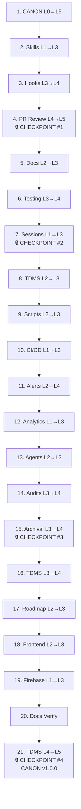

# System-Wide Standardization — Implementation Plan

<!-- prettier-ignore-start -->
**Document Version:** 1.1
**Last Updated:** 2026-03-04
**Status:** DRAFT — Amended (21 review decisions incorporated)
<!-- prettier-ignore-end -->

> **Deep-Plan Phase 3 Artifact** **Generated:** 2026-03-04 **Decisions:** See
> [DECISIONS.md](./DECISIONS.md) (92 decisions, 19 tenets, 41 directives)
> **Effort:** XL (estimated 40-60 sessions across 21 steps)

---

## Summary

This plan implements the System-Wide Standardization overhaul: a 21-step,
sequential transformation of 18 ecosystems from their current maturity levels to
target levels defined in DECISIONS.md. CANON (Ecosystem Zero) is built first as
the meta-framework, then each ecosystem gets its own deep-plan and
standardization pass in dependency order. TDMS is staged across three positions
(#8, #16, #21) due to its XL scope. Four checkpoints validate progress. Research
overlap (researching ecosystem N+1 while implementing N) is the only approved
parallelism (per D63).

**Execution model:** Sequential with research overlap. Each ecosystem follows:
deep-plan → implement → audit → exit review → changelog → next (per D63, D69,
T13).

**Key references:** D67 (locked sequence), D49 (CANON enforcement), D9 (16-item
checklist), D81-D83 (audit framework), T1-T18 (core tenets).

---

## Cross-Cutting Infrastructure (applies to ALL steps)

These elements recur at every step. Defined once here, referenced throughout.

### Per-Ecosystem Deep-Plan (T13 plan_as_you_go)

Every ecosystem (Steps 2-21) gets its own `/deep-plan` session before
implementation begins. Phase 0 of each deep-plan consults the knowledge base
(D75):

- `.planning/system-wide-standardization/` — all artifacts from this overhaul
- _Framework repo archived (Q33)_ — 68 decisions, 42 gaps (consumed into CANON)
- PR Review v2 patterns (`.planning/milestones/v1.0-ROADMAP.md`)
- Prior ecosystem deep-plan decisions (accumulated as we go)
- `.canon/changelog.jsonl` — cross-ecosystem impact log

### Per-Ecosystem Exit Criteria (D69)

Every ecosystem completes with:

1. 16-item checklist scorecard — each item completed or formally deferred with
   justification (per D54)
2. Brief user review of scorecard + deferrals
3. Changelog entries for all cross-ecosystem impacts (T18)
4. Health checker(s) passing
5. Tests passing (existing + new)

### ROADMAP Integration (D70)

After each ecosystem completes:

1. Add work items to ROADMAP.md under Track-CANON
2. Run dedupe against MASTER_DEBT (per directive #35)
3. Update SESSION_CONTEXT.md quick status

### Learning Capture (D76, T18, directive #37)

Learnings captured DURING ecosystem builds via:

- `.canon/changelog.jsonl` entries (continuous)
- CANON version bumps at checkpoints (batched formalization)

### Rollback Protocol (D68, T12, T9)

Every ecosystem step has a defined rollback path. Git-revert-based rollback is
the mechanism (not branch-based). Protocol:

1. **Pre-migration snapshot:** Before each ecosystem's implementation begins,
   tag the repo: `git tag pre-<ecosystem-id>-snapshot` (e.g.,
   `pre-skills-snapshot`)
2. **Rollback trigger:** If an ecosystem step leaves the repo in a worse state
   than before (health checkers regressing, tests failing, cross-ecosystem
   breakage), rollback is available
3. **Rollback execution:** `git revert` the commits from the ecosystem step back
   to the tagged snapshot
4. **Post-rollback:** Log the rollback in `.canon/changelog.jsonl` with reason,
   create TDMS item for the root cause, then re-attempt with amended approach

Rollback is a safety net, not a substitute for validation. Each ecosystem
deep-plan should identify step-level rollback boundaries within their
implementation.

### Schema Versioning Strategy (D24, T12, D22)

All `.canon/schemas/*.schema.ts` files include a `SCHEMA_VERSION` export.
Protocol:

1. **Additive changes** (new optional fields): patch version bump, no migration
   needed (D22 extensible-core)
2. **Breaking changes** (renamed fields, removed fields, type changes): minor
   version bump, migration script REQUIRED before merge
3. **Structural changes** (new required fields, schema splits): major version
   bump, migration script + cross-ecosystem impact assessment required
4. **Pre-commit validation:** Schema files must have valid `SCHEMA_VERSION`
   export; JSONL data files must validate against their declared schema version

Schema version tracking is a Step 1 (CANON) deliverable. Individual ecosystem
deep-plans inherit this infrastructure.

### Migration Validation Protocol (T10, T11, T12)

When any step migrates data from one format to another (e.g., markdown → JSONL,
unstructured → schema-validated), the following protocol applies:

1. **Pre-migration:** Tag snapshot (see Rollback Protocol above)
2. **Migration execution:** Transform data, validate output against target
   schema
3. **Post-migration validation:** Every migrated record checked for:
   - Schema compliance (Zod validation passes)
   - Data completeness (no fields lost in transformation)
   - Cross-reference integrity (all IDs/references still resolve)
4. **Finding disposition — user's choice at each finding:**
   - **Fix in-place:** Resolve the finding before proceeding (recommended for
     anything blocking downstream work)
   - **Log to TDMS:** Create debt item with source `canon-migration` and
     ecosystem reference for later resolution
   - User decides per-finding — not auto-routed by severity
5. **Archive originals:** After validated migration, move source files to
   `.archive/<ecosystem-id>/<datestamp>/` (preserves history, removes from
   active tree). Git history provides additional safety net.
6. **Cross-reference map:** When migration changes IDs or anchors, create/update
   `.canon/.xref.json` mapping old references to new locations. Validation step
   checks all docs for stale references.

### Per-Phase Regression Check (T10, T11)

At the end of each ecosystem step (before exit criteria sign-off):

1. Run the full existing test suite — zero regressions allowed
2. Run health checkers for ALL previously-completed ecosystems — no degradation
3. If regressions found: fix before proceeding (these are blockers, not
   deferrable)

This is separate from checkpoint validation. Checkpoints validate strategic
progress; regression checks validate that nothing broke.

### Born-Compliant Timing (D26)

Born-compliant gates (new artifacts must meet the ecosystem's standard) activate
AFTER the ecosystem step is marked complete, not during implementation. During
implementation, the ecosystem is in transition — enforcing standards on
in-progress work creates circular dependencies. Each ecosystem's deep-plan
should note the activation point for its born-compliant gate.

### Checkpoint Concrete Metrics (D69, D67)

Each checkpoint (4 total) has quantitative pass/fail criteria defined in its
section below. Checkpoints are NOT subjective assessments — they are measurable
gates. If metrics aren't met, the checkpoint fails and iteration is required
before proceeding. See individual checkpoint sections for specific metrics.

---

## Step 1: CANON — Ecosystem Zero (L0 → L5)

**Effort:** L (6-10 sessions) | **Depends on:** Nothing — this is the foundation

CANON is the meta-system that defines the rules for all other ecosystems.
Building CANON first validates the entire framework before applying it to others
(T1, T10). This step creates the `.canon/` directory, all foundational schemas,
the enforcement system, and the first CANON artifacts.

### 1a. Directory Structure + Meta Config (D21)

Create `.canon/` at repo root:

```
.canon/
├── canon.json                    # CANON meta: version, config
├── tenets.jsonl                  # Core tenets (first artifact — D32)
├── tenets.md                     # Generated view
├── ecosystems.jsonl              # Registry (one line per ecosystem)
├── changelog.jsonl               # Cross-ecosystem change log (T18, D72)
├── schemas/
│   ├── ecosystem-registry.schema.ts  # Zod: ecosystem registry line
│   ├── assessment.schema.ts          # Zod: maturity assessment
│   ├── enforcement-manifest.schema.ts # Zod: enforcement rules
│   ├── changelog.schema.ts           # Zod: changelog entry (D72)
│   ├── health-report.schema.ts       # Zod: health report envelope (D25)
│   └── tenet.schema.ts               # Zod: tenet entry (D32)
├── config/
│   ├── defaults.json                 # Global defaults (D5)
│   └── overrides/                    # Per-ecosystem overrides
├── reports/                          # Generated dashboards/matrix views
├── scripts/
│   ├── generate-tenets-md.js         # JSONL → MD view generator
│   ├── generate-ecosystem-matrix.js  # Cross-ecosystem matrix view
│   ├── validate-canon.js             # Self-validation (D49 self-protection)
│   ├── check-canon-health.js         # Health checker (D17)
│   └── scan-changelog.js             # Pre-check for TDMS items (D73)
└── ecosystems/
    └── {id}/                         # Per-ecosystem dirs (created per-step)
        ├── assessment.jsonl           # Maturity assessment (D23)
        ├── enforcement.jsonl          # Enforcement manifest (D26)
        └── contracts/                 # Inter-ecosystem contracts (D74)
```

**Files to create:**

- `.canon/canon.json` —
  `{ "version": "0.1.0", "created": "...", "checkpoints": [] }`
- All schema files under `.canon/schemas/` — Zod source of truth (D24), JSON
  Schema auto-generated

**Done when:** `.canon/` directory exists with `canon.json` at v0.1.0, all
schema files compile, directory structure matches D21.

### 1b. Tenets — First CANON Artifact (D32)

Migrate the tenets from `.planning/system-wide-standardization/tenets.jsonl` to
`.canon/tenets.jsonl`.

Each line:
`{ "id": "T1", "category": "foundation|design|operations|process", "name": "snake_case", "statement": "...", "evidence": ["D1", "D6"], "added": "2026-03-04", "version": "0.1.0" }`

Create `generate-tenets-md.js` — reads `.canon/tenets.jsonl`, outputs
`.canon/tenets.md`. Standard CLI: `--input`, `--output` flags (D27). Node.js
only (T7). Idempotent (T12).

**Done when:** `.canon/tenets.jsonl` has all tenets, `.canon/tenets.md` is
generated, both are in sync.

### 1c. Ecosystem Registry (D2, D22)

Create `.canon/ecosystems.jsonl` with one line per ecosystem. Schema
(extensible-core per D22):

```typescript
// .canon/schemas/ecosystem-registry.schema.ts
import { z } from "zod";

export const EcosystemRegistryEntry = z.object({
  id: z.string(), // kebab-case: "pr-review", "tdms", "skills"
  name: z.string(), // Human: "PR Review", "TDMS"
  current_level: z.enum(["L0", "L1", "L2", "L3", "L4", "L5"]),
  target_level: z.enum(["L0", "L1", "L2", "L3", "L4", "L5"]),
  effort: z.enum(["S", "M", "L", "XL", "XL-partial"]),
  seq_position: z.number(), // Position in 21-step sequence
  status: z.enum([
    "not_started",
    "researching",
    "in_progress",
    "completed",
    "deferred",
  ]),
  owner: z.string(), // Primary ownership (T16)
  dependencies: z.array(z.string()), // Ecosystem IDs this depends on
  decision_ref: z.string(), // e.g. "D33"
});
```

Populate with all 18 ecosystems from the assessment table in DECISIONS.md
(Section 4).

**Done when:** `.canon/ecosystems.jsonl` has 18 entries, all validate against
schema.

### 1d. Maturity Model + 16-Item Checklist (D3, D8, D9)

Create `.canon/schemas/assessment.schema.ts`:

```typescript
export const MaturityAssessment = z.object({
  ecosystem_id: z.string(),
  assessed_at: z.string().datetime(),
  level: z.enum(["L0", "L1", "L2", "L3", "L4", "L5"]),
  checklist: z.array(
    z.object({
      item_number: z.number().min(1).max(16),
      name: z.string(),
      status: z.enum(["present", "partial", "absent", "deferred", "n/a"]),
      evidence: z.string().optional(),
      deferral_justification: z.string().optional(), // Required when deferred (D54)
    })
  ),
  required_items: z.array(z.number()), // Per-ecosystem mapping (D54)
  optional_items: z.array(z.number()),
});
```

The 16 checklist items are defined in D9 (Zod schemas, JSONL storage, generated
views, health monitoring, enforcement manifest, testing, documentation, state
persistence, error handling, naming compliance, configuration, lifecycle hooks,
versioning, inter-ecosystem contracts, rollback/recovery, deprecation policy).

**Done when:** Schema compiles, CANON's own initial assessment written to
`.canon/ecosystems/canon/assessment.jsonl`.

### 1e. Enforcement System (D14, D15, D26, D49)

CANON enforcement is bidirectional (D49, directive #22):

**Internal self-protection:**

- Pre-commit gate: validate `.canon/` files against schemas, tenet changes
  require version bump, no orphaned references
- Pre-push gate: migration script required for breaking changes, all tenet
  references valid
- Integrity checks: `tenets.jsonl` ↔ `tenets.md` sync, `ecosystems.jsonl` ↔
  per-ecosystem dirs sync

**Downstream propagation:**

- Version broadcast: CANON version bump → health checkers detect skew
- Contract enforcement: schema change → dependent manifests fail validation
- Migration automation: breaking changes ship WITH migration scripts (T12)
- Fail-loud cascade: ecosystem >48h behind CANON version → alerts escalate (T11)
- Semver blast radius (D49): patch (<1h), minor (24-48h), major (1-2 weeks
  staggered)

**Files to create:**

- `.canon/scripts/validate-canon.js` — self-validation script
- `.canon/scripts/check-canon-health.js` — health checker (D17 enhanced
  interface: score + trend + recommendations)
- `.canon/ecosystems/canon/enforcement.jsonl` — CANON's own enforcement manifest
- Hook integration: add CANON validation to `.husky/pre-commit` and
  `.husky/pre-push`

**Done when:** `validate-canon.js` passes on current `.canon/` state, health
checker produces JSON envelope + JSONL findings (D25), enforcement manifest has
rules with tier + severity per D26, hooks integrated.

### 1f. Generated Views + Dashboard (D18, D27)

Create standardized view generators:

- `.canon/scripts/generate-tenets-md.js` (from 1b)
- `.canon/scripts/generate-ecosystem-matrix.js` — cross-ecosystem maturity
  matrix view
- `.canon/scripts/generate-changelog-md.js` — changelog human view

All scripts follow standard CLI interface: `--input`, `--output` (D27). Node.js
(T7). Idempotent (T12).

Dashboard generation: hybrid trigger (D18) — auto-generate on data change +
on-demand rebuild.

**Done when:** All generators produce correct output, matrix view shows all 18
ecosystems with current/target levels.

### 1g. Changelog Infrastructure (T18, D72)

Create `.canon/changelog.jsonl` with extensible-core schema (D72):

```typescript
export const ChangelogEntry = z.object({
  timestamp: z.string().datetime(),
  ecosystem: z.string(), // Source ecosystem
  change: z.string(), // What changed
  affects: z.array(z.string()), // Ecosystem IDs affected
  type: z.string().optional(), // "schema", "enforcement", "contract", etc.
  seq_position: z.number().optional(),
  decision_ref: z.string().optional(),
  files_changed: z.array(z.string()).optional(),
  severity: z.enum(["patch", "minor", "major"]).optional(),
});
```

**Done when:** Schema validates, initial changelog entries written for CANON
creation itself.

### 1h. Testing + Documentation

- Unit tests for all `.canon/scripts/` (Jest, co-located in
  `.canon/scripts/__tests__/`)
- Integration test: full roundtrip (write JSONL → generate views → validate)
- Documentation: `.canon/README.md` — CANON spec, getting started, contribution
  guide

**Done when:** All tests pass, README covers the CANON system.

### 1i. CANON Self-Assessment + Versioning (D13)

Run CANON through its own 16-item checklist. CANON must score L5 on all
applicable items — it's the exemplar.

Tag: `canon-v0.1.0`

CANON version trajectory (Idea #45): `0.1.0` → `0.2.0` (checkpoint #1, after
Step 4) → `0.3.0` (checkpoint #2) → `0.4.0` (checkpoint #3) → `1.0.0`
(checkpoint #4, Step 21)

### Step 1 Audit

Run code-reviewer on all new `.canon/` files. Tier 1 + Tier 2 domains 6, 8 from
the audit framework (D81).

**Done when:** CANON at L5, all schemas compile, all scripts pass tests,
enforcement hooks integrated, self-assessment complete, version 0.1.0 tagged.

---

## Step 2: Skills (L1 → L3)

**Effort:** L (6-10 sessions — 62+ skills) | **Depends on:** Step 1 (CANON)

Per D37, the Skills ecosystem is a daily tool touching many systems. Skill-audit
skill (`.claude/skills/skill-audit/`) drives per-skill assessment (directive
#20).

### Pre-implementation

1. Deep-plan for Skills ecosystem (T13) — consults knowledge base (D75)
2. Register ecosystem: add entry to `.canon/ecosystems.jsonl`

### Implementation

- Create `.canon/ecosystems/skills/` with assessment + enforcement manifest
- Define Zod schemas for skill metadata (SKILL.md frontmatter, REFERENCE.md
  structure)
- Formalize skill lifecycle: creation (via skill-creator), audit (via
  skill-audit), update, deprecation, archival
- Establish monitoring: skill health checker (`scripts/check-skill-health.js` or
  `.canon/ecosystems/skills/health.js`)
- Run skill-audit on representative sample, then all skills
- Born-compliant gate: all NEW skills created after this step must meet L3
  standards
- State persistence: skill invocation tracking formalized
- Inter-ecosystem contracts: Skills ↔ Hooks (skill validation gates), Skills ↔
  Agents (agent-skill boundary)

### Key files to create/modify

- `.canon/ecosystems/skills/assessment.jsonl`
- `.canon/ecosystems/skills/enforcement.jsonl`
- `.canon/schemas/skill-metadata.schema.ts`
- `.claude/skills/SKILL_STANDARDS.md` (update existing)

### Exit criteria (D69)

16-item checklist scorecard, user review, changelog entries.

**Done when:** Skills ecosystem at L3, skill-audit canonized, born-compliant
gate active, health checker passing.

---

## Step 3: Hooks (L3 → L4)

**Effort:** M (3-5 sessions) | **Depends on:** Step 2 (Skills — skill validation
gates)

Per D36, Hooks is the enforcement infrastructure. Strong operational automation
exists (`.husky/pre-commit` at ~350 lines, `.husky/pre-push`, `.claude/hooks/`).
Delta is mainly Zod schemas + formalized contracts + versioning.

### Pre-implementation

1. Deep-plan for Hooks ecosystem
2. Register in `.canon/ecosystems.jsonl`

### Implementation

- Zod schemas for hook configuration (`.claude/hooks/*.js` structure, hook
  output format)
- Enforcement manifest: `.canon/ecosystems/hooks/enforcement.jsonl`
- Formalize hook lifecycle (create, test, deprecate, remove)
- Version hook configurations
- Inter-ecosystem contracts: Hooks ↔ Skills (validation gates), Hooks ↔ CI/CD
  (pipeline integration), Hooks ↔ Testing (test execution in hooks)
- Health checker for hook ecosystem
- Naming compliance audit on all hooks

### Exit criteria

16-item checklist, user review, changelog.

**Done when:** Hooks at L4, enforcement manifest complete, contracts formalized,
schemas validate.

---

## Step 4: PR Review — CANON Pilot (L4 → L5)

**Effort:** S (1-2 sessions) | **Depends on:** Step 3 (Hooks)

**CHECKPOINT #1: Does the CANON framework work?** (D67, D49)

PR Review is the reference implementation (D33). Already at L4 with 56 test
files, 10 health checkers, multi-mechanism enforcement. This is the first
ecosystem to reach L5 — validates CANON before applying it broadly.

### Pre-implementation

1. Deep-plan (lightweight — mostly gap-filling)
2. Register in `.canon/ecosystems.jsonl`

### Implementation

- Fill remaining checklist gaps: rollback/recovery, deprecation policy, naming
  validation (pending CANON format from Step 1)
- Formalize inter-ecosystem contracts with CANON schema format (D74)
- Run PR Review through full 16-item CANON checklist
- Validate that CANON tooling (schemas, health checkers, enforcement) works
  end-to-end on a real ecosystem

### Checkpoint #1 Validation — Concrete Metrics

After PR Review reaches L5, the following must ALL pass:

1. **Schema validation:** All `.canon/schemas/*.schema.ts` compile with zero
   errors, all JSONL files validate against declared schemas (0 failures)
2. **Health checker coverage:** PR Review health checker produces JSON
   envelope + JSONL findings per D25, with score ≥ 90%
3. **Enforcement manifest:** PR Review enforcement manifest has rules covering
   all applicable checklist items, each with tier + severity per D26
4. **Changelog completeness:** `.canon/changelog.jsonl` has entries for every
   cross-ecosystem impact from Steps 1-4 (auditable against git log)
5. **Self-assessment accuracy:** CANON's own 16-item checklist assessment
   matches independently-verifiable evidence (no "present" claims without proof)
6. **Regression check:** Full test suite passes, all Step 1 health checkers
   still passing

**If checkpoint fails:** Iterate on CANON (Step 1) before proceeding. D68
skip-and-return does NOT apply here — CANON must work.

**If checkpoint passes:** Promote CANON to v0.2.0 (D76). Proceed with
confidence.

**Done when:** PR Review at L5, CANON framework validated, CANON promoted to
v0.2.0.

### Step 4 Audit

Tier 1 (full) + Tier 2 (full) — comprehensive post-checkpoint validation (D83).

---

## Step 5: Docs (L2 → L3)

**Effort:** M (3-5 sessions) | **Depends on:** Step 4 (Checkpoint #1 passed)

Per D65 and directive #32, Docs is elevated to position #5. Establishes folder
structure, file placement standards, document dependency maps, and master lists
BEFORE any further ecosystems are standardized.

### Pre-implementation

1. Deep-plan for Docs ecosystem
2. Register in `.canon/ecosystems.jsonl`

### Implementation

- Standardize `docs/` folder structure and file placement
- Formalize document dependency system (`scripts/check-cross-doc-deps.js`
  already exists — canonize it)
- Zod schemas for document metadata (frontmatter, headers per
  `scripts/check-doc-headers.js`)
- Monitoring: enhance doc-ecosystem-audit skill, create health checker
- Formalize DOCUMENTATION_INDEX.md generation pipeline
  (`scripts/generate-doc-index.js`)
- Define born-compliant doc standards for all future ecosystem documentation
- Inter-ecosystem contracts: Docs ↔ every other ecosystem (doc placement rules),
  Docs ↔ Hooks (doc-header validation gate)

### Key existing files to canonize

- `scripts/check-cross-doc-deps.js`
- `scripts/check-doc-headers.js`
- `scripts/check-doc-placement.js`
- `scripts/check-document-sync.js`
- `scripts/generate-doc-index.js`
- `.claude/skills/doc-ecosystem-audit/`
- `.claude/skills/docs-maintain/`
- `DOCUMENTATION_INDEX.md`
- `docs/DOCUMENT_DEPENDENCIES.md`

### Exit criteria

16-item checklist, user review, changelog.

**Done when:** Docs at L3, folder standards defined, dependency system
canonized, born-compliant doc template established.

---

## Step 6: Testing (L3 → L4)

**Effort:** M (3-5 sessions) | **Depends on:** Step 5 (Docs — test documentation
standards)

Per D47, Testing has good coverage (496+ tests, Jest, pre-commit enforcement).
Delta to L4 is formalized enforcement manifest, Zod schemas for test
configuration, and inter-ecosystem test contracts.

### Pre-implementation

1. Deep-plan for Testing ecosystem
2. Register in `.canon/ecosystems.jsonl`

### Implementation

- Zod schemas for test configuration (`jest.config.ts`, test naming conventions)
- Enforcement manifest: minimum coverage thresholds, required test types per
  file category
- Formalize test patterns: unit vs integration vs e2e boundaries
- Inter-ecosystem contracts: Testing ↔ Hooks (test execution in pre-commit),
  Testing ↔ CI/CD (test pipeline), Testing ↔ every ecosystem (test requirements
  per ecosystem)
- Health checker for testing ecosystem
- Versioning strategy for test infrastructure

### Key existing files

- `jest.config.ts`
- `__tests__/` directories throughout codebase
- `.husky/pre-commit` (test execution section)
- `.github/workflows/` (CI test jobs)

### Exit criteria

16-item checklist, user review, changelog.

**Done when:** Testing at L4, enforcement manifest defines test requirements,
schemas validate test config.

---

## Step 7: Sessions (L1 → L3)

**Effort:** M (3-5 sessions) | **Depends on:** Step 6 (Testing — test
infrastructure)

**CHECKPOINT #2: Core infrastructure complete** (D67)

Per D35, Sessions is cross-cutting infrastructure. Every ecosystem depends on
session state being reliable. Schemas + JSONL + monitoring gives reliability
layer.

### Pre-implementation

1. Deep-plan for Sessions ecosystem
2. Register in `.canon/ecosystems.jsonl`

### Implementation

- Zod schemas for session state (`SESSION_CONTEXT.md` structure,
  `.claude/state/*.json` formats, `deep-plan.state.json` structure)
- Formalize session lifecycle: session-begin, session-end, checkpoint,
  compaction recovery
- JSONL storage for session history (canonize `docs/SESSION_HISTORY.md` → JSONL
  source)
- Monitoring: session health checker (gap detection, state staleness)
- State persistence audit: verify all state files survive compaction (T9)
- Inter-ecosystem contracts: Sessions ↔ Skills (session-begin/end skills),
  Sessions ↔ Hooks (session hooks), Sessions ↔ State (checkpoint mechanism)

### Key existing files

- `SESSION_CONTEXT.md`
- `docs/SESSION_HISTORY.md`
- `.claude/state/` directory
- `.claude/skills/session-begin/`, `.claude/skills/session-end/`
- `.claude/skills/checkpoint/`
- `.claude/hooks/session-start.sh`
- `scripts/check-session-gaps.js`

### Checkpoint #2 Validation — Concrete Metrics

After Sessions reaches L3, core infrastructure is complete: CANON (L5), Skills
(L3), Hooks (L4), PR Review (L5), Docs (L3), Testing (L4), Sessions (L3). Ready
for data-heavy ecosystems.

All of the following must pass:

1. **Ecosystem health:** All 7 completed ecosystem health checkers pass with
   scores at or above their exit criteria thresholds
2. **No regressions:** Full test suite passes; no ecosystem has degraded from
   its exit-criteria state
3. **Registry accuracy:** `.canon/ecosystems.jsonl` has 7 entries with correct
   `status: "completed"` and accurate `current_level` values
4. **Contract integrity:** All inter-ecosystem contracts declared in Steps 1-7
   have both sides implemented (no dangling contract references)
5. **Changelog audit:** `.canon/changelog.jsonl` entries for Steps 1-7 are
   complete and cross-referenceable against git history

If regressions found: fix before proceeding. Promote CANON to v0.3.0 (D76).

### Exit criteria

16-item checklist, user review, changelog.

**Done when:** Sessions at L3, session lifecycle formalized, state persistence
validated, checkpoint #2 passed.

---

## Step 8: TDMS Stage 1 (L2 → L3)

**Effort:** XL-partial (6-10 sessions for this stage) | **Depends on:** Step 7
(Sessions + Checkpoint #2)

Per D34 and directive #19, TDMS is critical and targets L5 across three stages.
Stage 1 focuses on Zod schemas + monitoring for 37 scripts in `scripts/debt/`.

### Pre-implementation

1. Deep-plan for TDMS Stage 1
2. Register in `.canon/ecosystems.jsonl`

### Implementation

- Zod schemas for all TDMS data structures:
  - `MASTER_DEBT.jsonl` line schema
  - TDMS state schemas
  - Audit finding schemas
  - Health report schemas
- Add schema validation to all 37 `scripts/debt/` scripts
- Health monitoring: TDMS health checker with trend data
- Formalize TDMS data flow: intake → classification → resolution → archival
- Address 9-writer race condition on MASTER_DEBT (T12 idempotent operations
  violation)
- Standardize error handling across all 37 scripts (T11)
- Configuration: extract hardcoded values to central config

### Key existing files

- `scripts/debt/` — 37 scripts
- `docs/technical-debt/MASTER_DEBT.jsonl` — canonical debt database
- `.claude/skills/sonarcloud/` — SonarCloud integration
- `.claude/skills/add-debt/` — debt intake

### Exit criteria (Stage 1 only)

16-item checklist scorecard (some items deferred to Stage 2/3 with justification
per D54), user review, changelog.

**Done when:** TDMS at L3, all scripts have Zod schemas, monitoring operational.

---

## Step 9: Scripts (L2 → L3)

**Effort:** L (6-10 sessions — 300+ scripts) | **Depends on:** Step 8 (TDMS
Stage 1 — learnings from 37-script standardization)

Per D39, the script infrastructure has 300+ scripts with inconsistent patterns.
TDMS learnings from Step 8 directly inform this step.

### Pre-implementation

1. Deep-plan for Scripts ecosystem
2. Register in `.canon/ecosystems.jsonl`

### Implementation

- Define script infrastructure standards: naming, error handling, CLI interface,
  exit codes
- Zod schemas for script configuration and output formats
- Audit all scripts for reachability (some may be dead code)
- Standardize script documentation (inline + generated)
- Monitoring: script ecosystem health checker
- Inter-ecosystem contracts: Scripts ↔ Hooks (scripts called from hooks),
  Scripts ↔ TDMS (debt scripts), Scripts ↔ CI/CD (scripts in pipelines)

### Key existing files

- `scripts/` — 300+ scripts across subdirectories
- `.claude/skills/script-ecosystem-audit/`
- `scripts/config/` — some centralized config exists

### Exit criteria

16-item checklist, user review, changelog.

**Done when:** Scripts at L3, infrastructure standards defined, dead code
identified, health checker operational.

---

## Step 10: CI/CD (L1 → L3)

**Effort:** M (3-5 sessions) | **Depends on:** Step 9 (Scripts — pipeline
scripts standardized)

Per D41 and D66, CI/CD covers build/deploy pipelines beyond local gates. Staged
L1→L2→L3.

### Pre-implementation

1. Deep-plan for CI/CD ecosystem
2. Register in `.canon/ecosystems.jsonl`

### Implementation

- Catalog all GitHub Actions workflows in `.github/workflows/`
- Zod schemas for workflow configuration and deployment state
- Formalize pipeline stages: lint → test → build → deploy → verify
- Monitoring: CI/CD health checker (build success rates, deploy frequency)
- Inter-ecosystem contracts: CI/CD ↔ Hooks (local vs CI gates), CI/CD ↔ Testing
  (test pipeline), CI/CD ↔ Scripts (pipeline scripts)
- Versioning strategy for workflow definitions

### Key existing files

- `.github/workflows/` — GitHub Actions definitions
- `.husky/pre-push` — local pre-push gates
- Firebase deployment configuration

### Exit criteria

16-item checklist, user review, changelog.

**Done when:** CI/CD at L3, workflows cataloged, monitoring operational.

---

## Step 11: Alerts (L2 → L4)

**Effort:** M (3-5 sessions) | **Depends on:** Step 10 (CI/CD — pipeline
monitoring feeds alerts)

Per D38, Alerts has 36 categories, scoring, benchmarks, trend tracking. Staged
L2→L3→L4.

### Pre-implementation

1. Deep-plan for Alerts ecosystem
2. Register in `.canon/ecosystems.jsonl`

### Implementation

- Zod schemas for alert definitions, scoring, benchmark data
- Enforcement manifest: alert acknowledgment requirements, escalation rules
- Formalize 36 alert categories with schemas
- Monitoring: alerts-about-alerts (meta-health checker)
- Inter-ecosystem contracts: Alerts ↔ every ecosystem (health checker output
  feeds alerts), Alerts ↔ Sessions (mid-session alerting), Alerts ↔ CI/CD
  (pipeline failure alerts)

### Key existing files

- `.claude/skills/alerts/`
- `scripts/check-*.js` — various health checkers that feed alerts
- `.claude/state/alert-sessions/`

### Exit criteria

16-item checklist, user review, changelog.

**Done when:** Alerts at L4, schemas validate all 36 categories, enforcement
manifest active.

---

## Step 12: Analytics (L1 → L3)

**Effort:** M (3-5 sessions) | **Depends on:** Step 11 (Alerts — monitoring
layer feeds analytics)

Per D42, metrics and trend data are scattered across health checkers and audit
outputs. No unified analytics layer.

### Pre-implementation

1. Deep-plan for Analytics ecosystem
2. Register in `.canon/ecosystems.jsonl`

### Implementation

- Catalog all metric sources across the codebase
- Zod schemas for metric definitions, trend data, benchmark comparisons
- Unified analytics aggregation layer
- Monitoring: analytics health checker
- Dashboards: generated views from aggregated metrics (D18)
- Inter-ecosystem contracts: Analytics ↔ Alerts (metric thresholds → alerts),
  Analytics ↔ every ecosystem (metric collection interface)

### Exit criteria

16-item checklist, user review, changelog.

**Done when:** Analytics at L3, metric sources cataloged, aggregation
operational, dashboards generated.

---

## Step 13: Agents (L2 → L3)

**Effort:** M (3-5 sessions) | **Depends on:** Step 12 (Analytics — agent
metrics)

Per D50, 35 agent definitions with structured patterns. Invocation tracking via
JSONL exists.

### Pre-implementation

1. Deep-plan for Agents ecosystem
2. Register in `.canon/ecosystems.jsonl`

### Implementation

- Zod schemas for agent definitions and invocation records
- Formalize agent lifecycle: definition, invocation, monitoring, deprecation
- Health checker for agent ecosystem
- Inter-ecosystem contracts: Agents ↔ Skills (agent-skill boundary), Agents ↔
  Sessions (agent invocation within sessions)
- Canonize agent invocation JSONL format

### Key existing files

- Agent definitions throughout `.claude/skills/` (agent subagent_type
  references)
- Agent invocation tracking JSONL

### Exit criteria

16-item checklist, user review, changelog.

**Done when:** Agents at L3, definitions schema-validated, invocation tracking
canonized.

---

## Step 14: Audits (L3 → L4, with L5 pathway)

**Effort:** M (3-5 sessions) | **Depends on:** Step 13 (Agents — audit agents)

Per D51 and directive #26, Audits must reach L4 with L5 pathway designed in from
the start. 22 quality + 7 ecosystem audit skills.

### Pre-implementation

1. Deep-plan for Audits ecosystem
2. Register in `.canon/ecosystems.jsonl`

### Implementation

- Zod schemas for audit definitions, findings, history
- Enforcement manifest: audit quality standards, finding severity requirements
- Formalize audit lifecycle: trigger → execute → findings → triage → resolve
- L5 pathway architecture: versioned audit standards, automated regression
  detection, self-auditing capabilities
- Monitoring: audit ecosystem health checker
- Inter-ecosystem contracts: Audits ↔ every ecosystem (audit coverage), Audits ↔
  TDMS (findings → debt items), Audits ↔ Roadmap (findings → work items)

### Key existing files

- `.claude/skills/audit-*/` — 7+ audit skills
- `.claude/skills/comprehensive-ecosystem-audit/`
- `scripts/audit/` — audit scripts
- `docs/audits/` — audit results
- `.claude/skills/create-audit/` — audit scaffolding

### Exit criteria

16-item checklist, user review, changelog.

**Done when:** Audits at L4, L5 pathway documented, schemas validate all audit
types, enforcement manifest active.

---

## Step 15: Archival/Rotation (L3 → L4)

**Effort:** M (3-5 sessions) | **Depends on:** Step 14 (Audits — audit archival
patterns)

**CHECKPOINT #3: All process-layer ecosystems standardized** (D67)

Per D48, archival patterns exist (JSONL rotation, review archival, state
cleanup). Delta to L4 is enforcement gates, Zod schemas, lifecycle hook
formalization.

### Pre-implementation

1. Deep-plan for Archival/Rotation ecosystem
2. Register in `.canon/ecosystems.jsonl`

### Implementation

- Zod schemas for archive formats, rotation policies, cleanup rules
- Enforcement manifest: retention requirements, archival triggers
- Formalize lifecycle hooks: when to archive, what to rotate, cleanup schedules
- Monitoring: archival health checker (staleness, size, compliance)
- Inter-ecosystem contracts: Archival ↔ every ecosystem (archival patterns),
  Archival ↔ TDMS (debt archival), Archival ↔ Docs (doc archival)

### Key existing files

- `scripts/archive-doc.js`
- `scripts/archive-reviews.js`
- `scripts/check-review-archive.js`
- `scripts/cleanup-alert-sessions.js`
- JSONL rotation patterns throughout

### Checkpoint #3 Validation — Concrete Metrics

After Archival/Rotation reaches L4, all process-layer ecosystems are
standardized. All of the following must pass:

1. **Ecosystem health:** All 15 completed ecosystem health checkers pass
2. **No regressions:** Full test suite passes; no ecosystem degraded
3. **Registry accuracy:** `.canon/ecosystems.jsonl` has 15 entries at
   `status: "completed"` with correct levels
4. **Enforcement coverage:** All ecosystems at L4+ have active enforcement
   manifests with rules firing in pre-commit/pre-push
5. **TDMS integration:** All migration findings from Steps 1-15 either resolved
   or tracked in MASTER_DEBT with source `canon-migration`
6. **Archival compliance:** All migrated source files archived per Migration
   Validation Protocol

Promote CANON to v0.4.0 (D76). Ready for app-layer.

### Exit criteria

16-item checklist, user review, changelog.

**Done when:** Archival/Rotation at L4, checkpoint #3 passed, CANON at v0.4.0.

### Step 15 Audit

Tier 1 (full) + Tier 2 (full) — process-layer completion validation.

---

## Step 16: TDMS Stage 2 (L3 → L4)

**Effort:** XL-partial (6-10 sessions) | **Depends on:** Step 15 (Checkpoint #3)

Second TDMS stage. All process-layer patterns now established. Focus on
enforcement manifest and testing.

### Pre-implementation

1. Deep-plan for TDMS Stage 2
2. Update `.canon/ecosystems/tdms/` entry

### Implementation

- Enforcement manifest: `.canon/ecosystems/tdms/enforcement.jsonl` — rules for
  all 37 scripts
- Testing: comprehensive test suite for TDMS scripts (unit + integration)
- Formalize TDMS contracts with all dependent ecosystems
- Address any findings from Stage 1 that were deferred
- Enforcement gates active in pre-commit/pre-push

### Exit criteria (Stage 2)

16-item checklist scorecard (some items deferred to Stage 3), user review.

**Done when:** TDMS at L4, enforcement operational, comprehensive tests passing.

---

## Step 17: Roadmap & Execution (L2 → L3)

**Effort:** L (6-10 sessions) | **Depends on:** Step 16 (TDMS Stage 2 — debt
pipeline standardized)

Per D46 and directive #21, the Roadmap & Execution ecosystem is the HUB. All
input pipelines now standardized after 16 prior steps. Critical gap: non-debt
input pipelines are missing (directive #21, Idea #26).

### Pre-implementation

1. Deep-plan for Roadmap & Execution ecosystem
2. Register in `.canon/ecosystems.jsonl`

### Implementation

- Build missing input pipelines (T8 automation over discipline):
  - Audit findings → ROADMAP work items (currently manual — Idea #30)
  - Deep-plan decisions → ROADMAP items (currently manual — Idea #29)
  - Feature requests → ROADMAP items
  - Architecture decisions → ROADMAP items
- Zod schema for ROADMAP.md structure
- Dedupe automation: ROADMAP additions auto-checked against MASTER_DEBT
  (directive #35)
- Formalize work lifecycle: plan → execute → review → archive
- Monitoring: roadmap health checker (enhance existing
  `scripts/check-roadmap-health.js`)
- Inter-ecosystem contracts: Roadmap ↔ every ecosystem (work item intake),
  Roadmap ↔ TDMS (debt → roadmap pipeline), Roadmap ↔ Audits (findings → roadmap
  pipeline)

### Key existing files

- `ROADMAP.md`, `ROADMAP_FUTURE.md`, `ROADMAP_LOG.md`
- `scripts/check-roadmap-health.js`
- `scripts/check-roadmap-hygiene.js`
- `.claude/skills/task-next/`

### Exit criteria

16-item checklist, user review, changelog.

**Done when:** Roadmap at L3, all input pipelines automated, dedupe operational.

---

## Step 18: Frontend/App (L2 → L3)

**Effort:** M (3-5 sessions) | **Depends on:** Step 17 (Roadmap — work item
tracking for app-layer)

Per D52 and directive #23, app-layer planning differs from process ecosystems.
Focus on CONNECTION POINTS between process ecosystems and the app layer. Adapted
checklist (D54).

### Pre-implementation

1. Deep-plan for Frontend/App ecosystem (adapted approach per D52)
2. Register in `.canon/ecosystems.jsonl`

### Implementation

- Identify all connection points between app and process ecosystems
- Zod schemas at API boundaries (app ↔ Firebase)
- Health monitoring at connection points
- Testing at boundaries: component tests, integration tests
- Formalize app-layer conventions that touch process ecosystems (error
  reporting, analytics events, auth state)
- Inter-ecosystem contracts: Frontend ↔ Firebase (API contracts), Frontend ↔
  Testing (component test patterns), Frontend ↔ Alerts (error reporting)

### Key existing files

- `src/` — Next.js application source
- `src/app/` — App Router pages
- `src/components/` — UI components
- `src/lib/` — shared libraries
- `next.config.ts`
- `tailwind.config.ts`

### Exit criteria

Adapted 16-item checklist, user review, changelog.

**Done when:** Frontend/App at L3, connection points formalized, boundary tests
in place.

---

## Step 19: Firebase/Backend (L1 → L3)

**Effort:** M-L (3-8 sessions) | **Depends on:** Step 18 (Frontend — app ↔
backend contracts)

Per D53 and directive #23, Firebase/Backend has the biggest maturity gap. Staged
L1→L2→L3. Same adapted approach as Frontend/App.

### Pre-implementation

1. Deep-plan for Firebase/Backend ecosystem (adapted approach)
2. Register in `.canon/ecosystems.jsonl`

### Implementation

- Catalog all Cloud Functions, Firestore rules, Auth config, Storage rules
- Zod schemas for function input/output, Firestore document shapes, API
  contracts
- Connection point contracts with Frontend/App (formalized in Step 18)
- Monitoring: backend health checker (function invocation health, Firestore
  usage)
- Security review at API boundaries
- Inter-ecosystem contracts: Firebase ↔ Frontend (API), Firebase ↔ Testing
  (function tests), Firebase ↔ CI/CD (deploy pipeline)

### Key existing files

- `functions/` — Cloud Functions source
- `firestore.rules`
- `storage.rules`
- `firebase.json`
- `.firebaserc`

### Exit criteria

Adapted 16-item checklist, user review, changelog.

**Done when:** Firebase/Backend at L3, all functions cataloged, API contracts
formalized, boundary tests in place.

---

## Step 20: Docs Verification Pass

**Effort:** S (1-2 sessions) | **Depends on:** Step 19 (all 18 ecosystems
standardized)

Per D67, this is a meta-check: are all 18 ecosystems' docs consistent? Staleness
audit across all documentation produced during Steps 1-19.

### Implementation

- Run doc-ecosystem-audit across all ecosystem documentation
- Cross-reference `.canon/ecosystems/*/` docs with `docs/` content
- Verify no stale references, broken links, outdated patterns
- Update DOCUMENTATION_INDEX.md
- Fix any inconsistencies found

**Done when:** All ecosystem docs consistent, no stale references, index
updated.

---

## Step 21: TDMS Stage 3 — Final Canonization (L4 → L5)

**Effort:** XL-final (6-10 sessions) | **Depends on:** Step 20 (all docs
verified)

**CHECKPOINT #4: Full system overhaul complete** (D67)

Final TDMS stage. All other ecosystems standardized. TDMS reaches L5 — fully
canonized.

### Pre-implementation

1. Deep-plan for TDMS Stage 3
2. Update `.canon/ecosystems/tdms/` entry

### Implementation

- Complete all remaining 16-item checklist items
- Full canonization: all 37 scripts at L5 standards
- Advanced enforcement: automated regression detection
- Full inter-ecosystem contract suite
- Migration strategy: schema versioning for MASTER_DEBT evolution
- Deprecation policy for old TDMS patterns

### Checkpoint #4 Validation — Overhaul Complete — Concrete Metrics

Run comprehensive audit (D83): Tier 1 + Tier 2 + Tier 3 (summary) + Tier 4
(full) across ALL 18 ecosystems. All of the following must pass:

1. **Maturity targets met:** All 18 ecosystems at or above their target maturity
   level as defined in DECISIONS.md assessment table
2. **Health universal green:** All 18 ecosystem health checkers passing
3. **Changelog completeness:** `.canon/changelog.jsonl` covers all 21 steps,
   cross-referenceable against git log (no undocumented cross-ecosystem impacts)
4. **Contract completeness:** All inter-ecosystem contracts have both sides
   implemented; no orphaned or dangling contracts
5. **TDMS clean:** All `canon-migration` source items in MASTER_DEBT either
   resolved or explicitly accepted as ongoing debt with justification
6. **Schema integrity:** All JSONL files across all ecosystems validate against
   their declared schema versions
7. **Archive integrity:** All migrated source files properly archived; no stale
   pre-migration files in active tree
8. **Knowledge capture:** Learnings from all 21 steps captured in changelog;
   maintenance patterns documented for ongoing operations

Promote CANON to v1.0.0 (D76).

### Exit criteria

Full 16-item checklist, comprehensive overhaul audit, user review.

**Done when:** TDMS at L5, CANON at v1.0.0, overhaul complete, all ecosystems at
target maturity.

### Step 21 Audit

Full overhaul audit: Tier 1 + Tier 2 + Tier 3 + Tier 4 (D83).

---

## Parallelization Guidance

Per D63, **no parallel implementation tracks**. The only approved parallelism:

- **Research overlap:** Deep-plan ecosystem N+1 while implementing ecosystem N
- Example: While implementing Skills (#2), begin Phase 0 research for Hooks (#3)

This keeps learning transfer intact (directive #33) while maintaining
productivity (directive #31).

---

## Effort Summary

| Step | Ecosystem              | Effort     | Sessions (est.) |
| ---- | ---------------------- | ---------- | --------------- |
| 1    | CANON                  | L          | 6-10            |
| 2    | Skills                 | L          | 6-10            |
| 3    | Hooks                  | M          | 3-5             |
| 4    | PR Review (checkpoint) | S          | 1-2             |
| 5    | Docs                   | M          | 3-5             |
| 6    | Testing                | M          | 3-5             |
| 7    | Sessions (checkpoint)  | M          | 3-5             |
| 8    | TDMS L2→L3             | XL-partial | 6-10            |
| 9    | Scripts                | L          | 6-10            |
| 10   | CI/CD                  | M          | 3-5             |
| 11   | Alerts                 | M          | 3-5             |
| 12   | Analytics              | M          | 3-5             |
| 13   | Agents                 | M          | 3-5             |
| 14   | Audits                 | M          | 3-5             |
| 15   | Archival (checkpoint)  | M          | 3-5             |
| 16   | TDMS L3→L4             | XL-partial | 6-10            |
| 17   | Roadmap & Execution    | L          | 6-10            |
| 18   | Frontend/App           | M          | 3-5             |
| 19   | Firebase/Backend       | M-L        | 3-8             |
| 20   | Docs Verification      | S          | 1-2             |
| 21   | TDMS L4→L5 (final)     | XL-final   | 6-10            |
|      | **Total**              |            | **~80-130**     |

Per D87: S=1-2, M=3-5, L=6-10, XL=11-20 sessions. These are planning estimates,
not commitments.

Per D71: Standardization and project work are interleaved in the same sessions
as needed. If 3+ sessions pass with no standardization progress, ecosystem
health dashboard flags it.

---

## Dependency Graph



---

## Plan Quality Checklist

- [x] Summary (2-3 sentences)
- [x] Reference to DECISIONS.md
- [x] Files to create/modify with exact paths
- [x] Steps with "Done when:" criteria
- [x] Dependency markers between steps
- [x] Audit checkpoints (4 checkpoints + per-step audits)
- [x] Effort estimate (per-step + total)
- [x] Parallelization guidance (research overlap only)
- [x] Rollback protocol (git-revert + pre-migration tags) — v1.1
- [x] Schema versioning strategy (additive/breaking/structural) — v1.1
- [x] Migration validation protocol (fix-or-defer, archive, xref) — v1.1
- [x] Per-phase regression checks — v1.1
- [x] Born-compliant timing clarification — v1.1
- [x] Concrete checkpoint metrics (quantitative gates) — v1.1

---

## Version History

| Version | Date       | Description                                                                                                                                                                                                                                                                                                                                                 |
| ------- | ---------- | ----------------------------------------------------------------------------------------------------------------------------------------------------------------------------------------------------------------------------------------------------------------------------------------------------------------------------------------------------------- |
| 1.0     | 2026-03-04 | Initial plan created                                                                                                                                                                                                                                                                                                                                        |
| 1.1     | 2026-03-04 | Amended: 21 review decisions incorporated — rollback protocol (git-revert + tags), schema versioning strategy, migration validation protocol (fix-or-defer at user discretion, archive to `.archive/`, xref mapping), per-phase regression checks, born-compliant timing clarification, concrete checkpoint metrics (4 checkpoints with quantitative gates) |
