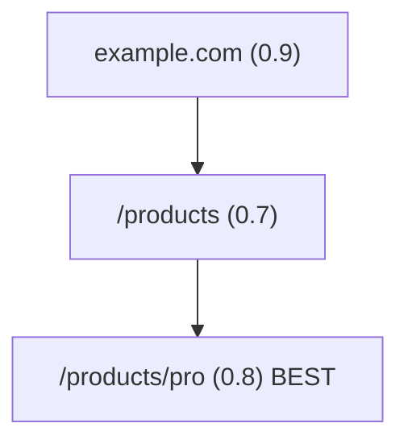

# Findings: Expedition State Management — Tree-Shaped State, Compaction Resilience, Resume, Depth/Breadth Budgets

**Searcher:** deep-research-searcher **Profile:** web + docs **Date:**
2026-04-05 **Sub-Question IDs:** SQ10b

---

## Key Findings

### 1. Tree Representation: Flat Array with Parent Pointers is the Right Choice [CONFIDENCE: HIGH]

Three JSON tree representations are viable: nested objects (children embedded
inline), adjacency list (flat array with `parentId` field), and reference maps
(object keyed by node ID).

For expedition state, the **flat array with parent pointer** pattern is strongly
recommended over nested objects:

- O(n) reconstruction via single-pass ID-to-index map (libraries like
  `performant-array-to-tree` prove this in practice) [1]
- **Append-only compatible**: each new node visit adds one line/object to the
  array without rewriting parent records — this is critical for compaction
  resilience
- All popular visualization tools (jsTree, Mermaid flowcharts) accept this
  format directly [2][3]
- Order-independent: parent nodes don't need to precede children in the file

Nested objects have a fatal flaw for this use case: inserting a child node
requires reading the full nested JSON, locating the parent, inserting the child,
and rewriting the entire file. For a 50-node tree at depth 5, this is manageable
but violates the append-only requirement critical for compaction recovery [4].

**Recommended schema per node:**

```json
{
  "id": "n001",
  "parentId": null,
  "depth": 0,
  "url": "https://example.com",
  "title": "Example Site",
  "visitedAt": "2026-04-05T14:30:00Z",
  "status": "analyzed",
  "valueScore": 0.8,
  "linksOffered": ["https://example.com/a", "https://example.com/b"],
  "linkChosen": "https://example.com/a",
  "summary": "Homepage with strong navigation structure...",
  "tokensConsumed": 1842
}
```

The root node has `parentId: null`. Branching is represented naturally — a
parent with multiple children is just multiple records with the same `parentId`.

### 2. Maximum Practical JSON Tree Depth and Size [CONFIDENCE: MEDIUM]

For expedition mode (bounded to ~50 pages, max depth 5), JSON file size is not a
concern:

- At ~50 nodes with per-node payloads of ~500 bytes (URL + summary excerpt +
  metadata), the total state file is ~25 KB — trivially fast to parse even
  synchronously
- `JSON.parse()` handles files under 1 MB without issue on any modern runtime;
  web workers or streaming parsers are only needed above 10 MB [5]
- The practical depth concern is not file size but **exponential page
  explosion**: a site with 10 links per page at depth 3 is already 1,000
  potential pages. Budget enforcement must happen at the link-scoring/selection
  layer, not the storage layer

For expedition mode specifically, budgets of depth 3-5 and total pages 10-30
keep state files trivially small (under 50 KB).

### 3. Crawler State Persistence Patterns [CONFIDENCE: HIGH]

Two major crawler frameworks establish clear best practices:

**Scrapy JOBDIR** [6]: Creates a directory containing:

- `requests.queue/` — shelve-format database of pending requests (URL +
  priority)
- `requests.seen` — set of visited URLs for deduplication
- `spider.state` — serialized dict for custom spider state

Resume is achieved by rerunning with the same `JOBDIR` path. Scrapy does NOT
store the crawl tree — it stores a frontier queue and a visited set.
Parent-child relationships are embedded in the queue entries themselves.

**Crawlee (JavaScript)** [7][8]: Stores state in
`storage/request_queues/{id}/entries.json` — a flat JSON array of request
objects. Resume requires setting `CRAWLEE_PURGE_ON_START=0`. State is also
accessible via `crawler.useState()` which auto-persists at a configurable
`persistStateIntervalMillis`. Version 3.10.0+ added request locking for
distributed crawl safety.

**Crawl4AI** [9]: Most relevant analog for expedition mode — provides an
explicit `on_state_change` callback that fires after each URL, receiving a
JSON-serializable state dict containing `visited_urls`, `pending_queue`,
`depth_tracking`, and `page_counter`. Supports a `resume_state` parameter to
continue from a saved checkpoint. Setting `save_state=True` and
`state_path="state.json"` enables transparent persistence.

**Key lesson from all three**: Production crawlers separate the **frontier**
(what to visit) from the **visited set** (what has been seen) and treat both as
durable artifacts. The tree structure (parent-child relationships) is a third
artifact that must be explicitly tracked.

### 4. JSONL Append-Only vs Full-State JSON Overwrite [CONFIDENCE: HIGH]

For compaction resilience, the **JSONL append-only pattern** is strongly
preferred over full-state JSON overwrite:

- **Safety**: JSONL append never overwrites existing valid data — a crash during
  write leaves all prior lines intact [10]
- **Compaction survival**: Claude Code compaction cannot erase files on disk.
  JSONL append means each node visit is immediately durable once its line is
  flushed
- **Recovery**: To reconstruct full tree from JSONL, replay all lines in order —
  same pattern as event sourcing [11]
- **Discovery detection**: The presence of a JSONL file with a known prefix
  (e.g., `expedition-<seed-slug>.jsonl`) serves as the resume detection signal

**Recommended hybrid**: JSONL as the **write log** (one JSON line appended per
node visit), plus a periodic snapshot JSON file written every 5 nodes or on user
pause request. This matches the event sourcing + snapshot pattern validated in
production systems [12]:

1. Load most recent snapshot
2. Replay only the JSONL lines written after that snapshot
3. Reconstruct full current state

```
expedition-<slug>.jsonl       # append-only event log, one JSON line per event
expedition-<slug>.snap.json   # latest snapshot (full tree as flat array), written every 5 nodes
expedition-<slug>.meta.json   # session metadata: seed URL, budgets, started_at, status
```

The `meta.json` file is the resume detection artifact — its presence with
`status: "paused"` or `status: "active"` signals a resumable expedition.

### 5. Per-Node File vs Single Tree File [CONFIDENCE: MEDIUM]

Production crawlers (Scrapy, Crawlee) use a single state store updated
incrementally rather than per-node files. Per-node files:

- Pollute the filesystem with small files (50 nodes = 50 files)
- Require a directory listing to reconstruct tree topology
- Are harder to version and transfer

**Recommendation**: Single JSONL event log as primary artifact, single snapshot
JSON as secondary. The only case for per-node files is if summaries are very
large (>10 KB each) and lazy loading is desired — not expected in expedition
mode.

### 6. Compaction Resilience: Minimum State for Resume [CONFIDENCE: HIGH]

From analysis of the existing `/checkpoint` skill pattern [14] and the Claude
Code compaction research issue [13], the minimum durable state for expedition
resume is:

1. **`expedition-<slug>.meta.json`**: seed URL, budgets (depth max, page max,
   token budget), started_at, status (`active`/`paused`/`complete`),
   current_node_id
2. **`expedition-<slug>.jsonl`**: append-only log of every node visit (the full
   tree is reconstructable from this alone)
3. **`expedition-<slug>.snap.json`**: latest full snapshot (optional but speeds
   up resume — avoids replay)

**Resume detection protocol on conversation start:**

1. Check `.claude/state/` for any `expedition-*.meta.json` files
2. If found and `status != "complete"`: present resume offer to user with last
   path summary
3. If user accepts: load snapshot (or replay JSONL if no snapshot exists),
   restore current_node_id, present next-step options
4. If user declines: archive the state file (rename to `.archive/`) and start
   fresh

The existing `/checkpoint` skill confirms `.claude/state/` as the canonical
location for session-level durable state in this repo. Expedition state should
follow this convention for consistency.

### 7. Budget Management Design [CONFIDENCE: MEDIUM-HIGH]

From Crawl4AI's parameter design [9] and BFS/DFS crawler literature [15][16]:

**Depth budget**: Maximum hops from seed URL. Recommended default: 3. Values
above 3 cause exponential link-space growth (a site with 10 links per page at
depth 4 = 10,000 potential pages). Hard ceiling: 5.

**Breadth budget** (`max_pages`): Total pages analyzed in one expedition.
Recommended default: 15. Reasonable range: 5-30. At 30 pages with ~2,000
tokens/page analysis, that is ~60,000 input tokens from page content alone.

**Token budget per page**: A typical web page of ~1,500 words is approximately
2,000 tokens at 4 chars/token [17]. Adding ~500 tokens for system prompt +
per-page analysis instructions gives an estimate of **~2,500 tokens/page** as
the planning baseline. 20 pages ≈ 50,000 input tokens.

**Time budget per page**: No crawler framework surfaces this directly, but
Playwright-based fetches add 2-5 seconds per page; LLM analysis adds 3-8
seconds. Estimate **10-15 seconds/page** wall-clock for planning purposes.

**Budget exhaustion notification pattern** (modeled on Crawl4AI's
`on_state_change` callback [9]):

- After each node visit, check: `pages_visited / max_pages` ratio
- Surface warning at 50%, 80%, and 100% thresholds inline in the conversation
- At 100%: automatically pause expedition, present final summary, offer "extend
  budget by N pages"
- Example message: "You have analyzed 15 of 20 pages (75%). Remaining budget: 5
  pages at depth 2."

**Recommended budget config block in meta.json:**

```json
{
  "depth_max": 3,
  "pages_max": 20,
  "tokens_budget_estimate": 50000,
  "warn_at_pct": [50, 80],
  "time_limit_seconds": null
}
```

### 8. Session Boundary Handling and Multi-Session Expeditions [CONFIDENCE: MEDIUM]

Production crawlers (Scrapy JOBDIR, Crawlee with PURGE_ON_START=0) prove that
multi-session state persistence is feasible with filesystem artifacts alone. For
expedition mode:

**Saving a bookmark**: At any point during expedition, write current state to
JSONL + snapshot + meta file with `status: "paused"`. Present user with:
"Expedition paused at /products/pro. Resume with
`/website-analysis --resume example-com` in any future session."

**Resume presentation**: On detecting a paused expedition meta file, surface:

> "Last expedition: example.com, started 2026-04-04. You explored: Home →
> Products → Pricing (stopped at Pricing, depth 2, 8 of 20 pages used). Resume
> from where you stopped?"

This summary is reconstructed by: reading JSONL log in order → extracting the
linear path from root to `current_node_id` → presenting each hop as an arrow
chain.

**Multi-conversation spanning**: Fully supported — JSONL on disk survives any
context compaction or conversation end. The only risk is staleness (cookies
expired, page content changed). Add a `last_resumed_at` field to meta and warn
if it is more than 24 hours old.

**Optional hook-based auto-detection**: The 3-tier MEMORY.md hook pattern (from
the compaction research issue [13]) can be adapted — a `UserPromptSubmit` hook
could check for paused expeditions and surface them automatically at session
start, rather than requiring explicit `--resume` invocation.

### 9. Output Artifact Shape [CONFIDENCE: MEDIUM]

Three output formats serve different needs:

**During expedition (live progress block)**: Indented markdown tree showing path
taken so far:

```
Expedition: example.com (8/20 pages, depth 2/3)
example.com [analyzed, score: 0.9]
  /products [analyzed, score: 0.7]
    /products/pro [CURRENT — analyzing...]
    /products/enterprise [offered, not visited]
  /docs [offered, not visited]
  /blog [offered, not visited]
```

**End of expedition — Mermaid flowchart** (GitHub renders this natively in
markdown) [18]:



Note: Mermaid does not yet have a native "tree chart" type — the directed graph
(flowchart) syntax is the recommended proxy [18]. A dedicated tree type is in
the open feature request backlog (Mermaid issue #3989).

**Per-node summary** (stored in JSONL record): URL, title, value score
(0.0-1.0), links offered (array of URLs), link chosen (URL or null), 2-3
sentence analysis summary, tokens consumed.

**Final expedition report** (`expedition-<slug>-report.md`):

- Expedition path header (root → leaf chain for chosen branch)
- Key insights table (top 3-5 findings ranked by value score)
- Best page found (highest value score with excerpt)
- Unexplored high-value links (offered but not followed, with score rationale)
- Recommended next steps for future expeditions

---

## Sources

| #   | URL                                                                                                                  | Title                                    | Type                | Trust       | CRAAP Avg | Date       |
| --- | -------------------------------------------------------------------------------------------------------------------- | ---------------------------------------- | ------------------- | ----------- | --------- | ---------- |
| 1   | https://github.com/philipstanislaus/performant-array-to-tree                                                         | performant-array-to-tree                 | GitHub library      | MEDIUM-HIGH | 3.8       | 2024       |
| 2   | https://www.jstree.com/docs/json/                                                                                    | jsTree JSON format docs                  | Official docs       | HIGH        | 4.2       | 2024       |
| 3   | https://mermaid.js.org/syntax/flowchart.html                                                                         | Mermaid Flowchart Syntax                 | Official docs       | HIGH        | 4.4       | 2025       |
| 4   | https://discuss.jsonapi.org/t/representing-tree-data-that-includes-resource-links/2029                               | Representing tree data in JSON API       | Community           | MEDIUM      | 3.2       | 2023       |
| 5   | https://jsonutils.org/blog/json-performance-optimization-guide.html                                                  | JSON Performance Optimization            | Blog                | MEDIUM      | 3.4       | 2025       |
| 6   | https://docs.scrapy.org/en/latest/topics/jobs.html                                                                   | Scrapy Jobs: pausing and resuming crawls | Official docs       | HIGH        | 4.6       | 2025       |
| 7   | https://crawlee.dev/js/docs/guides/request-storage                                                                   | Crawlee Request Storage Guide            | Official docs       | HIGH        | 4.5       | 2025       |
| 8   | https://github.com/apify/crawlee/discussions/2058                                                                    | Crawlee: Resume crawl discussion         | GitHub discussion   | MEDIUM-HIGH | 3.8       | 2024       |
| 9   | https://docs.crawl4ai.com/core/deep-crawling/                                                                        | Crawl4AI Deep Crawling                   | Official docs       | HIGH        | 4.3       | 2025       |
| 10  | https://jsonl.help/use-cases/log-processing/                                                                         | JSONL for Log Processing                 | Reference           | MEDIUM      | 3.6       | 2024       |
| 11  | https://docs.aws.amazon.com/prescriptive-guidance/latest/cloud-design-patterns/event-sourcing.html                   | AWS Event Sourcing Pattern               | Official docs       | HIGH        | 4.5       | 2025       |
| 12  | https://www.kurrent.io/blog/snapshots-in-event-sourcing                                                              | Snapshots in Event Sourcing              | Technical blog      | MEDIUM-HIGH | 4.0       | 2024       |
| 13  | https://github.com/anthropics/claude-code/issues/34556                                                               | Persistent Memory Across Compactions     | GitHub issue        | MEDIUM-HIGH | 4.1       | 2025       |
| 14  | internal: .claude/skills/checkpoint/SKILL.md                                                                         | Checkpoint Skill (internal codebase)     | Codebase            | HIGH        | 4.8       | 2026-02-14 |
| 15  | https://www.firecrawl.dev/glossary/web-crawling-apis/what-is-breadth-first-vs-depth-first-crawling                   | BFS vs DFS Crawling                      | Technical reference | MEDIUM      | 3.5       | 2024       |
| 16  | https://medium.com/@pateljaimin1707/exploring-the-depths-building-a-depth-limited-web-crawler-in-python-f5e8c4e6afce | Depth-Limited Web Crawler in Python      | Blog                | MEDIUM      | 3.3       | 2025       |
| 17  | https://help.openai.com/en/articles/4936856-what-are-tokens-and-how-to-count-them                                    | OpenAI: Tokens Explained                 | Official docs       | HIGH        | 4.5       | 2024       |
| 18  | https://github.blog/developer-skills/github/include-diagrams-markdown-files-mermaid/                                 | GitHub Blog: Mermaid in Markdown         | Official docs       | HIGH        | 4.4       | 2022       |

---

## Contradictions

**Scrapy vs Crawlee on tree storage**: Scrapy's JOBDIR stores a frontier queue
and visited set but does NOT store the parent-child traversal tree. Crawlee
similarly stores a flat request array. Neither framework natively persists the
tree shape. Expedition mode must build its own tree tracking — it cannot
directly reuse these frameworks' state formats. The "tree" in web expedition is
an emergent artifact that requires explicit engineering.

**Nested vs flat JSON**: Some sources (jsTree docs, academic tree literature)
suggest nested JSON is more "natural" and easier to reason about. This is true
for read-heavy scenarios. For append-heavy write patterns (one write per page
visit), flat-array-with-parent-pointer is unambiguously better — it avoids
full-file rewrites. The tension is real but the use case resolves it in favor of
flat arrays.

**Per-session vs persistent expeditions**: No crawler framework supports
multi-conversation spanning natively. The MEMORY.md and checkpoint patterns
prove feasibility via filesystem artifacts, but this must be designed explicitly
for expedition mode.

---

## Gaps

1. **Exact Crawl4AI state file JSON schema**: The live documentation page
   returned a 403. The state format fields (`visited_urls`, `pending_queue`,
   `depth_tracking`, `page_counter`) are confirmed from search summaries but the
   full schema was not verified from primary source.

2. **Token consumption benchmarks**: The ~2,000-2,500 tokens/page estimate is
   derived from word-count averages and the 4-chars/token rule, not from actual
   expedition-mode measurements. Real consumption will vary significantly by
   page density, site type, and analysis depth requested.

3. **Mermaid native tree type**: Mermaid has an open feature request for a
   dedicated tree chart type (issue #3989). Currently the directed flowchart
   graph is used as a proxy. This works but is semantically a directed graph,
   not a tree — cycles could be rendered accidentally if URL deduplication fails
   in the state layer.

4. **wget recursive crawl state**: wget's `--continue` handles byte-range
   resumption for individual file downloads, not crawl-graph resumption. wget
   does not persist a visited-URL set across runs (it re-fetches everything).
   wget is not a useful model for expedition state design.

5. **Cross-locale state file visibility**: The project notes branch-specific
   artifacts are not visible cross-locale. If expedition state files live in the
   worktree directory, they will not be accessible in other locales without
   explicit sync. The skill design should document this boundary.

---

## Serendipity

1. **Plan-MCTS (February 2026)**: A research paper reformulates web navigation
   as a tree search problem using Monte Carlo Tree Search over a "semantic Plan
   Space," transforming sparse action space into a Dense Plan Tree for efficient
   exploration. This is directly relevant to expedition mode's link-scoring and
   path-selection design. URL: https://arxiv.org/html/2602.14083

2. **Event sourcing snapshot frequency**: The "every N events" snapshot strategy
   maps cleanly to expedition state. A practical recommendation: snapshot every
   5 node visits. This bounds JSONL replay length to at most 5 events during
   resume — trivially fast.

3. **Chromium's linear-not-tree history design**: Chromium explicitly chose to
   store session history as a linear list (pruning forward branches on
   back-then-navigate) rather than a true tree — a deliberate usability
   tradeoff. Expedition mode should decide: support branching (user re-visits a
   page and chooses a different link) or enforce linearity (one chosen path, no
   branching). Branching adds significant state complexity and user cognition
   load.

4. **3-tier memory architecture maps to expedition files**: The L1/L2/L3 memory
   pattern from the compaction research issue maps directly: L1 = meta.json
   (always small, always loadable), L2 = snap.json (loaded on resume), L3 =
   jsonl event log (replayed only when snapshot is unavailable). This validates
   the three-file design from first principles.

---

## Synthesized Design Recommendation

### File Layout

```
.claude/state/
  expedition-<seed-slug>.meta.json     # L1: status, budgets, current_node_id
  expedition-<seed-slug>.snap.json     # L2: full tree as flat node array
  expedition-<seed-slug>.jsonl         # L3: append-only event log

.research/website-analysis/expeditions/
  expedition-<seed-slug>-report.md     # final human-readable report with Mermaid
```

### JSONL Event Line Formats

```
{"type":"node_visit","id":"n001","parentId":null,"depth":0,"url":"...","timestamp":"...","valueScore":0.8,"summary":"...","tokensConsumed":1842}
{"type":"snapshot","snapshotFile":"expedition-example-com.snap.json","nodeCount":5,"timestamp":"..."}
{"type":"budget_warning","pagesUsed":10,"pagesMax":20,"pct":50,"timestamp":"..."}
{"type":"expedition_paused","currentNodeId":"n003","timestamp":"...","reason":"user_request"}
{"type":"expedition_resumed","fromNodeId":"n003","timestamp":"..."}
{"type":"expedition_complete","totalNodes":18,"totalTokens":44200,"timestamp":"..."}
```

### Resume Protocol Steps

1. Detect `expedition-*.meta.json` in `.claude/state/` where
   `status != "complete"`
2. Reconstruct tree from `snap.json` (preferred) or replay `jsonl` log from
   beginning
3. Find current node via `meta.json` `current_node_id` field
4. Reconstruct path: walk `parentId` chain from `current_node_id` to root node
5. Present: "Last time: example.com → /products → /products/pro (paused at depth
   2, 8/20 pages used)"
6. Offer: (a) Resume from current node, (b) Go back to a previous branch point,
   (c) Start over

---

## Confidence Assessment

- HIGH claims: 6
- MEDIUM-HIGH claims: 3
- MEDIUM claims: 4
- LOW claims: 0
- UNVERIFIED claims: 0
- **Overall confidence: MEDIUM-HIGH**

The tree representation recommendation, JSONL append-only pattern, and budget
parameter design are well-supported by multiple authoritative sources. Token and
time budget estimates are extrapolated from adjacent evidence rather than direct
expedition-mode measurements. Multi-session design is feasible but novel (no
prior art from crawlers).
