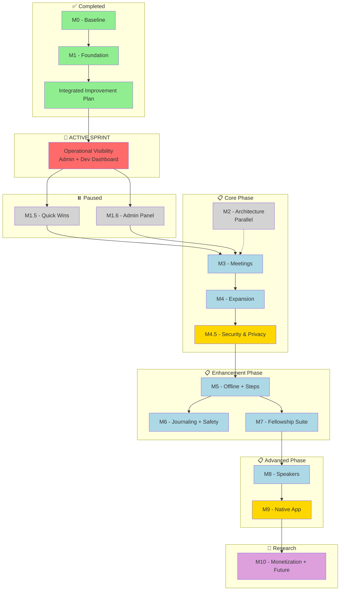

# SoNash Product Roadmap

<!-- prettier-ignore-start -->
**Document Version:** 3.26
**Last Updated:** Session #169
**Status:** ACTIVE
**Related:** [ROADMAP_FUTURE.md](./ROADMAP_FUTURE.md) (future milestones), [ROADMAP_LOG.md](./ROADMAP_LOG.md) (archive)
<!-- prettier-ignore-end -->

> **v3.17 UPDATE:** Removed all date-based scheduling. Now uses Priority + Phase
> Buckets + Relative Ordering system. See Timing System section below.

> **v3.16 UPDATE:** Created canonical audit findings location (Session #116).
> 172 NET NEW findings consolidated to
> [docs/technical-debt/](./docs/technical-debt/). Added audit findings procedure
> documentation and ROADMAP integration guide. See AUDIT_FINDINGS_PROCEDURE.md
> (archived).

---

## AI Instructions

> For detailed AI update instructions, cross-document update triggers, and
> validation commands, see
> [claude.md Section 6](./claude.md#6-agentskill-triggers).

**Quick Reference:**

- **Active sprint work** → Update task checkboxes and progress %
- **Future milestone details** → Add to [ROADMAP_FUTURE.md](./ROADMAP_FUTURE.md)
- **Completed items** → Archive to [ROADMAP_LOG.md](./ROADMAP_LOG.md)
- **Validation:** `npm run docs:update-readme`, `npm run roadmap:validate`

---

## 1. 🎯 Document Purpose

This is the **CANONICAL** product roadmap for SoNash. This document serves as:

1. **Single Source of Truth** - All feature planning and prioritization
2. **Progress Tracker** - Current milestone status and completion
3. **Planning Reference** - What's next and why

**📌 NOTE**: This document supersedes all previous roadmap documents.

> **Note:** Completed items are archived in [ROADMAP_LOG.md](./ROADMAP_LOG.md)
>
> **✅ BLOCKER RESOLVED:** Integrated improvement initiative is complete! See
> [INTEGRATED_IMPROVEMENT_PLAN.md](docs/archive/completed-plans/INTEGRATED_IMPROVEMENT_PLAN.md)
> for the archived plan. Feature development on M1.5 and M1.6 can now resume.
>
> **Architecture Refactoring:** Delta Review validation complete (Step 4).
> Validated items tracked in M2 below. Original plan archived:
> [EIGHT_PHASE_REFACTOR_PLAN.md](./docs/archive/completed-plans/EIGHT_PHASE_REFACTOR_PLAN.md)

---

## 2. 📋 How to Use This Document

### For AI Assistants

1. **Check Milestones Overview** to understand current priorities
2. **Find active work** in "In Progress" sections (🔄 emoji)
3. **Before starting new features**, verify they're in the roadmap
4. **Update progress** after completing significant work
5. **Archive completed items** to [ROADMAP_LOG.md](./ROADMAP_LOG.md)

### For Developers

1. **Quick Status**: See Milestones Overview table
2. **Current Work**: Look for 🔄 In Progress sections
3. **Feature Details**: Each milestone has detailed breakdowns
4. **Acceptance Criteria**: Check Definition of Done at bottom

---

## 3. 🎯 Vision

Build a comprehensive, secure digital recovery notebook that helps individuals
track their sobriety journey with privacy-first design and evidence-based
recovery practices.

---

## 4. 📊 Milestones Overview

| Milestone                           | Status      | Progress           | Phase       | Priority   | Items |
| ----------------------------------- | ----------- | ------------------ | ----------- | ---------- | ----- |
| **M0 - Baseline**                   | ✅ Complete | 100%               | Foundation  | Foundation | -     |
| **M1 - Foundation**                 | ✅ Complete | 100%               | Foundation  | P0         | -     |
| **Integrated Improvement Plan**     | ✅ Complete | 100% (9/9 steps)   | Foundation  | DONE       | -     |
| **🧹 GRAND PLAN: Debt Elimination** | 🔄 ACTIVE   | ~68% (1,176/1,727) | Parallel    | **P0**     | 1,727 |
| **🚀 Operational Visibility**       | 🔄 ACTIVE   | ~25%               | Foundation  | **P0**     | ~105  |
| **M1.5 - Quick Wins**               | ⏸️ Paused   | ~20%               | Foundation  | P1         | ~19   |
| **M1.6 - Admin Panel + UX**         | ⏸️ Paused   | ~75%               | Foundation  | P1         | ~15   |
| **M2 - Architecture**               | ⏸️ Optional | 0%                 | Parallel    | P2         | ~72   |
| ↳ M2.1 Code Quality                 |             |                    | Parallel    | P2         | ~25   |
| ↳ M2.2 Monitoring                   |             |                    | Parallel    | P2         | ~25   |
| ↳ M2.3 Infrastructure               |             |                    | Parallel    | P2         | ~22   |
| **M3 - Meetings**                   | 📋 Planned  | 0%                 | Core        | P1         | 6     |
| **M4 - Expansion**                  | 📋 Planned  | 0%                 | Core        | P1         | ~8    |
| **M4.5 - Security & Privacy**       | 📋 Planned  | 0%                 | Core        | **P0**     | 13    |
| **M5 - Offline + Steps**            | 📋 Planned  | 0%                 | Enhancement | P1         | 23    |
| **M6 - Journaling + Safety**        | 📋 Planned  | 0%                 | Enhancement | P1         | 26    |
| **M7 - Fellowship Suite**           | 📋 Planned  | 0%                 | Enhancement | P1         | ~55   |
| ↳ M7.1 Sponsor & Sharing            |             |                    | Enhancement | P1         | ~15   |
| ↳ M7.2 Exports & Reports            |             |                    | Enhancement | P1         | ~14   |
| ↳ M7.3 Nashville & Knowledge        |             |                    | Enhancement | P1         | ~21   |
| ↳ M7.4 Personalization              |             |                    | Enhancement | P2         | ~17   |
| **M8 - Speakers**                   | 📋 Planned  | 0%                 | Advanced    | P2         | 3     |
| **M9 - Native App**                 | 📋 Planned  | 0%                 | Advanced    | P2         | 15    |
| **M10 - Monetization + Future**     | 🔬 Research | 0%                 | Future      | P2         | ~15   |

### Timing System (Session #128)

**Phase Buckets** (execution order):

- **Foundation**: M0, M1, M1.5, M1.6, Operational Visibility
- **Core**: M3, M4, M4.5 (after Foundation complete)
- **Enhancement**: M5, M6, M7 (after Core complete)
- **Advanced**: M8, M9 (after Enhancement complete)
- **Future**: M10+ (research/long-term)
- **Parallel**: M2, GRAND PLAN (can run alongside any phase as needed)

**Priority Levels**:

- **P0**: Critical path, blocks other work
- **P1**: Next sprint after current P0 completes
- **P2**: Backlog, opportunistic
- **P3**: Future consideration

**Overall Progress:** ~15% (3 foundation milestones complete, active sprint
~25%)

> **Archive:** For completed M0 and M1 milestones, see
> [ROADMAP_LOG.md](./ROADMAP_LOG.md)

### Milestone Dependency Graph



### Critical Dependency Chains

**Chain 1: Encryption → Offline → Features**

- M4 → M4.5 (Encryption) → M5 (Offline) → {M6, M7}
- **Impact:** M4.5 blocks 60+ items across M6/M7
- **Mitigation:** Start encryption R&D during M4, parallel security audit

**Chain 2: Offline Queue → Sponsor Sharing**

- M5-F1 (T2.2 sharedPackets) → M7-F1 (Sponsor features)
- **Impact:** T2.2 blocks 8 sponsor collaboration items
- **Mitigation:** Implement T2.2 early in M5-F1

**Chain 3: Capacitor Wrapper → ALL Native Features**

- T8.1 (Capacitor wrapper) → M9-F1 (ALL native features)
- **Impact:** T8.1 blocks entire M9 milestone (15 items)
- **Mitigation:** Capacitor PoC during M8, PWA fallback path

**Chain 4: Pattern Matcher → Journaling Insights**

- F5.2 (Pattern Matcher) → {F5.3, F5.7, F5.13}
- **Impact:** Low - only affects 3 visualization features
- **Mitigation:** Feature flag, rule-based MVP before ML

**Legend:** 🟢 Complete | 🟡 In Progress/Blocker | 🟠 Blocked | ⚪ Optional | 🔵
Planned | 🟣 Research

**Parallelization Guide:**
[PARALLEL_EXECUTION_GUIDE.md](analysis/PARALLEL_EXECUTION_GUIDE.md)

- 7 parallel work groups identified
- Potential savings: 15 weeks (54 → 39 weeks)
- See guide for execution order and resource requirements

---

## 5. 🚀 ACTIVE SPRINT: Operational Visibility (P0)

> **Spec:**
> [OPERATIONAL_VISIBILITY_SPRINT.md](docs/OPERATIONAL_VISIBILITY_SPRINT.md)
> **Goal:** Full operational visibility with sustainable automations for solo
> dev **Status:** 🔄 ACTIVE | **Started:** Session #64 | **Updated:** Session
> #98

> **✅ SonarCloud Sprint Partially Complete (Session #85)**
>
> PR 1 (Mechanical Fixes) and PR 2 (Critical Issues) completed. Remaining work
> (PR 3-5: Major/Minor quality + Security Hotspots) moved to M2 Architecture
> backlog as lower-priority maintenance items. Sprint unblocked.
>
> - **Plan:**
>   [sonarcloud-cleanup-sprint.md](docs/archive/completed-plans/sonarcloud-cleanup-sprint.md)
> - **Completed:** ~300 issues fixed (mechanical + critical)
> - **Deferred:** ~1,400 issues to M2 (major, minor, security hotspots)

> **📋 Process Audit Integration (Session #101)**
>
> This sprint now includes CI/CD reliability and solo developer automation work
> from Process Audit CANON-0105-0118 and Comprehensive Audit (Session #98).
> Total sprint effort: ~65 hours across 5 tracks.

This sprint consolidates Admin Panel completion, Development Dashboard, CI/CD
reliability, and solo developer automations.

### Archived Tracks (✅ Complete)

| Track            | Items               | Completed     | Session   | Details                                                                                    |
| ---------------- | ------------------- | ------------- | --------- | ------------------------------------------------------------------------------------------ |
| Hotfixes         | REACT-001, PERF-002 | ✅ Fixed      | #115      | [ROADMAP_LOG.md](./ROADMAP_LOG.md#session-142---roadmap-cleanup-archived-completed-tracks) |
| A — Admin Panel  | A1-A25              | ✅ All phases | #75-#129  | [ROADMAP_LOG.md](./ROADMAP_LOG.md#track-a--admin-panel--development-complete)              |
| A-Test — Testing | 293/294 tests       | ✅ Complete   | #130-#141 | [ROADMAP_LOG.md](./ROADMAP_LOG.md#track-a-test--testing--validation--complete)             |

### Sprint Tracks (9 Parallel Tracks)

| Track        | Focus                                   | Status          | Effort    | Owner  |
| ------------ | --------------------------------------- | --------------- | --------- | ------ |
| **Track A**  | Admin Panel (Sentry + GCP Logs)         | ✅ Archived     | ~6 hours  | Claude |
| **Track B**  | Dev Dashboard MVP (expanded +B10/B11)   | 🔄 In Progress  | ~20 hours | Claude |
| **Track C**  | UI/UX Improvements                      | 📋 Reserved     | TBD       | Claude |
| **Track D**  | CI Reliability & Automation             | 📋 Planned      | ~28 hours | Claude |
| **Track E**  | Solo Developer Automations              | 📋 Planned      | ~14 hours | Claude |
| **Track AI** | AI Optimization Sprint (multi-AI audit) | ✅ Complete     | ~9 hours  | Claude |
| **Track O**  | Owner Actions (manual setup)            | 📋 **DO FIRST** | ~10 min   | Jason  |
| **Track P**  | Performance Critical (CWV fix)          | 📋 Planned      | ~24 hours | Claude |
| **Track T**  | Testing Infrastructure (Playwright)     | 🔄 Phase 1 Done | ~70 hours | Claude |

### S0 Critical Debt (Immediate Action)

> **Policy:** S0 items are always in the active sprint regardless of track.
> **Source:** MASTER_DEBT.jsonl (status=VERIFIED, severity=S0)

| ID        | Title                                              | File                                                | Category     | Effort |
| --------- | -------------------------------------------------- | --------------------------------------------------- | ------------ | ------ |
| DEBT-0012 | Cognitive Complexity 22 to 15                      | functions/src/admin.ts:576                          | code-quality | E0     |
| DEBT-0037 | Cognitive Complexity 17 to 15                      | components/widgets/compact-meeting-countdown.tsx:69 | code-quality | E0     |
| DEBT-0854 | App Check disabled on production Cloud Functions   | functions/src/index.ts                              | security     | E2     |
| DEBT-1056 | Cognitive Complexity 16 to 15                      | components/admin/errors-tab.tsx                     | code-quality | E0     |
| DEBT-1064 | Nesting >4 levels deep                             | components/admin/logs-tab.tsx                       | code-quality | E0     |
| DEBT-1538 | Cognitive Complexity 16 to 15                      | functions/src/jobs.ts                               | code-quality | E0     |
| DEBT-1624 | Cognitive Complexity 17 to 15                      | components/dev/lighthouse-tab.tsx                   | code-quality | E0     |
| DEBT-1912 | Client-side filtering of sensitive data            | hooks/use-journal.ts                                | code-quality | E1     |
| DEBT-2499 | pull_request_target security vulnerability         | .github/workflows/deploy-firebase.yml               | process      | E2     |
| DEBT-3079 | 57 AI Instructions sections = ~4,500+ tokens waste | N/A                                                 | code-quality | E0     |
| DEBT-3080 | Session Counter Regex in 5 hooks                   | .claude/hooks/commit-tracker.js                     | code-quality | E1     |

**Total: 11 items | ~8 hours estimated (6xE0 + 3xE1 + 2xE2)**

**Cross-references:**

- DEBT-0854 also tracked in Track S S0 Critical Security (line ~683)
- DEBT-2499 also relevant to Track D CI Reliability
- DEBT-0012, DEBT-1538 will be addressed in Grand Plan Sprint 6 (functions/)
- DEBT-0037, DEBT-1056, DEBT-1064, DEBT-1624 covered by Grand Plan Sprint 2
  (components/) - already done
- CANON-0067 (47 cognitive complexity violations) is a broader parent item in
  M2.3-REF

### Track AI - AI Optimization Sprint (COMPLETE - Session #169)

> **Source:** Multi-AI Audit session `maa-2026-02-17-182d43` (5 AI sources, 65
> findings). **Triage:** 35 accepted for sprint, 13 deferred to debt, 19
> dismissed (duplicates/FP/negligible). **Goal:** Clean dead code, reduce
> session-start latency, DRY up hooks, fix audit prompt gaps.

#### Phase 1: Dead Code Removal (E0, ~1 hour)

- [x] **AI-1.1** Delete 6 dead `.sh` hook files (DEBT-3198, 3200, 3211, 3218)
- [x] **AI-1.2** Delete 13 dead TypeScript migration scripts (DEBT-3184–3196)
- [x] **AI-1.3** Verified delete of orphaned consolidated hook JS files
      (DEBT-3219) — verify references in settings.json/package.json first
- [x] **AI-1.4** Delete dead technical-debt log artifacts (DEBT-3231)
- [x] **AI-1.5** Remove `stop-serena-dashboard.js` from SessionStart hooks
      (DEBT-3199, 3221)
- [x] **AI-1.6** Remove `filesystem` entry from `.mcp.json` (DEBT-3225)

#### Phase 2: Quick Fixes (E0, ~1 hour)

- [x] **AI-2.1** Replace `execSync('node -v')` with `process.version`
      (DEBT-3197)
- [x] **AI-2.2** Apply `rotateJsonl()` to `hook-warnings-log.jsonl` and
      `health-score-log.jsonl` (DEBT-3217, 3244)
- [x] **AI-2.3** Fix broken link in `code-reviewer/SKILL.md` — point to
      `docs/agent_docs/CODE_PATTERNS.md` (DEBT-3208)
- [x] **AI-2.4** Add `evidence` field to all audit agent output schemas
      (DEBT-3201)
- [x] **AI-2.5** Fix git diff parsing in `post-read-handler.js` to use `-z` flag
      (DEBT-3209)

#### Phase 3: Session-Start Incremental (E1, ~2 hours)

- [x] **AI-3.1** Add TTL guard on unconditional `npm run test:build` (DEBT-3204)
- [x] **AI-3.2** Condense session-start output to <10 lines, <100 tokens
      (DEBT-3202)

#### Phase 4: Hook Shared Libraries (E1, ~3 hours)

- [x] **AI-4.1** Extract `gitExec()` to `hooks/lib/git-utils.js`, update 7 hooks
      (DEBT-3213)
- [x] **AI-4.2** Extract `INLINE_PATTERNS` + `checkInlinePatterns()` to
      `hooks/lib/inline-patterns.js` (DEBT-3212)
- [x] **AI-4.3** Migrate `loadJson`/`saveJson` users to `state-utils.js`
      (DEBT-3243)
- [x] **AI-4.4** Add `FALSE_POSITIVES.jsonl` exclusion to audit agent prompts
      (DEBT-3220) — already present in all 13+ audit skills

#### Phase 5: Reference Doc Trim (E1, ~1 hour)

- [x] **AI-5.1** Trim `COMMAND_REFERENCE.md` (109KB) to lightweight index
      (<10KB) linking to source files (DEBT-3206)

#### Phase 6: Audit Review Stage Fix (E1, ~1 hour)

- [x] **AI-6.1** Add Interactive Review phase to `multi-ai-audit/SKILL.md`
      between Phase 5 (Unification) and Phase 6 (TDMS Intake) — adapt
      single-session format for CANON-grouped, consensus-scored findings
- [x] **AI-6.2** Add Interactive Review phase to `audit-aggregator/SKILL.md`

**Total: 18 work items | ~9 hours estimated | 6 phases**

#### Deferred to Debt (3 items, E2-E3)

| DEBT ID                                 | Title                                           | Effort |
| --------------------------------------- | ----------------------------------------------- | ------ |
| DEBT-3182, 3183, 3203, 3205, 3207, 3236 | Full session-start.js architectural overhaul    | E3     |
| DEBT-3210, 3216, 3232, 3235, 3241, 3242 | Shared base audit template                      | E3     |
| DEBT-3215                               | Structured return protocol for pre-commit-fixer | E2     |

### GRAND PLAN: Technical Debt Elimination (1,727 items)

> **Full spec:** See plan file at `.claude/plans/` (session plan) and
> `docs/technical-debt/logs/grand-plan-manifest.json` (item-to-sprint mapping)
>
> **Sprint manifest files:** `docs/technical-debt/logs/sprint-N-ids.json`
> contain every DEBT-XXXX ID for each sprint, grouped by file.

| Sprint | Directory Group            | Items | Files | Risk     | Status  |
| ------ | -------------------------- | ----: | ----: | -------- | ------- |
| 1      | `scripts/`                 |   601 |   106 | Low      | ✅ Done |
| 2      | `components/`              |   334 |   100 | Moderate | ✅ Done |
| 3      | `.claude/` + `docs/`       |   241 |    84 | Zero     | ✅ Done |
| 4      | `lib/` + `hooks/` + `app/` |   214 |    40 | Moderate | Pending |
| 5      | `.github/` + config        |   156 |    40 | Moderate | Pending |
| 6      | `functions/` + rules       |    80 |     9 | High     | Pending |
| 7      | `tests/` + systemic        |   151 |    12 | Mixed    | Pending |
| skip   | Dedicated sessions         |     6 |     - | -        | Later   |

**Approach:** File-based (not category-based) to avoid revisiting files. Each
sprint uses parallel agents + wave-based execution + per-wave commits.
Lightweight verification per sprint; comprehensive audit only after Sprint 7.

**Session #166 Verification & Triage (228 items verified, 96 placed):**

- 54 code-quality/refactoring items → Sprint 4 (2 S0, 13 S1, 24 S2, 15 S3)
- 2 process items → Sprint 5 (S3)
- 35 ai-optimization items → Track D (2 S1, 15 S2, 18 S3)
- 4 security items → M4.5 (2 S2, 2 S3)
- 1 documentation item → Track B (S3)

**Enhancement Audit Items (Session #151, migrated to TDMS):**

- [ ] **DEBT-2809:** Triage 96 stale TODO/TBD markers across 34 files — resolve,
      remove, or convert to TDMS items (S2, E1)
- [ ] **DEBT-2811:** Documentation effectiveness metrics — track which docs are
      useful, with actionable plan to prune/improve (S2, E2) [M2.1]

### Track B - Dev Dashboard (Expanded)

> **Full spec:** See
> [OPERATIONAL_VISIBILITY_SPRINT.md](docs/OPERATIONAL_VISIBILITY_SPRINT.md)
> Track B
>
> **Session #116 Audit Findings:** 18 documentation findings - see
> [MASTER_DEBT.jsonl](docs/technical-debt/MASTER_DEBT.jsonl) (documentation
> category)

#### Session #116 Documentation Priority Items (S1/S2)

- [ ] **CANON-0011:** 16 broken anchor links `SESSION_CONTEXT.md:47` [E1] - S1
- [ ] **CANON-0012:** 20 placeholder issues in templates
      `PERFORMANCE_AUDIT_PLAN_2026_Q1.md` [E1] - S1
- [ ] **CANON-0077:** Broken relative links in review docs
      `CODE_REVIEW_2026_Q1.md` [E1] - S1
- [ ] **CANON-0078:** [X] placeholders in 2026-Q1 plans
      `CODE_REVIEW_PLAN_2026_Q1.md` [E1] - S1
- [ ] **CANON-0013:** 99 files fail docs:check (313 errors) `README.md` [E1] -
      S2
- [ ] **CANON-0148:** Fix broken relative links [E1] - S1
- [ ] **CANON-0149:** Replace [X] placeholders [E1] - S1

#### Core Setup ✅ PARTIAL

- [x] **B1:** Create `/dev` route with auth gate (2hr) ✅
- [x] **B2:** PERF-001 - Lighthouse audit script (2hr) ✅

#### Dev Dashboard Tabs

- [ ] **B3:** Lighthouse CI Integration (2hr) [depends: B1, B2]
- [ ] **B4:** Firestore History Storage (2hr) [depends: B1]
- [ ] **B5:** Lighthouse Dashboard Tab (3hr) [depends: B3, B4]
- [ ] **B6:** Error Tracing Tab (2hr) - includes npm audit display [depends: B4]
- [ ] **B7:** Session Activity Tab (2hr) [depends: B4]
- [ ] **B8:** Document Sync Tab (1hr) [depends: B4]
- [ ] **B9:** Override Audit Tab (1hr) [depends: B4]
- [ ] **B10:** System Health Tab (3hr) **NEW - Process Audit Integration**
      [depends: B4]
  - Pattern compliance status (93 violations baseline)
  - CI gate status, script test coverage
  - Pre-commit timing, agent compliance
- [ ] **B11:** Warnings Resolution Tab (3hr) **NEW - Session #101** [depends:
      B4, E1]
  - Track unresolved hook warnings
  - Resolution actions: Acknowledge/Resolve/Suppress
  - Aging alerts for old warnings

### Track D - CI Reliability & Automation (NEW)

> **Source:** Process Audit CANON-0105-0118 + Comprehensive Audit (Session #98)
> **Full spec:** See
> [OPERATIONAL_VISIBILITY_SPRINT.md](docs/OPERATIONAL_VISIBILITY_SPRINT.md)
> Track D
>
> **Session #116 Audit Findings:** 17 findings - see
> [MASTER_DEBT.jsonl](docs/technical-debt/MASTER_DEBT.jsonl) (process category)

#### Session #116 Priority Items (S1/S2)

- [ ] **CANON-0090:** Script test coverage 2-7% `scripts/` [E2] - S1
- [ ] **CANON-0091:** Deploy workflow missing gcloud setup `deploy-firebase.yml`
      [E1] - S1
- [ ] **CANON-0162:** Convert CI gates to blocking [E2] - S1
- [ ] **CANON-0163:** Add npm audit + CodeQL + Dependabot [E2] - S1
- [ ] **CANON-0007:** GitHub Actions using version tags
      `auto-label-review-tier.yml:18` [E1] - S2
- [ ] **CANON-0021:** Artifact upload without retention policy `ci.yml:99`
      [E1] - S2
- [ ] **CANON-0092:** Pre-commit hook slow (~35-50s) `pre-commit` [E1] - S2

**NEW from Session #128 Audit:**

- [ ] DEBT-0944: Tests not run for config changes (S1, pre-commit:54)
- [ ] DEBT-0945: Doc-only commit detection misclassifies critical JSONL (S1,
      pre-commit:71)
- [ ] DEBT-0946: Cross-document override not implemented (S1,
      pre-commit:119-131)
- [ ] DEBT-0948: Functions directory not linted in CI (S1, ci.yml:27-28)
- [ ] DEBT-0953: Backlog enforcement job obsolete after TDMS migration (S2,
      backlog-enforcement.yml)
- [ ] DEBT-0958: Function deletion with force flag lacks validation (S2,
      deploy-firebase.yml:67-74)
- [ ] DEBT-0959: Pre-commit total time 15-30s developer friction (S2,
      pre-commit)

**NEW from Session #152 Triage:**

- [ ] DEBT-2748: Duplicate hook validation for Write+Edit+MultiEdit tools (S2,
      check-edit-requirements.sh)
- [ ] DEBT-2749: Firebase deployment lacks rollback on partial failure (S2,
      deploy-firebase.yml)
- [ ] DEBT-2751: SonarCloud not enforced in CI gates (S2, ci.yml)
- [ ] DEBT-2752: Sentry disabled in dev mode by default (S2, sentry.client.ts)
- [ ] DEBT-2753: Hook performance not tracked - no metrics (S2,
      pattern-check.sh)
- [ ] DEBT-2754: Pre-push duplicates pre-commit pattern checks (S2, pre-push)
- [ ] DEBT-2785: Pre-commit hook parallelization - 40% faster (S2, pre-commit)
- [ ] DEBT-2786: CI non-blocking checks should block (S2, ci.yml)
- [ ] DEBT-2803: Consolidate regex pattern linter into ESLint plugin (S2,
      check-pattern-compliance.js)

**Enhancement Items (Session #151, migrated to TDMS):**

- [ ] DEBT-2812: Add engines field to root package.json for CI/CD consistency
      (S2, E0)
- [ ] DEBT-2814: Pre-push duplicates pre-commit pattern checks (S2, E0)

#### Phase 1 - Quick Wins

- [ ] **D1:** Pin Firebase CLI version (30min) [CANON-0112]
- [ ] **D2:** Optimize pre-commit hook (2hr) [CANON-0110] - Target: ~50s → <15s
  - [x] **D2.1:** Skip tests for doc-only commits (10min) - ✅ Session #113
  - [ ] **D2.2:** Remove duplicate test run from pre-push (done) - ✅ Session
        #113
  - [ ] **D2.3:** Add file extension filters to hook matchers (1hr)
  - [ ] **D2.4:** Consolidate Write/Edit/MultiEdit hooks (2hr)
- [ ] **D3:** Update workflow documentation (2hr) [CANON-0109]

#### Phase 2 - CI Quality Gates

- [ ] **D4:** Fix non-blocking CI gates (4hr) [CANON-0105, 0111] - S0 priority
      [depends: D1]
- [ ] **D5:** Add security scanning to CI (4hr) [CANON-0107] [depends: D4]

#### Phase 3 - Deployment Safety

- [x] **D5.5:** Golden-path E2E test (3hr) [CTO Advisory] - ✅ **Consolidated
      into Track T** (T2.1-T2.5)
- [ ] **D6:** Post-deployment health checks (2hr) [Comprehensive] [depends: D4]
- [ ] **D7:** Deployment approval gates (2hr) [Comprehensive] [depends: D6]
- [ ] **D8:** Automated rollback (5hr) [Comprehensive] [depends: D6, D7]
- [ ] **D9:** Canary deployments (6hr) [Comprehensive - Optional] [depends: D8]

#### Phase 4 - Ongoing

- [ ] **D10:** Script test coverage (ongoing) [CANON-0106] - 2-7% → 30%
      [depends: D1]

### Track E - Solo Developer Automations (NEW)

> **Rationale:** Automations for solo no-code developer using Claude Code **Full
> spec:** See
> [OPERATIONAL_VISIBILITY_SPRINT.md](docs/OPERATIONAL_VISIBILITY_SPRINT.md)
> Track E
>
> **Session #116 Audit Findings:** 3 engineering-productivity findings - see
> [MASTER_DEBT.jsonl](docs/technical-debt/MASTER_DEBT.jsonl)

#### Session #116 Priority Items (S2)

- [ ] **CANON-0027:** No scripts/doctor.js for environment validation `scripts/`
      [E1] - S2

**NEW from Session #128 Audit (Offline Infrastructure - CRITICAL):**

- [ ] DEBT-0933: Firebase IndexedDB persistence not enabled (S1,
      lib/firebase.ts)
- [ ] DEBT-0934: No service worker - app cannot load offline (S1, public/)
- [ ] DEBT-0935: No offline write queue - journal entries lost (S1,
      lib/firestore-service.ts)

- [ ] **E1:** Warning collector hook (2hr) - Feed B11 Warnings Tab
- [ ] **E2:** Session health summary (1hr) - JSON output for Dashboard [depends:
      E1]
- [ ] **E3:** Auto-escalation system (2hr) - Age-based issue alerts [depends:
      E1]
- [ ] **E4:** Pre-commit decision aid (1hr) - Guide commit decisions
- [ ] **E5:** Automated fix suggestions (3hr) - Generate patches
- [ ] **E6:** Weekly health digest (2hr) - Automated trend summary
- [ ] **E7:** Session-end runbook (1hr) - docs/runbooks/SESSION_END.md
- [ ] **E8:** Incident response runbook (2hr) -
      docs/runbooks/INCIDENT_RESPONSE.md
- [ ] **E9:** Broken deploy triage runbook (30min)
- [ ] **E10:** Firestore permission denied runbook (30min)
- [ ] **E11:** App Check issues runbook (30min)
- [ ] **E12:** Cost spike triage runbook (30min)
- [ ] **E13:** Claude Fix Bundle format (1hr) - docs/CLAUDE_FIX_BUNDLE.md
- [ ] **E14:** Reduce SESSION_CONTEXT.md (1hr) - Archive history to
      SESSION_HISTORY.md
- [x] **E15:** Create SKILL_INDEX.md (30min) - ✅ Session #113
- [ ] **E16:** Consolidate audit skills (2hr) - Merge 9 /audit-\* into single
      /audit
- [x] **E17:** claude.md context optimization (1hr) - Slimmed 497→~130 lines,
      extracted to AGENT_ORCHESTRATION.md + CONTEXT_PRESERVATION.md ✅ PR #356
- [x] **E18:** Dependency-aware task ordering (2hr) - `/task-next` skill +
      Kahn's topological sort via `scripts/tasks/resolve-dependencies.js` ✅ PR
      #356
- [x] **E19:** JSONL-based velocity tracking (2hr) -
      `scripts/velocity/track-session.js` + `generate-report.js` ✅ PR #356

**NEW from Session #152 Triage:**

- [ ] DEBT-2780: AI_WORKFLOW.md size optimization - 872 lines (S2,
      AI_WORKFLOW.md)
- [ ] DEBT-2782: Security guidance consolidation - overlapping docs (S2,
      SECURITY.md)
- [ ] DEBT-2784: Cross-reference navigation overhead (S2,
      DOCUMENT_DEPENDENCIES.md)
- [ ] DEBT-2787: Script consolidation - 30+ scripts with inconsistent CLI (S2,
      scripts/README.md)

### Track O - Owner Actions (Jason - Manual Setup)

> **PRIORITY:** Do these FIRST - they take only ~10 minutes total and provide
> critical external monitoring that code cannot replicate.
>
> **Full instructions:** See
> [OPERATIONAL_VISIBILITY_SPRINT.md](docs/OPERATIONAL_VISIBILITY_SPRINT.md)
> Track O

- [ ] **O1:** Firebase Budget Alert (~2 min)
  - Firebase Console → Usage and billing → Create budget
  - Set $25 threshold, add your email
- [ ] **O2:** UptimeRobot External Monitoring (~5 min)
  - Create free account at uptimerobot.com
  - Add HTTPS monitor for production URL
  - Add email alerts
- [ ] **O3:** GitHub Dependabot Enable (~2 min)
  - Repo Settings → Code security → Enable Dependabot alerts

### Track C - UI/UX & Analytics (Late Sprint)

- [ ] **C2:** Monitoring Consolidation (4-6hr)
  - Unify error formats across frontend/backend/logs
  - Add correlation IDs to logger (`EFF-006`)
  - Enables end-to-end request tracing

### Track P - Performance Critical (NEW - Session #98)

> **Source:** Comprehensive Audit (Session #98, report archived) **Tracking:**
> [Technical Debt Index](docs/technical-debt/INDEX.md)
>
> **Note:** Renamed from "Track D" to "Track P" to avoid confusion with Track D
> (CI Reliability) in the Operational Visibility Sprint.
>
> **Session #116 Audit Findings:** 11 findings - see
> [MASTER_DEBT.jsonl](docs/technical-debt/MASTER_DEBT.jsonl) (performance
> category)

**Priority:** P0 - Core Web Vitals failing, 11MB image payload

#### Session #116 Priority Items (S1/S2)

- [ ] **CANON-0056:** Landing page blocks SSR `app/page.tsx` [E2] - S1
- [ ] **CANON-0057:** Notebook module registry eagerly imports all pages
      `roadmap-modules.tsx` [E2] - S1
- [ ] **CANON-0058:** Sentry incomplete - no Web Vitals `sentry.client.ts`
      [E2] - S2
- [ ] **CANON-0059:** Celebration animations create 150+ DOM elements
      `confetti-burst.tsx` [E1] - S2
- [ ] **CANON-0060:** No React.memo causes unnecessary re-renders
      `entry-card.tsx` [E1] - S2
- [ ] **CANON-0064:** Step1WorksheetCard excessive complexity (804 lines)
      `Step1WorksheetCard.tsx` [E2] - S2

**NEW from Session #128 Audit:**

- [ ] DEBT-0950: MoodSparkline redundant fetch duplicates journal data (S1,
      mood-sparkline.tsx:18)
- [ ] DEBT-0955: Large ResourcesPage not code-split (960 lines, ~50KB) (S2,
      resources-page.tsx:1)
- [ ] DEBT-0960: Pre-push redundant checks (15-40s) (S2, pre-push)

**NEW from Session #152 Triage:**

- [ ] DEBT-2768: No performance benchmarks for pagination and data loading (S2,
      resources-page.tsx)
- [ ] DEBT-2772: Enable Next.js experimental optimizations + bundle analysis
      (S2, next.config.mjs)
- [ ] DEBT-2777: Lazy load Leaflet and Recharts with dynamic imports (S2,
      meeting-map.tsx)

#### P1: Image Optimization (4hr) - **CRITICAL**

- [ ] **P1.1:** Remove unused gemini-generated images (-4MB)
- [ ] **P1.2:** Convert remaining images to WebP format (-90% size)
- [ ] **P1.3:** Add responsive srcsets for notebook covers
- [ ] **P1.4:** Preload LCP image (wood-table.jpg)

**Impact:** LCP 4s → <2.5s, Initial load 11MB → <2MB

#### P2: Bundle Optimization (4hr)

- [ ] **P2.1:** Add dynamic imports for notebook pages
- [ ] **P2.2:** Tree-shake framer-motion (only import needed functions)
- [ ] **P2.3:** Code-split admin panel
- [ ] **P2.4:** Add bundle analyzer (@next/bundle-analyzer) (1hr) **NEW -
      Audit**

**Impact:** TTI 3-5s → <2s, Bundle -40%

#### P3: React Performance (6hr)

- [ ] **P3.1:** Add React.memo to today-page child components
- [ ] **P3.2:** Memoize auth context value
- [ ] **P3.3:** Add useMemo to expensive array.map operations
- [ ] **P3.4:** Virtual scrolling for large lists (react-window) (3hr) **NEW -
      Audit**

**Impact:** FID/INP 250ms → <100ms

#### P4: Firestore Optimization (4hr)

- [ ] **P4.1:** Add `limit(7)` to weekly stats query
- [ ] **P4.2:** Create composite indexes for common queries
- [ ] **P4.3:** Implement request deduplication
- [ ] **P4.4:** Consolidate real-time listeners (2hr) **NEW - Audit**

**Impact:** Firestore reads -90%, Query time -50%

#### P5: Caching & Offline (4hr)

- [ ] **P5.1:** Add HTTP cache headers to firebase.json
- [ ] **P5.2:** Install and configure next-pwa
- [ ] **P5.3:** Add offline fallback page

**Impact:** Repeat visits instant, Offline support

#### P6: Security Headers (2hr)

- [ ] **P6.1:** Add Content Security Policy
- [ ] **P6.2:** Add X-Frame-Options, X-Content-Type-Options
- [ ] **P6.3:** Remove hardcoded reCAPTCHA fallback

**Impact:** XSS protection, Clickjacking prevention

**Track P Total: ~24 hours** (was ~18 hours, +6hr from Audit)

### Track S - Security Technical Debt (NEW - Phase 18)

> **Source:** TDMS MASTER_DEBT.jsonl security category (58 items) **Goal:**
> Address security-related technical debt for production hardening **Priority:**
> P0 - Security issues should be resolved before M4.5 Security & Privacy
> milestone

**Note:** This track addresses **technical debt** related to security (e.g., App
Check disabled, reCAPTCHA fail-open, missing headers). For security **features**
(encryption, privacy controls), see M4.5 Security & Privacy milestone.

#### S0 Critical Security (4 unique issues - deduplicated from 18 items)

> **Note:** DEBT-0854 (App Check disabled) has been promoted to the **S0
> Critical Debt** section in the Active Sprint above for immediate action.

| ID         | Issue                                                 | File                     | Effort |
| ---------- | ----------------------------------------------------- | ------------------------ | ------ |
| DEBT-0854+ | App Check disabled on Cloud Functions                 | functions/src/index.ts   | E1     |
| DEBT-0850+ | Legacy journalEntries allows direct writes            | firestore.rules          | E2     |
| DEBT-0087  | Missing security headers (CSP, X-Frame-Options, etc.) | firebase.json            | E1     |
| DEBT-0852+ | CI security gates non-blocking                        | .github/workflows/ci.yml | E1     |

**S0 Action Items:**

- [ ] **S1:** Re-enable App Check on Cloud Functions (DEBT-0854, 0856,
      0860, 0865) -- **See S0 Critical Debt in Active Sprint**
- [ ] **S2:** Close direct client write path to journalEntries (DEBT-0850,
      0855, 0857)
- [ ] **S3:** Add security headers to firebase.json (DEBT-0087)
- [ ] **S4:** Convert CI security checks to blocking (DEBT-0852, 0859, 0864)

#### S1 High Priority Security (12 items)

| Pattern                   | IDs                               | Description                         | Effort |
| ------------------------- | --------------------------------- | ----------------------------------- | ------ |
| reCAPTCHA fail-open       | DEBT-0045, 0071, 0080, 0100, 0110 | Logs missing token but continues    | E1     |
| Client App Check disabled | DEBT-0068, 0108                   | Client-side not sending tokens      | E1     |
| Rate limiting incomplete  | DEBT-0046, 0081, 0101, 0111       | No IP throttling, admin unthrottled | E2     |
| Admin claim defense       | DEBT-0073, 0109                   | Direct writes expand blast radius   | E2     |

**S1 Action Items:**

- [ ] **S5:** Make reCAPTCHA fail-closed when configured
- [ ] **S6:** Restore client App Check initialization
- [ ] **S7:** Add IP-based rate limiting, throttle admin endpoints
- [ ] **S8:** Add Cloud Function wrappers for admin mutations

**NEW from Session #128 Audit:**

- [ ] DEBT-0932: App Check disabled + no offline support (S1,
      functions/src/index.ts)
- [ ] DEBT-0943: Firebase credentials written to disk in deployment (S1,
      deploy-firebase.yml)
- [ ] DEBT-0947: Trigger override logging silently fails with || true (S1,
      pre-push)
- [ ] DEBT-0949: GitHub Actions secrets not rotated regularly (S1, Settings)

#### S2 Medium Priority Security (27 items + 3 NEW)

Security hotspots and lower-severity items tracked in MASTER_DEBT.jsonl with
category="security". Review and address as part of ongoing security hardening.

**NEW from Session #128 Audit:**

- [ ] DEBT-0951: Missing Content-Security-Policy header (S2, firebase.json)
- [ ] DEBT-0952: Script injection vulnerability in resolve-debt workflow (S2)
- [ ] DEBT-0954: Security check doesn't scan Cloud Functions (S2)

#### S3 Low Priority Security (15 items)

Security-related code improvements, documentation needs tracked in
MASTER_DEBT.jsonl.

**NEW from Session #152 Triage:**

- [ ] DEBT-2779: Add composite index for userId + timestamp on security_logs
      (S2, firestore.indexes.json)

**Enhancement Items (Session #151, migrated to TDMS):**

- [ ] DEBT-2810: Security guidance consolidation — merge overlapping security
      docs into clear hierarchy (S2, E2)

**Track S Total:** 60 items | ~30 hours estimated

### Track T - Testing Infrastructure (NEW - Session #103)

> **Spec:**
> [TESTING_INFRASTRUCTURE_PLAN.md](docs/plans/TESTING_INFRASTRUCTURE_PLAN.md)
> **Goal:** Automated testing for components, user journeys, and visual
> regression **Note:** Consolidates D5.5, AUTO-004, TEST-001, TEST-002 into
> unified testing track

**Priority:** P1 - Build sustainable testing infrastructure for solo developer

#### Phase 1: `/test-suite` Skill + Feature Protocols ✅ COMPLETE (Session #141)

> **Delivered:** Unified testing suite with 27 feature protocols, 5-phase
> pipeline (smoke/feature/security/performance/report), dual browser support
> (Playwright MCP + Chrome Extension), Firebase Preview Channels for PR testing.
>
> **User Manual:** [TESTING_USER_MANUAL.md](docs/plans/TESTING_USER_MANUAL.md)
> **Skill:** `.claude/skills/test-suite/SKILL.md` **Protocols:**
> `.claude/test-protocols/*.protocol.json` (27 files)

- [x] **T1.1:** Install and configure Playwright (via MCP plugin) ✅
- [x] **T1.2:** Create test protocol system (27 feature protocols) ✅
- [x] **T1.3:** Create `/test-suite` skill with 5-phase pipeline ✅
- [x] **T1.4:** Configure Firebase Preview Channels for PR testing ✅
- [x] **T1.5:** Testing User Manual + doc cross-references ✅

#### Phase 2: Golden Path E2E Tests (10hr)

> Implements and expands D5.5 (Golden-path E2E test). **Note:** The
> `/test-suite` protocols (Phase 1) cover these journeys via Playwright MCP.
> This phase adds traditional `@playwright/test` CI-runnable tests if needed.

- [ ] **T2.1:** Auth Flow - Sign in, anonymous auth, sign out (2hr)
- [ ] **T2.2:** Onboarding - Clean date, fellowship, nickname (2hr)
- [ ] **T2.3:** Daily Journal - Mood, gratitude, free-write (2hr)
- [ ] **T2.4:** Meeting Finder - Search, filter, pagination (2hr)
- [ ] **T2.5:** Admin CRUD - Meetings/Quotes/Users operations (2hr)

#### Phase 3: Component Testing (10hr)

- [ ] **T3.1:** Form Components - Input validation, submit states (2hr)
- [ ] **T3.2:** Modal/Dialog - Open, close, interactions (2hr)
- [ ] **T3.3:** Navigation - Tabs, ribbon, breadcrumbs (2hr)
- [ ] **T3.4:** Data Display - Cards, lists, pagination (2hr)
- [ ] **T3.5:** Admin Components - CRUD forms, data tables (2hr)

#### Phase 4: Visual Regression (6hr)

- [ ] **T4.1:** Configure Playwright visual comparison (2hr)
- [ ] **T4.2:** Create baseline screenshots (key pages) (2hr)
- [ ] **T4.3:** Integrate with CI (fail on diff > threshold) (2hr)

#### Phase 5: Dev Dashboard Integration (5hr)

> Depends on Track B completion

- [ ] **T5.1:** Test Results Tab - Show pass/fail summary (2hr)
- [ ] **T5.2:** Coverage Display - File/component breakdown (2hr)
- [ ] **T5.3:** Run Tests Button - Trigger test suite from panel (1hr)

#### Phase 6: Test Data Management (6hr)

- [ ] **T6.1:** Test Data Factories - User, Meeting, Journal factories (2hr)
- [ ] **T6.2:** Seed Scripts - Populate emulator with realistic data (2hr)
- [ ] **T6.3:** Cleanup Utilities - Reset state between tests (2hr)
- [ ] **T6.4:** Security Rules Tests - Test firestore.rules coverage (3hr)
      **NEW - Audit**

**NEW from Session #128 Audit:**

- [ ] DEBT-0942: Multiple 'any' types in test mock setup (10+ instances) (S1,
      firestore-service.test.ts:18)

**NEW from Session #152 Triage:**

- [ ] DEBT-2764: Missing Cloud Functions integration tests (S2, admin.ts)
- [ ] DEBT-2765: No visual regression testing despite Playwright (S2,
      package.json)
- [ ] DEBT-2766: Coverage thresholds not enforced despite c8 (S2, package.json)
- [ ] DEBT-2767: Limited script testing - 5 test files for 60+ scripts (S2,
      callable-errors.test.ts)
- [ ] DEBT-2769: Error boundary and Sentry integration not tested (S2,
      error-boundary.tsx)
- [ ] DEBT-2770: Flaky timing in rate limiter tests using real setTimeout (S2,
      rate-limiter.test.ts)
- [ ] DEBT-2771: msw installed but unused for API mocking (S2, package.json)

#### Phase 7: Cloud Functions Testing (22hr) **NEW - Refactoring Audit**

> **Source:** docs/audits/comprehensive/REFACTORING_AUDIT_DEDUPLICATED.md
> (TEST-001 through TEST-005) **Critical Gap:** All 19 Cloud Functions have **0%
> test coverage**

- [ ] **T7.1:** admin.ts test suite (6hr) - 3,111 lines, 0 tests
- [ ] **T7.2:** jobs.ts test suite (4hr) - 1,036 lines, 0 tests
- [ ] **T7.3:** index.ts tests (2hr) - Entry point coverage
- [ ] **T7.4:** triggers.ts tests (4hr) - Firestore trigger coverage
- [ ] **T7.5:** emailer.ts tests (2hr) - Email functionality
- [ ] **T7.6:** Background jobs tests (4hr) - Scheduled job testing

**Track T Total: ~70 hours** (was ~45 hours)

**Environment Support:**

| Environment  | Browser                | Extension Support | Notes                 |
| ------------ | ---------------------- | ----------------- | --------------------- |
| Web (Remote) | Headless Chromium      | Limited           | CI/CD, automated runs |
| CLI (Local)  | Chrome with extensions | Full              | Chrome extension mode |

### Future Enhancements (Deferred from PR Reviews)

| ID         | Enhancement                            | Source      | Priority |
| ---------- | -------------------------------------- | ----------- | -------- |
| ADMIN-FE-1 | Move error knowledge base to Firestore | Review #151 | P2       |
| SEC-LOG-1  | Sensitive log persistence review       | Review #162 | P2       |

> **ADMIN-FE-1:** The error knowledge base (`lib/error-knowledge-base.ts`) is
> currently hardcoded. Moving it to Firestore would allow dynamic updates
> without code deploys. Architectural change - implement after core admin
> features complete.
>
> **ADMIN-FE-2:** Instead of duplicating logs into Firestore, the adminGetLogs
> function could query the GCP Cloud Logging API directly. This would eliminate
> data redundancy, reduce Firestore costs, and remove the need for the log
> pruning job. Major architecture change requiring `@google-cloud/logging`
> dependency.
>
> **SEC-LOG-1:** Security events are persisted to `security_logs` Firestore
> collection. While metadata is now redacted (Review #162), a broader review of
> what data should be logged vs. only sent to GCP Cloud Logging is warranted.
> Consider implementing a tiered logging strategy where only aggregated/summary
> data is stored in Firestore.

### Blockers

| Blocker                  | Status      | Resolution                         |
| ------------------------ | ----------- | ---------------------------------- |
| **SonarCloud Cleanup**   | ✅ Partial  | PR 1+2 done; PR 3-5 deferred to M2 |
| Sentry not initialized   | ✅ Resolved | A1 complete                        |
| Sentry env vars missing  | ✅ Resolved | Firebase config verified           |
| Dashboard stats failing  | ✅ Resolved | A5 complete                        |
| /dev route doesn't exist | 🔄 Ready    | B1 task (Track B) - can proceed    |
| Track A testing complete | ✅ Complete | All jobs A10-A14 passing           |

### Quick Reference: Environment Variables Needed

```bash
# Sentry (Cloud Functions) - you need to provide these
firebase functions:config:set sentry.api_token="YOUR_TOKEN"
firebase functions:config:set sentry.org="YOUR_ORG"
firebase functions:config:set sentry.project="YOUR_PROJECT"

# Sentry (Client - .env.local)
NEXT_PUBLIC_SENTRY_DSN=https://xxx@sentry.io/xxx
NEXT_PUBLIC_SENTRY_ENABLED=true
```

### Additional Monitoring Integrations (Evaluated Session #69)

| Tool                  | Recommendation     | Cost                             | Notes                     |
| --------------------- | ------------------ | -------------------------------- | ------------------------- |
| Sentry Session Replay | ✅ Enable          | $0 (50/mo free)                  | Already integrated        |
| PostHog               | ✅ Consider for C1 | $0 (5k replays + 1M events free) | All-in-one analytics      |
| LogRocket             | ❌ Skip            | $99/mo+                          | Too expensive             |
| Datadog RUM           | ❌ Skip            | $1.50/1k sessions                | Overkill for this stage   |
| Firebase Crashlytics  | ⏳ Later           | $0                               | Only if native mobile app |

---

## 6. ⚡ M1.5 - Quick Wins (🔄 In Progress)

**Goal:** High-impact, low-effort features that improve user experience

### 🚨 Clear Audit Backlog ✅ MOSTLY COMPLETE

> **Status:** Session #99 completed 7 items. Only 2 documentation items remain,
> deferred to documentation sprint. See
> [AUDIT_FINDINGS_BACKLOG.md](docs/technical-debt/INDEX.md)

**Current backlog:** 2 items (deferred to documentation sprint)

| ID         | Category      | Severity | Effort | Status   | Description                      |
| ---------- | ------------- | -------- | ------ | -------- | -------------------------------- |
| CANON-0101 | Documentation | S3       | E2     | DEFERRED | Missing Quick Start sections     |
| CANON-0102 | Documentation | S3       | E1     | DEFERRED | Missing AI Instructions sections |

**NEW from Session #128 Audit:**

- [ ] DEBT-0938: Comprehensive audit reports missing standard structure (S1,
      audit-code-report.md)
- [ ] DEBT-0939: Broken link to FALSE_POSITIVES.jsonl in agent policy (S1,
      SKILL_AGENT_POLICY.md:312)
- [ ] DEBT-0940: Missing CONTRIBUTING.md at root level (S1, CONTRIBUTING.md)
- [ ] DEBT-0957: Archive docs never checked for link rot (S2,
      docs-lint.yml:77-80) ROADMAP.md, ROADMAP_FUTURE.md, AUDIT_TRACKER.md,
      SKILL_AGENT_POLICY.md)

**Enhancement Items (Session #151, migrated to TDMS):**

- [ ] DEBT-2806: Inconsistent loading states — spinners vs text vs skeletons
      across components (S2, E2)
- [ ] DEBT-2807: Generic button labels — Submit instead of action-specific text
      (S2, E0)
- [ ] DEBT-2808: Date formats inconsistent across the app (S2, E1)
- [ ] DEBT-2813: Missing ARIA labels on critical navigation tabs (S2, E0)

**Completed in Session #99:**

- ✅ CANON-0107: Security headers (S1)
- ✅ CANON-0108: Storage rules (verified existing)
- ✅ CANON-0103: docs:check false positives
- ✅ CANON-0104: Scripts in session start (verified existing)
- ✅ CANON-0105: CANON validation in CI
- ✅ CANON-0106: npm commands added
- ✅ LEGACY-001: SSR-safe localStorage retrofit

**Process Audit items moved to Operational Visibility Sprint Track D:**

- CANON-0105 (CI gates) → Track D: D4
- CANON-0106 (Script coverage) → Track D: D10
- CANON-0107 (Security scanning) → Track D: D5
- CANON-0109 (Workflow docs) → Track D: D3
- CANON-0110 (Pre-commit slow) → Track D: D2
- CANON-0111 (Pattern checker) → Track D: D4
- CANON-0112 (Firebase CLI) → Track D: D1

### 🔥 Refactoring Audit Quick Wins ✅ COMPLETE (Session #115)

> **Source:** docs/audits/comprehensive/REFACTORING_AUDIT_DEDUPLICATED.md -
> Dependency housekeeping items

| ID      | Issue                    | Effort | Action                      | Status |
| ------- | ------------------------ | ------ | --------------------------- | ------ |
| DEP-001 | @types/leaflet in prod   | 5 min  | Move to devDependencies     | ✅     |
| DEP-002 | lucide-react outdated    | 10 min | npm update lucide-react     | ✅     |
| DEP-020 | Hardcoded storage bucket | 15 min | Extract to env var          | ⏭️ N/A |
| DEP-021 | Node 24 not LTS          | 10 min | Change to Node 20           | ✅     |
| DEP-022 | lodash vulnerability     | 10 min | npm audit fix in functions/ | ✅     |
| DEP-006 | tsx in prod deps         | 5 min  | Move to devDependencies     | ✅     |
| DEP-007 | dotenv in prod deps      | 5 min  | Move to devDependencies     | ✅     |
| DEP-008 | Generic project name     | 5 min  | Rename to sonash            | ✅     |

> **DEP-020 Note:** Hardcoded storage bucket in `functions/src/jobs.ts` is
> intentional - the default `bucket()` returns the wrong appspot.com bucket.

**Completed:** Session #115 | **Actual Time:** ~15 minutes

### 🔬 Research: SAST Tool Integration (After Backlog)

> **Source:** Qodo PR Review #155 suggestion - replace custom regex-based
> security scanner with dedicated SAST tool

**Task:** Research and implement Semgrep or similar SAST tool integration

**Why:**

- Current `security-check.js` uses 10 hand-written regex patterns
- Dedicated SAST tools have 1000s of community-vetted rules
- Better detection: semantic analysis vs. text matching
- Catches data flow issues regex can't detect

**Research deliverables:**

- [ ] Compare options: Semgrep, CodeQL, ESLint security plugins
- [ ] Evaluate: speed, false positive rate, rule coverage, CI integration
- [ ] Prototype: Add Semgrep to CI (non-blocking initially)
- [ ] Decision: Keep custom script + SAST, or replace entirely

**Effort:** E1 (research) + E2 (implementation)

### Enhancement Audit Items (Session #151)

> **Source:** Enhancement Audit (`/audit-enhancements`) — Session #151

- [ ] **ENH-0033:** Add `engines` field to root `package.json` (E0, 5 min)
- [ ] **ENH-0047:** Add ARIA labels on critical navigation tabs (E0)
- [ ] **ENH-0013:** Replace generic button labels with action-specific text (E0)
- [ ] **ENH-0063:** Remove duplicate pattern check from pre-push hook (E0)
- [ ] **ENH-0019:** Create shared `formatDate` utility for consistent date
      formatting (E1)

**NEW from Session #152 Triage (UX/Copy):**

- [ ] DEBT-2758: No focus trap management in modals and dialogs (S2, dialog.tsx)
- [ ] DEBT-2759: Missing error state illustrations - plain text only (S2,
      error-boundary.tsx)
- [ ] DEBT-2760: Missing loading skeletons on data-heavy pages (S2,
      today-page-skeleton.tsx)
- [ ] DEBT-2761: No optimistic updates for form submissions (S2,
      entry-wizard.tsx)
- [ ] DEBT-2762: Missing keyboard shortcuts for power users (S2,
      enhanced-mood-selector.tsx)
- [ ] DEBT-2763: Form validation shows errors only on submit (S2, mood-form.tsx)
- [ ] DEBT-2788: Generic button labels - "Submit" instead of action-specific
      (S2, admin-crud-table.tsx)
- [ ] DEBT-2789: Error messages don't guide user to fix the problem (S2,
      errors.ts)
- [ ] DEBT-2790: Inconsistent terminology - meeting vs session (S2,
      meeting-details-dialog.tsx)
- [ ] DEBT-2791: Confirmation dialogs lack specific consequences (S2,
      admin-crud-table.tsx)
- [ ] DEBT-2792: Loading text inconsistency (S2, dashboard-tab.tsx)
- [ ] DEBT-2794: Success feedback messages too brief (S2, dashboard-tab.tsx)
- [ ] DEBT-2800: Collocate related quote components (S2, daily-quote-card.tsx)

### In Progress

- 🔄 Settings page UI
- 🔄 Profile management
- 🔄 Clean date picker improvements

### Planned Quick Wins (Priority Order)

#### P0 - Critical UX

1. ~~**Expanded Onboarding Wizard**~~ → _Moved to M6 F3: Onboarding_

2. ~~**Sponsor Personalization System**~~ → _Moved to M7 F1: Sponsor Connection_

3. **Stage-of-Recovery Selector** (4 SP)
   - Adjusts app emphasis based on user stage
   - Newcomer vs old-timer focus

#### P1 - High Value

4. **User Documentation & Help System** (5-8 SP)
   - Getting started guide for new users
   - Feature explanations (daily check-in, journal, growth tools)
   - Recovery program primer (12 steps overview)
   - FAQ section (account, privacy, data)
   - In-app tooltips for key features
   - Optional: Interactive tutorial/walkthrough on first launch
   - **Why:** Reduces confusion, improves onboarding, helps users get value
     faster

5. **Sober Fun Ideas Generator** (3 SP)
   - Random activities for boredom
   - Relapse prevention tool

6. **"Meetings Starting Soon" Filter** (3 SP)
   - Shows meetings within next hour
   - Location-based proximity

#### P2 - Nice to Have

7. **"Too Tired" Mode** (3 SP)
   - Reduces night review to 3 questions
   - Prevents fatigue-based abandonment

8. **Disguised App Icon + Name** (5 SP)
   - Privacy layer for device sharing
   - "Journal" or neutral branding

#### Engineering Productivity Quick Wins (from Session #64 Audit)

> **Source:** Engineering Productivity Audit (Session #64, report archived)

9. **EFF-001: Add `npm run dev:offline` Script** (S effort, High ROI)
   - [ ] Install `concurrently` as dev dependency
   - [ ] Add
         `"dev:offline": "concurrently \"firebase emulators:start\" \"npm run dev\""`
   - [ ] Enables single-command offline development
   - **Verification:** `npm run dev:offline` starts both emulators and Next.js

10. **EFF-003: Add `scripts/doctor.js` Environment Validator** (S effort, High
    ROI)
    - [ ] Create script to check Node version, npm, Firebase CLI, `.env.local`
    - [ ] Add `npm run doctor` to package.json
    - [ ] Include helpful fix hints in error messages
    - **Verification:** `npm run doctor` passes on working setup, fails clearly
      on broken

11. **EFF-005: Cache npm ci in CI Workflow** (S effort, Medium ROI)
    - [ ] Add npm cache to `.github/workflows/ci.yml`
    - [ ] Or merge jobs to run npm ci once
    - [ ] Saves ~60s per CI run
    - **Verification:** CI time decreases by ~60s

#### Process Automation Quick Wins (from Session #64 Gap Analysis)

> **Source:** Process Automation Gap Analysis (Session #60)

12. **AUTO-001: Wire Session-Start Scripts** (S effort, High ROI) ✅ DONE
    - [x] Add `lessons:surface` to session-start.sh
    - [x] Add `docs:sync-check --quick` to session-start.sh
    - [x] Add learning entry reminder to pre-commit hook
    - **Verification:** Session start shows lessons and doc sync status

13. **AUTO-002: Add npm audit to Pre-Push** (S effort, High ROI)
    - [ ] Add `npm audit --audit-level=high` to `.husky/pre-push`
    - [ ] Non-blocking warning initially
    - [ ] ~3-8s overhead per push
    - **Verification:** Push with vulnerable dep shows warning

14. **AUTO-003: Integrate Sentry with Logger** (S effort, High ROI)
    - [ ] Remove TODO from `lib/logger.ts:107`
    - [ ] Wire `Sentry.captureException()` in error paths
    - [ ] Add correlation ID context
    - **Verification:** Production errors appear in Sentry

15. **AUTO-004: Add Code Coverage to CI** (M effort, Medium ROI) - ✅
    **Consolidated into Track T** (T1.4, T5.2)
    - [x] Wire `npm run test:coverage` into CI → T1.4
    - [x] Add coverage threshold check → T1.4
    - [x] Generate coverage badge → T5.2
    - **Verification:** CI fails if coverage drops >5%

16. **AUTO-005: Remove CI continue-on-error Flags** (S effort, Medium ROI)
    - [ ] Fix Prettier baseline (run `npm run format`)
    - [ ] Fix knip baseline (7 unused deps)
    - [ ] Remove all `continue-on-error: true` flags
    - **Verification:** CI blocks on formatting/linting issues

17. **AUTO-006: Consolidate Redundant Checks** (M effort, Low ROI)
    - [ ] Remove pattern compliance from session-start.sh
    - [ ] Merge write/edit requirement hooks
    - [ ] Document in TRIGGERS.md
    - **Verification:** Session start is ~2-3s faster

#### Test Coverage Quick Wins (from Session #79 PR #277 Testing)

> **Source:** PR #277 Testing revealed missing automated tests for
> security-critical code

18. **TEST-001: Add redactSensitiveUrl Tests** (S effort, High ROI) - ✅
    **Consolidated into Track T** (T6.1)
    - [x] Export `redactSensitiveUrl` from `lib/utils/error-export.ts` → T6.1
    - [x] Test strips query params from URLs → T6.1
    - [x] Test strips hash fragments from URLs → T6.1
    - [x] Test handles malformed URLs → T6.1
    - **Verification:** `npm test` includes URL redaction tests

19. **TEST-002: Add Cloud Functions Validation Tests** (M effort, High ROI) - ✅
    **Consolidated into Track T** (T6.1, T2.5)
    - [x] Set up test infrastructure in `functions/` → T6.1
    - [x] Test `adminSoftDeleteUser` Zod validation → T2.5
    - [x] Test self-deletion block → T2.5
    - [x] Test rollback on Auth failure → T2.5
    - **Verification:** `cd functions && npm test` runs backend tests

---

## 7. 🖥️ M1.6 - Admin Panel + Today Page Enhancement (🔄 In Progress)

**Goal:** Operational monitoring for admins + dramatically improved user
experience for Today page

**Detailed Specification:** See
[SoNash**AdminPanelEnhancement**v1_2\_\_2025-12-22.md](./docs/archive/SoNash__AdminPanelEnhancement__v1_2__2025-12-22.md)
(v1.4)

> **Completed Phases:** For details on completed Phases 1-3 and Today Page
> Enhancement, see
> [ROADMAP_LOG.md](./ROADMAP_LOG.md#️-m16---admin-panel--today-page-enhancement)

### Enhancement Audit Items (Session #151)

> **Source:** Enhancement Audit (`/audit-enhancements`) — Session #151

- [ ] **ENH-0011:** Standardize loading states across components (E2)

### Phase 4: Error Tracking - Sentry Integration (✅ Complete via Track A)

**Priority:** High | **Effort:** Low-Medium | **Value:** High | **Status:**
Complete (Session #129)

**Approach:** Hybrid summary + deep links via Cloud Function (token never
exposed to client)

- [x] `adminGetSentryErrorSummary` Cloud Function (server-side API call) ✅
- [x] Error summary card on Dashboard (count + trend) ✅
- [x] Errors tab with recent errors in plain English ✅
- [x] Deep links to Sentry for each error ✅
- [x] User ID correlation (link to user detail if available) ✅ **Track A21**

**Environment Variables (Cloud Functions only):** `SENTRY_API_TOKEN`,
`SENTRY_ORG`, `SENTRY_PROJECT`

> **Completed:** All Phase 4 tasks done via Track A (A1-A4, A21). User
> correlation implemented in Session #129 with activity timeline and navigation.

### Phase 5: System Logs - GCP Integration (✅ Complete via Track A)

**Priority:** High | **Effort:** Low | **Value:** Medium | **Status:** Complete
(Session #129)

**Approach:** Recent events + deep links (don't rebuild GCP logging UI)

- [x] Recent security events display (from existing `logSecurityEvent()`) ✅
      **Track A4**
- [x] Deep link to GCP Cloud Logging Console (pre-filtered) ✅ **Track A4**
- [x] Query builder with pre-built templates ✅ **Track A22**
- [x] Export filtered results as JSON ✅ **Track A22**
- [ ] Verify log retention configured (90+ days) - **Deferred to ops checklist**
- [ ] Optional: Log sink for long-term archival - **Deferred to M2**

**Note:** Security/audit logs remain in GCP Cloud Logging (immutable, compliant)
— no Firestore `admin_logs` collection.

> **Completed:** Core functionality done via Track A (A4, A22). Log retention
> verification and archival are operational tasks, not feature development.

### Phase 5.5: Local Recovery Resources Directory (📋 Planned - MOVED UP)

> **Session #69 Update:** Moved from Phase 7 to Phase 5.5 since data already
> exists in `data/local-resources.ts`. Lower implementation effort.

**Priority:** Medium-High | **Effort:** Medium (5-8 SP) | **Value:** High —
critical local resource access

**Approach:** Display verified Nashville recovery resources with admin
management

**Context:**

- 60+ verified local resources already aggregated in `data/local-resources.ts`

- 8 categories: Clinical (Detox, Residential, Outpatient, Harm Reduction) +
  Community (Recovery Centers, Essentials, Jobs/Legal, Wellness)
- All resources have addresses, phone numbers, websites, services, and GPS
  coordinates

**User-Facing Features:**

- [ ] Display local resources in Growth tab (below Sober Living Finder)
- [ ] Category filtering (8 predefined categories)
- [ ] Search/filter by resource name or services
- [ ] Map view with "Nearby" feature using GPS coordinates
- [ ] Resource detail cards (address, phone, website, services)
- [ ] "Call" and "Get Directions" quick actions
- [ ] Sort by distance (if location permission granted)

**Admin Panel Features:**

- [ ] Resources tab in Admin Panel (similar to Meetings/Sober Living)
- [ ] CRUD operations for local resources
- [ ] Category management
- [ ] Active/inactive toggle for resources
- [ ] Bulk import from `data/local-resources.ts` (one-time migration)
- [ ] GPS coordinate validation
- [ ] Phone/website format validation

**Technical Implementation:**

- **New Collection:** `/local_resources/{resourceId}` in Firestore
- **New Service:** `lib/db/local-resources.ts` (similar to `meetings.ts`,
  `sober-living.ts`)
- **New Component:** `components/notebook/pages/local-resources-section.tsx` (in
  Growth tab)
- **New Admin Component:** `components/admin/local-resources-tab.tsx`
- **Map Integration:** Reuse existing `MeetingMap` component with LocalResource
  type support
- **Firestore Rules:** Admin-write, user-read for
  `/local_resources/{resourceId}`

**Effort Estimate:** 9-12 hours (6-8 SP)

**Dependencies:**

- ✅ Data already aggregated (`data/local-resources.ts`)
- ✅ Map component already exists (reuse `MeetingMap`)
- ✅ Admin panel framework already exists

### Phase 6: Customizable Quick Actions (📋 Planned)

**Priority:** Medium | **Effort:** Medium | **Value:** High — personalized user
experience

**Approach:** User-configurable FAB with Firestore preferences

**Objectives:**

- [ ] Settings panel for Quick Actions customization (More tab → Settings)
- [ ] Action selection (choose which actions to show)
- [ ] Action ordering (drag-and-drop reordering)
- [ ] Custom phone numbers (sponsor, support contacts)
- [ ] Save preferences to user profile (Firestore)
- [ ] Fallback to sensible defaults for new users

**Use Cases:**

1. **Power User:** Removes "Quick Mood" (doesn't use it), adds custom sponsor
   phone
2. **Minimalist:** Shows only 2 actions (Call Sponsor, Community)
3. **Meeting-Focused:** Reorders to prioritize Community at top
4. **Contact-Heavy:** Adds multiple phone numbers (sponsor, accountability
   partner, hotline)

**New Files:**

- `components/settings/quick-actions-settings.tsx` - Settings panel UI
- `lib/quick-actions-config.ts` - Default actions + validation

**Modified Files:**

- `components/notebook/features/quick-actions-fab.tsx` - Load user preferences
- `firestore.rules` - Allow user to read/write
  `users/{uid}/preferences/quickActions`

**Technical Details:**

- **Data Model:** `QuickActionsPreferences` in `/users/{uid}/preferences`
- **Action Types:** navigation (NotebookModuleId), phone (tel: link), custom
  (URL)
- **Max Actions:** 6 (performance limit)
- **Drag-and-Drop:** Using `@dnd-kit/core`
- **Phone Validation:** Standard phone number format checking

**Future Enhancements:**

- Action templates (e.g., "Meeting-Focused", "Contact-Heavy")
- Share action configurations with other users
- Analytics on most-used actions
- Suggested actions based on usage patterns

### Admin Panel Future Enhancements (Session #69)

| Enhancement          | Priority | Effort | Description                                                    |
| -------------------- | -------- | ------ | -------------------------------------------------------------- |
| **Batch Operations** | P2       | M      | Multi-select users for bulk actions (disable, tag, export)     |
| **Dark Mode**        | P2       | S      | Admin panel theme toggle                                       |
| **Role-Based Views** | P3 (M7+) | L      | Different tab visibility by admin role (Content vs Operations) |

> **Note:** Phase 7 (Local Recovery Resources) moved to Phase 5.5. See above.

### Success Metrics

| Metric                 | Target                        |
| ---------------------- | ----------------------------- |
| Time to identify issue | < 2 minutes                   |
| Dashboard load time    | < 3 seconds                   |
| Error visibility       | 100% of Cloud Function errors |
| Job failure detection  | < 1 hour after failure        |

---

## 8. 📊 Technical Debt Backlog (Aggregated)

> **Primary Source:** [TECHNICAL_DEBT_MASTER.md](docs/technical-debt/INDEX.md) ←
> **NEW (Session #98)** **Legacy Source:**
> [MASTER_ISSUE_LIST.md](docs/technical-debt/INDEX.md) (superseded)
> **Comprehensive Audit:** Session #98 (report archived) **Last Updated:**
> Session #98

### Overview

Technical debt is now tracked in TECHNICAL_DEBT_MASTER.md which consolidates:

- Comprehensive Audit (Session #98): 112 valid findings (2 false positives
  removed)
- MASTER_ISSUE_LIST legacy items (cross-referenced, many duplicates)
- ROADMAP inline items (CANON-, DEDUP-, EFF-, PERF-)

| Severity | Count | Description                 | Sprint Location                      |
| -------- | ----- | --------------------------- | ------------------------------------ |
| **S0**   | 11    | Critical - Immediate action | **Active Sprint - S0 Critical Debt** |
| **S1**   | 28    | High - Current/next sprint  | Track D + M1.5                       |
| **S2**   | 45    | Medium - Backlog priority   | M2                                   |
| **S3**   | 32    | Low - Nice to have          | Backlog                              |

### S0 Critical Items (Immediate Action)

| ID           | Title                       | Effort | Sprint Location                    |
| ------------ | --------------------------- | ------ | ---------------------------------- |
| ~~SEC-001~~  | ~~Credentials in git~~      | -      | **FALSE POSITIVE**                 |
| ~~SEC-002~~  | ~~Firebase key exposed~~    | -      | **FALSE POSITIVE**                 |
| **PERF-001** | Unoptimized images (11MB)   | E2     | Track D - D1                       |
| **PERF-002** | No code splitting           | E2     | Track D - D2                       |
| **PERF-003** | Missing React memoization   | E2     | Track D - D3                       |
| **PERF-004** | Unbounded Firestore queries | E2     | Track D - D4                       |
| **PERF-005** | No service worker           | E2     | Track D - D5                       |
| **PERF-007** | Missing cache headers       | E1     | Track D - D5                       |
| MASTER-0078  | App Check disabled          | E2     | **S0 Critical Debt** (= DEBT-0854) |

### Quick Wins (E0/E1) - ~12 Hours Total

| Task                                | Effort | Impact         | Sprint       |
| ----------------------------------- | ------ | -------------- | ------------ |
| Remove hardcoded reCAPTCHA fallback | 15min  | Security       | Track D - D6 |
| Add HTTP cache headers              | 30min  | Caching        | Track D - D5 |
| Add type:module to package.json     | 5min   | DX (S3)        | Backlog      |
| Add security headers (CSP)          | 2hr    | XSS protection | Track D - D6 |
| Tree-shake framer-motion            | 2hr    | -25KB bundle   | Track D - D2 |
| Lazy load images                    | 2hr    | LCP            | Track D - D1 |
| Create CONTRIBUTING.md              | 2hr    | Onboarding     | M1.5         |
| Consolidate error handlers          | 3hr    | Consistency    | M2           |

### Implementation Phases

| Phase | Focus                         | Items | Sprint                  |
| ----- | ----------------------------- | ----- | ----------------------- |
| 1     | **Performance Critical (S0)** | 7     | Track D (NOW)           |
| 2     | Security + Quick Wins         | 15    | Track D + M1.5          |
| 3     | Deployment Safety             | 5     | Track B (Dev Dashboard) |
| 4     | Code Quality                  | 25    | M2.1                    |
| 5     | Architecture                  | 30    | M2                      |
| 6     | Remaining backlog             | 30    | Ongoing                 |

### Update Triggers

**This section is updated when:**

- Session ends → Update TECHNICAL_DEBT_MASTER.md with resolved items
- Comprehensive audit runs → Regenerate findings, verify false positives
- Items resolved → Mark status in TECHNICAL_DEBT_MASTER.md

**Full Tracking:** See [TECHNICAL_DEBT_MASTER.md](docs/technical-debt/INDEX.md)

---

## 9. 🏛️ M2 - Architecture Refactor (⏸️ Optional)

**Goal:** Reduce technical debt only if friction prevents progress

**Sub-milestones:** M2.1 (Code Quality), M2.2 (Monitoring), M2.3
(Infrastructure)

---

### 9.1 📦 M2.1 - Code Quality & Tooling (~25 items)

Developer tooling, SonarCloud cleanup, and code quality improvements.

> **Session #116 Audit Findings:** 87 code findings - see
> [MASTER_DEBT.jsonl](docs/technical-debt/MASTER_DEBT.jsonl) (code category)

#### Session #116 Priority Items (S0/S1)

- [ ] **CANON-0138:** Reduce 47 CRITICAL complexity functions `scripts/` [E3] -
      S0
- [ ] **CANON-0001:** 5 failing tests in check-docs-light
      `check-docs-light.test.ts:199` [E1] - S1
- [ ] **CANON-0030:** Console.\* usage bypasses logger `lib/db/library.ts`
      [E1] - S1
- [ ] **CANON-0035:** No Firestore rules emulator tests `firestore.rules` [E2] -
      S1
- [ ] **CANON-0036:** Security-critical files low test coverage
      `account-linking.ts` [E2] - S1
- [ ] **CANON-0106:** Fix journal entry type mismatch [E0] - S1
- [ ] **CANON-0115:** Remove deprecated saveNotebookJournalEntry [E2] - S1
- [ ] **CANON-0136:** Add Firestore rules emulator tests [E2] - S1
- [ ] **CANON-0137:** Increase security file coverage [E2] - S1

**NEW from Session #128 Audit:**

- [ ] DEBT-0931: TodayPage component critical - N+1 queries, 940+ lines (S1,
      today-page.tsx:1)
- [ ] DEBT-0941: Explicit 'any' type in production callback (S1,
      today-page.tsx:507)

**NEW from Session #152 Triage (Refactoring):**

- [ ] DEBT-2795: Consolidate duplicate mood selector components - 3
      implementations (S2, mood-selector.tsx)
- [ ] DEBT-2796: Extract meeting time parsing logic - ~80 lines duplicated (S2,
      meetings.ts)
- [ ] DEBT-2797: Migrate useAuth consumers to focused hooks - 16 components (S2,
      use-journal.ts)
- [ ] DEBT-2798: Extract common form state logic - ~150 lines duplicate (S2,
      meetings-tab.tsx)
- [ ] DEBT-2799: Create barrel exports for component directories (S2,
      features/index.ts)
- [ ] DEBT-2801: Standardize export style - 38 default vs 69 named (S2,
      features/index.ts)
- [ ] DEBT-2804: writeFileSync without atomic write pattern (S2,
      suggest-pattern-automation.js)
- [ ] DEBT-2805: writeFileSync without atomic write pattern (S2, archive-doc.js)

### Deferred Foundation Work

**From M1 - Monitoring & Observability:**

- ⏳ Performance monitoring (page load times, API latency) - **P2** ⚡
  _Consolidates: M2-DD-6 API Latency Metrics_
- ⏳ User analytics baseline (DAU, retention, feature usage) - **P2** ⚡
  _Consolidates: OV-A12, T6.3, T6.8_
- ⏳ Alert thresholds defined (automated error/performance alerts) - **P2**

**Incident Response Automation** (Jan 2026):

- ⏳ **Phase 1: Detection & Alerting** (2-3 hours, P1)
  - GCP budget alerts with Slack/Discord webhook ($25, $50, $100, $500
    thresholds)
  - Log-based metrics for security events (RATE_LIMIT_EXCEEDED,
    APP_CHECK_FAILURE, AUTHORIZATION_FAILURE)
  - Sentry alert rules for error rate spikes (>10/min → P2, >50/min → P1)
  - **Reference:** [INCIDENT_RESPONSE.md](./docs/INCIDENT_RESPONSE.md)
- ⏳ **Phase 2: Response Automation** (3-4 hours, P2)
  - Hot-loadable blocklist in Firestore (`/system/blocklist`) - no redeploy to
    block attackers
  - Emergency response scripts (`scripts/emergency/block-user.sh`,
    `disable-function.sh`, `deploy-lockdown-rules.sh`)
  - Incident timeline extractor (auto-export GCP logs to incident report format)
  - Admin panel UI for blocklist management

**Deferred Background Jobs:**

- ⏳ **Refresh Cache/Indexes** - Rebuild denormalized data and search indexes
  - Schedule: Daily at 5 AM CT
  - Priority: P3 - implement when caching layer exists
- ⏳ **Database Backup Verification** - Verify Firebase backup integrity
  - Schedule: Weekly on Saturdays at 1 AM CT
  - Priority: P3 - implement when backup strategy formalized

### SonarCloud Deferred Work (Session #85)

> **Source:**
> [sonarcloud-cleanup-sprint.md](docs/archive/completed-plans/sonarcloud-cleanup-sprint.md)
> PR 1 (Mechanical) + PR 2 (Critical) completed; remaining work deferred here.

**Deferred PRs (~1,400 issues):**

- ⏳ **PR 3: Major Code Quality** (~220 issues, P2)
  - S3358 nested ternary issues (108)
  - React accessibility issues (~110)
  - Priority: Address when friction affects development
- ⏳ **PR 4: Medium/Minor Priority** (~1,095 issues, P3)
  - String methods (replaceAll, push batching)
  - Modern JavaScript (globalThis, Number.isNaN)
  - React props (read-only, deprecated APIs)
  - Priority: Low - code works correctly, stylistic improvements
- ⏳ **PR 5: Security Hotspots** (97 hotspots, P2)
  - HIGH probability: Command injection review (14)
  - MEDIUM probability: Regex DoS, Math.random (48)
  - LOW probability: PATH manipulation, GitHub Actions (35)
  - Priority: Review as part of security audit cycles

**Rationale for Deferral:**

- PR 1+2 addressed all BLOCKER and CRITICAL severity issues
- Remaining issues are stylistic or low-risk code smells
- Feature development can proceed without Quality Gate blocking

### Developer Tooling (Step 6.1)

> **Source:**
> [INTEGRATED_IMPROVEMENT_PLAN.md](docs/archive/completed-plans/INTEGRATED_IMPROVEMENT_PLAN.md)
> Step 3 + Step 5 items migrated here.

**Active Tooling (Enforced):**

- ✅ **Prettier** - Code formatting (`npm run format`, `npm run format:check`)
  - Configured in `.prettierrc`
  - Pre-commit hook runs format check (non-blocking warning)
  - 518+ files formatted (see Session #64)
- ✅ **ESLint** - Code linting (`npm run lint`)
  - Configured in `eslint.config.mjs`
  - Pre-commit hook blocks on errors
- ✅ **madge** - Circular dependency detection (`npm run deps:circular`)
  - Pre-push hook validates no circular deps
  - Baseline: 0 circular dependencies
- ✅ **Pattern Compliance** - Anti-pattern detection (`npm run patterns:check`)
  - Script: `scripts/check-pattern-compliance.js`
  - Pre-commit hook blocks on violations
  - 100+ patterns from 140+ code reviews
- ✅ **Delta Review Process** - AI-assisted PR reviews
  - CodeRabbit + Qodo integration
  - Learning capture in `AI_REVIEW_LEARNINGS_LOG.md`
  - Pattern consolidation every 10 reviews

**Planned Tooling (Future):**

- ⏳ **Cross-Platform Testing** - Test scripts on Windows/Unix before merge
  - **Issue:** Scripts developed on Unix fail on Windows (path separators, CRLF
    line endings)
  - **Patterns added:** CODE_PATTERNS.md Session #71 (isAbsolute, CRLF
    normalization, path.sep)
  - **Solution options:**
    1. GitHub Actions matrix with `runs-on: [ubuntu-latest, windows-latest]`
    2. WSL testing workflow for Unix developers
    3. Script validation pre-commit hook checking for cross-platform patterns
  - **Priority:** P2 - Add to CI when cross-platform issues become frequent
- ⏳ **knip** - Unused export detection (`npm run deps:unused`)
  - Currently: baseline documented, not blocking
  - Future: Add to CI with allow-list
- ⏳ **ESLint Import Boundary Rules**
  - Prerequisite: Feature folder refactoring (below)
  - Enforce import restrictions between feature domains
- ⏳ **Automated Metrics Dashboard**
  - Session activity visualization
  - Error tracing viewer
  - See:
    [DEVELOPMENT.md Process & Tooling section](./DEVELOPMENT.md#-process--tooling-improvements)

**Dependency Maintenance (Session #69):**

> **Reminder:** Review and plan migration for major version upgrades. Research
> done in Session #69 - see commit history for breaking change analysis.

| Package                  | Current | Target | Breaking Changes                      |
| ------------------------ | ------- | ------ | ------------------------------------- |
| `recharts`               | 2.15.4  | 3.x    | API renames, state access changes     |
| `tailwind-merge`         | 2.6.0   | 3.x    | **Requires Tailwind v4 first**        |
| `react-resizable-panels` | 2.1.9   | 4.x    | Complete API rename (Group/Separator) |
| `lucide-react`           | 0.454.0 | 0.562+ | Icon renames may break imports        |

**License Review:** Add LICENSE file to project (currently UNLICENSED)

### Context Optimization & Agent Infrastructure (Session #90)

> **Source:** Context optimization analysis (Session #90) **Quick Wins
> Completed:** 3/3 (file-size filtering, hook analysis, shared path validation
> utility) **Projected Impact:** 40-75% context reduction in high-volume
> operations

**✅ Completed Quick Wins:**

- ✅ **File-Size Filtering in pattern-check.js** (E0 effort, High ROI)
  - Skip pattern checks on files <100 lines
  - Reduces per-edit latency by ~50ms on small files
  - Context savings: 5-10% on average edits
- ✅ **Shared Path Validation Utility** (E0 effort, High ROI)
  - Created `scripts/lib/validate-paths.js`
  - Consolidated duplicate validation logic from 5+ hooks
  - Reduces code duplication by ~50 lines
  - Improves security audit consistency
- ✅ **Hook Redundancy Analysis** (E0 effort)
  - Analyzed `analyze-user-request.js` and `agent-trigger-enforcer.js`
  - Determined they are complementary (different triggers), not redundant
  - No consolidation needed
- ✅ **Audit Orchestration System** (E1 effort, Very High ROI)
  - Created `audit-comprehensive` orchestrator skill
  - Created `audit-aggregator` deduplication agent
  - Enables parallel execution of all 6 audit agents
  - Time savings: 77% (150 minutes → 35 minutes)
  - Cross-domain insights through deduplication and priority ranking

**Phase 1.5: QoL Agent Infrastructure ✅ COMPLETE (Session #133)**

- ✅ **File-Based State Persistence** (E0 effort, High ROI) — QoL #2
  - `.claude/state/` directory with `.gitignore` for ephemeral session data
  - `state-utils.js` shared module for atomic read/write
  - Convention: `task-{name}.state.json` for multi-step task tracking
  - **Context savings:** Survives compaction, eliminates re-explanation
- ✅ **Compaction-Safe Handoff Protocol** (E0 effort, High ROI) — QoL #5
  - `compaction-handoff.js` PostToolUse hook writes structured handoff.json
  - Auto-triggers when 25+ files read in session
  - Captures git state, agent invocations, files read
  - Enhanced `/save-context`, `/checkpoint` with handoff integration
- ✅ **Pre-Commit Fixer Skill** (E1 effort, High ROI) — QoL #1
  - `/pre-commit-fixer` skill for automated commit failure recovery
  - Category A (auto-fixable) vs Category B (subagent-delegated) classification
  - Eliminates 2-5 context-heavy round-trips per commit failure
- ✅ **Delegated Code Review Pipeline** (E1 effort, High ROI) — QoL #4
  - Enhanced `agent-trigger-enforcer.js` with review queue tracking
  - Writes to `.claude/state/pending-reviews.json` after 5+ code files modified
  - `/session-end` reconciles suggested vs invoked agents
  - Findings written to files, not inline — saves 1000+ tokens

**Phase 2: Agent Infrastructure (Medium Priority)**

- ⏳ **Parallel Research Agents on Session Start** (E1 effort) — QoL #3
  - Spawn 3-4 background Explore agents at session start
  - Pre-gather: recent changes, S0/S1 debt items, branch/PR status
  - Write summaries to `.claude/state/session-context-{date}.md`
  - **Context savings:** 1000-2000 tokens of exploration pre-built
  - **Priority:** P1 - Every session benefits

- ⏳ **Batch Operations via Agent Farms** (E2 effort) — QoL #6
  - Pattern for bulk operations: chunk items, spawn parallel agents per chunk
  - Each agent writes results to `.claude/state/batch-{n}.json`
  - Apply to: debt verification, bulk fixes, doc updates, test fixing
  - **Context savings:** N \* per-item tokens compressed to parallel execution
  - **Priority:** P2 - High value for bulk operations

- ⏳ **Create `codebase-explorer` Agent** (E2 effort)
  - Specialized agent for codebase navigation and context gathering
  - Replaces ad-hoc file reads with structured exploration
  - Use cases: "Find all error handlers", "Map authentication flow", "Locate
    configuration"
  - **Context savings:** 40-60% on exploratory tasks
  - **Priority:** P1 - High-frequency use case

- ⏳ **Refactor `code-reviewer` Skill for Parallelization** (E2 effort)
  - Split single-file reviews into parallel subagent tasks
  - Enable concurrent analysis of multiple files
  - **Context savings:** 30-50% on multi-file PR reviews
  - **Priority:** P1 - Used in every PR review

- ⏳ **Create `agent-router` Agent** (E1 effort)
  - Meta-agent that analyzes task and delegates to appropriate specialist
  - Reduces overhead of manual agent selection
  - **Context savings:** 20-30% on complex multi-domain tasks
  - **Priority:** P2 - Nice-to-have optimization

- ⏳ **Extract Shared Utilities** (E1 effort)
  - Identify repeated logic in skills/agents
  - Create reusable utilities (similar to validate-paths.js)
  - Targets: hook validation patterns, file processing, output formatting
  - **Context savings:** 10-20% across all agents
  - **Priority:** P2 - Incremental improvement

**Phase 3: Advanced Optimization (Lower Priority)**

- ⏳ **Smart Agent Selection via Hook Enhancement** (E1 effort) — QoL #7
  - Upgrade `analyze-user-request.js` with complexity scoring
  - Count action verbs; score >= 3 suggests Plan agent first
  - Score >= 5 suggests breaking into subagent tasks
  - **Context savings:** Prevents unplanned complexity from bloating context
  - **Priority:** P3 - Incremental improvement

- ⏳ **Session End Agent Compliance Report** (E1 effort) — QoL #8
  - Reconcile agents suggested vs agents invoked at session end
  - Read `.agent-trigger-state.json` and `.session-agents.json`
  - Report gaps for trend analysis over time
  - **Priority:** P3 - Accountability improvement

- ⏳ **Build `documentation-enforcement` Agent** (E2 effort)
  - Automated enforcement of documentation standards
  - Triggered by SessionStart or PostToolUse for doc files
  - Reduces manual doc validation overhead
  - **Context savings:** 30-40% on documentation work
  - **Priority:** P3 - Defer until doc debt reduced

- ⏳ **Audit All 42 Skills for Parallelization** (E3 effort)
  - Systematic review of all skills for subagent opportunities
  - Identify sequential operations that can run in parallel
  - Create refactor roadmap for high-impact skills
  - **Context savings:** 20-40% across skill executions
  - **Priority:** P3 - Long-term efficiency gain

- ⏳ **Create `context-optimizer` Agent** (E2 effort)
  - Meta-agent that suggests context optimization strategies
  - Analyzes session transcripts for inefficient patterns
  - Recommends agent delegation, file read optimization, etc.
  - **Context savings:** 10-20% through continuous improvement
  - **Priority:** P3 - Self-optimization tool

**Implementation Strategy:**

1. **Phase 1.5 (Session #133):** ✅ State persistence, handoff, pre-commit
   fixer, delegated review
2. **Phase 2 (Next sprint):** Parallel session-start agents, batch agent farms,
   codebase-explorer, code-reviewer refactor
3. **Phase 3:** Smart agent selection, compliance report, agent-router, shared
   utilities
4. **Phase 4:** Build documentation-enforcement and context-optimizer
5. **Continuous:** Audit skills for parallelization opportunities during routine
   maintenance

**Success Metrics:**

- Context token usage reduction: >40% on exploratory tasks
- Session latency reduction: >30% on multi-file operations
- Developer productivity: Fewer "context rot" incidents
- Compaction recovery rate: >90% successful handoff-based resumptions

### Dev Dashboard Future Enhancements (Session #69)

> **Note:** These are future additions to the Dev Dashboard after core tabs are
> complete. See Active Sprint Track B for current priorities.

| Enhancement                  | Priority | Effort | Description                                                 |
| ---------------------------- | -------- | ------ | ----------------------------------------------------------- |
| **Bundle Size Analysis Tab** | P1       | M      | Visualize bundle sizes, track trends over time              |
| **CI/CD Pipeline Status**    | P1       | S      | Show recent builds, pass/fail trends, deploy status         |
| **Deployment History**       | P1       | S      | Recent deploys with rollback links                          |
| **Test Coverage Dashboard**  | P2       | M      | Show coverage by file/component                             |
| **Dependency Security Tab**  | P2       | S      | Surface `npm audit` results, vulnerability alerts           |
| **API Latency Metrics**      | P2       | M      | Track Cloud Function response times                         |
| **Database Stats**           | P2       | S      | Firestore read/write counts, storage usage                  |
| **Health Check Endpoint**    | P1       | S      | `/api/health` returning system status for uptime monitoring |
| **Feature Flags Management** | P2       | M      | Enable/disable features without deploy                      |
| **Cost Monitoring**          | P2       | M      | GCP/Firebase costs visualization                            |

**From M1 - Code Quality & Automation:**

- ⏳ CI/CD pipeline setup (GitHub Actions or similar)
- ⏳ Automated testing in PR workflow
- ⏳ Client-side rate limiting in firestore-service.ts

**From M1 - Security Hardening:**

- 🔄 **Manual reCAPTCHA Enterprise Implementation**
  - ✅ **Frontend Integration:** `lib/recaptcha.ts` - `getRecaptchaToken()`
    helper for bot protection
  - ✅ **Backend Verification:** `functions/src/recaptcha-verify.ts` -
    Server-side token validation
  - ✅ **Security Wrapper Integration:** Added to all 5 Cloud Functions with
    `recaptchaAction` parameters
  - ✅ **Made Optional:** Corporate networks block Google reCAPTCHA - logs
    `RECAPTCHA_MISSING_TOKEN` (WARNING)
  - ✅ **Event Logging:** Added 8 reCAPTCHA event types to `security-logger.ts`
  - ⏳ **Admin Panel Monitoring:** See
    [ADMIN_PANEL_SECURITY_MONITORING_REQUIREMENTS.md](./docs/ADMIN_PANEL_SECURITY_MONITORING_REQUIREMENTS.md)
  - **Files:** See commits `b6fe5e9`, `9e83e86`, `a818bea`, `b402f41`, `16b5deb`
- ❌ **Firebase App Check** - **DEDUP-0001** → _Moved to M4.5 F2: Privacy
  Controls_
  - See APP_CHECK_REENABLE_PLAN.md (archived)

**Data Quality & Operations:**

- ⏳ **Retry Geocoding for 50 Meeting Addresses**
  - **Issue:** OpenStreetMap Nominatim API blocked our IP for bulk requests
  - **Status:** 50 meeting addresses still need GPS coordinates
  - **Solution:** Wait 24-48 hours for block to lift, then retry with
    scripts/retry-failures.ts
  - **Alternative:** Switch to Google Maps API or Mapbox for production
    reliability
  - **Files:** `scripts/retry-failures.ts`, `scripts/enrichment_failures.json`
  - **Effort:** 10 minutes (retry) or 2-4 hours (API migration)
  - **Priority:** P2 - Data quality improvement, not blocking core functionality
- ⏳ **Consider Reverting to next/font/google for Font Optimization** (Dec
  28, 2025)
  - **Current State:** Using @fontsource packages (self-hosted) to avoid
    build-time network dependency
  - **Issue:** Previously experienced intermittent TLS/network failures when
    building with next/font/google
  - **Benefits of Reverting:** Automatic font optimization, subsetting, and
    preloading by Next.js
  - **When to Revisit:** Once build infrastructure has stable/reliable network
    access to fonts.googleapis.com
  - **Files:** `app/layout.tsx`, `package.json` (remove @fontsource deps)
  - **Effort:** 15 minutes (revert to original implementation)
  - **Priority:** P3 - Nice-to-have optimization, current solution works well

### Code Quality Issues (CI Flagged)

These pre-existing issues were identified during PR review CI:

- ⏳ **Prettier Formatting (518 files)** - Run `npm run format:write` to fix
  - **Priority:** P2 - Code style consistency
  - **Effort:** 5 minutes (automated fix)
- ⏳ **Unused devDependencies** - Remove `@modelcontextprotocol/sdk`, `undici`
  - **Priority:** P3 - Dependency cleanup
  - **Effort:** 5 minutes
- ⏳ **Unlisted dependencies** - Add `globals` (eslint.config.mjs),
  `postcss-load-config` (postcss.config.mjs)
  - **Priority:** P2 - Prevents CI failures
  - **Effort:** 5 minutes
- ⏳ **Duplicate exports** - Fix `ErrorBoundary|default` in
  `components/providers/error-boundary.tsx`
  - **Priority:** P3 - Code style
  - **Effort:** 10 minutes
- ⏳ **Pattern Compliance - Dev Utility Scripts** (Review #136)
  - **Issue:** 79 pattern violations in development/migration scripts
  - **Files:** `scripts/ai-review.js`, `scripts/assign-review-tier.js`,
    `scripts/check-docs-light.js`, `scripts/check-document-sync.js`,
    `scripts/normalize-canon-ids.js`, `scripts/validate-audit.js`, and others
  - **Patterns:** Unsafe `error.message` access, `readFileSync` without
    try/catch, `startsWith()` path validation, Windows path issues
  - **Current State:** Excluded via `GLOBAL_EXCLUDE` in
    `check-pattern-compliance.js`
  - **Priority:** P4 - Low priority (dev tools, rarely run)
  - **Effort:** 4-6 hours (fix all 79 violations incrementally)
  - **Approach:** Fix during related maintenance work, not dedicated sprint

---

### 9.2 📊 M2.2 - Monitoring & Observability (~25 items)

Performance monitoring, incident response, and dashboard enhancements.

### Engineering Productivity - Observability & Offline (from Session #64 Audit)

> **Source:** Engineering Productivity Audit (Session #64, report archived)
> **Priority:** P1 for EFF-010 (CRITICAL), P2 for others

#### Observability Improvements

- ⏳ **EFF-006: Add Correlation IDs to Logger** (M effort)
  - Generate unique correlation ID per request
  - Pass through all log calls (frontend + backend)
  - **Key lines:** `lib/logger.ts:1`, `hooks/use-journal.ts:319`
  - Enables tracing requests across services
  - **Verification:** Make request, find same ID in frontend and backend logs

- ⏳ **EFF-007: Add Network Status to Logs** (M effort)
  - Add `isOnline` to logger context and Sentry tags
  - Track offline state when errors occur
  - **Verification:** Go offline, trigger error, see `isOnline: false` in Sentry

- ⏳ **EFF-008: Create Smoke Test Script** (M effort)
  - Create `npm run smoke` that hits homepage, auth endpoint, Cloud Function
  - Quick deployment verification (~30s)
  - **Verification:** `npm run smoke` passes on healthy deployment

- ⏳ **EFF-009: Add Bug Report GitHub Template** (M effort)
  - Create `.github/ISSUE_TEMPLATE/bug_report.md`
  - Fields: steps to repro, expected, actual, env, offline status, Sentry link
  - **Verification:** New issue shows template with all fields

#### Offline Support (CRITICAL)

- ⏳ **EFF-010:** → _Merged into T1.2 (M5 Offline Infrastructure)_
  - **Key lines:** `hooks/use-journal.ts:319`, `lib/firebase.ts:1`

- ⏳ **EFF-011:** → _Moved to M5 F1: Offline Infrastructure_

- ⏳ **EFF-012: Network Failure Error Handling Tests** (M effort)
  - **Deferred from:** Track A Admin Panel testing (Session #77)
  - Test admin panel network failure scenarios:
    - [ ] Logs tab error state on network failure
    - [ ] Privilege save error handling and revert
    - [ ] Jobs failure status display
    - [ ] Password reset network failure handling
  - Test invalid/edge case states (from Track A Section 7.2):
    - [ ] Empty logs collection handled gracefully
    - [ ] Missing user document handled gracefully
    - [ ] Invalid privilege type handled gracefully
  - Test graceful degradation patterns
  - **Verification:** Simulate offline, verify error states and recovery

#### Lighthouse Performance Monitoring

> **Source:** Lighthouse integration planning session (Session #66)
> **Prerequisite:** PERF-001/PERF-002 from M1.5 complete **Spec:**
> [LIGHTHOUSE_INTEGRATION_PLAN.md](docs/LIGHTHOUSE_INTEGRATION_PLAN.md)

- ⏳ **PERF-003: Historical Score Tracking** (M effort)
  - Store Lighthouse scores in Firestore or flat files
    (`.lighthouse/history.json`)
  - Track trends over time (daily/weekly snapshots from CI)
  - Alert on significant regressions (>10 point drop in any category)
  - **Verification:** Historical data shows score trends over 7+ days

- ⏳ **PERF-004: Performance Budgets** (S effort)
  - Define budgets: LCP < 2.5s, FID < 100ms, CLS < 0.1, Performance > 80
  - Integrate with Lighthouse CI assertions (`lighthouserc.js`)
  - Warn on budget violations (non-blocking initially)
  - **Verification:** Budget violation shows warning in CI

- ⏳ **PERF-005: Development Dashboard Integration** (L effort)
  - Display Lighthouse scores in Development Dashboard
  - Per-page breakdown (landing, today, journal, growth, more, admin)
  - Historical trend visualization (chart.js or similar)
  - Links to full HTML reports
  - **Verification:** Dashboard shows latest scores and trend graph

- ⏳ **PERF-006: PWA Audit Baseline** (S effort)
  - Document current PWA score and gaps
  - Create remediation plan for installability
  - Track PWA-specific metrics (service worker, manifest, offline)
  - Ties to EFF-010 (Offline Queue) as prerequisite for good PWA score
  - **Verification:** PWA score documented with gap analysis

---

### 9.3 🏗️ M2.3 - Infrastructure & Refactoring (~22 items)

Architecture refactoring, schema optimization, and infrastructure work.

### Validated Refactor Backlog (from Step 4.3 Audit)

> **Full Backlog:** REFACTOR_BACKLOG.md (archived) (97 validated items,
> prioritized by severity/effort)

**S0 Critical Items:**

| ID         | Title                                                                          | Effort | PR  |
| ---------- | ------------------------------------------------------------------------------ | ------ | --- |
| DEDUP-0001 | Re-enable App Check -- **See S0 Critical Debt in Active Sprint** (= DEBT-0854) | E2     | -   |
| DEDUP-0002 | Close legacy journalEntries write path                                         | E2     | PR2 |
| DEDUP-0011 | Fix useJournal memory leak                                                     | E1     | PR1 |

**S1 High Priority (Top 5):**

| ID         | Title                               | Effort | PR   |
| ---------- | ----------------------------------- | ------ | ---- |
| DEDUP-0003 | Make reCAPTCHA fail-closed          | E1     | PR3  |
| DEDUP-0004 | Complete rate limiting (IP + admin) | E2     | PR4  |
| DEDUP-0005 | Replace console.\* with logger      | E1     | PR8  |
| DEDUP-0012 | Enable SSR for landing page         | E2     | PR13 |
| CANON-0072 | Split TodayPage god component       | E3     | -    |

### M2.3-REF: God Object Refactoring (~38 hours) **NEW - Refactoring Audit**

> **Source:** docs/audits/comprehensive/REFACTORING_AUDIT_DEDUPLICATED.md
> (ARCH-001 through ARCH-005) **Critical:** 4 files exceed 1,000 lines,
> affecting maintainability and performance
>
> **Session #116 Audit Findings:** 19 refactoring findings - see
> [MASTER_DEBT.jsonl](docs/technical-debt/MASTER_DEBT.jsonl) (refactoring
> category)

#### Session #116 Refactoring Priority Items (S0/S1)

- [ ] **CANON-0067:** 47 CRITICAL cognitive complexity violations `scripts/`
      [E3] - S0 -- **Note:** Individual S0 items (DEBT-0012, DEBT-1538, etc.)
      tracked in S0 Critical Debt section
- [ ] **CANON-0023:** Deprecated saveNotebookJournalEntry still used in 6+
      components `firestore-service.ts` [E2] - S1
- [ ] **CANON-0032:** Critical logic divergence in journal saving
      `firestore-service.ts` [E1] - S1
- [ ] **CANON-0068:** Journal entry type definitions diverge between
      client/server `journal.ts` [E2] - S1
- [ ] **CANON-0069:** useJournal mixes domain logic with transport
      `use-journal.ts` [E2] - S1

**NEW from Session #128 Audit:**

- [ ] DEBT-0936: Cloud Functions index file god object (811 lines) (S1,
      functions/src/index.ts:1)
- [ ] DEBT-0937: Admin functions file exceeds complexity (800+ lines) (S1,
      functions/src/admin.ts:1)
- [ ] DEBT-0956: useJournal hook has 7 responsibilities (438 lines) (S2,
      hooks/use-journal.ts:1)

| ID           | File                                     | Lines | Target | Effort | Priority |
| ------------ | ---------------------------------------- | ----- | ------ | ------ | -------- |
| M2.3-REF-001 | functions/src/admin.ts                   | 3,111 | ~500   | 16hr   | P1       |
| M2.3-REF-002 | components/admin/users-tab.tsx           | 2,092 | ~500   | 8hr    | P1       |
| M2.3-REF-003 | components/notebook/pages/today-page.tsx | 1,199 | ~500   | 6hr    | P2       |
| M2.3-REF-004 | components/admin/dashboard-tab.tsx       | 1,031 | ~500   | 4hr    | P2       |
| M2.3-REF-005 | Repository pattern violations (multiple) | -     | -      | 4hr    | P2       |

**Key Issue Lines (for audit cross-reference):**

- **M2.3-REF-001:** `admin.ts:143` (ReDoS regex), `admin.ts:1388` (nested
  templates), `admin.ts:1726` (cognitive complexity), `admin.ts:1835` (cognitive
  complexity)
- **M2.3-REF-002:** `users-tab.tsx:1` (god component), `users-tab.tsx:84`
  (complexity)
- **M2.3-REF-003:** `today-page.tsx:1` (god component), `today-page.tsx:396`
  (debug logs)
- **M2.3-REF-004:** `dashboard-tab.tsx:1` (large component)

**Splitting Strategy:**

- **admin.ts** → admin-users.ts, admin-content.ts, admin-monitoring.ts,
  admin-jobs.ts (8 files)
- **users-tab.tsx** → UserTable, UserFilters, UserActions, UserDetailDialog,
  UserBulkActions (5 components)
- **today-page.tsx** → TodayContainer, DailyCheckIn, WeeklyStats,
  QuickActionsPanel (4 components)
- **dashboard-tab.tsx** → SystemHealthCard, UserMetricsCard, JobStatusCard,
  StorageCard (4 components)

**Total Lines Reduction:** ~5,430 lines through proper decomposition

### Potential Architecture Work

- ⏳ Component library consolidation - **P2**
- ⏳ State management standardization - **P2**
- ⏳ API abstraction layer - **P2**
- ⏳ Database schema optimization
- ⏳ Admin route middleware (server-side protection for `/admin/*`)
- ⏳ **M2: FirestoreService is a God Object** (lib/firestore-service.ts)
  - **Issue:** 300-400+ line file manages all Firestore operations
  - **Fix:** Split into `DailyLogService`, `JournalService`, `InventoryService`
  - **Effort:** 4 hours
- ⏳ **M3: Error Handling Gaps in Contexts**
  - **Issue:** Various contexts lack proper error handling
  - **Fix:** Implement consistent error state pattern
  - **Effort:** 4 hours
- ⏳ **M17: Onboarding Wizard is 515 Lines**
  (components/onboarding/onboarding-wizard.tsx)
  - **Issue:** Single component with 5 different step views
  - **Fix:** Extract each step into own component
  - **Effort:** 3 hours
  - **Priority:** LOW - works fine, refactor when needed
- ⏳ **M2: Duplicate reCAPTCHA Verification Logic** (security-wrapper.ts &
  index.ts)
  - **Issue:** Optional reCAPTCHA verification logic duplicated in two locations
  - **Fix:** Extract into `verifyRecaptchaTokenOptional()` helper in
    recaptcha-verify.ts
  - **Effort:** 1 hour
  - **Priority:** LOW - DRY violation, but code works fine
- ⏳ **M2: migrateAnonymousUserData Manual Security Checks**
  (functions/src/index.ts)
  - **Issue:** Function manually implements security checks instead of using
    withSecurityChecks wrapper
  - **Fix:** Add custom authorization callback option to withSecurityChecks,
    refactor to use wrapper
  - **Effort:** 2-3 hours
  - **Priority:** LOW - consistency improvement, custom auth logic works
    correctly

### SonarCloud Issue Backlog (Step 4C Triage)

> **IMPORTANT**: Before production deployment, re-run SonarCloud scan and
> address ACCEPT-RISK items. See SONARCLOUD_TRIAGE.md (archived) for details.

#### ACCEPT-RISK Items (23 total) - Requires Production Re-evaluation

- ⏳ **Command Injection in Dev Scripts** (S4721) - 7 items
  - `scripts/ai-review.js:222,227` - execSync with controlled inputs
  - `scripts/check-pattern-compliance.js:447`
  - `scripts/check-review-needed.js:234`
  - `scripts/phase-complete-check.js:437`
  - `scripts/retry-failures.ts:113`
  - **Rationale**: Internal dev scripts, not deployed to production
  - **Action**: Review before any script deployment to production

- ⏳ **PATH Variable in Dev Scripts** (S4036) - 14 items
  - Various scripts and test files
  - **Rationale**: Controlled development environment
  - **Action**: Review if scripts become part of CI/CD

- ⏳ **Secrets in GitHub Actions Run Block** (S7636) - 1 item
  - `.github/workflows/deploy-firebase.yml:58`
  - **Rationale**: Firebase deploy workflow, acceptable pattern
  - **Action**: Consider using GitHub environment secrets

#### FIX-LATER Items (41+ total)

- ⏳ **ReDoS Regex Patterns** (S5852) - ~32 items
  - Various scripts with potentially vulnerable regex
  - **Fix**: Rewrite regex patterns to avoid backtracking
  - **Priority**: LOW - Scripts have bounded input, low exploitation risk

- ⏳ **GitHub Actions SHA Pinning** (S7637) - 2 items
  - `.github/workflows/auto-label-review-tier.yml:29`
  - `.github/workflows/docs-lint.yml:36`
  - **Fix**: Pin actions to full SHA instead of version tag
  - **Priority**: LOW - Best practice, not critical

- ⏳ **Accessibility: onClick without Keyboard** (S1082) - 6 items
  - Various components with click handlers missing keyboard support
  - **Fix**: Add onKeyDown handlers or use semantic buttons
  - **Priority**: LOW - Batch fix in accessibility sprint

- ⏳ **Regex Precedence in Seed Script** (S5850) - 1 item
  - `scripts/seed-meetings.ts:79`
  - **Fix**: Group regex parts for explicit precedence
  - **Priority**: LOW - Seed script, not production

**Trigger:** Only pursue if M3+ blocked by technical limitations or if scaling
reveals performance issues

**Priority:** Low - Foundation is solid, focus on features first

### Consolidated Audit Findings (Session #116)

> **Canonical Location:** [docs/audits/canonical/](docs/technical-debt/) **Full
> Index:** [Technical Debt INDEX.md](docs/technical-debt/INDEX.md)
> **Procedures:** AUDIT_FINDINGS_PROCEDURE.md (archived)

**Session #116** consolidated 172 NET NEW audit findings from 6-domain
comprehensive audit.

| Severity    | Count | Action                  |
| ----------- | ----- | ----------------------- |
| S0 Critical | 3     | Immediate fix required  |
| S1 High     | 42    | Fix before next release |
| S2 Medium   | 78    | Fix when convenient     |
| S3 Low      | 49    | Nice to have            |

**Top Priority Items (S0/S1):**

| ID         | Title                                       | File                  | Section  |
| ---------- | ------------------------------------------- | --------------------- | -------- |
| CANON-0138 | Reduce 47 CRITICAL complexity functions     | scripts/              | M2.3-REF |
| CANON-0162 | Convert CI gates to blocking                | CI                    | Track D  |
| CANON-0031 | Client App Check disabled                   | `firebase.ts`         | M4.5     |
| CANON-0033 | reCAPTCHA not enforced when configured      | `security-wrapper.ts` | M4.5     |
| CANON-0035 | No Firestore rules tests                    | `firestore.rules`     | Track T  |
| CANON-0050 | reCAPTCHA missing token logs but continues  | `security-wrapper.ts` | M4.5     |
| CANON-0056 | Landing page blocks SSR                     | `app/page.tsx`        | Track P  |
| CANON-0067 | 47 CRITICAL cognitive complexity violations | scripts/              | M2.3-REF |
| CANON-0077 | Broken relative links in review docs        | docs/                 | Track B  |
| CANON-0090 | Script test coverage 2-7%                   | scripts/              | Track D  |
| CANON-0091 | Deploy workflow missing gcloud setup        | `.github/workflows/`  | Track D  |

**By Category:**

| Category                 | Count | ROADMAP Section        |
| ------------------------ | ----- | ---------------------- |
| code                     | 87    | M2.1 Code Quality      |
| refactoring              | 19    | M2.3-REF               |
| documentation            | 18    | Track B                |
| security                 | 17    | M4.5 Security          |
| process                  | 17    | Track D CI Reliability |
| performance              | 11    | Track P                |
| engineering-productivity | 3     | Track E                |

**Integration Strategy:**

1. **S0/S1 findings** added to respective track/milestone above
2. **S2/S3 findings** tracked in
   [MASTER_DEBT.jsonl](docs/technical-debt/MASTER_DEBT.jsonl)
3. **Cross-reference** via file:line in aggregator for deduplication
4. **Resolution workflow** documented in AUDIT_FINDINGS_PROCEDURE.md (archived)

---

## 10. 🗓️ M3 - Meetings & Location (📋 PLANNED)

**Story Points:** 84 SP | **Priority:** P1

### Features

#### F1: Meeting Proximity Detection (21 SP)

- Real-time "meetings near me" based on GPS
- Distance calculation and sorting
- Map view integration
- Filter by fellowship type (AA/NA/CA/etc)

#### F2: Meeting Notes (13 SP)

- In-app note capture during meetings
- "What did you commit to?" prompts
- Auto-link to journal timeline
- Export/share capabilities

#### F3: Calendar Integration (26 SP)

- Sync favorite meetings to device calendar
- Reminder notifications
- iCal export for external apps
- Recurring event support

#### F4: Virtual Meeting Support (13 SP)

- Zoom/Google Meet link integration
- Online meeting directory
- One-tap join from app
- Hybrid in-person/virtual tracking

#### F5: Enhanced Meeting Data (11 SP)

- User reviews and ratings
- Accessibility information
- Special requirements (smoking, childcare, etc)
- Meeting type badges (Step Study, Big Book, Speaker)

#### F6: Celebrate Recovery Integration (13 SP)

- Import ~20 Nashville area meetings (Source data ready in
  `docs/source-data/celebrate_recovery_meetings.json`)
- Add "Celebrate Recovery" to fellowship type selector
- Update meeting finder to support CR-specific tags (Large Group, Open Share,
  Fellowship Meal)
- Distinguish between "Step Study" and "Open Share" groups

**Dependencies:**

- Google Maps API integration
- Calendar API permissions
- Meeting data scraping/partnership

---

## 11. 🎯 M4 - Feature Expansion (📋 PLANNED)

**Goal:** Extend core functionality based on M1-M3 learnings

### Potential Features (TBD)

- Multiple sobriety dates (separate counters per substance) - **P2**
- Tone/language settings (firm vs gentle) - **P2**
- Craving countdown timer ("ride it out" feature) - **P2**
- Auto-carry-forward task nudges - **P2**

### HALT Check Enhancements

_Building on the basic HALT check feature from M1.5_

**Phase 2: Analytics & Insights**

- Pattern detection: "You often feel tired on Mondays"
- Weekly/monthly HALT summaries with visualization
- Correlation analysis with mood and usage patterns
- Trend graphs showing HALT frequency over time

**Phase 3: Smart Features** 🔬 _R&D Required_

- Predictive alerts: "You usually feel lonely at this time"
- Context-aware suggestions based on historical patterns
- Reminder system for regular HALT checks (customizable schedule)
- Integration with meeting finder when lonely detected
- Integration with sponsor contact when angry/lonely

> **R&D:** Requires time-series analysis, pattern detection algorithms.
> Evaluate: simple rule-based vs ML. Start with heuristics before ML investment.

**Phase 4: Community & AI** 🔬 _R&D Required_

- Anonymous aggregate insights: "Others often feel the same today"
- AI-powered coping strategy recommendations
- Guided meditation/breathing exercises for anger/stress
- Connection to support community during vulnerability
- Emergency escalation for critical patterns

> **R&D:** Requires local LLM or API integration, differential privacy for
> aggregates. Significant infrastructure. Defer until M7+.

**Story Points:** 26-34 SP (distributed across phases) **Priority:** P2
(nice-to-have, builds on core feature)

---

## 12. 🔐 M4.5 - Security & Privacy (📋 PLANNED)

**Story Points:** ~85 SP | **Priority:** P0 (Critical prerequisite for M5)

> **CRITICAL GATE:** This milestone MUST complete before M5 (Offline) can begin.
> All offline data storage requires encryption infrastructure from M4.5.
>
> **Session #116 Audit Findings:** 17 findings - see
> [MASTER_DEBT.jsonl](docs/technical-debt/MASTER_DEBT.jsonl) (security category)

### Session #116 Priority Items (S1/S2)

- [ ] **CANON-0031:** Client App Check disabled `firebase.ts` [E1] - S1
- [ ] **CANON-0033:** reCAPTCHA not enforced when configured
      `security-wrapper.ts` [E1] - S1
- [ ] **CANON-0050:** reCAPTCHA missing token logs but continues
      `security-wrapper.ts` [E1] - S1
- [ ] **CANON-0051:** Rate limiting incomplete (no IP throttling)
      `security-wrapper.ts` [E2] - S1
- [ ] **CANON-0099:** Restore client App Check init [E1] - S1
- [ ] **CANON-0100:** Admin-claim rules defense-in-depth `firestore.rules`
      [E2] - S1
- [ ] **CANON-0052:** Zod schemas missing .strict() `schemas.ts` [E1] - S2
- [ ] **CANON-0055:** Some admin collections allow direct client writes
      `firestore.rules` [E2] - S2

### Overview

Implements encryption infrastructure and privacy controls as prerequisite for
offline features in M5. All sensitive data (step work, inventories, journal
entries) will be encrypted at rest using AES-256-GCM with PBKDF2 key derivation.

### Dependencies

- **Prerequisite:** M4 (Feature Expansion) must complete first
- **Blocks:** M5 (Offline), M6 (Journaling), M7 (Fellowship) - 60+ items depend
  on encryption

### F1: Encryption Infrastructure (7 items)

- [ ] **T4.1** - Tab-level PIN passcode (user-set 4-6 digit PIN)
- [ ] **T4.2** - PBKDF2 key derivation (bundled with T4.1)
- [ ] **T4.3** - AES-256-GCM encryption engine
- [ ] **T4.4** - Encrypt ALL step work and inventories at rest
- [ ] **T4.6** - Recovery key generation (12-word mnemonic)
- [ ] **T4.7** - DEK/KEK key wrapping architecture
- [ ] **T4.9** - Auto-lock timeout (configurable: 1/5/15/30 min)

### F2: Privacy Controls (6 items)

- [ ] **F4.1** - Offline Queue Trust Indicator (visual sync status)
- [ ] **F4.5** - Guest Mode (sandboxed demo without data persistence)
- [ ] **F4.7** - Selective Sync (choose what syncs to cloud)
- [ ] **F4.10** - Nuclear Option (3-step account + data deletion)
- [ ] **F4.12** - No-Tracking Dashboard (transparency UI for telemetry)
- [ ] **F4.14** - Snapshot Protection (prevent screenshots of sensitive screens)
- [ ] **DEDUP-0001** - Re-enable Firebase App Check _(moved from M2)_
  - Prerequisites: DEDUP-0003 (reCAPTCHA fail-closed), DEDUP-0004 (rate
    limiting)
  - See APP_CHECK_REENABLE_PLAN.md (archived)

### F3: Security Hardening (5 items) **NEW - Refactoring Audit**

> **Source:** docs/audits/comprehensive/REFACTORING_AUDIT_DEDUPLICATED.md
> (SEC-002, SEC-003, SEC-004, SEC-007, FB-003)

- [ ] **M4.5-SEC-001** - Rate limiting on public endpoints (4hr)
- [ ] **M4.5-SEC-002** - Restrict CORS origins (1hr)
- [ ] **M4.5-SEC-003** - Admin privilege hardening (2hr)
- [ ] **M4.5-SEC-004** - Token rotation for long-lived sessions (3hr)
- [ ] **M4.5-SEC-005** - Security rules for new collections (2hr)

**F3 Total: ~12 hours**

### Pre-M4.5 R&D (Start During M4) - **P0**

> **Critical Path:** T4.3 blocks 60+ items. Early R&D reduces bottleneck risk.

- [ ] **RND-T4.2** - PBKDF2 Prototype (1-2 days)
  - Implement key derivation proof-of-concept
  - Test iteration counts (100k-310k) for performance vs security
  - Document browser compatibility (Web Crypto API support)
  - **Output:** Working prototype in `lib/crypto/pbkdf2.ts`

- [ ] **RND-T4.3** - AES-256-GCM Spike (2-3 days)
  - Research Web Crypto API implementation patterns
  - Prototype encrypt/decrypt with test vectors
  - Measure performance on mobile devices (low-end Android target)
  - **Output:** Spike report with implementation recommendations

- [ ] **RND-AUDIT** - Security Audit Planning (1 day)
  - Research security audit vendors (NCC Group, Trail of Bits, etc.)
  - Get budget estimates for crypto implementation review
  - Draft audit scope document
  - **Output:** Audit vendor shortlist with timeline/cost estimates

- [ ] **RND-DEXIE** - Dexie-Encrypted-Addon Evaluation (1 day)
  - Test `dexie-encrypted-addon` for IndexedDB encryption
  - Evaluate performance impact on read/write operations
  - Confirm compatibility with planned schema
  - **Output:** Go/no-go recommendation for addon vs custom implementation

### Implementation Notes

- External security audit required before M5 can start
- Bundle implementation recommended (see Pass 2 deduplication analysis)
- All crypto operations use Web Crypto API (no server-side keys)

---

## 13. 📝 M5 - Offline + Steps (📋 PLANNED)

**Story Points:** ~150 SP | **Priority:** P1 | **Items:** 23

> **Prerequisite:** M4.5 (Encryption) must complete first

### F0: App-Wide Input Infrastructure (1 item)

- [ ] **F1.0** - App-wide speech-to-text (Web Speech API with fallback)

### F1: Offline Infrastructure (13 items)

Core offline-first architecture enabling data persistence without connectivity.

- [ ] **T1.2** - Custom mutation queue (Dexie.js wrapper)
- [ ] **T1.3** - Sync worker with exponential retry
- [ ] **T1.4** - IndexedDB setup via Dexie.js
- [ ] **T1.6** - Storage quota management and warnings
- [ ] **T1.11** - Multi-device conflict detection UI
- [ ] **T1.12** - Conflict resolution strategies (LWW, merge, manual)
- [ ] **T2.2** - sharedPackets collection (sponsor sharing foundation)
- [ ] **T2.8** - SyncState per device tracking
- [ ] **T2.12** - Soft delete pattern for offline-safe deletes
- [ ] **T7.1** - Feature flag for offline rollout
- [ ] **T7.2** - PR strategy (types → conflict UI incremental)
- [ ] **T7.8** - Unit tests for conflict scenarios
- [ ] **T7.9** - Firebase emulator integration tests
- [ ] **EFF-011** - Offline Tests _(moved from M2)_
  - Mock network status, test queue behavior, sync on reconnect

### F2: Step Work Worksheets (4 items)

Digital worksheets for structured step work (existing + expansion).

- [ ] **F1.2** - Step Work Worksheets (Steps 2-9)
- [ ] **F1.2b** - Step Work Worksheets (Steps 11-12)
- [ ] 10th Step Inventory Tool (structured prompts, Big Book format)
- [ ] Inventory Templates (AA, NA, custom formats)

### F3: Step Work Enhancements (3 items)

- [ ] **F1.3** - Interactive step tools (visual aids, drag-drop)
- [ ] **F5.1** - Tag as Inventory (journal → Step 4 bridge)
- [ ] Amends Tracker (Step 9 - people harmed, completion status)

### F4: Step Work Context (2 items)

- [ ] **F1.4** - "I'm Stuck" button with context-aware guidance
- [ ] Pattern Recognition (AI theme detection, recurring defects) 🔬 _R&D:
      Evaluate NLP libraries, local vs cloud processing, privacy implications_

**Dependencies:**

- M4.5 encryption infrastructure (REQUIRED)
- Sponsor sharing permissions (via T2.2)
- AI/ML analysis (optional enhancement)

---

## 14. 🙏 M6 - Journaling + Safety (📋 PLANNED)

**Story Points:** ~180 SP | **Priority:** P1 | **Items:** 26

> **Prerequisite:** M5 (Offline) must complete first for offline journaling

### F1: Journaling & Insights (17 items)

Advanced journaling tools building on offline infrastructure.

- [ ] **F5.2** - Pattern Matcher (bundled with F5.3, F5.7, F5.13) - Recovery
      weather, HALT heat map, context tags
- [ ] **F5.4** - Gratitude Mosaic (visual gratitude collage)
- [ ] **F5.5** - Time Capsule (On This Day reflection tool)
- [ ] **F5.6** - The Wave (Urge Log - timer proving cravings pass)
- [ ] **F5.9** - Rant Room (audio journal + transcription)
- [ ] **F5.10** - Unsent Letter (therapeutic writing with Release ritual)
- [ ] **F5.11** - Dynamic Prompts (recovery-stage aware question rotation)
- [ ] **F5.12** - Meeting Takeaways (one-line wisdom capture)
- [ ] **F5.14** - Brain Dump (timed freewriting sprint)
- [ ] **F9.1** - One Action (contextual home screen suggestion engine)
- [ ] **F9.2** - Bookends (AM/PM routine check-ins)
- [ ] **F9.6** - Pause Protocol (haptic grounding for agitation)
- [ ] **F9.7** - Habit Stacker (stack recovery onto existing habits)
- [ ] **F9.10** - Sleep Hygiene (Wind-Down pre-sleep wizard)
- [ ] **F7.6** - 30-Day Retrospective (monthly progress magazine)
- [ ] **F6.5** - Crisis Decision Tree (yes/no wizard for crisis routing)
- [ ] Prayer Library (existing - AA/NA prayers)

### F2: Safety & Harm Reduction (4 items)

Crisis intervention and harm reduction tools.

- [ ] **F10.1** - The Lifeline (single-tap emergency with silent mode)
- [ ] **F10.2** - The Guardrails (context-aware trauma gates)
- [ ] **F10.3** - Harm Reduction Locker (Naloxone guide + Good Samaritan law)
- [ ] **F10.4** - Compassionate U-Turn (relapse debriefing wizard)

### F3: Onboarding (2 items)

Improved new user experience.

- [ ] **F12.10** - Intake Interview (conversational onboarding)
- [ ] **F12.11** - Slow Rollout (progressive feature disclosure)
- [ ] **Expanded Onboarding Wizard** (8-13 SP) _(moved from M1.5)_
  - Program selection, sobriety date, stage-of-recovery, notifications
  - Privacy walkthrough, home customization, sponsor setup, skip option

### Existing Features (Prayers & Meditations)

- Daily Meditation (Just for Today, Daily Reflections, 24 Hours a Day)
- Guided Meditation (audio tracks, breath work, progress tracking)

**Content Licensing:**

- Requires AA/NA permissions for copyrighted material
- Partnership with publishers (Hazelden, NA World Services)

---

## 15. 🤝 M7 - Fellowship Suite (📋 PLANNED)

**Story Points:** ~350 SP | **Priority:** P1 | **Items:** ~55

> **Prerequisite:** M5 (Offline) must complete first for sponsor sharing

**Sub-milestones:** M7.1 (Sponsor), M7.2 (Exports), M7.3 (Nashville), M7.4
(Personalization)

---

### 15.1 👥 M7.1 - Sponsor & Sharing (~15 items)

Sponsor relationship management and daily engagement features.

### F1: Sponsor Connection (12 items)

Complete sponsor relationship management.

- [ ] **T2.4** - Sponsor contact storage (name/phone/email for offline) ⚡
      _Consolidates: M16-P6-4 custom phone numbers_
- [ ] **F2.1** - Sponsor Export + Redaction (pre-flight check with redaction UI)
- [ ] **F2.2** - Hard Conversation Scripts (templates for difficult talks)
- [ ] **F2.4** - Next Call Agenda (Park for Sponsor button on entries)
- [ ] **F2.5** - Circle of Trust (multi-role permissions manager)
- [ ] **F2.6** - Sponsor Vetting Guide (private checklist)
- [ ] **F2.8** - Relapse Autopsy Worksheet (collaborative debrief)
- [ ] **F2.9** - Shared Commitments (digital handshake accountability)
- [ ] **F2.10** - Sponsor Prompt Library (suggested questions)
- [ ] **T9.9** - Sponsor link UX (code + QR for pairing)
- [ ] Sponsor contact quick-dial + emergency button (existing)
- [ ] Sponsor dashboard (view sponsee progress) (existing)
- [ ] **Sponsor Personalization System** (8-13 SP) _(moved from M1.5)_
  - Sponsor contact management, personalized prompts by hasSponsor status
  - Step work integration, analytics tracking

### F2: Service & Fellowship (1 item)

- [ ] **F5.8** - Service Points (esteemable acts tracking for Step 12)

### F3: Daily Engagement (2 items)

- [ ] **F9.4** - Compassionate Milestones (anti-streak cumulative progress)
- [ ] **F9.5** - Share Pocket (flag entries for meeting shares)

---

### 15.2 📄 M7.2 - Exports & Reports (~14 items)

Comprehensive data export and professional documentation.

### F4: Exports & Reports (14 items)

Comprehensive data export and professional documentation.

- [ ] **F7.1** - Recovery Resume (professional PDF for courts)
- [ ] **F7.2** - Step Packets (workbook mode with margins)
- [ ] **F7.4** - Emergency Wallet Card (print-and-fold pocket card)
- [ ] **F7.5** - Full Archive (JSON/CSV/Text data sovereignty) ⚡ _Consolidates:
      Desktop/Web CSV/JSON export, DW-012_
- [ ] **F7.7** - Clinical Hand-Off (specialized export for therapists)
- [ ] **F7.8** - Amends Ledger (Step 9 spreadsheet export)
- [ ] **F7.10** - Service Log (volunteer hours timesheet)
- [ ] **F7.11** - Incident Report (14-day relapse analysis)
- [ ] **T5.2** - Client-side only PDF (no server-side - privacy)
- [ ] **T5.3** - EXIF stripping (canvas re-encode for metadata)
- [ ] **T5.5** - Preview screen before generate
- [ ] **T5.6** - Sponsor packet builder UI
- [ ] **T5.7** - Watermark option (CONFIDENTIAL for sensitive)
- [ ] **T5.8** - Web Share API (native share sheet)

---

### 15.3 🎸 M7.3 - Nashville & Knowledge (~21 items)

Nashville-specific resources and educational content.

### F5: Nashville Advantage (8 items)

Nashville-specific recovery resources.

- [ ] **F3.2** - Safe Spaces Map (third places with late-night filter)
- [ ] **F3.3** - My Sober Circuit (home group + routine stacking)
- [ ] **F3.4** - Meeting After Meeting (community tips)
- [ ] **F3.5** - Broadway Escape Plan (panic navigation for triggers)
- [ ] **F3.6** - Clubhouse Status Hub (live recovery center dashboard)
- [ ] **F3.7** - First 72 Hours (newcomer itinerary)
- [ ] **F3.8** - Sober-Friendly Events (curated non-drinking social)
- [ ] Nashville meeting proximity (from M3)

### F6: Recovery Knowledge Base (13 items)

Educational content and interactive guides.

- [ ] **F6.2** - Am I Doing This Right? (etiquette flowchart)
- [ ] **F6.3** - Smart Glossary (contextual hyperlinked definitions)
- [ ] **F6.4** - Script Lab (roleplay scripts with vibe options)
- [ ] **F6.6** - Daily Principle Deck (randomized principle application)
- [ ] **F6.7** - Anatomy of a Meeting (visual map for newcomers)
- [ ] **F6.8** - Normie Translator (shareable cards for family)
- [ ] **F6.9** - Service Menu (micro-service options by difficulty)
- [ ] **F6.10** - Fellowship Compass (AA/NA/CA/SMART comparison)
- [ ] **F6.11** - Traditions in Real Life (relationship hacks)
- [ ] **F6.12** - Readiness Checkers (self-reflective quizzes)
- [ ] **T9.5** - FlexSearch (local-first search engine)
- [ ] Plain English Steps (translator toggle) (existing M1.5)
- [ ] Recovery Library (glossary + etiquette) (existing)

---

### 15.4 ⚙️ M7.4 - Personalization & Analytics (~17 items)

Safety, personalization, accessibility, and analytics features.

### F7: Safety Features (5 items)

Proactive safety tools (builds on M6 crisis features).

- [ ] **F10.5** - The Canary (timed check-in with auto-alert)
- [ ] **F10.6** - Medical ID (lock screen wallpaper for EMTs)
- [ ] **F10.7** - Never Use Alone (spotter hotline integration)
- [ ] **F10.8** - Exit Strategy Scripts (social excuses + fake call)
- [ ] **F10.9** - Detox Navigator (Nashville detox directory + transport)

### F8: Personalization (11 items)

User customization and accessibility.

- [ ] **F8.1** - Rosetta Stone (AA/NA/Secular vocabulary toggle)
- [ ] **F8.4** - Nudge Engine (granular notification controls)
- [ ] **F8.5** - Name Your Power (spiritual term customization)
- [ ] **F8.6** - The Focus (substance vs behavior tracker logic)
- [ ] **F8.7** - Notebook Aesthetics (paper, font, cover theming)
- [ ] **F8.8** - The Why Anchor (persistent motivational photo)
- [ ] **F8.9** - Accessibility Plus (enhanced scaling + dyslexia font)
- [ ] **F8.10** - Red Line List (trigger word content masking)
- [ ] **F8.11** - Sponsor Link Status (hide features if no sponsor)

### F9: Analytics & Data (7 items)

Privacy-respecting usage insights.

- [ ] **T6.3** - Action event taxonomy (standard naming)
- [ ] **T6.4** - Word count buckets (privacy-safe content metrics)
- [ ] **T6.5** - Sync performance tracking
- [ ] **T6.8** - 90-day retention (privacy-compliant retention)
- [ ] **T9.2** - Data retention policy (user choice for auto-cleanup)
- [ ] **T9.12** - Backup UX (monthly backup reminder) ⚡ _Consolidates:
      Desktop/Web automated cloud backup, DW-013_
- [ ] Analytics toggle (user control) (existing M10)

### F10: Visionary Features (2 items) - **P3**

Long-term engagement for old-timers.

- [ ] **F11.6** - Scroll of Life (data fusion timeline) - P3
- [ ] **F11.8** - 90-in-90 Passport (gamified meeting exploration) - P3

### F11: Financial & Old-Timers (4 items)

Financial recovery and mentorship tools.

- [ ] **F12.1** - Savings Ticker (financial motivation via cost viz)
- [ ] **F12.2** - Wreckage List (Step 9 debt tracking)
- [ ] **F12.7** - Sponsee CRM (old-timer mentor dashboard)
- [ ] **F12.8** - Speaker's Outline (story builder from timeline)

**Privacy Considerations:**

- All sharing features are opt-in only
- User controls visibility settings
- Anonymous participation option

---

## 16. 🎤 M8 - Speaker Recordings (📋 PLANNED)

**Story Points:** 63 SP | **Priority:** P2

### Features

#### F1: Speaker Library (26 SP)

- Curated AA/NA speaker recordings
- Search by topic (resentments, relationships, Step 4)
- Favorites and playlists
- Download for offline listening

#### F2: Personal Recording (21 SP)

- Record own shares/qualifications
- Private journal audio entries
- Transcription (AI-powered)
- Organize by topic/date

#### F3: Audio Player (16 SP)

- Playback controls
- Speed adjustment
- Sleep timer
- Resume from last position

**Content Licensing:**

- AA/NA speaker permissions
- Copyright compliance
- Content moderation

### M8 Exit Criteria: M9 Go/No-Go Decision

Before M8 completes, the following must be evaluated to decide M9 scope:

| Criterion               | Go Signal                           | No-Go Signal                      |
| ----------------------- | ----------------------------------- | --------------------------------- |
| **PWA Limitations**     | Critical features impossible in PWA | PWA covers all needs              |
| **User Feedback**       | Users request native features       | Users satisfied with PWA          |
| **Cost/Benefit**        | Native ROI justifies 100+ SP        | PWA enhancements more efficient   |
| **App Store Readiness** | Compliance achievable               | Store requirements prohibitive    |
| **Capacitor PoC**       | T8.1 prototype successful           | Capacitor integration problematic |

**Decision:** [ ] GO to full M9 | [ ] REDUCED M9 (PWA+ only) | [ ] CANCEL M9

---

## 17. 📱 M9 - Native App Features (📋 PLANNED)

**Story Points:** ~100 SP | **Priority:** P2 | **Items:** 15

> **DECISION GATE:** Capacitor PoC required during M8 before M9 can proceed. If
> Capacitor rejected, M9 may be cancelled or reduced to PWA enhancements.

### Overview

Native app enhancements using Capacitor wrapper. Provides biometric
authentication, secure storage, health tracking, and native engagement features.
Conditional on T8.1 (Capacitor wrapper) decision gate.

### Dependencies

- **Prerequisite:** M8 (Speakers) must complete first
- **Decision Gate:** Capacitor PoC during M8 (approve or cancel M9)
- **Blocks:** M10 (Monetization) - Premium features may leverage native

### F1: Native Security (3 staged items)

Core native security features (implemented first).

- [ ] **T8.1** - Capacitor wrapper (CRITICAL - all other items depend on this)
- [ ] **T8.4** - Native biometrics (Face ID/Touch ID via Capacitor)
- [ ] **T8.5** - Native secure storage (Keychain/Keystore for encryption keys)

### F1: Deferred Native Security (6 items)

Additional native security requiring native app.

- [ ] **T4.10** - Biometric unlock (requires native biometrics)
- [ ] **F4.4** - Stealth Mode (icon switching requires native)
- [ ] **F5.4b** - Gratitude widget/shake (home screen widget)
- [ ] **F5.9b** - Voice tone analysis (native audio APIs)
- [ ] **F9.9** - Nashville Sound (native music app deep links)
- [ ] **F9.11** - Drive Time Companion (native car mode + voice journal)

### F2: Native Health Integration (3 deferred items)

Bio-rhythm tracking requiring Health Kit/Google Fit.

- [ ] **F12.4** - Stress Monitor (heart rate tracking)
- [ ] **F12.5** - Sleep Truth (sleep quality analysis)
- [ ] **F12.6** - Movement as Medicine (exercise correlation)

### F3: Native Engagement (3 deferred items)

Advanced native features.

- [ ] **F11.1** - SoNash Beacon (BLE proximity for meetings)
- [ ] **T9.1** - Push notifications (native push infrastructure)
- [ ] Additional native engagement features TBD

### Implementation Notes

- **Decision Gate:** T8.1 Capacitor PoC required during M8
- **Alternative Path:** If Capacitor rejected, use PWA native APIs (limited)
  - WebAuthn for biometrics, IndexedDB encryption for secure storage
  - Reduces M9 scope significantly
- All M9 features optional enhancements to core web app

---

## 18. 💰 M10 - Monetization + Future (🔬 RESEARCH)

**Goal:** Sustainable revenue model without exploiting vulnerable users

**Detailed Research:** See
[docs/MONETIZATION_RESEARCH.md](./docs/MONETIZATION_RESEARCH.md)

### Research Findings (December 2025)

#### Rejected Models

- ❌ Freemium with paywalls (blocks critical recovery tools)
- ❌ Ads (privacy violations, triggers)
- ❌ Data monetization (unethical, illegal in recovery context)

#### Viable Options

**1. Premium Features (Ethical Freemium)** - **P2** 🔬

- ✅ Free: All core recovery tools (journal, meetings, inventories)
- 💰 Premium: Advanced analytics, speaker library, offline mode
- **Pricing:** $2.99/month or $19.99/year
- **Positioning:** "Support SoNash, unlock extras"

> _R&D: Payment integration (Stripe), subscription management, feature flags for
> premium content_

**2. Donation Model** - **P2** 🔬

- ✅ "Pay what you can" philosophy (AA 7th Tradition)
- Optional recurring donations
- Transparent expense reporting
- No feature gating

> _R&D: Donation platform integration (Ko-fi, GitHub Sponsors, custom), expense
> transparency dashboard_

**3. B2B Licensing** - **P2** 🔬

- Treatment centers license app for clients
- Sober living facilities bulk subscriptions
- Institutional pricing ($5-10/user/month)
- White-label options

> _R&D: Multi-tenancy architecture, admin portal for institutions, white-label
> build pipeline, compliance (HIPAA?)_

**4. Hybrid Approach (Recommended)**

- Free tier: 100% of core features
- Optional premium: $2.99/month (power users)
- Institutional partnerships: Recurring revenue
- Donation option: Community support

**Next Steps:**

1. Launch free product to build user base
2. Measure engagement and retention (M3-M8)
3. Survey users about willingness to pay
4. Pilot premium tier Q1 2027

### Deferred Future Enhancements (11 items) - **All P3** 🔬

Items deferred to post-launch or future versions. Items marked 🔬 require R&D.

- [ ] **F4.11** - Shoulder Surf Blur (nice-to-have; auto-lock covers use case) -
      P3
- [ ] **T3.14** - Queue compaction (optimization for v2) - P3
- [ ] **F11.2** - Reclaiming City map - P3 🔬 _R&D: Privacy review, location
      data handling, map SDK evaluation_
- [ ] **F11.3** - Digital Coffee Table - P3 🔬 _R&D: Real-time sync
      architecture, WebRTC/WebSocket evaluation_
- [ ] **F11.4** - Warm Handoff B2B integration - P3 🔬 _R&D: B2B API design,
      multi-tenancy, compliance requirements_
- [ ] **F11.5** - The Mirror AI companion - P3 🔬 _R&D: Local LLM feasibility,
      on-device inference, Capacitor integration_
- [ ] **F11.7** - Family Bridge trust builder - P3 🔬 _R&D: Multi-user
      permission model, relationship privacy, consent flows_
- [ ] **F11.9** - Service Exchange barter - P3 🔬 _R&D: Marketplace
      architecture, moderation system, trust/reputation_
- [ ] **T8.7** - Extract offline-core package (optimization; not required v1) -
      P3
- [ ] **F12.3** - The Envelope budget tool (budgeting complexity; scope creep) -
      P3
- [ ] **T9.4** - File attachments for photos - P3 🔬 _R&D: Storage architecture,
      compression, quota management_

### TBD / Needs Research

- [ ] **F5.15** - Symptom vs Feeling distinction (needs UX research; close to
      medical)

---

## 19. 🖥️ Desktop/Web Enhancements

**Goal:** Leverage full browser capabilities for power users

### Multi-Panel Layout (21 SP)

- Split-screen views (timeline + detail)
- Dashboard mode (4-panel grid)
- Resizable panels
- Keyboard shortcuts

### Advanced Visualizations (34 SP)

- Mood heat map (calendar view)
- Correlation matrix (meetings ↔ mood)
- Trend lines (multiple metrics)
- Word clouds from journal entries
- Export charts as PNG/SVG → _See T5.8 (Web Share API)_

### Keyboard Shortcuts (8 SP)

- `J/K`: Navigate timeline
- `N`: New journal entry
- `G + T`: Go to Today tab
- `?`: Keyboard shortcuts help
- Vim-style navigation (optional)

### Export & Backup (13 SP) ⚠️ CONSOLIDATED

> **See M7-F4 (Exports & Reports)** - These items overlap with M7 export
> features. Implement as part of M7, not separately.

- CSV/JSON/PDF export → _See F7.5 (Full Archive), T5.2 (Client-side PDF)_
- Automated cloud backup → _See T9.12 (Backup UX)_
- Local file download → _See F7.5 (Full Archive)_
- Sponsor report generation → _See F2.1 (Sponsor Export), T5.6 (Sponsor packet
  builder)_

### Search & Filter (21 SP)

- Full-text search across all entries
- Advanced filters (date range, mood, type)
- Saved searches
- Search suggestions

### Mobile Responsiveness (Session #69 - Added)

> **Note:** Implement alongside other web enhancements. Different approach from
> current mobile-first design.

- [ ] Admin Panel mobile-friendly layout
  - Critical metrics visible without horizontal scroll
  - Touch-friendly error investigation
  - Quick action buttons for common responses
- [ ] On-call admin scenarios support
  - Emergency actions from mobile device
  - Simplified dashboard view for small screens

**Priority:** P2 | **Effort:** M | **Milestone:** Near web enhancement work

---

## 20. 🎨 Feature Decisions (Quick Reference)

| Feature                | Status          | Priority | Notes                        |
| ---------------------- | --------------- | -------- | ---------------------------- |
| Recovery Library       | ✅ Approved     | P0       | Combine glossary + etiquette |
| HALT Check             | ✅ Approved     | P1       | User-initiated button        |
| God Box                | ❌ Deferred     | P3       | Maybe never                  |
| Complacency Detector   | ⏳ Needs Review | P2       | Engagement drop alerts       |
| Principle-Based Badges | ✅ Approved     | P2       | Honesty/service vs streaks   |

---

## 21. 📏 Success Metrics

### User Engagement

- Daily Active Users (DAU)
- Weekly journal entries per user
- Average session duration
- Feature adoption rate

### Retention

- 7-day retention rate (target: >40%)
- 30-day retention rate (target: >25%)
- 90-day retention rate (target: >15%)

### Recovery Outcomes

- Days clean tracking
- Meeting attendance frequency
- Journal consistency (entries per week)
- Spot check completion rate

### Technical Health

- Error rate (target: <1%)
- API response time (target: <200ms)
- App crash rate (target: <0.1%)
- Security incidents (target: 0)

---

## 22. 🔄 Agile Process

> Sprint cadence, story point scale, and Definition of Done are documented in
> [DEVELOPMENT.md](./DEVELOPMENT.md#-agile-process).

---

## 23. 🛠️ Process & Tooling Improvements

> Development Dashboard plans, Cross-Document Dependency Map (✅ complete), and
> Document Dependency Automation options are documented in
> [DEVELOPMENT.md](./DEVELOPMENT.md#-process--tooling-improvements).

---

## 24. 📚 References

### Core Documentation

- **[ARCHITECTURE.md](./ARCHITECTURE.md)** - Technical architecture and design
  patterns
- **[DEVELOPMENT.md](./DEVELOPMENT.md)** - Developer setup and testing guide
- **[TESTING_PLAN.md](docs/TESTING_PLAN.md)** - Testing strategy and QA
  procedures
- **[TESTING_USER_MANUAL.md](docs/plans/TESTING_USER_MANUAL.md)** - UI testing
  with `/test-suite` skill (27 protocols, 5 phases)
- **[SESSION_CONTEXT.md](./SESSION_CONTEXT.md)** - Current sprint focus and
  status
- **[ROADMAP_LOG.md](./ROADMAP_LOG.md)** - Archive of completed roadmap items

### Detailed Documentation (in /docs)

- **[SECURITY.md](./docs/SECURITY.md)** - Security layers, data classification,
  privacy protections, Firestore rules
- **[INCIDENT_RESPONSE.md](./docs/INCIDENT_RESPONSE.md)** - Security incident
  procedures
- **[MONETIZATION_RESEARCH.md](./docs/MONETIZATION_RESEARCH.md)** - Revenue
  model research and recommendations (M10)
- **[JOURNAL_SYSTEM_UPDATE.md](./docs/archive/2025-dec-reports/JOURNAL_SYSTEM_UPDATE.md)** -
  December 2025 journal refactor changelog
- **[TESTING_PLAN.md](./docs/TESTING_PLAN.md)** - Comprehensive testing strategy
  and multi-phase fixes
- **[TESTING_USER_MANUAL.md](./docs/plans/TESTING_USER_MANUAL.md)** -
  `/test-suite` skill reference (smoke, feature, security, performance testing)
- **[SERVER_SIDE_SECURITY.md](./docs/SERVER_SIDE_SECURITY.md)** - Cloud
  Functions security patterns
- **[LIBRARY_ANALYSIS.md](./docs/archive/2025-dec-reports/LIBRARY_ANALYSIS.md)** -
  Dependency documentation (192k+ code snippets)

### Archived Documentation

- **[docs/archive/](./docs/archive/)** - Historical documents, proposals, and
  status reports

---

## 25. 📝 Update Triggers

Update this document when milestone status changes, new features are added,
priorities change, or progress percentages change significantly (>10%). For full
trigger matrix and cross-document update rules, see
[claude.md Section 7](./claude.md#7-reference-docs).

---

## 26. 🗓️ Version History

| Version | Session | Changes                                                                                                                                                                                                                                                                                                                                                                        |
| ------- | ------- | ------------------------------------------------------------------------------------------------------------------------------------------------------------------------------------------------------------------------------------------------------------------------------------------------------------------------------------------------------------------------------ |
| 3.26    | #169    | Added Track AI — AI Optimization Sprint (16 items, 5 phases) from multi-AI audit triage; updated Sprint Tracks table (8→9); updated debt statuses (35 SPRINT, 13 VERIFIED, 19 dismissed); regenerated views/metrics                                                                                                                                                            |
| 3.22    | #142    | Moved Agile Process, Process & Tooling Improvements to DEVELOPMENT.md; trimmed Update Triggers and AI Instructions sections to summaries with links                                                                                                                                                                                                                            |
| 3.21    | #141    | Track T Phase 1 COMPLETE: `/test-suite` skill with 27 feature protocols, 5-phase pipeline (smoke/feature/security/performance/report), Firebase Preview Channels, dual browser support (Playwright MCP + Chrome Extension); added TESTING_USER_MANUAL.md references to all core docs; updated cross-document sync triggers for test protocols                                  |
| 3.20    | #140    | Completed date-to-session migration: converted all remaining inline dates to session references; replaced Version History Date column with Session column; removed inline dates from completed items; npm audit fix (brace-expansion vuln); cleaned up stale .bak file                                                                                                         |
| 3.19    | #133    | Added Phase 1.5 QoL Agent Infrastructure (4 items complete); placed QoL #3, #6, #7, #8 in Phase 2-3; unified /sonarcloud skill; archived obsolete scripts                                                                                                                                                                                                                      |
| 3.18    | #130    | Added Track A-Test A19-A22 testing plan (TRACK_A_TESTING_PLAN.md); linked Track T Phase 1 as dependency for automated testing; updated test category count to 9; added tool installation details (Playwright, firebase rules testing, msw)                                                                                                                                     |
| 3.17    | #128    | TIMING SYSTEM CHANGE - Removed all date-based scheduling from roadmap; introduced Priority + Phase Buckets + Relative Ordering system; updated Milestones Overview table (Target → Phase column); converted inline date references to session numbers; added episodic memory integration to all audit skills                                                                   |
| 3.16    | #116    | Created canonical audit findings location (`docs/audits/canonical/`); consolidated 172 NET NEW findings; added AUDIT_FINDINGS_PROCEDURE.md for roadmap integration workflow                                                                                                                                                                                                    |
| 3.15    | #115    | Integrated 94 NET NEW findings from Refactoring Audit; added Track T Phase 7 (Cloud Functions Testing), M2.3-REF (God Object Refactoring), M4.5-F3 (Security Hardening), and Quick Wins                                                                                                                                                                                        |
| 3.14    | #103    | Added Track T (Testing Infrastructure) with 6 phases (~45hr); consolidated D5.5, AUTO-004, TEST-001, TEST-002 into Track T; Playwright-based E2E, component, and visual regression testing; Dev Dashboard integration; CLI Chrome extension support                                                                                                                            |
| 3.13    | #102    | **ROADMAP RESTRUCTURE**: Split into ROADMAP.md (active) + ROADMAP_FUTURE.md (M2-M10 details); fixed percentage inconsistency (removed duplicate 35%); renamed Track D Performance → Track P (avoid collision); added 7 Parallel Groups with `⏸ PG#` markers; comprehensive AI Instructions with specific update triggers; added DOCUMENT_DEPENDENCIES cross-references         |
| 3.10    | #98     | Added Track D (Performance Critical) with 18hr of urgent fixes; created TECHNICAL_DEBT_MASTER.md as single source of truth; verified SEC-001/SEC-002 as false positives; updated Technical Debt Backlog section with corrected counts (7 S0, 28 S1, 45 S2, 32 S3)                                                                                                              |
| 3.9     | #94     | **R&D NOTES**: Added 🔬 R&D requirements to E3 items (HALT P3/P4, Pattern Recognition, F11.\*, M10 monetization)                                                                                                                                                                                                                                                               |
| 3.8     | #94     | **CONSOLIDATION**: Added cross-references for overlapping items (Sponsor, Analytics, Export domains) with ⚡ markers                                                                                                                                                                                                                                                           |
| 3.7     | #94     | **M9 GATE**: Added M8 exit criteria with go/no-go decision table for M9 native app                                                                                                                                                                                                                                                                                             |
| 3.6     | #94     | **PARALLEL EXECUTION**: Created PARALLEL_EXECUTION_GUIDE.md with 7 work groups, 15-week potential savings                                                                                                                                                                                                                                                                      |
| 3.5     | #94     | **ENCRYPTION R&D**: Added 4 pre-M4.5 R&D items (RND-T4.2, RND-T4.3, RND-AUDIT, RND-DEXIE) to reduce critical path bottleneck                                                                                                                                                                                                                                                   |
| 3.4     | #94     | **MILESTONE SPLIT**: Added sub-milestones M2.1/M2.2/M2.3 and M7.1/M7.2/M7.3/M7.4 to improve navigation of overloaded milestones                                                                                                                                                                                                                                                |
| 3.3     | #94     | **PRIORITIES**: Assigned P2/P3 to 28 items missing priority (M2-MON, M2-ARCH, M4-_, M10-MODEL-_, F11.\*, deferred items)                                                                                                                                                                                                                                                       |
| 3.2     | #94     | **RELOCATIONS**: Moved 4 miscategorized items (DEDUP-0001→M4.5, EFF-011→M5, Onboarding→M6, Sponsor→M7)                                                                                                                                                                                                                                                                         |
| 3.1     | #94     | **DEDUPLICATION**: Removed 8 duplicate items (C1→A19, ADMIN-FE-2→A22, FD-005→M4-002, FD-006→M4-001, Journey Phase/Dashboard Builder refs→M1.5/M1.6, EFF-010→T1.2); analysis files in `analysis/` folder                                                                                                                                                                        |
| 3.0     | #93     | **EXPANSION INTEGRATION**: Merged 85 expansion items from EXPANSION_EVALUATION_TRACKER.md; added M4.5 (Security), M9 (Native); updated M5/M6/M7 with 76 new items; full analysis completed (B1-B6 passes)                                                                                                                                                                      |
| 2.16    | #85     | **BLOCKER RESOLVED**: SonarCloud Sprint PR 1+2 completed (~300 issues); PR 3-5 deferred to M2 Architecture backlog; Operational Visibility Sprint unblocked; feature development can proceed                                                                                                                                                                                   |
| 2.15    | #79     | **BLOCKER ADDED**: SonarCloud Cleanup Sprint blocks Operational Visibility Sprint; all 1,213 issues (1,116 code issues + 97 security hotspots) must be resolved before feature development resumes; created plan, snapshot, and runbook                                                                                                                                        |
| 2.14    | #78     | Added Admin Panel Phase 3 (A23-A25) - Error JSON export with timeframe selection, auto-refresh tabs on switch, soft-delete users with 30-day retention; deployed functions and Firestore indexes                                                                                                                                                                               |
| 2.13    | #77     | **Track A-Test COMPLETE** - All jobs A10-A14 passing (97.7% pass rate); Fixed A11 storage bucket (`sonash-app.firebasestorage.app`); Added EFF-012 (Network Failure Tests) to offline mode section                                                                                                                                                                             |
| 2.12    | #76     | Firestore indexes deployed and verified; Track A-Test validation in progress                                                                                                                                                                                                                                                                                                   |
| 2.11    | #75     | Added Track A-P2 (Firebase Console Phase 2) with items 5-8 (A19-A22) to active sprint; expanded task details with effort estimates                                                                                                                                                                                                                                             |
| 2.10    | #75     | Added Firebase Console In-App Features (A15-A18) - Password reset, Storage stats, Rate limits, Collection counts; added future sprint items A19-A22                                                                                                                                                                                                                            |
| 2.9     | #75     | Track A development complete (A1-A14 all done); added Track A-Test phase with 125 test items; linked to TRACK_A_TESTING_CHECKLIST.md; updated blockers (Sentry/Dashboard resolved)                                                                                                                                                                                             |
| 2.8     | #75     | Added Technical Debt Backlog section with 283 aggregated findings from all audits; created MASTER_ISSUE_LIST.md, IMPLEMENTATION_PLAN.md, ROADMAP_INTEGRATION.md; linked to `npm run aggregate:audit-findings`                                                                                                                                                                  |
| 2.7     | #70     | Added Background Jobs Expansion (A10-A14) to Track A - cleanup sessions, orphaned files, usage analytics, prune security events, health checks; added Deferred Background Jobs to M2 (refresh cache, backup verification)                                                                                                                                                      |
| 2.6     | #69     | Major sprint update - corrected stale Sentry status (A1-A3 done); moved Phase 5 into sprint; moved Local Resources to Phase 5.5; added Admin Panel enhancements (stacked tabs, user privileges, batch ops, dark mode); added Dev Dashboard enhancements; added User Analytics Tab; added monitoring integrations evaluation (PostHog recommended); added mobile responsiveness |
| 2.5     | #65     | Created Operational Visibility Sprint as active P0 focus; created OPERATIONAL_VISIBILITY_SPRINT.md; reorganized milestones                                                                                                                                                                                                                                                     |
| 2.4     | #65     | Added Lighthouse Performance Tracking items (PERF-001 to PERF-006) to M1.5 and M2 sections; created LIGHTHOUSE_INTEGRATION_PLAN.md                                                                                                                                                                                                                                             |
| 2.2     | #64     | Added Engineering Productivity audit items (EFF-001 to EFF-011) to M1.5 and M2 sections                                                                                                                                                                                                                                                                                        |
| 2.1     | #44     | Updated "Doc Standardization" to "Integrated Improvement Plan" with current progress (44%, 3.5/8 steps); updated mermaid diagram                                                                                                                                                                                                                                               |
| 2.0     | #3      | Standardized structure per Phase 3 migration                                                                                                                                                                                                                                                                                                                                   |
| 1.5     | Pre-#1  | Created ROADMAP_LOG.md, archived M0/M1                                                                                                                                                                                                                                                                                                                                         |
| 1.4     | Pre-#1  | M1.6 Phases 1-3 complete                                                                                                                                                                                                                                                                                                                                                       |
| 1.3     | Pre-#1  | Admin panel spec v1.2                                                                                                                                                                                                                                                                                                                                                          |
| 1.2     | Pre-#1  | Consolidated from multiple roadmap docs                                                                                                                                                                                                                                                                                                                                        |
| 1.1     | Pre-#1  | M1 security hardening complete                                                                                                                                                                                                                                                                                                                                                 |
| 1.0     | Pre-#1  | Initial consolidated roadmap                                                                                                                                                                                                                                                                                                                                                   |

**Historical Notes:**

- Pre-session tracking: Created ROADMAP_LOG.md archive, streamlined active
  roadmap
- Pre-session tracking: Consolidated from ROADMAP_V3.md,
  WEB_ENHANCEMENTS_ROADMAP.md, FEATURE_DECISIONS.md
