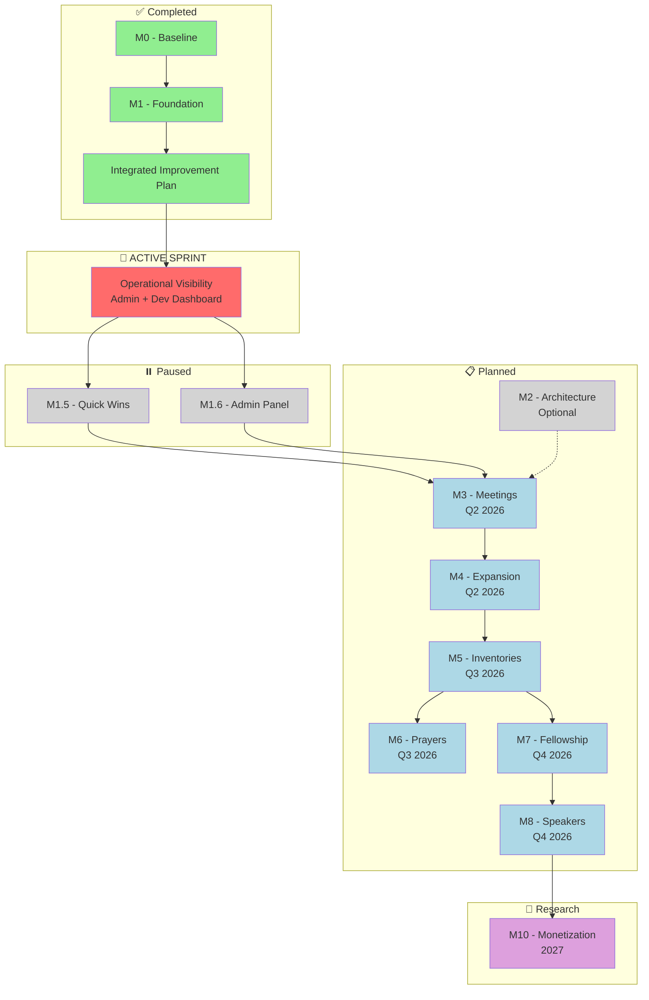

# SoNash Product Roadmap

**Document Version:** 2.5 **Last Updated:** 2026-01-14 **Status:** ACTIVE
**Overall Completion:** ~35%

---

## 🎯 Document Purpose

This is the **CANONICAL** product roadmap for SoNash. This document serves as:

1. **Single Source of Truth** - All feature planning and prioritization
2. **Progress Tracker** - Current milestone status and completion
3. **Planning Reference** - What's next and why

**📌 NOTE**: This document supersedes all previous roadmap documents.

> **Note:** Completed items are archived in [ROADMAP_LOG.md](./ROADMAP_LOG.md)
>
> **✅ BLOCKER RESOLVED:** Integrated improvement initiative is complete! See
> [INTEGRATED_IMPROVEMENT_PLAN.md](docs/archive/completed-plans/INTEGRATED_IMPROVEMENT_PLAN.md)
> for the archived plan. Feature development on M1.5 and M1.6 can now resume.
>
> **Architecture Refactoring:** Delta Review validation complete (Step 4).
> Validated items tracked in M2 below. Original plan archived:
> [EIGHT_PHASE_REFACTOR_PLAN.md](./docs/archive/completed-plans/EIGHT_PHASE_REFACTOR_PLAN.md)

---

## 📋 How to Use This Document

### For AI Assistants

1. **Check Milestones Overview** to understand current priorities
2. **Find active work** in "In Progress" sections (🔄 emoji)
3. **Before starting new features**, verify they're in the roadmap
4. **Update progress** after completing significant work
5. **Archive completed items** to [ROADMAP_LOG.md](./ROADMAP_LOG.md)

### For Developers

1. **Quick Status**: See Milestones Overview table
2. **Current Work**: Look for 🔄 In Progress sections
3. **Feature Details**: Each milestone has detailed breakdowns
4. **Acceptance Criteria**: Check Definition of Done at bottom

---

## 🎯 Vision

Build a comprehensive, secure digital recovery notebook that helps individuals
track their sobriety journey with privacy-first design and evidence-based
recovery practices.

---

## 📊 Milestones Overview

| Milestone                       | Status      | Progress         | Target    | Priority   |
| ------------------------------- | ----------- | ---------------- | --------- | ---------- |
| **M0 - Baseline**               | ✅ Complete | 100%             | Q4 2025   | Foundation |
| **M1 - Foundation**             | ✅ Complete | 100%             | Q1 2026   | P0         |
| **Integrated Improvement Plan** | ✅ Complete | 100% (9/9 steps) | Q1 2026   | DONE       |
| **🚀 Operational Visibility**   | 🔄 ACTIVE   | ~10%             | Q1 2026   | **P0**     |
| **M1.5 - Quick Wins**           | ⏸️ Paused   | ~50%             | Q1 2026   | P1         |
| **M1.6 - Admin Panel + UX**     | ⏸️ Paused   | ~75%             | Q1 2026   | P1         |
| **M2 - Architecture**           | ⏸️ Optional | 0%               | As needed | P2         |
| **M3 - Meetings**               | 📋 Planned  | 0%               | Q2 2026   | P1         |
| **M4 - Expansion**              | 📋 Planned  | 0%               | Q2 2026   | P1         |
| **M5 - Inventories**            | 📋 Planned  | 0%               | Q3 2026   | P1         |
| **M6 - Prayers**                | 📋 Planned  | 0%               | Q3 2026   | P2         |
| **M7 - Fellowship**             | 📋 Planned  | 0%               | Q4 2026   | P1         |
| **M8 - Speakers**               | 📋 Planned  | 0%               | Q4 2026   | P2         |
| **M10 - Monetization**          | 🔬 Research | 0%               | 2027      | P2         |

**Overall Progress:** ~40% (Improvement Plan complete, feature work ready to
resume)

> **Archive:** For completed M0 and M1 milestones, see
> [ROADMAP_LOG.md](./ROADMAP_LOG.md)

### Milestone Dependency Graph



**Legend:** 🟢 Complete | 🟡 In Progress/Blocker | 🟠 Blocked | ⚪ Optional | 🔵
Planned | 🟣 Research

---

## 🚀 ACTIVE SPRINT: Operational Visibility (P0)

> **Spec:** [OPERATIONAL_VISIBILITY_SPRINT.md](docs/OPERATIONAL_VISIBILITY_SPRINT.md)
> **Goal:** Full operational visibility via Admin Panel + Development Dashboard
> **Status:** 🔄 In Progress | **Started:** 2026-01-14

This sprint consolidates Admin Panel Phases 4-5 and Development Dashboard creation.

### Sprint Tracks (Parallel)

| Track | Focus | Status | Target |
|-------|-------|--------|--------|
| **Track A** | Admin Panel (Sentry + GCP Logs) | 🔄 In Progress | Week 1-2 |
| **Track B** | Dev Dashboard MVP | 🔄 In Progress | Week 1-3 |

### Week 1 Priorities (Current)

**Track A - Admin Panel:**
- [ ] **A1:** Wire Sentry client in `app/layout.tsx` (1hr)
- [ ] **A2:** Configure Sentry Cloud Function env vars (1hr)
- [ ] **A3:** Verify Admin Errors Tab displays real data (30min)

**Track B - Dev Dashboard:**
- [ ] **B1:** Create `/dev` route with auth gate (2hr)
- [ ] **B2:** PERF-001 - Lighthouse audit script (2hr)

### Week 2-3 Priorities

**Track A:**
- [ ] **A4:** Build Admin Logs Tab with GCP deep links (3-4hr)

**Track B:**
- [ ] **B3:** PERF-002 - Lighthouse CI integration (2hr)
- [ ] **B4:** PERF-003 - Firestore history storage (2hr)
- [ ] **B5:** Lighthouse Dashboard Tab (3hr)
- [ ] **B6-B9:** Error, Session, Docs, Override tabs (6hr total)

### Blockers

| Blocker | Status | Resolution |
|---------|--------|------------|
| Sentry not initialized | ❌ Blocking | A1 task |
| Sentry env vars missing | ❌ Blocking | A2 task (need your Sentry project info) |
| /dev route doesn't exist | ❌ Blocking | B1 task |

### Quick Reference: Environment Variables Needed

```bash
# Sentry (Cloud Functions) - you need to provide these
firebase functions:config:set sentry.api_token="YOUR_TOKEN"
firebase functions:config:set sentry.org="YOUR_ORG"
firebase functions:config:set sentry.project="YOUR_PROJECT"

# Sentry (Client - .env.local)
NEXT_PUBLIC_SENTRY_DSN=https://xxx@sentry.io/xxx
NEXT_PUBLIC_SENTRY_ENABLED=true
```

---

## ⚡ M1.5 - Quick Wins (🔄 In Progress)

**Goal:** High-impact, low-effort features that improve user experience

### In Progress

- 🔄 Settings page UI
- 🔄 Profile management
- 🔄 Clean date picker improvements

### Planned Quick Wins (Priority Order)

#### P0 - Critical UX

1. **Expanded Onboarding Wizard** (8-13 SP)
   - Program selection (AA/NA/CA/Smart Recovery)
   - Sobriety/clean date setup with guidance
   - Stage-of-recovery assessment
   - Notification preferences
   - Privacy walkthrough (what data is collected)
   - Home screen customization (choose visible widgets)
   - Sponsor contact setup (optional)
   - Skip option for returning users

2. **Sponsor Personalization System** (8-13 SP)
   - **Leverages:** `hasSponsor` data from onboarding
   - **Sponsor Contact Management:**
     - Add sponsor name, phone, email
     - Quick-dial from app
     - Track last contact date
     - Set reminder frequency
   - **Personalized Prompts:**
     - "Have you called your sponsor today?" (if `hasSponsor === 'yes'`)
     - "Consider finding a sponsor" nudges (if `hasSponsor === 'no'`)
     - Meeting etiquette tips for sponsor-seekers (if
       `hasSponsor === 'looking'`)
   - **Step Work Integration:**
     - Encourage sponsor involvement for Step 4-9
     - "Share with sponsor" quick action for inventory entries
   - **Analytics Tracking:**
     - Sponsor contact frequency
     - Retention comparison (sponsored vs non-sponsored users)
     - Feature usage by sponsor status
   - **Why:** Fulfills onboarding promise of personalization, proven retention
     booster

3. **Stage-of-Recovery Selector** (4 SP)
   - Adjusts app emphasis based on user stage
   - Newcomer vs old-timer focus

#### P1 - High Value

4. **User Documentation & Help System** (5-8 SP)
   - Getting started guide for new users
   - Feature explanations (daily check-in, journal, growth tools)
   - Recovery program primer (12 steps overview)
   - FAQ section (account, privacy, data)
   - In-app tooltips for key features
   - Optional: Interactive tutorial/walkthrough on first launch
   - **Why:** Reduces confusion, improves onboarding, helps users get value
     faster

5. **Sober Fun Ideas Generator** (3 SP)
   - Random activities for boredom
   - Relapse prevention tool

6. **"Meetings Starting Soon" Filter** (3 SP)
   - Shows meetings within next hour
   - Location-based proximity

#### P2 - Nice to Have

7. **"Too Tired" Mode** (3 SP)
   - Reduces night review to 3 questions
   - Prevents fatigue-based abandonment

8. **Disguised App Icon + Name** (5 SP)
   - Privacy layer for device sharing
   - "Journal" or neutral branding

#### Engineering Productivity Quick Wins (from 2026-01-13 Audit)

> **Source:**
> [Engineering Productivity Audit](docs/audits/single-session/engineering-productivity/audit-2026-01-13.md)

9. **EFF-001: Add `npm run dev:offline` Script** (S effort, High ROI)
   - [ ] Install `concurrently` as dev dependency
   - [ ] Add
         `"dev:offline": "concurrently \"firebase emulators:start\" \"npm run dev\""`
   - [ ] Enables single-command offline development
   - **Verification:** `npm run dev:offline` starts both emulators and Next.js

10. **EFF-003: Add `scripts/doctor.js` Environment Validator** (S effort, High
    ROI)
    - [ ] Create script to check Node version, npm, Firebase CLI, `.env.local`
    - [ ] Add `npm run doctor` to package.json
    - [ ] Include helpful fix hints in error messages
    - **Verification:** `npm run doctor` passes on working setup, fails clearly
      on broken

11. **EFF-005: Cache npm ci in CI Workflow** (S effort, Medium ROI)
    - [ ] Add npm cache to `.github/workflows/ci.yml`
    - [ ] Or merge jobs to run npm ci once
    - [ ] Saves ~60s per CI run
    - **Verification:** CI time decreases by ~60s

#### Process Automation Quick Wins (from 2026-01-13 Gap Analysis)

> **Source:** Process Automation Gap Analysis (Session #60)

12. **AUTO-001: Wire Session-Start Scripts** (S effort, High ROI) ✅ DONE
    - [x] Add `lessons:surface` to session-start.sh
    - [x] Add `docs:sync-check --quick` to session-start.sh
    - [x] Add learning entry reminder to pre-commit hook
    - **Verification:** Session start shows lessons and doc sync status

13. **AUTO-002: Add npm audit to Pre-Push** (S effort, High ROI)
    - [ ] Add `npm audit --audit-level=high` to `.husky/pre-push`
    - [ ] Non-blocking warning initially
    - [ ] ~3-8s overhead per push
    - **Verification:** Push with vulnerable dep shows warning

14. **AUTO-003: Integrate Sentry with Logger** (S effort, High ROI)
    - [ ] Remove TODO from `lib/logger.ts:107`
    - [ ] Wire `Sentry.captureException()` in error paths
    - [ ] Add correlation ID context
    - **Verification:** Production errors appear in Sentry

15. **AUTO-004: Add Code Coverage to CI** (M effort, Medium ROI)
    - [ ] Wire `npm run test:coverage` into CI
    - [ ] Add coverage threshold check
    - [ ] Generate coverage badge
    - **Verification:** CI fails if coverage drops >5%

16. **AUTO-005: Remove CI continue-on-error Flags** (S effort, Medium ROI)
    - [ ] Fix Prettier baseline (run `npm run format`)
    - [ ] Fix knip baseline (7 unused deps)
    - [ ] Remove all `continue-on-error: true` flags
    - **Verification:** CI blocks on formatting/linting issues

17. **AUTO-006: Consolidate Redundant Checks** (M effort, Low ROI)
    - [ ] Remove pattern compliance from session-start.sh
    - [ ] Merge write/edit requirement hooks
    - [ ] Document in TRIGGERS.md
    - **Verification:** Session start is ~2-3s faster

#### Lighthouse Performance Tracking (from 2026-01-14 Planning)

> **Source:** Lighthouse integration planning session (Session #66)
> **Goal:** Track performance across all pages with non-blocking CI integration

18. **PERF-001: Add Lighthouse CLI Script** (S effort, High ROI)
    - [ ] Install `lighthouse` as dev dependency
    - [ ] Create `scripts/lighthouse-audit.js` for multi-page auditing
    - [ ] Add `npm run lighthouse` to package.json
    - [ ] Output JSON/HTML reports to `.lighthouse/` (gitignored)
    - [ ] Audit all routes: `/`, `/today`, `/journal`, `/growth`, `/more`, `/admin`, `/login`
    - **Verification:** `npm run lighthouse` generates reports for all routes

19. **PERF-002: Add Lighthouse to CI (Non-blocking)** (M effort, High ROI)
    - [ ] Add Lighthouse CI job to `.github/workflows/ci.yml`
    - [ ] Run against preview deployment or localhost with `start-server-and-test`
    - [ ] Upload HTML reports as artifacts
    - [ ] `continue-on-error: true` (warnings only, non-blocking)
    - [ ] Add score summary to PR comment (optional)
    - **Verification:** PR shows Lighthouse scores in CI summary/artifacts

---

## 🖥️ M1.6 - Admin Panel + Today Page Enhancement (🔄 In Progress)

**Goal:** Operational monitoring for admins + dramatically improved user
experience for Today page

**Detailed Specification:** See
[SoNash**AdminPanelEnhancement**v1_2\_\_2025-12-22.md](./docs/archive/SoNash__AdminPanelEnhancement__v1_2__2025-12-22.md)
(v1.4)

> **Completed Phases:** For details on completed Phases 1-3 and Today Page
> Enhancement, see
> [ROADMAP_LOG.md](./ROADMAP_LOG.md#m16---admin-panel--today-page-enhancement)

### Phase 4: Error Tracking - Sentry Integration (📋 Planned)

**Priority:** High | **Effort:** Low-Medium | **Value:** High

**Approach:** Hybrid summary + deep links via Cloud Function (token never
exposed to client)

- [ ] `adminGetSentryErrorSummary` Cloud Function (server-side API call)
- [ ] Error summary card on Dashboard (count + trend)
- [ ] Errors tab with recent errors in plain English
- [ ] Deep links to Sentry for each error
- [ ] User ID correlation (link to user detail if available)

**Environment Variables (Cloud Functions only):** `SENTRY_API_TOKEN`,
`SENTRY_ORG`, `SENTRY_PROJECT`

### Phase 5: System Logs - GCP Integration (📋 Planned)

**Priority:** Medium | **Effort:** Low | **Value:** Medium

**Approach:** Recent events + deep links (don't rebuild GCP logging UI)

- [ ] Recent security events display (from existing `logSecurityEvent()`)
- [ ] Deep link to GCP Cloud Logging Console (pre-filtered)
- [ ] Verify log retention configured (90+ days)
- [ ] Optional: Log sink for long-term archival

**Note:** Security/audit logs remain in GCP Cloud Logging (immutable, compliant)
— no Firestore `admin_logs` collection.

### Phase 6: Customizable Quick Actions (📋 Planned)

**Priority:** Medium | **Effort:** Medium | **Value:** High — personalized user
experience

**Approach:** User-configurable FAB with Firestore preferences

**Objectives:**

- [ ] Settings panel for Quick Actions customization (More tab → Settings)
- [ ] Action selection (choose which actions to show)
- [ ] Action ordering (drag-and-drop reordering)
- [ ] Custom phone numbers (sponsor, support contacts)
- [ ] Save preferences to user profile (Firestore)
- [ ] Fallback to sensible defaults for new users

**Use Cases:**

1. **Power User:** Removes "Quick Mood" (doesn't use it), adds custom sponsor
   phone
2. **Minimalist:** Shows only 2 actions (Call Sponsor, Community)
3. **Meeting-Focused:** Reorders to prioritize Community at top
4. **Contact-Heavy:** Adds multiple phone numbers (sponsor, accountability
   partner, hotline)

**New Files:**

- `components/settings/quick-actions-settings.tsx` - Settings panel UI
- `lib/quick-actions-config.ts` - Default actions + validation

**Modified Files:**

- `components/notebook/features/quick-actions-fab.tsx` - Load user preferences
- `firestore.rules` - Allow user to read/write
  `users/{uid}/preferences/quickActions`

**Technical Details:**

- **Data Model:** `QuickActionsPreferences` in `/users/{uid}/preferences`
- **Action Types:** navigation (NotebookModuleId), phone (tel: link), custom
  (URL)
- **Max Actions:** 6 (performance limit)
- **Drag-and-Drop:** Using `@dnd-kit/core`
- **Phone Validation:** Standard phone number format checking

**Future Enhancements:**

- Action templates (e.g., "Meeting-Focused", "Contact-Heavy")
- Share action configurations with other users
- Analytics on most-used actions
- Suggested actions based on usage patterns

### Phase 7: Local Recovery Resources Directory (📋 Planned)

**Priority:** Medium-High | **Effort:** Medium (5-8 SP) | **Value:** High —
critical local resource access

**Approach:** Display verified Nashville recovery resources with admin
management

**Context:**

- 60+ verified local resources already aggregated in `data/local-resources.ts`
  (Dec 28, 2025)
- 8 categories: Clinical (Detox, Residential, Outpatient, Harm Reduction) +
  Community (Recovery Centers, Essentials, Jobs/Legal, Wellness)
- All resources have addresses, phone numbers, websites, services, and GPS
  coordinates

**User-Facing Features:**

- [ ] Display local resources in Growth tab (below Sober Living Finder)
- [ ] Category filtering (8 predefined categories)
- [ ] Search/filter by resource name or services
- [ ] Map view with "Nearby" feature using GPS coordinates
- [ ] Resource detail cards (address, phone, website, services)
- [ ] "Call" and "Get Directions" quick actions
- [ ] Sort by distance (if location permission granted)

**Admin Panel Features:**

- [ ] Resources tab in Admin Panel (similar to Meetings/Sober Living)
- [ ] CRUD operations for local resources
- [ ] Category management
- [ ] Active/inactive toggle for resources
- [ ] Bulk import from `data/local-resources.ts` (one-time migration)
- [ ] GPS coordinate validation
- [ ] Phone/website format validation

**Technical Implementation:**

- **New Collection:** `/local_resources/{resourceId}` in Firestore
- **New Service:** `lib/db/local-resources.ts` (similar to `meetings.ts`,
  `sober-living.ts`)
- **New Component:** `components/notebook/pages/local-resources-section.tsx` (in
  Growth tab)
- **New Admin Component:** `components/admin/local-resources-tab.tsx`
- **Map Integration:** Reuse existing `MeetingMap` component with LocalResource
  type support
- **Firestore Rules:** Admin-write, user-read for
  `/local_resources/{resourceId}`

**Data Migration:**

- [ ] Cloud Function or script to seed Firestore from `data/local-resources.ts`
- [ ] Preserve existing data structure (categories, locationType, coordinates)
- [ ] Add `createdAt`, `updatedAt`, `active` fields

**Files to Create:**

1. `lib/db/local-resources.ts` - Service layer (CRUD operations)
2. `components/growth/local-resources-card.tsx` - Resource display card
3. `components/growth/local-resources-list.tsx` - Filterable list view
4. `components/growth/local-resources-map.tsx` - Map view with markers
5. `components/admin/local-resources-tab.tsx` - Admin CRUD interface
6. `scripts/seed-local-resources.ts` - One-time data migration
7. Update `firestore.rules` - Add rules for `/local_resources` collection
8. Update `firestore.indexes.json` - Add indexes for category, city filtering

**Files to Modify:**

1. `components/notebook/pages/growth-page.tsx` - Add local resources section
2. `components/admin/admin-panel.tsx` - Add Resources tab
3. `components/maps/meeting-map.tsx` - Extend to support LocalResource type (or
   create separate component)

**Effort Estimate:**

- Service layer + Firestore setup: 2 hours
- User-facing UI (list + map + filters): 3-4 hours
- Admin panel CRUD: 2-3 hours
- Data migration script: 1 hour
- Testing + polish: 1-2 hours
- **Total: 9-12 hours (6-8 SP)**

**Dependencies:**

- ✅ Data already aggregated (`data/local-resources.ts`)
- ✅ Map component already exists (reuse `MeetingMap`)
- ✅ Admin panel framework already exists
- ⚠️ Should wait until PR1 complete (Firestore rules changes)

**Why This Matters:**

- Provides critical access to treatment, housing, food, legal services
- Fills gap between meetings (fellowship) and clinical care
- High user value for newly sober individuals navigating Nashville recovery
  ecosystem

### Success Metrics

| Metric                 | Target                        |
| ---------------------- | ----------------------------- |
| Time to identify issue | < 2 minutes                   |
| Dashboard load time    | < 3 seconds                   |
| Error visibility       | 100% of Cloud Function errors |
| Job failure detection  | < 1 hour after failure        |

---

## 🏛️ M2 - Architecture Refactor (⏸️ Optional)

**Goal:** Reduce technical debt only if friction prevents progress

### Deferred Foundation Work

**From M1 - Monitoring & Observability:**

- ⏳ Performance monitoring (page load times, API latency)
- ⏳ User analytics baseline (DAU, retention, feature usage)
- ⏳ Alert thresholds defined (automated error/performance alerts)

**Incident Response Automation** (Jan 2026):

- ⏳ **Phase 1: Detection & Alerting** (2-3 hours, P1)
  - GCP budget alerts with Slack/Discord webhook ($25, $50, $100, $500
    thresholds)
  - Log-based metrics for security events (RATE_LIMIT_EXCEEDED,
    APP_CHECK_FAILURE, AUTHORIZATION_FAILURE)
  - Sentry alert rules for error rate spikes (>10/min → P2, >50/min → P1)
  - **Reference:** [INCIDENT_RESPONSE.md](./docs/INCIDENT_RESPONSE.md)
- ⏳ **Phase 2: Response Automation** (3-4 hours, P2)
  - Hot-loadable blocklist in Firestore (`/system/blocklist`) - no redeploy to
    block attackers
  - Emergency response scripts (`scripts/emergency/block-user.sh`,
    `disable-function.sh`, `deploy-lockdown-rules.sh`)
  - Incident timeline extractor (auto-export GCP logs to incident report format)
  - Admin panel UI for blocklist management

### Developer Tooling (Added 2026-01-14 - Step 6.1)

> **Source:**
> [INTEGRATED_IMPROVEMENT_PLAN.md](docs/archive/completed-plans/INTEGRATED_IMPROVEMENT_PLAN.md)
> Step 3 + Step 5 items migrated here.

**Active Tooling (Enforced):**

- ✅ **Prettier** - Code formatting (`npm run format`, `npm run format:check`)
  - Configured in `.prettierrc`
  - Pre-commit hook runs format check (non-blocking warning)
  - 518+ files formatted as of 2026-01-12
- ✅ **ESLint** - Code linting (`npm run lint`)
  - Configured in `eslint.config.mjs`
  - Pre-commit hook blocks on errors
- ✅ **madge** - Circular dependency detection (`npm run deps:circular`)
  - Pre-push hook validates no circular deps
  - Baseline: 0 circular dependencies
- ✅ **Pattern Compliance** - Anti-pattern detection (`npm run patterns:check`)
  - Script: `scripts/check-pattern-compliance.js`
  - Pre-commit hook blocks on violations
  - 100+ patterns from 140+ code reviews
- ✅ **Delta Review Process** - AI-assisted PR reviews
  - CodeRabbit + Qodo integration
  - Learning capture in `AI_REVIEW_LEARNINGS_LOG.md`
  - Pattern consolidation every 10 reviews

**Planned Tooling (Future):**

- ⏳ **knip** - Unused export detection (`npm run deps:unused`)
  - Currently: baseline documented, not blocking
  - Future: Add to CI with allow-list
- ⏳ **ESLint Import Boundary Rules**
  - Prerequisite: Feature folder refactoring (below)
  - Enforce import restrictions between feature domains
- ⏳ **Automated Metrics Dashboard**
  - Session activity visualization
  - Error tracing viewer
  - See: [ROADMAP.md Process & Tooling section](#-process--tooling-improvements)

**From M1 - Code Quality & Automation:**

- ⏳ CI/CD pipeline setup (GitHub Actions or similar)
- ⏳ Automated testing in PR workflow
- ⏳ Client-side rate limiting in firestore-service.ts

**From M1 - Security Hardening:**

- 🔄 **Manual reCAPTCHA Enterprise Implementation** (Dec 30, 2025)
  - ✅ **Frontend Integration:** `lib/recaptcha.ts` - `getRecaptchaToken()`
    helper for bot protection
  - ✅ **Backend Verification:** `functions/src/recaptcha-verify.ts` -
    Server-side token validation
  - ✅ **Security Wrapper Integration:** Added to all 5 Cloud Functions with
    `recaptchaAction` parameters
  - ✅ **Made Optional:** Corporate networks block Google reCAPTCHA - logs
    `RECAPTCHA_MISSING_TOKEN` (WARNING)
  - ✅ **Event Logging:** Added 8 reCAPTCHA event types to `security-logger.ts`
  - ⏳ **Admin Panel Monitoring:** See
    [ADMIN_PANEL_SECURITY_MONITORING_REQUIREMENTS.md](./docs/ADMIN_PANEL_SECURITY_MONITORING_REQUIREMENTS.md)
  - **Files:** See commits `b6fe5e9`, `9e83e86`, `a818bea`, `b402f41`, `16b5deb`
- ❌ **Firebase App Check** (Dec 30, 2025) - **DEDUP-0001**
  - **Status:** DISABLED in all Cloud Functions (`requireAppCheck: false`)
  - **Reason:** Hit 403 throttle errors (24-hour limit), implemented manual
    reCAPTCHA as workaround
  - **Impact:** Security posture weakened - App Check provides bot protection at
    Firebase SDK level
  - **Re-enablement Plan:**
    [APP_CHECK_REENABLE_PLAN.md](docs/reviews/2026-Q1/canonical/tier2-output/APP_CHECK_REENABLE_PLAN.md)
    - Prerequisites: DEDUP-0003 (reCAPTCHA fail-closed), DEDUP-0004 (rate
      limiting)
    - Steps: Client init → Server enforcement → Testing
  - **Reference:**
    [RECAPTCHA_REMOVAL_GUIDE.md](./docs/RECAPTCHA_REMOVAL_GUIDE.md) for
    removal/implementation guides
- **Priority:** P0 - CRITICAL security item (re-enable after prerequisites)

**Data Quality & Operations:**

- ⏳ **Retry Geocoding for 50 Meeting Addresses** (Dec 28, 2025)
  - **Issue:** OpenStreetMap Nominatim API blocked our IP for bulk requests
  - **Status:** 50 meeting addresses still need GPS coordinates
  - **Solution:** Wait 24-48 hours for block to lift, then retry with
    scripts/retry-failures.ts
  - **Alternative:** Switch to Google Maps API or Mapbox for production
    reliability
  - **Files:** `scripts/retry-failures.ts`, `scripts/enrichment_failures.json`
  - **Effort:** 10 minutes (retry) or 2-4 hours (API migration)
  - **Priority:** P2 - Data quality improvement, not blocking core functionality
- ⏳ **Consider Reverting to next/font/google for Font Optimization** (Dec
  28, 2025)
  - **Current State:** Using @fontsource packages (self-hosted) to avoid
    build-time network dependency
  - **Issue:** Previously experienced intermittent TLS/network failures when
    building with next/font/google
  - **Benefits of Reverting:** Automatic font optimization, subsetting, and
    preloading by Next.js
  - **When to Revisit:** Once build infrastructure has stable/reliable network
    access to fonts.googleapis.com
  - **Files:** `app/layout.tsx`, `package.json` (remove @fontsource deps)
  - **Effort:** 15 minutes (revert to original implementation)
  - **Priority:** P3 - Nice-to-have optimization, current solution works well

### Code Quality Issues (CI Flagged - 2026-01-12)

These pre-existing issues were identified during PR review CI:

- ⏳ **Prettier Formatting (518 files)** - Run `npm run format:write` to fix
  - **Priority:** P2 - Code style consistency
  - **Effort:** 5 minutes (automated fix)
- ⏳ **Unused devDependencies** - Remove `@modelcontextprotocol/sdk`, `undici`
  - **Priority:** P3 - Dependency cleanup
  - **Effort:** 5 minutes
- ⏳ **Unlisted dependencies** - Add `globals` (eslint.config.mjs),
  `postcss-load-config` (postcss.config.mjs)
  - **Priority:** P2 - Prevents CI failures
  - **Effort:** 5 minutes
- ⏳ **Duplicate exports** - Fix `ErrorBoundary|default` in
  `components/providers/error-boundary.tsx`
  - **Priority:** P3 - Code style
  - **Effort:** 10 minutes
- ⏳ **Pattern Compliance - Dev Utility Scripts** (Review #136)
  - **Issue:** 79 pattern violations in development/migration scripts
  - **Files:** `scripts/ai-review.js`, `scripts/assign-review-tier.js`,
    `scripts/check-docs-light.js`, `scripts/check-document-sync.js`,
    `scripts/normalize-canon-ids.js`, `scripts/validate-audit.js`, and others
  - **Patterns:** Unsafe `error.message` access, `readFileSync` without
    try/catch, `startsWith()` path validation, Windows path issues
  - **Current State:** Excluded via `GLOBAL_EXCLUDE` in
    `check-pattern-compliance.js`
  - **Priority:** P4 - Low priority (dev tools, rarely run)
  - **Effort:** 4-6 hours (fix all 79 violations incrementally)
  - **Approach:** Fix during related maintenance work, not dedicated sprint

### Engineering Productivity - Observability & Offline (from 2026-01-13 Audit)

> **Source:**
> [Engineering Productivity Audit](docs/audits/single-session/engineering-productivity/audit-2026-01-13.md)
> **Priority:** P1 for EFF-010 (CRITICAL), P2 for others

#### Observability Improvements

- ⏳ **EFF-006: Add Correlation IDs to Logger** (M effort)
  - Generate unique correlation ID per request
  - Pass through all log calls (frontend + backend)
  - Enables tracing requests across services
  - **Verification:** Make request, find same ID in frontend and backend logs

- ⏳ **EFF-007: Add Network Status to Logs** (M effort)
  - Add `isOnline` to logger context and Sentry tags
  - Track offline state when errors occur
  - **Verification:** Go offline, trigger error, see `isOnline: false` in Sentry

- ⏳ **EFF-008: Create Smoke Test Script** (M effort)
  - Create `npm run smoke` that hits homepage, auth endpoint, Cloud Function
  - Quick deployment verification (~30s)
  - **Verification:** `npm run smoke` passes on healthy deployment

- ⏳ **EFF-009: Add Bug Report GitHub Template** (M effort)
  - Create `.github/ISSUE_TEMPLATE/bug_report.md`
  - Fields: steps to repro, expected, actual, env, offline status, Sentry link
  - **Verification:** New issue shows template with all fields

#### Offline Support (CRITICAL)

- ⏳ **EFF-010: Implement Offline Queue** (L effort, **CRITICAL**)
  - **Issue:** `hooks/use-journal.ts:319-340` - all writes require network
  - **Impact:** Offline is REQUIRED but writes fail, causing data loss
  - **Fix:**
    - [ ] IndexedDB queue with pending/synced/failed states
    - [ ] Sync on reconnect with batch writes
    - [ ] Conflict resolution strategy
    - [ ] UI indicators for pending/synced/failed
  - **Verification:** Go offline, make entry, verify pending state, go online,
    verify sync

- ⏳ **EFF-011: Add Offline Tests** (L effort)
  - Mock network status in tests
  - Test queue behavior, sync on reconnect
  - **Verification:** `npm test -- --grep offline` all pass

#### Lighthouse Performance Monitoring (from 2026-01-14 Planning)

> **Source:** Lighthouse integration planning session (Session #66)
> **Prerequisite:** PERF-001/PERF-002 from M1.5 complete
> **Spec:** [LIGHTHOUSE_INTEGRATION_PLAN.md](docs/LIGHTHOUSE_INTEGRATION_PLAN.md)

- ⏳ **PERF-003: Historical Score Tracking** (M effort)
  - Store Lighthouse scores in Firestore or flat files (`.lighthouse/history.json`)
  - Track trends over time (daily/weekly snapshots from CI)
  - Alert on significant regressions (>10 point drop in any category)
  - **Verification:** Historical data shows score trends over 7+ days

- ⏳ **PERF-004: Performance Budgets** (S effort)
  - Define budgets: LCP < 2.5s, FID < 100ms, CLS < 0.1, Performance > 80
  - Integrate with Lighthouse CI assertions (`lighthouserc.js`)
  - Warn on budget violations (non-blocking initially)
  - **Verification:** Budget violation shows warning in CI

- ⏳ **PERF-005: Development Dashboard Integration** (L effort)
  - Display Lighthouse scores in Development Dashboard
  - Per-page breakdown (landing, today, journal, growth, more, admin)
  - Historical trend visualization (chart.js or similar)
  - Links to full HTML reports
  - **Verification:** Dashboard shows latest scores and trend graph

- ⏳ **PERF-006: PWA Audit Baseline** (S effort)
  - Document current PWA score and gaps
  - Create remediation plan for installability
  - Track PWA-specific metrics (service worker, manifest, offline)
  - Ties to EFF-010 (Offline Queue) as prerequisite for good PWA score
  - **Verification:** PWA score documented with gap analysis

### Validated Refactor Backlog (from Step 4.3 Audit - 2026-01-14)

> **Full Backlog:**
> [REFACTOR_BACKLOG.md](docs/reviews/2026-Q1/canonical/tier2-output/REFACTOR_BACKLOG.md)
> (97 validated items, prioritized by severity/effort)

**S0 Critical Items:**

| ID         | Title                                  | Effort | PR  |
| ---------- | -------------------------------------- | ------ | --- |
| DEDUP-0001 | Re-enable App Check (see above)        | E2     | -   |
| DEDUP-0002 | Close legacy journalEntries write path | E2     | PR2 |
| DEDUP-0011 | Fix useJournal memory leak             | E1     | PR1 |

**S1 High Priority (Top 5):**

| ID         | Title                               | Effort | PR   |
| ---------- | ----------------------------------- | ------ | ---- |
| DEDUP-0003 | Make reCAPTCHA fail-closed          | E1     | PR3  |
| DEDUP-0004 | Complete rate limiting (IP + admin) | E2     | PR4  |
| DEDUP-0005 | Replace console.\* with logger      | E1     | PR8  |
| DEDUP-0012 | Enable SSR for landing page         | E2     | PR13 |
| CANON-0072 | Split TodayPage god component       | E3     | -    |

### Potential Architecture Work

- ⏳ Component library consolidation
- ⏳ State management standardization
- ⏳ API abstraction layer
- ⏳ Database schema optimization
- ⏳ Admin route middleware (server-side protection for `/admin/*`)
- ⏳ **M2: FirestoreService is a God Object** (lib/firestore-service.ts)
  - **Issue:** 300-400+ line file manages all Firestore operations
  - **Fix:** Split into `DailyLogService`, `JournalService`, `InventoryService`
  - **Effort:** 4 hours
- ⏳ **M3: Error Handling Gaps in Contexts**
  - **Issue:** Various contexts lack proper error handling
  - **Fix:** Implement consistent error state pattern
  - **Effort:** 4 hours
- ⏳ **M17: Onboarding Wizard is 515 Lines**
  (components/onboarding/onboarding-wizard.tsx)
  - **Issue:** Single component with 5 different step views
  - **Fix:** Extract each step into own component
  - **Effort:** 3 hours
  - **Priority:** LOW - works fine, refactor when needed
- ⏳ **M2: Duplicate reCAPTCHA Verification Logic** (security-wrapper.ts &
  index.ts)
  - **Issue:** Optional reCAPTCHA verification logic duplicated in two locations
  - **Fix:** Extract into `verifyRecaptchaTokenOptional()` helper in
    recaptcha-verify.ts
  - **Effort:** 1 hour
  - **Priority:** LOW - DRY violation, but code works fine
- ⏳ **M2: migrateAnonymousUserData Manual Security Checks**
  (functions/src/index.ts)
  - **Issue:** Function manually implements security checks instead of using
    withSecurityChecks wrapper
  - **Fix:** Add custom authorization callback option to withSecurityChecks,
    refactor to use wrapper
  - **Effort:** 2-3 hours
  - **Priority:** LOW - consistency improvement, custom auth logic works
    correctly

### SonarCloud Issue Backlog (Step 4C Triage - 2026-01-13)

> **IMPORTANT**: Before production deployment, re-run SonarCloud scan and
> address ACCEPT-RISK items. See
> [SONARCLOUD_TRIAGE.md](docs/SONARCLOUD_TRIAGE.md) for details.

#### ACCEPT-RISK Items (23 total) - Requires Production Re-evaluation

- ⏳ **Command Injection in Dev Scripts** (S4721) - 7 items
  - `scripts/ai-review.js:222,227` - execSync with controlled inputs
  - `scripts/check-pattern-compliance.js:447`
  - `scripts/check-review-needed.js:234`
  - `scripts/phase-complete-check.js:437`
  - `scripts/retry-failures.ts:113`
  - **Rationale**: Internal dev scripts, not deployed to production
  - **Action**: Review before any script deployment to production

- ⏳ **PATH Variable in Dev Scripts** (S4036) - 14 items
  - Various scripts and test files
  - **Rationale**: Controlled development environment
  - **Action**: Review if scripts become part of CI/CD

- ⏳ **Secrets in GitHub Actions Run Block** (S7636) - 1 item
  - `.github/workflows/deploy-firebase.yml:58`
  - **Rationale**: Firebase deploy workflow, acceptable pattern
  - **Action**: Consider using GitHub environment secrets

#### FIX-LATER Items (41+ total)

- ⏳ **ReDoS Regex Patterns** (S5852) - ~32 items
  - Various scripts with potentially vulnerable regex
  - **Fix**: Rewrite regex patterns to avoid backtracking
  - **Priority**: LOW - Scripts have bounded input, low exploitation risk

- ⏳ **GitHub Actions SHA Pinning** (S7637) - 2 items
  - `.github/workflows/auto-label-review-tier.yml:29`
  - `.github/workflows/docs-lint.yml:36`
  - **Fix**: Pin actions to full SHA instead of version tag
  - **Priority**: LOW - Best practice, not critical

- ⏳ **Accessibility: onClick without Keyboard** (S1082) - 6 items
  - Various components with click handlers missing keyboard support
  - **Fix**: Add onKeyDown handlers or use semantic buttons
  - **Priority**: LOW - Batch fix in accessibility sprint

- ⏳ **Regex Precedence in Seed Script** (S5850) - 1 item
  - `scripts/seed-meetings.ts:79`
  - **Fix**: Group regex parts for explicit precedence
  - **Priority**: LOW - Seed script, not production

**Trigger:** Only pursue if M3+ blocked by technical limitations or if scaling
reveals performance issues

**Priority:** Low - Foundation is solid, focus on features first

---

## 🗓️ M3 - Meetings & Location (📋 Planned - Q2 2026)

**Story Points:** 84 SP | **Priority:** P1

### Features

#### F1: Meeting Proximity Detection (21 SP)

- Real-time "meetings near me" based on GPS
- Distance calculation and sorting
- Map view integration
- Filter by fellowship type (AA/NA/CA/etc)

#### F2: Meeting Notes (13 SP)

- In-app note capture during meetings
- "What did you commit to?" prompts
- Auto-link to journal timeline
- Export/share capabilities

#### F3: Calendar Integration (26 SP)

- Sync favorite meetings to device calendar
- Reminder notifications
- iCal export for external apps
- Recurring event support

#### F4: Virtual Meeting Support (13 SP)

- Zoom/Google Meet link integration
- Online meeting directory
- One-tap join from app
- Hybrid in-person/virtual tracking

#### F5: Enhanced Meeting Data (11 SP)

- User reviews and ratings
- Accessibility information
- Special requirements (smoking, childcare, etc)
- Meeting type badges (Step Study, Big Book, Speaker)

#### F6: Celebrate Recovery Integration (13 SP)

- Import ~20 Nashville area meetings (Source data ready in
  `docs/source-data/celebrate_recovery_meetings.json`)
- Add "Celebrate Recovery" to fellowship type selector
- Update meeting finder to support CR-specific tags (Large Group, Open Share,
  Fellowship Meal)
- Distinguish between "Step Study" and "Open Share" groups

**Dependencies:**

- Google Maps API integration
- Calendar API permissions
- Meeting data scraping/partnership

---

## 🎯 M4 - Feature Expansion (📋 Planned - Q2 2026)

**Goal:** Extend core functionality based on M1-M3 learnings

### Potential Features (TBD)

- Multiple sobriety dates (separate counters per substance)
- Tone/language settings (firm vs gentle)
- Craving countdown timer ("ride it out" feature)
- Auto-carry-forward task nudges

### HALT Check Enhancements

_Building on the basic HALT check feature from M1.5_

**Phase 2: Analytics & Insights**

- Pattern detection: "You often feel tired on Mondays"
- Weekly/monthly HALT summaries with visualization
- Correlation analysis with mood and usage patterns
- Trend graphs showing HALT frequency over time

**Phase 3: Smart Features**

- Predictive alerts: "You usually feel lonely at this time"
- Context-aware suggestions based on historical patterns
- Reminder system for regular HALT checks (customizable schedule)
- Integration with meeting finder when lonely detected
- Integration with sponsor contact when angry/lonely

**Phase 4: Community & AI**

- Anonymous aggregate insights: "Others often feel the same today"
- AI-powered coping strategy recommendations
- Guided meditation/breathing exercises for anger/stress
- Connection to support community during vulnerability
- Emergency escalation for critical patterns

**Story Points:** 26-34 SP (distributed across phases) **Priority:** P2
(nice-to-have, builds on core feature)

---

## 📝 M5 - Nightly Inventories (📋 Planned - Q3 2026)

**Story Points:** 116 SP | **Priority:** P1

### Features

#### F1: 10th Step Inventory Tool (47 SP)

- Structured inventory prompts (AA Big Book format)
- Character defects checklist
- Assets vs defects tracking
- Progress over time visualization

#### F2: Inventory Templates (21 SP)

- Multiple formats (AA, NA, custom)
- User-created templates
- Share templates with sponsor

#### F3: Amends Tracker (26 SP)

- List of people harmed
- Amends completion status
- Notes and reflections
- Privacy controls (sponsor-only sharing)

#### F4: Pattern Recognition (22 SP)

- AI-powered theme detection
- Recurring character defects
- Trigger identification
- Insights dashboard

**Dependencies:**

- Secure storage (encrypted at rest)
- Sponsor sharing permissions
- AI/ML analysis (optional)

---

## 🙏 M6 - Prayers & Meditations (📋 Planned - Q3 2026)

**Story Points:** 63 SP | **Priority:** P2

### Features

#### F1: Prayer Library (21 SP)

- AA-approved prayers (Serenity Prayer, 3rd Step, 7th Step)
- NA prayers and meditations
- Custom prayer creation
- Favorites and bookmarks

#### F2: Daily Meditation (16 SP)

- Just for Today (NA)
- Daily Reflections (AA)
- 24 Hours a Day
- Push notification reminders

#### F3: Guided Meditation (26 SP)

- Audio meditation tracks
- Mindfulness exercises
- Breath work timers
- Progress tracking

**Content Licensing:**

- Requires AA/NA permissions for copyrighted material
- Partnership with publishers (Hazelden, NA World Services)

---

## 🤝 M7 - Fellowship & Support (📋 Planned - Q4 2026)

**Story Points:** 100 SP | **Priority:** P1

### Features

#### F1: Sponsor Connection (32 SP)

- Sponsor contact quick-dial
- "I need help" emergency button
- Sponsor chat/messaging
- Sponsor dashboard (view sponsee progress)

#### F2: Phone List (21 SP)

- Fellowship phone directory
- Favorites and groups
- One-tap calling
- SMS integration

#### F3: Support Network (26 SP)

- Create accountability circles
- Group check-ins
- Shared gratitude lists
- Peer encouragement system

#### F4: Milestone Celebrations (11 SP)

- Auto-detect sobriety milestones (30/60/90 days, 1 year)
- Shareable celebration graphics
- Notify sponsor/support network
- Digital chips and badges

#### F5: Gamification (Optional) (10 SP)

- Principle-based badges (honesty, service)
- Streak tracking (journal entries, meeting attendance)
- No shame/punishment mechanics
- Focus on growth, not competition

**Privacy Considerations:**

- Optional feature (opt-in only)
- User controls visibility settings
- Anonymous participation option

---

## 🎤 M8 - Speaker Recordings (📋 Planned - Q4 2026)

**Story Points:** 63 SP | **Priority:** P2

### Features

#### F1: Speaker Library (26 SP)

- Curated AA/NA speaker recordings
- Search by topic (resentments, relationships, Step 4)
- Favorites and playlists
- Download for offline listening

#### F2: Personal Recording (21 SP)

- Record own shares/qualifications
- Private journal audio entries
- Transcription (AI-powered)
- Organize by topic/date

#### F3: Audio Player (16 SP)

- Playback controls
- Speed adjustment
- Sleep timer
- Resume from last position

**Content Licensing:**

- AA/NA speaker permissions
- Copyright compliance
- Content moderation

---

## 💰 M10 - Monetization Strategy (🔬 Research - 2027)

**Goal:** Sustainable revenue model without exploiting vulnerable users

**Detailed Research:** See
[docs/MONETIZATION_RESEARCH.md](./docs/MONETIZATION_RESEARCH.md)

### Research Findings (December 2025)

#### Rejected Models

- ❌ Freemium with paywalls (blocks critical recovery tools)
- ❌ Ads (privacy violations, triggers)
- ❌ Data monetization (unethical, illegal in recovery context)

#### Viable Options

**1. Premium Features (Ethical Freemium)**

- ✅ Free: All core recovery tools (journal, meetings, inventories)
- 💰 Premium: Advanced analytics, speaker library, offline mode
- **Pricing:** $2.99/month or $19.99/year
- **Positioning:** "Support SoNash, unlock extras"

**2. Donation Model**

- ✅ "Pay what you can" philosophy (AA 7th Tradition)
- Optional recurring donations
- Transparent expense reporting
- No feature gating

**3. B2B Licensing**

- Treatment centers license app for clients
- Sober living facilities bulk subscriptions
- Institutional pricing ($5-10/user/month)
- White-label options

**4. Hybrid Approach (Recommended)**

- Free tier: 100% of core features
- Optional premium: $2.99/month (power users)
- Institutional partnerships: Recurring revenue
- Donation option: Community support

**Next Steps:**

1. Launch free product to build user base
2. Measure engagement and retention (M3-M8)
3. Survey users about willingness to pay
4. Pilot premium tier Q1 2027

---

## 🖥️ Desktop/Web Enhancements

**Goal:** Leverage full browser capabilities for power users

### Multi-Panel Layout (21 SP)

- Split-screen views (timeline + detail)
- Dashboard mode (4-panel grid)
- Resizable panels
- Keyboard shortcuts

### Advanced Visualizations (34 SP)

- Mood heat map (calendar view)
- Correlation matrix (meetings ↔ mood)
- Trend lines (multiple metrics)
- Word clouds from journal entries
- Export charts as PNG/SVG

### Keyboard Shortcuts (8 SP)

- `J/K`: Navigate timeline
- `N`: New journal entry
- `G + T`: Go to Today tab
- `?`: Keyboard shortcuts help
- Vim-style navigation (optional)

### Export & Backup (13 SP)

- CSV/JSON/PDF export
- Automated cloud backup
- Local file download
- Sponsor report generation

### Search & Filter (21 SP)

- Full-text search across all entries
- Advanced filters (date range, mood, type)
- Saved searches
- Search suggestions

---

## 🎨 Feature Decisions (Quick Reference)

| Feature                 | Status          | Priority | Notes                           |
| ----------------------- | --------------- | -------- | ------------------------------- |
| Recovery Library        | ✅ Approved     | P0       | Combine glossary + etiquette    |
| HALT Check              | ✅ Approved     | P1       | User-initiated button           |
| God Box                 | ❌ Deferred     | P3       | Maybe never                     |
| Complacency Detector    | ⏳ Needs Review | P2       | Engagement drop alerts          |
| Tone Settings           | ⏳ Needs Review | P1       | Firm vs gentle language         |
| Multiple Sobriety Dates | ⏳ Needs Review | P2       | Separate counters per substance |
| Principle-Based Badges  | ✅ Approved     | P2       | Honesty/service vs streaks      |

---

## 📏 Success Metrics

### User Engagement

- Daily Active Users (DAU)
- Weekly journal entries per user
- Average session duration
- Feature adoption rate

### Retention

- 7-day retention rate (target: >40%)
- 30-day retention rate (target: >25%)
- 90-day retention rate (target: >15%)

### Recovery Outcomes

- Days clean tracking
- Meeting attendance frequency
- Journal consistency (entries per week)
- Spot check completion rate

### Technical Health

- Error rate (target: <1%)
- API response time (target: <200ms)
- App crash rate (target: <0.1%)
- Security incidents (target: 0)

---

## 🔄 Agile Process

### Sprint Cadence

- **Sprint Length:** 2 weeks
- **Planning:** Every other Monday
- **Retrospective:** Every other Friday
- **Daily Standups:** Async (Slack/Discord)

### Story Point Scale

- 1-2 SP: <1 day
- 3-5 SP: 1-2 days
- 8 SP: 1 week
- 13 SP: 1-2 weeks
- 21+ SP: Break into smaller stories

### Definition of Done

- ✅ Code reviewed
- ✅ Tests written and passing
- ✅ Documentation updated
- ✅ Deployed to staging
- ✅ Manual QA complete
- ✅ Security review (if applicable)

---

## 🛠️ Process & Tooling Improvements

### Development Dashboard (Planned - Near-term)

**Status:** 📋 Planned **Priority:** P1 (Development Tooling) **Added:**
2026-01-13 (Session #64)

**Purpose:** Unified dev dashboard for monitoring session activity, error
tracing, and development metrics. Not for production - strictly development
tooling.

**Proposed Features:**

1. **Session Activity Monitor**
   - Visualize JSONL session logs (`.claude/session-activity.jsonl`)
   - Show event timeline (file edits, skill invocations, commits)
   - Detect sessions without explicit end markers
   - Aggregate metrics (files changed, skills used, session duration)

2. **Error & Tracing Viewer**
   - Display Sentry-like local error aggregation
   - Show console.error logs with context
   - Link errors to relevant file/line
   - Filter by severity, date, component

3. **Override Audit Trail**
   - Visualize override logs (`.claude/override-log.jsonl`)
   - Show frequency, reasons, patterns
   - Flag unusual override patterns

4. **Document Sync Status**
   - Visual status of template-instance relationships
   - Placeholder detection results
   - Cross-document dependency alerts

**Implementation Notes:**

- Simple local web UI (Next.js page under /dev or standalone)
- Read-only access to JSONL logs
- No production impact
- Could be separate tool or integrated admin panel

**Discussion:** Brainstorm in future session. Low effort MVP could be a CLI
summary command; full dashboard is larger scope.

---

### Cross-Document Dependency Map

**Status:** ✅ COMPLETE **Priority:** P1 **Added:** 2026-01-13 **Completed:**
2026-01-14 (Session #64)

**What Was Done:**

1. ✅ Added "Cross-Document Update Triggers" section to
   `DOCUMENT_DEPENDENCIES.md` (v1.1) with 12-row trigger matrix
2. ✅ Integrated into `/session-end` command checklist (Section 3)

**Trigger Matrix Location:**
[DOCUMENT_DEPENDENCIES.md#cross-document-update-triggers](docs/DOCUMENT_DEPENDENCIES.md#cross-document-update-triggers)

> **Note:** INTEGRATED_IMPROVEMENT_PLAN.md is now archived (2026-01-14). See the
> canonical trigger matrix in DOCUMENT_DEPENDENCIES.md for current triggers.

---

### Document Dependency Automation (Future Enhancement)

**Current State (Session #35 - 2026-01-08):**

- ✅ Manual validation via `/docs-sync` slash command (wrapper that executes
  `npm run docs:sync-check`)
- ✅ Script: `npm run docs:sync-check` → `scripts/check-document-sync.js`
  (detects placeholder content, broken links, stale sync dates)
- ✅ Documentation: `docs/DOCUMENT_DEPENDENCIES.md` tracks all template-instance
  relationships
- ✅ Integration: DOCUMENTATION_AUDIT Category 6 validates sync status

**Future Automation Options:**

1. **Pre-Commit Hook Integration** (Low Priority)
   - Run `docs:sync-check` before each commit
   - Block commits if critical sync issues found
   - **Pros**: Catches issues early
   - **Cons**: Adds ~2-3s to commit latency

2. **Pre-Push Hook Integration** (Medium Priority)
   - Run `docs:sync-check` before push
   - Warn on issues but don't block (exit 0 always)
   - **Pros**: Less intrusive than pre-commit
   - **Cons**: Issues found later in workflow

3. **CI/CD Integration** (Recommended)
   - Add `npm run docs:sync-check` to GitHub Actions
   - Run on PRs that modify docs/templates/ or docs/reviews/
   - Report issues as PR comments
   - **Pros**: No local latency impact, thorough validation
   - **Cons**: Requires CI/CD setup

4. **Scheduled Validation** (Low Priority)
   - Weekly cron job runs `docs:sync-check`
   - Reports to Slack/email if issues found
   - **Pros**: Regular validation without manual intervention
   - **Cons**: Delayed detection (up to 7 days)

**Recommendation**:

- Keep manual (`/docs-sync`) for immediate use
- Add to CI/CD when GitHub Actions is configured (post-M3)
- Consider pre-push hook if sync issues become frequent (quarterly review)

**Discussion**:

- Document sync is quality-focused, not critical to functionality
- Manual checks are sufficient for current team size (solo developer)
- Automation becomes valuable when multiple contributors update templates
- Revisit in Q2 2026 or when team expands

---

## 📚 References

### Core Documentation

- **[ARCHITECTURE.md](./ARCHITECTURE.md)** - Technical architecture and design
  patterns
- **[DEVELOPMENT.md](./DEVELOPMENT.md)** - Developer setup and testing guide
- **[TESTING_PLAN.md](docs/TESTING_PLAN.md)** - Testing strategy and QA
  procedures
- **[SESSION_CONTEXT.md](./SESSION_CONTEXT.md)** - Current sprint focus and
  status
- **[ROADMAP_LOG.md](./ROADMAP_LOG.md)** - Archive of completed roadmap items
- **[SoNash_Code_Review_Consolidated**v1_0**2025-12-23.md](./docs/archive/SoNash_Code_Review_Consolidated**v1_0**2025-12-23.md)** -
  Consolidated 6-AI code review report
- **[SoNash**AdminPanelEnhancement**v1_2\_\_2025-12-22.md](./docs/archive/SoNash**AdminPanelEnhancement**v1_2\_\_2025-12-22.md)** -
  Admin panel enhancement specification (M1.6)
- **[SoNash**Phase1_ClaudeCode_Prompt**v1_3\_\_2025-12-22.md](./docs/archive/SoNash**Phase1_ClaudeCode_Prompt**v1_3\_\_2025-12-22.md)** -
  Phase 1 implementation prompt

### Detailed Documentation (in /docs)

- **[SECURITY.md](./docs/SECURITY.md)** - Security layers, data classification,
  privacy protections, Firestore rules
- **[INCIDENT_RESPONSE.md](./docs/INCIDENT_RESPONSE.md)** - Security incident
  procedures
- **[MONETIZATION_RESEARCH.md](./docs/MONETIZATION_RESEARCH.md)** - Revenue
  model research and recommendations (M10)
- **[JOURNAL_SYSTEM_UPDATE.md](./docs/archive/2025-dec-reports/JOURNAL_SYSTEM_UPDATE.md)** -
  December 2025 journal refactor changelog
- **[TESTING_PLAN.md](./docs/TESTING_PLAN.md)** - Comprehensive testing strategy
  and multi-phase fixes
- **[SERVER_SIDE_SECURITY.md](./docs/SERVER_SIDE_SECURITY.md)** - Cloud
  Functions security patterns
- **[ANTIGRAVITY_GUIDE.md](./docs/ANTIGRAVITY_GUIDE.md)** - AI agent
  collaboration guide
- **[LIBRARY_ANALYSIS.md](./docs/archive/2025-dec-reports/LIBRARY_ANALYSIS.md)** -
  Dependency documentation (192k+ code snippets)

### Archived Documentation

- **[docs/archive/](./docs/archive/)** - Historical documents, proposals, and
  status reports

---

## 📝 Update Triggers

**Update this document when:**

- Milestone status changes (started, completed, blocked)
- New features are added to roadmap
- Priority or timeline changes
- Progress percentage changes significantly (>10%)
- Features are completed and need archiving to ROADMAP_LOG.md

---

## 🤖 AI Instructions

When working on roadmap items:

1. **Before starting work**, verify the feature is in this roadmap
2. **Update status** when starting a feature (PENDING → IN_PROGRESS)
3. **Update progress** after significant work
4. **Archive completed items** to ROADMAP_LOG.md using `npm run docs:archive`
5. **Follow Definition of Done** checklist before marking complete
6. **Run `npm run docs:update-readme`** after milestone changes

---

## 🗓️ Version History

| Version | Date       | Changes                                                                                                                          |
| ------- | ---------- | -------------------------------------------------------------------------------------------------------------------------------- |
| 2.5     | 2026-01-14 | Created Operational Visibility Sprint as active P0 focus; created OPERATIONAL_VISIBILITY_SPRINT.md; reorganized milestones |
| 2.4     | 2026-01-14 | Added Lighthouse Performance Tracking items (PERF-001 to PERF-006) to M1.5 and M2 sections; created LIGHTHOUSE_INTEGRATION_PLAN.md |
| 2.2     | 2026-01-13 | Added Engineering Productivity audit items (EFF-001 to EFF-011) to M1.5 and M2 sections                                          |
| 2.1     | 2026-01-10 | Updated "Doc Standardization" to "Integrated Improvement Plan" with current progress (44%, 3.5/8 steps); updated mermaid diagram |
| 2.0     | 2026-01-02 | Standardized structure per Phase 3 migration                                                                                     |
| 1.5     | 2025-12-28 | Created ROADMAP_LOG.md, archived M0/M1                                                                                           |
| 1.4     | 2025-12-23 | M1.6 Phases 1-3 complete                                                                                                         |
| 1.3     | 2025-12-22 | Admin panel spec v1.2                                                                                                            |
| 1.2     | 2025-12-19 | Consolidated from multiple roadmap docs                                                                                          |
| 1.1     | 2025-12-18 | M1 security hardening complete                                                                                                   |
| 1.0     | 2025-12-17 | Initial consolidated roadmap                                                                                                     |

**Historical Notes:**

- December 28, 2025: Created ROADMAP_LOG.md archive, streamlined active roadmap
- December 19, 2025: Consolidated from ROADMAP_V3.md,
  WEB_ENHANCEMENTS_ROADMAP.md, FEATURE_DECISIONS.md
