# SoNash Product Roadmap

**Document Version:** 2.0
**Last Updated:** 2026-01-02
**Status:** ACTIVE
**Overall Completion:** ~35%

---

## 🎯 Document Purpose

This is the **CANONICAL** product roadmap for SoNash. This document serves as:

1. **Single Source of Truth** - All feature planning and prioritization
2. **Progress Tracker** - Current milestone status and completion
3. **Planning Reference** - What's next and why

**📌 NOTE**: This document supersedes all previous roadmap documents.

> **Note:** Completed items are archived in [ROADMAP_LOG.md](./ROADMAP_LOG.md)
>
> **⚠️ BLOCKER:** Integrated improvement initiative is active. See [INTEGRATED_IMPROVEMENT_PLAN.md](./INTEGRATED_IMPROVEMENT_PLAN.md) for the unified roadmap covering documentation standardization, tooling setup, and architecture refactoring validation.
>
> **Architecture Refactoring:** Pending Delta Review validation (Step 4 of Integrated Improvement Plan). Original plan: [EIGHT_PHASE_REFACTOR_PLAN.md](./docs/EIGHT_PHASE_REFACTOR_PLAN.md)

---

## 📋 How to Use This Document

### For AI Assistants

1. **Check Milestones Overview** to understand current priorities
2. **Find active work** in "In Progress" sections (🔄 emoji)
3. **Before starting new features**, verify they're in the roadmap
4. **Update progress** after completing significant work
5. **Archive completed items** to [ROADMAP_LOG.md](./ROADMAP_LOG.md)

### For Developers

1. **Quick Status**: See Milestones Overview table
2. **Current Work**: Look for 🔄 In Progress sections
3. **Feature Details**: Each milestone has detailed breakdowns
4. **Acceptance Criteria**: Check Definition of Done at bottom

---

## 🎯 Vision

Build a comprehensive, secure digital recovery notebook that helps individuals track their sobriety journey with privacy-first design and evidence-based recovery practices.

---

## 📊 Milestones Overview

| Milestone | Status | Progress | Target | Priority |
|-----------|--------|----------|--------|----------|
| **M0 - Baseline** | ✅ Complete | 100% | Q4 2025 | Foundation |
| **M1 - Foundation** | ✅ Complete | 100% | Q1 2026 | P0 |
| **Doc Standardization** | 🔄 In Progress | 57% (4/7) | Q1 2026 | P0 BLOCKER |
| **M1.5 - Quick Wins** | ⏸️ BLOCKED | ~50% | Q1 2026 | P0 |
| **M1.6 - Admin Panel + UX** | ⏸️ BLOCKED | ~75% | Q1 2026 | P1 |
| **M2 - Architecture** | ⏸️ Optional | 0% | As needed | P2 |
| **M3 - Meetings** | 📋 Planned | 0% | Q2 2026 | P1 |
| **M4 - Expansion** | 📋 Planned | 0% | Q2 2026 | P1 |
| **M5 - Inventories** | 📋 Planned | 0% | Q3 2026 | P1 |
| **M6 - Prayers** | 📋 Planned | 0% | Q3 2026 | P2 |
| **M7 - Fellowship** | 📋 Planned | 0% | Q4 2026 | P1 |
| **M8 - Speakers** | 📋 Planned | 0% | Q4 2026 | P2 |
| **M10 - Monetization** | 🔬 Research | 0% | 2027 | P2 |

**Overall Progress:** ~35%

> **Archive:** For completed M0 and M1 milestones, see [ROADMAP_LOG.md](./ROADMAP_LOG.md)

### Milestone Dependency Graph

```mermaid
flowchart TD
    subgraph Completed["✅ Completed"]
        M0[M0 - Baseline]
        M1[M1 - Foundation]
    end

    subgraph Active["🔄 Active/Blocked"]
        DOC[Doc Standardization\nP0 BLOCKER]
        M15[M1.5 - Quick Wins]
        M16[M1.6 - Admin Panel]
    end

    subgraph Future["📋 Planned"]
        M2[M2 - Architecture\nOptional]
        M3[M3 - Meetings\nQ2 2026]
        M4[M4 - Expansion\nQ2 2026]
        M5[M5 - Inventories\nQ3 2026]
        M6[M6 - Prayers\nQ3 2026]
        M7[M7 - Fellowship\nQ4 2026]
        M8[M8 - Speakers\nQ4 2026]
    end

    subgraph Research["🔬 Research"]
        M10[M10 - Monetization\n2027]
    end

    M0 --> M1
    M1 --> DOC
    DOC --> M15
    DOC --> M16
    M15 --> M3
    M16 --> M3
    M2 -.-> M3
    M3 --> M4
    M4 --> M5
    M5 --> M6
    M5 --> M7
    M7 --> M8
    M8 --> M10

    style M0 fill:#90EE90
    style M1 fill:#90EE90
    style DOC fill:#FFD700
    style M15 fill:#FFA07A
    style M16 fill:#FFA07A
    style M2 fill:#D3D3D3
    style M3 fill:#ADD8E6
    style M4 fill:#ADD8E6
    style M5 fill:#ADD8E6
    style M6 fill:#ADD8E6
    style M7 fill:#ADD8E6
    style M8 fill:#ADD8E6
    style M10 fill:#DDA0DD
```

**Legend:** 🟢 Complete | 🟡 In Progress/Blocker | 🟠 Blocked | ⚪ Optional | 🔵 Planned | 🟣 Research

---

## ⚡ M1.5 - Quick Wins (🔄 In Progress)

**Goal:** High-impact, low-effort features that improve user experience

### In Progress

- 🔄 Settings page UI
- 🔄 Profile management
- 🔄 Clean date picker improvements

### Planned Quick Wins (Priority Order)

#### P0 - Critical UX

1. **Expanded Onboarding Wizard** (8-13 SP)
   - Program selection (AA/NA/CA/Smart Recovery)
   - Sobriety/clean date setup with guidance
   - Stage-of-recovery assessment
   - Notification preferences
   - Privacy walkthrough (what data is collected)
   - Home screen customization (choose visible widgets)
   - Sponsor contact setup (optional)
   - Skip option for returning users

2. **Sponsor Personalization System** (8-13 SP)
   - **Leverages:** `hasSponsor` data from onboarding
   - **Sponsor Contact Management:**
     - Add sponsor name, phone, email
     - Quick-dial from app
     - Track last contact date
     - Set reminder frequency
   - **Personalized Prompts:**
     - "Have you called your sponsor today?" (if `hasSponsor === 'yes'`)
     - "Consider finding a sponsor" nudges (if `hasSponsor === 'no'`)
     - Meeting etiquette tips for sponsor-seekers (if `hasSponsor === 'looking'`)
   - **Step Work Integration:**
     - Encourage sponsor involvement for Step 4-9
     - "Share with sponsor" quick action for inventory entries
   - **Analytics Tracking:**
     - Sponsor contact frequency
     - Retention comparison (sponsored vs non-sponsored users)
     - Feature usage by sponsor status
   - **Why:** Fulfills onboarding promise of personalization, proven retention booster

3. **Stage-of-Recovery Selector** (4 SP)
   - Adjusts app emphasis based on user stage
   - Newcomer vs old-timer focus

#### P1 - High Value

4. **User Documentation & Help System** (5-8 SP)
   - Getting started guide for new users
   - Feature explanations (daily check-in, journal, growth tools)
   - Recovery program primer (12 steps overview)
   - FAQ section (account, privacy, data)
   - In-app tooltips for key features
   - Optional: Interactive tutorial/walkthrough on first launch
   - **Why:** Reduces confusion, improves onboarding, helps users get value faster

5. **Sober Fun Ideas Generator** (3 SP)
   - Random activities for boredom
   - Relapse prevention tool

6. **"Meetings Starting Soon" Filter** (3 SP)
   - Shows meetings within next hour
   - Location-based proximity

#### P2 - Nice to Have

7. **"Too Tired" Mode** (3 SP)
   - Reduces night review to 3 questions
   - Prevents fatigue-based abandonment

8. **Disguised App Icon + Name** (5 SP)
   - Privacy layer for device sharing
   - "Journal" or neutral branding

---

## 🖥️ M1.6 - Admin Panel + Today Page Enhancement (🔄 In Progress)

**Goal:** Operational monitoring for admins + dramatically improved user experience for Today page

**Detailed Specification:** See [SoNash__AdminPanelEnhancement__v1_2__2025-12-22.md](./docs/archive/SoNash__AdminPanelEnhancement__v1_2__2025-12-22.md) (v1.4)

> **Completed Phases:** For details on completed Phases 1-3 and Today Page Enhancement, see [ROADMAP_LOG.md](./ROADMAP_LOG.md#m16---admin-panel--today-page-enhancement)

### Phase 4: Error Tracking - Sentry Integration (📋 Planned)

**Priority:** High | **Effort:** Low-Medium | **Value:** High

**Approach:** Hybrid summary + deep links via Cloud Function (token never exposed to client)

- [ ] `adminGetSentryErrorSummary` Cloud Function (server-side API call)
- [ ] Error summary card on Dashboard (count + trend)
- [ ] Errors tab with recent errors in plain English
- [ ] Deep links to Sentry for each error
- [ ] User ID correlation (link to user detail if available)

**Environment Variables (Cloud Functions only):** `SENTRY_API_TOKEN`, `SENTRY_ORG`, `SENTRY_PROJECT`

### Phase 5: System Logs - GCP Integration (📋 Planned)

**Priority:** Medium | **Effort:** Low | **Value:** Medium

**Approach:** Recent events + deep links (don't rebuild GCP logging UI)

- [ ] Recent security events display (from existing `logSecurityEvent()`)
- [ ] Deep link to GCP Cloud Logging Console (pre-filtered)
- [ ] Verify log retention configured (90+ days)
- [ ] Optional: Log sink for long-term archival

**Note:** Security/audit logs remain in GCP Cloud Logging (immutable, compliant) — no Firestore `admin_logs` collection.

### Phase 6: Customizable Quick Actions (📋 Planned)

**Priority:** Medium | **Effort:** Medium | **Value:** High — personalized user experience

**Approach:** User-configurable FAB with Firestore preferences

**Objectives:**
- [ ] Settings panel for Quick Actions customization (More tab → Settings)
- [ ] Action selection (choose which actions to show)
- [ ] Action ordering (drag-and-drop reordering)
- [ ] Custom phone numbers (sponsor, support contacts)
- [ ] Save preferences to user profile (Firestore)
- [ ] Fallback to sensible defaults for new users

**Use Cases:**
1. **Power User:** Removes "Quick Mood" (doesn't use it), adds custom sponsor phone
2. **Minimalist:** Shows only 2 actions (Call Sponsor, Community)
3. **Meeting-Focused:** Reorders to prioritize Community at top
4. **Contact-Heavy:** Adds multiple phone numbers (sponsor, accountability partner, hotline)

**New Files:**
- `components/settings/quick-actions-settings.tsx` - Settings panel UI
- `lib/quick-actions-config.ts` - Default actions + validation

**Modified Files:**
- `components/notebook/features/quick-actions-fab.tsx` - Load user preferences
- `firestore.rules` - Allow user to read/write `users/{uid}/preferences/quickActions`

**Technical Details:**
- **Data Model:** `QuickActionsPreferences` in `/users/{uid}/preferences`
- **Action Types:** navigation (NotebookModuleId), phone (tel: link), custom (URL)
- **Max Actions:** 6 (performance limit)
- **Drag-and-Drop:** Using `@dnd-kit/core`
- **Phone Validation:** Standard phone number format checking

**Future Enhancements:**
- Action templates (e.g., "Meeting-Focused", "Contact-Heavy")
- Share action configurations with other users
- Analytics on most-used actions
- Suggested actions based on usage patterns

### Phase 7: Local Recovery Resources Directory (📋 Planned)

**Priority:** Medium-High | **Effort:** Medium (5-8 SP) | **Value:** High — critical local resource access

**Approach:** Display verified Nashville recovery resources with admin management

**Context:**
- 60+ verified local resources already aggregated in `data/local-resources.ts` (Dec 28, 2025)
- 8 categories: Clinical (Detox, Residential, Outpatient, Harm Reduction) + Community (Recovery Centers, Essentials, Jobs/Legal, Wellness)
- All resources have addresses, phone numbers, websites, services, and GPS coordinates

**User-Facing Features:**
- [ ] Display local resources in Growth tab (below Sober Living Finder)
- [ ] Category filtering (8 predefined categories)
- [ ] Search/filter by resource name or services
- [ ] Map view with "Nearby" feature using GPS coordinates
- [ ] Resource detail cards (address, phone, website, services)
- [ ] "Call" and "Get Directions" quick actions
- [ ] Sort by distance (if location permission granted)

**Admin Panel Features:**
- [ ] Resources tab in Admin Panel (similar to Meetings/Sober Living)
- [ ] CRUD operations for local resources
- [ ] Category management
- [ ] Active/inactive toggle for resources
- [ ] Bulk import from `data/local-resources.ts` (one-time migration)
- [ ] GPS coordinate validation
- [ ] Phone/website format validation

**Technical Implementation:**
- **New Collection:** `/local_resources/{resourceId}` in Firestore
- **New Service:** `lib/db/local-resources.ts` (similar to `meetings.ts`, `sober-living.ts`)
- **New Component:** `components/notebook/pages/local-resources-section.tsx` (in Growth tab)
- **New Admin Component:** `components/admin/local-resources-tab.tsx`
- **Map Integration:** Reuse existing `MeetingMap` component with LocalResource type support
- **Firestore Rules:** Admin-write, user-read for `/local_resources/{resourceId}`

**Data Migration:**
- [ ] Cloud Function or script to seed Firestore from `data/local-resources.ts`
- [ ] Preserve existing data structure (categories, locationType, coordinates)
- [ ] Add `createdAt`, `updatedAt`, `active` fields

**Files to Create:**
1. `lib/db/local-resources.ts` - Service layer (CRUD operations)
2. `components/growth/local-resources-card.tsx` - Resource display card
3. `components/growth/local-resources-list.tsx` - Filterable list view
4. `components/growth/local-resources-map.tsx` - Map view with markers
5. `components/admin/local-resources-tab.tsx` - Admin CRUD interface
6. `scripts/seed-local-resources.ts` - One-time data migration
7. Update `firestore.rules` - Add rules for `/local_resources` collection
8. Update `firestore.indexes.json` - Add indexes for category, city filtering

**Files to Modify:**
1. `components/notebook/pages/growth-page.tsx` - Add local resources section
2. `components/admin/admin-panel.tsx` - Add Resources tab
3. `components/maps/meeting-map.tsx` - Extend to support LocalResource type (or create separate component)

**Effort Estimate:**
- Service layer + Firestore setup: 2 hours
- User-facing UI (list + map + filters): 3-4 hours
- Admin panel CRUD: 2-3 hours
- Data migration script: 1 hour
- Testing + polish: 1-2 hours
- **Total: 9-12 hours (6-8 SP)**

**Dependencies:**
- ✅ Data already aggregated (`data/local-resources.ts`)
- ✅ Map component already exists (reuse `MeetingMap`)
- ✅ Admin panel framework already exists
- ⚠️ Should wait until PR1 complete (Firestore rules changes)

**Why This Matters:**
- Provides critical access to treatment, housing, food, legal services
- Fills gap between meetings (fellowship) and clinical care
- High user value for newly sober individuals navigating Nashville recovery ecosystem

### Success Metrics

| Metric | Target |
|--------|--------|
| Time to identify issue | < 2 minutes |
| Dashboard load time | < 3 seconds |
| Error visibility | 100% of Cloud Function errors |
| Job failure detection | < 1 hour after failure |

---

## 🏛️ M2 - Architecture Refactor (⏸️ Optional)

**Goal:** Reduce technical debt only if friction prevents progress

### Deferred Foundation Work

**From M1 - Monitoring & Observability:**
- ⏳ Performance monitoring (page load times, API latency)
- ⏳ User analytics baseline (DAU, retention, feature usage)
- ⏳ Alert thresholds defined (automated error/performance alerts)

**From M1 - Code Quality & Automation:**
- ⏳ CI/CD pipeline setup (GitHub Actions or similar)
- ⏳ Automated testing in PR workflow
- ⏳ Client-side rate limiting in firestore-service.ts

**From M1 - Security Hardening:**
- 🔄 **Manual reCAPTCHA Enterprise Implementation** (Dec 30, 2025)
  - ✅ **Frontend Integration:** `lib/recaptcha.ts` - `getRecaptchaToken()` helper for bot protection
  - ✅ **Backend Verification:** `functions/src/recaptcha-verify.ts` - Server-side token validation
  - ✅ **Security Wrapper Integration:** Added to all 5 Cloud Functions with `recaptchaAction` parameters
  - ✅ **Made Optional:** Corporate networks block Google reCAPTCHA - logs `RECAPTCHA_MISSING_TOKEN` (WARNING)
  - ✅ **Event Logging:** Added 8 reCAPTCHA event types to `security-logger.ts`
  - ⏳ **Admin Panel Monitoring:** See [ADMIN_PANEL_SECURITY_MONITORING_REQUIREMENTS.md](./docs/ADMIN_PANEL_SECURITY_MONITORING_REQUIREMENTS.md)
  - **Files:** See commits `b6fe5e9`, `9e83e86`, `a818bea`, `b402f41`, `16b5deb`
- ❌ **Firebase App Check** (Dec 30, 2025)
  - **Status:** DISABLED in all Cloud Functions (`requireAppCheck: false`)
  - **Reason:** Hit 403 throttle errors (24-hour limit), implemented manual reCAPTCHA as workaround
  - **Impact:** Security posture weakened - App Check provides bot protection at Firebase SDK level
  - **Next Steps:** Decide strategy (tracked in [INTEGRATED_IMPROVEMENT_PLAN.md](./INTEGRATED_IMPROVEMENT_PLAN.md) Step 4, Task 4.4)
    - Option A: Re-enable App Check + keep optional reCAPTCHA (defense in depth)
    - Option B: Wait for throttle to clear, then re-enable App Check only
    - Option C: Accept weaker security posture (reCAPTCHA optional, no App Check)
  - **Reference:** [recaptcha_removal_guide.md](./docs/recaptcha_removal_guide.md) for removal/implementation guides
- **Priority:** P0 - CRITICAL security decision needed (App Check should be re-enabled)

**Data Quality & Operations:**
- ⏳ **Retry Geocoding for 50 Meeting Addresses** (Dec 28, 2025)
  - **Issue:** OpenStreetMap Nominatim API blocked our IP for bulk requests
  - **Status:** 50 meeting addresses still need GPS coordinates
  - **Solution:** Wait 24-48 hours for block to lift, then retry with scripts/retry-failures.ts
  - **Alternative:** Switch to Google Maps API or Mapbox for production reliability
  - **Files:** `scripts/retry-failures.ts`, `scripts/enrichment_failures.json`
  - **Effort:** 10 minutes (retry) or 2-4 hours (API migration)
  - **Priority:** P2 - Data quality improvement, not blocking core functionality
- ⏳ **Consider Reverting to next/font/google for Font Optimization** (Dec 28, 2025)
  - **Current State:** Using @fontsource packages (self-hosted) to avoid build-time network dependency
  - **Issue:** Previously experienced intermittent TLS/network failures when building with next/font/google
  - **Benefits of Reverting:** Automatic font optimization, subsetting, and preloading by Next.js
  - **When to Revisit:** Once build infrastructure has stable/reliable network access to fonts.googleapis.com
  - **Files:** `app/layout.tsx`, `package.json` (remove @fontsource deps)
  - **Effort:** 15 minutes (revert to original implementation)
  - **Priority:** P3 - Nice-to-have optimization, current solution works well

### Potential Architecture Work

- ⏳ Component library consolidation
- ⏳ State management standardization
- ⏳ API abstraction layer
- ⏳ Database schema optimization
- ⏳ Admin route middleware (server-side protection for `/admin/*`)
- ⏳ **M2: FirestoreService is a God Object** (lib/firestore-service.ts)
  - **Issue:** 300-400+ line file manages all Firestore operations
  - **Fix:** Split into `DailyLogService`, `JournalService`, `InventoryService`
  - **Effort:** 4 hours
- ⏳ **M3: Error Handling Gaps in Contexts**
  - **Issue:** Various contexts lack proper error handling
  - **Fix:** Implement consistent error state pattern
  - **Effort:** 4 hours
- ⏳ **M17: Onboarding Wizard is 515 Lines** (components/onboarding/onboarding-wizard.tsx)
  - **Issue:** Single component with 5 different step views
  - **Fix:** Extract each step into own component
  - **Effort:** 3 hours
  - **Priority:** LOW - works fine, refactor when needed
- ⏳ **M2: Duplicate reCAPTCHA Verification Logic** (security-wrapper.ts & index.ts)
  - **Issue:** Optional reCAPTCHA verification logic duplicated in two locations
  - **Fix:** Extract into `verifyRecaptchaTokenOptional()` helper in recaptcha-verify.ts
  - **Effort:** 1 hour
  - **Priority:** LOW - DRY violation, but code works fine
- ⏳ **M2: migrateAnonymousUserData Manual Security Checks** (functions/src/index.ts)
  - **Issue:** Function manually implements security checks instead of using withSecurityChecks wrapper
  - **Fix:** Add custom authorization callback option to withSecurityChecks, refactor to use wrapper
  - **Effort:** 2-3 hours
  - **Priority:** LOW - consistency improvement, custom auth logic works correctly

**Trigger:** Only pursue if M3+ blocked by technical limitations or if scaling reveals performance issues

**Priority:** Low - Foundation is solid, focus on features first

---

## 🗓️ M3 - Meetings & Location (📋 Planned - Q2 2026)

**Story Points:** 84 SP | **Priority:** P1

### Features

#### F1: Meeting Proximity Detection (21 SP)

- Real-time "meetings near me" based on GPS
- Distance calculation and sorting
- Map view integration
- Filter by fellowship type (AA/NA/CA/etc)

#### F2: Meeting Notes (13 SP)

- In-app note capture during meetings
- "What did you commit to?" prompts
- Auto-link to journal timeline
- Export/share capabilities

#### F3: Calendar Integration (26 SP)

- Sync favorite meetings to device calendar
- Reminder notifications
- iCal export for external apps
- Recurring event support

#### F4: Virtual Meeting Support (13 SP)

- Zoom/Google Meet link integration
- Online meeting directory
- One-tap join from app
- Hybrid in-person/virtual tracking

#### F5: Enhanced Meeting Data (11 SP)

- User reviews and ratings
- Accessibility information
- Special requirements (smoking, childcare, etc)
- Meeting type badges (Step Study, Big Book, Speaker)

#### F6: Celebrate Recovery Integration (13 SP)

- Import ~20 Nashville area meetings (Source data ready in `docs/source-data/celebrate_recovery_meetings.json`)
- Add "Celebrate Recovery" to fellowship type selector
- Update meeting finder to support CR-specific tags (Large Group, Open Share, Fellowship Meal)
- Distinguish between "Step Study" and "Open Share" groups

**Dependencies:**

- Google Maps API integration
- Calendar API permissions
- Meeting data scraping/partnership

---

## 🎯 M4 - Feature Expansion (📋 Planned - Q2 2026)

**Goal:** Extend core functionality based on M1-M3 learnings

### Potential Features (TBD)

- Multiple sobriety dates (separate counters per substance)
- Tone/language settings (firm vs gentle)
- Craving countdown timer ("ride it out" feature)
- Auto-carry-forward task nudges

### HALT Check Enhancements
*Building on the basic HALT check feature from M1.5*

**Phase 2: Analytics & Insights**
- Pattern detection: "You often feel tired on Mondays"
- Weekly/monthly HALT summaries with visualization
- Correlation analysis with mood and usage patterns
- Trend graphs showing HALT frequency over time

**Phase 3: Smart Features**
- Predictive alerts: "You usually feel lonely at this time"
- Context-aware suggestions based on historical patterns
- Reminder system for regular HALT checks (customizable schedule)
- Integration with meeting finder when lonely detected
- Integration with sponsor contact when angry/lonely

**Phase 4: Community & AI**
- Anonymous aggregate insights: "Others often feel the same today"
- AI-powered coping strategy recommendations
- Guided meditation/breathing exercises for anger/stress
- Connection to support community during vulnerability
- Emergency escalation for critical patterns

**Story Points:** 26-34 SP (distributed across phases)
**Priority:** P2 (nice-to-have, builds on core feature)

---

## 📝 M5 - Nightly Inventories (📋 Planned - Q3 2026)

**Story Points:** 116 SP | **Priority:** P1

### Features

#### F1: 10th Step Inventory Tool (47 SP)

- Structured inventory prompts (AA Big Book format)
- Character defects checklist
- Assets vs defects tracking
- Progress over time visualization

#### F2: Inventory Templates (21 SP)

- Multiple formats (AA, NA, custom)
- User-created templates
- Share templates with sponsor

#### F3: Amends Tracker (26 SP)

- List of people harmed
- Amends completion status
- Notes and reflections
- Privacy controls (sponsor-only sharing)

#### F4: Pattern Recognition (22 SP)

- AI-powered theme detection
- Recurring character defects
- Trigger identification
- Insights dashboard

**Dependencies:**

- Secure storage (encrypted at rest)
- Sponsor sharing permissions
- AI/ML analysis (optional)

---

## 🙏 M6 - Prayers & Meditations (📋 Planned - Q3 2026)

**Story Points:** 63 SP | **Priority:** P2

### Features

#### F1: Prayer Library (21 SP)

- AA-approved prayers (Serenity Prayer, 3rd Step, 7th Step)
- NA prayers and meditations
- Custom prayer creation
- Favorites and bookmarks

#### F2: Daily Meditation (16 SP)

- Just for Today (NA)
- Daily Reflections (AA)
- 24 Hours a Day
- Push notification reminders

#### F3: Guided Meditation (26 SP)

- Audio meditation tracks
- Mindfulness exercises
- Breath work timers
- Progress tracking

**Content Licensing:**

- Requires AA/NA permissions for copyrighted material
- Partnership with publishers (Hazelden, NA World Services)

---

## 🤝 M7 - Fellowship & Support (📋 Planned - Q4 2026)

**Story Points:** 100 SP | **Priority:** P1

### Features

#### F1: Sponsor Connection (32 SP)

- Sponsor contact quick-dial
- "I need help" emergency button
- Sponsor chat/messaging
- Sponsor dashboard (view sponsee progress)

#### F2: Phone List (21 SP)

- Fellowship phone directory
- Favorites and groups
- One-tap calling
- SMS integration

#### F3: Support Network (26 SP)

- Create accountability circles
- Group check-ins
- Shared gratitude lists
- Peer encouragement system

#### F4: Milestone Celebrations (11 SP)

- Auto-detect sobriety milestones (30/60/90 days, 1 year)
- Shareable celebration graphics
- Notify sponsor/support network
- Digital chips and badges

#### F5: Gamification (Optional) (10 SP)

- Principle-based badges (honesty, service)
- Streak tracking (journal entries, meeting attendance)
- No shame/punishment mechanics
- Focus on growth, not competition

**Privacy Considerations:**

- Optional feature (opt-in only)
- User controls visibility settings
- Anonymous participation option

---

## 🎤 M8 - Speaker Recordings (📋 Planned - Q4 2026)

**Story Points:** 63 SP | **Priority:** P2

### Features

#### F1: Speaker Library (26 SP)

- Curated AA/NA speaker recordings
- Search by topic (resentments, relationships, Step 4)
- Favorites and playlists
- Download for offline listening

#### F2: Personal Recording (21 SP)

- Record own shares/qualifications
- Private journal audio entries
- Transcription (AI-powered)
- Organize by topic/date

#### F3: Audio Player (16 SP)

- Playback controls
- Speed adjustment
- Sleep timer
- Resume from last position

**Content Licensing:**

- AA/NA speaker permissions
- Copyright compliance
- Content moderation

---

## 💰 M10 - Monetization Strategy (🔬 Research - 2027)

**Goal:** Sustainable revenue model without exploiting vulnerable users

**Detailed Research:** See [docs/MONETIZATION_RESEARCH.md](./docs/MONETIZATION_RESEARCH.md)

### Research Findings (December 2025)

#### Rejected Models

- ❌ Freemium with paywalls (blocks critical recovery tools)
- ❌ Ads (privacy violations, triggers)
- ❌ Data monetization (unethical, illegal in recovery context)

#### Viable Options

**1. Premium Features (Ethical Freemium)**

- ✅ Free: All core recovery tools (journal, meetings, inventories)
- 💰 Premium: Advanced analytics, speaker library, offline mode
- **Pricing:** $2.99/month or $19.99/year
- **Positioning:** "Support SoNash, unlock extras"

**2. Donation Model**

- ✅ "Pay what you can" philosophy (AA 7th Tradition)
- Optional recurring donations
- Transparent expense reporting
- No feature gating

**3. B2B Licensing**

- Treatment centers license app for clients
- Sober living facilities bulk subscriptions
- Institutional pricing ($5-10/user/month)
- White-label options

**4. Hybrid Approach (Recommended)**

- Free tier: 100% of core features
- Optional premium: $2.99/month (power users)
- Institutional partnerships: Recurring revenue
- Donation option: Community support

**Next Steps:**

1. Launch free product to build user base
2. Measure engagement and retention (M3-M8)
3. Survey users about willingness to pay
4. Pilot premium tier Q1 2027

---

## 🖥️ Desktop/Web Enhancements

**Goal:** Leverage full browser capabilities for power users

### Multi-Panel Layout (21 SP)

- Split-screen views (timeline + detail)
- Dashboard mode (4-panel grid)
- Resizable panels
- Keyboard shortcuts

### Advanced Visualizations (34 SP)

- Mood heat map (calendar view)
- Correlation matrix (meetings ↔ mood)
- Trend lines (multiple metrics)
- Word clouds from journal entries
- Export charts as PNG/SVG

### Keyboard Shortcuts (8 SP)

- `J/K`: Navigate timeline
- `N`: New journal entry
- `G + T`: Go to Today tab
- `?`: Keyboard shortcuts help
- Vim-style navigation (optional)

### Export & Backup (13 SP)

- CSV/JSON/PDF export
- Automated cloud backup
- Local file download
- Sponsor report generation

### Search & Filter (21 SP)

- Full-text search across all entries
- Advanced filters (date range, mood, type)
- Saved searches
- Search suggestions

---

## 🎨 Feature Decisions (Quick Reference)

| Feature | Status | Priority | Notes |
|---------|--------|----------|-------|
| Recovery Library | ✅ Approved | P0 | Combine glossary + etiquette |
| HALT Check | ✅ Approved | P1 | User-initiated button |
| God Box | ❌ Deferred | P3 | Maybe never |
| Complacency Detector | ⏳ Needs Review | P2 | Engagement drop alerts |
| Tone Settings | ⏳ Needs Review | P1 | Firm vs gentle language |
| Multiple Sobriety Dates | ⏳ Needs Review | P2 | Separate counters per substance |
| Principle-Based Badges | ✅ Approved | P2 | Honesty/service vs streaks |

---

## 📏 Success Metrics

### User Engagement

- Daily Active Users (DAU)
- Weekly journal entries per user
- Average session duration
- Feature adoption rate

### Retention

- 7-day retention rate (target: >40%)
- 30-day retention rate (target: >25%)
- 90-day retention rate (target: >15%)

### Recovery Outcomes

- Days clean tracking
- Meeting attendance frequency
- Journal consistency (entries per week)
- Spot check completion rate

### Technical Health

- Error rate (target: <1%)
- API response time (target: <200ms)
- App crash rate (target: <0.1%)
- Security incidents (target: 0)

---

## 🔄 Agile Process

### Sprint Cadence

- **Sprint Length:** 2 weeks
- **Planning:** Every other Monday
- **Retrospective:** Every other Friday
- **Daily Standups:** Async (Slack/Discord)

### Story Point Scale

- 1-2 SP: <1 day
- 3-5 SP: 1-2 days
- 8 SP: 1 week
- 13 SP: 1-2 weeks
- 21+ SP: Break into smaller stories

### Definition of Done

- ✅ Code reviewed
- ✅ Tests written and passing
- ✅ Documentation updated
- ✅ Deployed to staging
- ✅ Manual QA complete
- ✅ Security review (if applicable)

---

## 📚 References

### Core Documentation

- **[ARCHITECTURE.md](./ARCHITECTURE.md)** - Technical architecture and design patterns
- **[DEVELOPMENT.md](./DEVELOPMENT.md)** - Developer setup and testing guide
- **[TESTING_CHECKLIST.md](./TESTING_CHECKLIST.md)** - QA testing procedures
- **[SESSION_CONTEXT.md](./SESSION_CONTEXT.md)** - Current sprint focus and status
- **[ROADMAP_LOG.md](./ROADMAP_LOG.md)** - Archive of completed roadmap items
- **[SoNash_Code_Review_Consolidated__v1_0__2025-12-23.md](./docs/archive/SoNash_Code_Review_Consolidated__v1_0__2025-12-23.md)** - Consolidated 6-AI code review report
- **[SoNash__AdminPanelEnhancement__v1_2__2025-12-22.md](./docs/archive/SoNash__AdminPanelEnhancement__v1_2__2025-12-22.md)** - Admin panel enhancement specification (M1.6)
- **[SoNash__Phase1_ClaudeCode_Prompt__v1_3__2025-12-22.md](./docs/archive/SoNash__Phase1_ClaudeCode_Prompt__v1_3__2025-12-22.md)** - Phase 1 implementation prompt

### Detailed Documentation (in /docs)

- **[SECURITY.md](./docs/SECURITY.md)** - Security layers, data classification, privacy protections
- **[INCIDENT_RESPONSE.md](./docs/INCIDENT_RESPONSE.md)** - Security incident procedures
- **[MONETIZATION_RESEARCH.md](./docs/MONETIZATION_RESEARCH.md)** - Revenue model research and recommendations (M10)
- **[JOURNAL_SYSTEM_UPDATE.md](./docs/archive/2025-dec-reports/JOURNAL_SYSTEM_UPDATE.md)** - December 2025 journal refactor changelog
- **[TESTING_PLAN.md](./docs/TESTING_PLAN.md)** - Comprehensive testing strategy and multi-phase fixes
- **[SERVER_SIDE_SECURITY.md](./docs/SERVER_SIDE_SECURITY.md)** - Cloud Functions security patterns
- **[ANTIGRAVITY_GUIDE.md](./docs/ANTIGRAVITY_GUIDE.md)** - AI agent collaboration guide
- **[LIBRARY_ANALYSIS.md](./docs/archive/2025-dec-reports/LIBRARY_ANALYSIS.md)** - Dependency documentation (192k+ code snippets)
- **[firestore-rules.md](./docs/firestore-rules.md)** - Firestore security rules documentation

### Archived Documentation

- **[docs/archive/](./docs/archive/)** - Historical documents, proposals, and status reports

---

## 📝 Update Triggers

**Update this document when:**
- Milestone status changes (started, completed, blocked)
- New features are added to roadmap
- Priority or timeline changes
- Progress percentage changes significantly (>10%)
- Features are completed and need archiving to ROADMAP_LOG.md

---

## 🤖 AI Instructions

When working on roadmap items:

1. **Before starting work**, verify the feature is in this roadmap
2. **Update status** when starting a feature (PENDING → IN_PROGRESS)
3. **Update progress** after significant work
4. **Archive completed items** to ROADMAP_LOG.md using `npm run docs:archive`
5. **Follow Definition of Done** checklist before marking complete
6. **Run `npm run docs:update-readme`** after milestone changes

---

## 🗓️ Version History

| Version | Date | Changes |
|---------|------|---------|
| 2.0 | 2026-01-02 | Standardized structure per Phase 3 migration |
| 1.5 | 2025-12-28 | Created ROADMAP_LOG.md, archived M0/M1 |
| 1.4 | 2025-12-23 | M1.6 Phases 1-3 complete |
| 1.3 | 2025-12-22 | Admin panel spec v1.2 |
| 1.2 | 2025-12-19 | Consolidated from multiple roadmap docs |
| 1.1 | 2025-12-18 | M1 security hardening complete |
| 1.0 | 2025-12-17 | Initial consolidated roadmap |

**Historical Notes:**
- December 28, 2025: Created ROADMAP_LOG.md archive, streamlined active roadmap
- December 19, 2025: Consolidated from ROADMAP_V3.md, WEB_ENHANCEMENTS_ROADMAP.md, FEATURE_DECISIONS.md
