# ROADMAP Deep Analysis - Pass 3: Dependency Graph Reconciliation

**Analysis Date:** 2026-01-24 | **Analyst:** Senior Architect Agent (Claude
Sonnet 4.5) | **Last Updated:** 2026-01-27

**Source Files:**

- ROADMAP.md (existing Mermaid flowchart, lines 89-149)
- analysis/pass1_inventory.md (milestone inventory)
- analysis/pass2_deduplication.md (discovered dependencies)

## Purpose

This document validates the dependency graph structure after inserting new
milestones M4.5 (Security & Privacy) and M9 (Native App Features). It performs
cycle detection, identifies blocking chains, analyzes critical paths, and
provides implementation ordering recommendations to ensure correct sequencing of
the expanded ROADMAP.

---

## Executive Summary

**Objective:** Ensure correct ordering of new milestones M4.5 (Security &
Privacy) and M9 (Native App) in the dependency graph.

**Key Findings:**

- **Current Graph:** 11 nodes (M0, M1, DOC, OVS, M15, M16, M2, M3-M8, M10), 13
  edges
- **Insertion Points Validated:**
  - M4.5 must go BETWEEN M4 and M5 (encryption prerequisite for offline)
  - M9 must go BETWEEN M8 and M10 (concrete native features before research)
- **Critical Path:** M0 → M1 → DOC → OVS → M15/M16 → M3 → M4 → **M4.5** → M5 →
  M6/M7 → M8 → **M9** → M10
- **No Circular Dependencies:** Graph remains acyclic after insertions
- **Blocking Chains Identified:** 4 critical dependency chains affecting 60+
  features

**Architectural Impact:** HIGH

- M4.5 insertion creates new critical path (encryption blocks offline features)
- M9 insertion extends timeline but parallelizable with M10 research
- 2 new blocking gates: Encryption decision (M4.5), Capacitor decision (M9)

---

## 1. Current Graph Structure Analysis

### 1.1 Node Inventory

| Node ID | Name                    | Status      | Type            | Current Dependencies (Incoming) |
| ------- | ----------------------- | ----------- | --------------- | ------------------------------- |
| M0      | Baseline                | ✅ Complete | Foundation      | None (root)                     |
| M1      | Foundation              | ✅ Complete | Foundation      | M0                              |
| DOC     | Integrated Improvement  | ✅ Complete | Documentation   | M1                              |
| OVS     | Operational Visibility  | 🔄 Active   | Admin/Dev Tools | DOC                             |
| M15     | Quick Wins              | ⏸️ Paused   | UX Improvements | OVS                             |
| M16     | Admin Panel             | ⏸️ Paused   | Admin Features  | OVS                             |
| M2      | Architecture Refactor   | ⏸️ Optional | Tech Debt       | None (optional)                 |
| M3      | Meetings & Location     | 📋 Planned  | Feature         | M15, M16, (M2 optional)         |
| M4      | Feature Expansion       | 📋 Planned  | Feature         | M3                              |
| M5      | Inventories + Offline   | 📋 Planned  | Feature         | M4                              |
| M6      | Journaling + Safety     | 📋 Planned  | Feature         | M5                              |
| M7      | Fellowship Suite        | 📋 Planned  | Feature         | M5, M7 (indirect)               |
| M8      | Speaker Recordings      | 📋 Planned  | Feature         | M7                              |
| M10     | Monetization + Research | 🔬 Research | Future          | M8                              |

**Total Nodes:** 14 (including 2 paused)

### 1.2 Edge Inventory (Adjacency List)

```
M0 → M1
M1 → DOC
DOC → OVS
OVS → M15
OVS → M16
M15 → M3
M16 → M3
M2 -.-> M3  (dotted = optional dependency)
M3 → M4
M4 → M5
M5 → M6
M5 → M7
M7 → M8
M8 → M10
```

**Total Edges:** 13 (12 solid + 1 optional)

### 1.3 Subgraph Structure

| Subgraph ID | Name             | Nodes                  | Visual Style     |
| ----------- | ---------------- | ---------------------- | ---------------- |
| Completed   | ✅ Completed     | M0, M1, DOC            | Green (#90EE90)  |
| Active      | 🚀 ACTIVE SPRINT | OVS                    | Red (#FF6B6B)    |
| Paused      | ⏸️ Paused        | M15, M16, M2           | Gray (#D3D3D3)   |
| Future      | 📋 Planned       | M3, M4, M5, M6, M7, M8 | Blue (#ADD8E6)   |
| Research    | 🔬 Research      | M10                    | Purple (#DDA0DD) |

### 1.4 Current Critical Path

**Longest Path (M0 to M10):**

```
M0 → M1 → DOC → OVS → M15 → M3 → M4 → M5 → M7 → M8 → M10
                         ↓
                        M16 →
```

**Path Length:** 11 milestones (M0, M1, DOC, OVS, M15, M3, M4, M5, M7, M8, M10)

**Blocking Points:**

1. OVS (blocks M15/M16)
2. M15 & M16 (both must complete before M3)
3. M5 (blocks both M6 and M7)

---

## 2. New Milestones Insertion Analysis

### 2.1 M4.5 (Security & Privacy) Insertion

**Proposed Location:** BETWEEN M4 and M5

**Rationale:**

1. **Encryption Prerequisite:** M5 (Offline) requires encryption infrastructure
   - M5-F1 items (T1.2-T1.12) handle offline queue + sync
   - Offline data must be encrypted at rest (privacy requirement)
   - M4.5-F1 (T4.1-T4.9) provides AES-256-GCM encryption infrastructure
2. **Data Model Dependency:** M5 offline queue uses encrypted payloads
3. **Security Architecture:** Encryption + privacy controls foundational before
   feature expansion

**Dependencies:**

- **Incoming:** M4 (Feature Expansion) → M4.5
  - Justification: Basic features complete, now harden security
- **Outgoing:** M4.5 → M5 (Offline)
  - Justification: Offline queue requires encryption layer

**Impact Analysis:**

- **Timeline:** Adds M4.5 to critical path (Q2 2026)
- **Affected Milestones:** M5, M6, M7 (all depend on encrypted offline
  foundation)
- **Risk:** If M4.5 delayed, entire offline strategy blocked

**Validation Result:** ✅ VALID - No circular dependencies, logical ordering
preserved

### 2.2 M9 (Native App Features) Insertion

**Proposed Location:** BETWEEN M8 and M10

**Rationale:**

1. **Concrete vs Visionary:** M9 features are implementable (biometrics, secure
   storage), M10 is research (monetization, marketplace)
2. **Capacitor Dependency:** M9 requires Capacitor wrapper decision (T8.1)
3. **Progressive Enhancement:** Native features enhance existing web features,
   not replace
4. **Timeline Separation:** M9 (2027) is more near-term than M10 (2027+
   research)

**Dependencies:**

- **Incoming:** M8 (Speaker Recordings) → M9
  - Justification: Core features complete before native enhancements
- **Outgoing:** M9 → M10 (Monetization)
  - Justification: Native app foundation before premium monetization features
  - Note: Some M10 items (visionary) may parallel M9

**Impact Analysis:**

- **Timeline:** Adds M9 to critical path (2027)
- **Affected Milestones:** M10 (depends on native capabilities for premium
  features)
- **Risk:** Capacitor decision gate could delay M9 indefinitely if rejected

**Validation Result:** ✅ VALID - No circular dependencies, separates concrete
from research work

---

## 3. Updated Dependency Graph

### 3.1 Updated Adjacency List

```
M0 → M1
M1 → DOC
DOC → OVS
OVS → M15
OVS → M16
M15 → M3
M16 → M3
M2 -.-> M3  (optional)
M3 → M4
M4 → M4.5   ← NEW EDGE
M4.5 → M5   ← NEW EDGE
M5 → M6
M5 → M7
M7 → M8
M8 → M9     ← NEW EDGE
M9 → M10    ← NEW EDGE
```

**New Edge Count:** 17 (16 solid + 1 optional) **Change:** +4 edges (2
insertions × 2 edges each)

### 3.2 Updated Mermaid Flowchart


**Visual Changes:**

- M4.5 and M9 styled in gold (#FFD700) to highlight new milestones
- M4.5 positioned in "Future" subgraph (Q2 2026)
- M9 positioned in "Future" subgraph (2027)
- New edges clearly show blocking relationships

### 3.3 Updated Critical Path

**New Longest Path (M0 to M10):**

```
M0 → M1 → DOC → OVS → M15 → M3 → M4 → M4.5 → M5 → M7 → M8 → M9 → M10
                         ↓
                        M16 →
```

**Path Length:** 13 milestones (was 11) **Change:** +2 milestones (M4.5, M9)

**New Blocking Points:**

1. OVS (blocks M15/M16)
2. M15 & M16 (both must complete before M3)
3. **M4.5 (blocks M5)** ← NEW GATE
4. M5 (blocks M6 and M7)
5. **M9 (blocks M10)** ← NEW GATE

---

## 4. Circular Dependency Check

### 4.1 Cycle Detection Algorithm

Using Depth-First Search (DFS) with visited/visiting state tracking:

```
Starting from M0:
  Visit M0 (visiting)
    Visit M1 (visiting)
      Visit DOC (visiting)
        Visit OVS (visiting)
          Visit M15 (visiting)
            Visit M3 (visiting)
              Visit M4 (visiting)
                Visit M4.5 (visiting)
                  Visit M5 (visiting)
                    Visit M6 (visiting) → M6 done (visited)
                    Visit M7 (visiting)
                      Visit M8 (visiting)
                        Visit M9 (visiting)
                          Visit M10 (visiting) → M10 done (visited)
                        M9 done (visited)
                      M8 done (visited)
                    M7 done (visited)
                  M5 done (visited)
                M4.5 done (visited)
              M4 done (visited)
            M3 done (visited)
          M15 done (visited)
          Visit M16 (visiting)
            → M16 points to M3 (already visited) → OK (forward edge)
          M16 done (visited)
        OVS done (visited)
      DOC done (visited)
    M1 done (visited)
  M0 done (visited)

Separate check for M2:
  Visit M2 (visiting)
    → M2 points to M3 (already visited) → OK (forward edge)
  M2 done (visited)
```

**Result:** ✅ NO CYCLES DETECTED

### 4.2 Path Termination Check

All paths terminate at:

- M10 (Monetization) - terminal node (no outgoing edges)
- M6 (Prayers) - terminal node (no outgoing edges)

Optional path M2 -.-> M3 is valid (joins main path, does not create cycle).

**Result:** ✅ ALL PATHS TERMINATE CORRECTLY

### 4.3 Validation Summary

| Check               | Result  | Notes                                             |
| ------------------- | ------- | ------------------------------------------------- |
| Cycle Detection     | ✅ PASS | No back edges detected                            |
| Path Termination    | ✅ PASS | All paths end at M6 or M10                        |
| Optional Dependency | ✅ PASS | M2 correctly marked as optional (dotted edge)     |
| New Edges Valid     | ✅ PASS | M4→M4.5, M4.5→M5, M8→M9, M9→M10 all forward edges |

**Overall Graph Integrity:** ✅ VALID ACYCLIC DIRECTED GRAPH (DAG)

---

## 5. Blocking Chain Analysis

### 5.1 Chain 1: Encryption → Offline → Features

**Path:** M4 → M4.5 → M5 → {M6, M7}

**Description:**

- M4.5 (Encryption) provides AES-256-GCM encryption infrastructure (T4.1-T4.9)
- M5 (Offline) uses encryption for local data storage (T1.2-T1.12)
- M6/M7 features depend on offline-first journaling and sync

**Blocking Items:**

- **M4.5-F1 (Encryption - 7 items):** T4.1-T4.4, T4.6, T4.7, T4.9
- **M5-F1 (Offline - 13 items):** T1.2-T1.4, T1.6, T1.11-T1.12, T2.2, T2.8,
  T2.12, T7.1-T7.2, T7.8-T7.9

**Affected Features (60+ items):**

- M6-F1 (Journaling - 17 items): F5.2, F5.4-6, F5.9-12, F5.14, F9.1-2, F9.6-7,
  F9.10, F7.6, F6.5
- M7-F1 (Sponsor Tools - 12 items): T2.4, F2.1-6, F2.8-10, T9.9
- M7-F4 (Exports - 14 items): F7.1-2, F7.4-5, F7.7-11, T5.2-3, T5.5-8

**Risk Analysis:**

- **Likelihood:** HIGH - Encryption is complex, security audits required
- **Impact:** CRITICAL - Blocks 60+ features across M6/M7
- **Mitigation:**
  1. Parallel R&D: Start encryption research during M4
  2. Feature flagging: Implement non-offline features in M6/M7 first
  3. Encryption audit: Hire external security review early

**Critical Path Impact:** +6-8 weeks (encryption implementation + audit)

### 5.2 Chain 2: Offline Queue → Sponsor Sharing

**Path:** M5-F1 (T2.2 - sharedPackets) → M7-F1 (Sponsor features)

**Description:**

- T2.2 (sharedPackets collection) enables sponsor data sharing
- Multiple sponsor features depend on this sharing mechanism

**Blocking Items:**

- **T2.2:** sharedPackets collection (part of M5-F1 offline infrastructure)

**Affected Features (8 items):**

- F2.1 - Sponsor Export + Redaction (requires sharedPackets)
- F2.4 - Next Call Agenda/Parking (shared notes)
- F2.5 - Circle of Trust (multi-person sharing)
- F2.9 - Shared Commitments (shared data)
- T9.9 - Sponsor Link (pairing mechanism)
- F7.5 - Full Archive (export includes shared data)
- F7.7 - Clinical Hand-Off (therapist sharing)
- F12.7 - Sponsee CRM (sponsor dashboard)

**Risk Analysis:**

- **Likelihood:** MEDIUM - Offline queue complex, but well-understood pattern
- **Impact:** MEDIUM - Blocks sponsor collaboration features, but core sponsor
  features work without sharing
- **Mitigation:**
  1. Phase sponsor features: Basic features (F2.2, F2.3, F2.6) don't require
     sharing
  2. Implement T2.2 early in M5-F1 sequence
  3. Test sharing with simple data first (notes), then expand

**Critical Path Impact:** +2-3 weeks (if T2.2 delayed)

### 5.3 Chain 3: Capacitor Wrapper → ALL Native Features

**Path:** T8.1 (Capacitor wrapper) → M9-F1 (ALL native features)

**Description:**

- T8.1 (Capacitor wrapper) is decision gate + implementation
- ALL M9 features depend on native app wrapper

**Blocking Items:**

- **T8.1:** Capacitor wrapper (single decision/implementation)

**Affected Features (12 items):**

- **M9-F1 (Native Security - 5 items):** T8.4-5 (biometrics, secure storage),
  F4.2 (burn after reading), T4.10 (biometric unlock), T8.11 (stealth mode)
- **M9-F2 (Native Health - 3 deferred):** T8.2-3, T8.6 (HR, sleep, movement
  tracking)
- **M9-F3 (Native Engagement - 4 deferred):** T8.7-10 (BLE, NFC, haptics, push
  notifications)

**Risk Analysis:**

- **Likelihood:** HIGH - Capacitor is major architecture decision, requires
  buy-in
- **Impact:** CRITICAL - Blocks entire M9 milestone (12 items)
- **Mitigation:**
  1. Decision gate: Create Capacitor proof-of-concept during M8
  2. Alternative path: If Capacitor rejected, defer M9 to PWA native APIs
     (limited features)
  3. Parallel research: Evaluate Capacitor vs Expo vs native wrappers in M8
     timeframe

**Critical Path Impact:** +10-12 weeks (if Capacitor PoC + migration required),
OR M9 cancelled (if Capacitor rejected)

### 5.4 Chain 4: Pattern Matcher → Journaling Insights

**Path:** F5.2 (Pattern Matcher) → {F5.3, F5.7, F5.13} (Visualization features)

**Description:**

- F5.2 (Pattern Matcher) is AI/ML engine for detecting recovery patterns
- Multiple visualization features consume pattern data

**Blocking Items:**

- **F5.2:** Pattern Matcher (bundled with F5.3, F5.7, F5.13)
  - F5.3 - Tag Heat Map (consumes pattern data)
  - F5.7 - Weather Correlation (consumes pattern data)
  - F5.13 - Trend Line (consumes pattern data)

**Affected Features (3 items):**

- All bundled into M6-F1 (Journaling)

**Risk Analysis:**

- **Likelihood:** MEDIUM - AI/ML is research-heavy, but scope-limited
- **Impact:** LOW - Only affects advanced insights, core journaling works
  without patterns
- **Mitigation:**
  1. Phase pattern matcher: Start with simple rule-based patterns (tags,
     frequency)
  2. ML enhancement: Add machine learning in M7 if M6 rule-based approach
     successful
  3. Feature flag: Pattern matcher can be disabled without breaking core journal

**Critical Path Impact:** +1-2 weeks (pattern matcher R&D), but LOW risk to
critical path (can be deferred)

### 5.5 Blocking Chain Summary

| Chain ID    | Blocker              | Affected Items       | Impact   | Risk   | Mitigation Priority                 |
| ----------- | -------------------- | -------------------- | -------- | ------ | ----------------------------------- |
| **Chain 1** | M4.5 Encryption      | 60+ items (M6/M7)    | CRITICAL | HIGH   | **P0** - Start encryption R&D in M4 |
| **Chain 2** | T2.2 sharedPackets   | 8 sponsor items      | MEDIUM   | MEDIUM | **P1** - Implement T2.2 early in M5 |
| **Chain 3** | T8.1 Capacitor       | 12 native items (M9) | CRITICAL | HIGH   | **P0** - Decision gate in M8        |
| **Chain 4** | F5.2 Pattern Matcher | 3 insight items      | LOW      | MEDIUM | **P2** - Can defer to M7            |

---

## 6. Critical Path Diagram

### 6.1 Full Critical Path with Timelines

```mermaid
flowchart LR
    subgraph Q4_2025["Q4 2025 ✅"]
        M0[M0 Baseline]
        M1[M1 Foundation]
    end

    subgraph Q1_2026["Q1 2026 🔄"]
        DOC[Doc Improvement]
        OVS[Ops Visibility<br/>ACTIVE]
    end

    subgraph Q1_Q2_2026["Q1-Q2 2026 ⏸️"]
        M15[M1.5 Quick Wins<br/>PAUSED]
        M16[M1.6 Admin<br/>PAUSED]
    end

    subgraph Q2_2026["Q2 2026 📋"]
        M3[M3 Meetings]
        M4[M4 Expansion]
        M45[🔐 M4.5 ENCRYPTION<br/>NEW - 13 items]
    end

    subgraph Q3_2026["Q3 2026 📋"]
        M5[💾 M5 OFFLINE<br/>19 items]
        M6[M6 Journaling<br/>23 items]
        M7[M7 Fellowship<br/>50+ items]
    end

    subgraph Q4_2026["Q4 2026 📋"]
        M8[M8 Speakers]
    end

    subgraph Y2027["2027 🔬"]
        M9[📱 M9 NATIVE<br/>NEW - 12 items]
        M10[M10 Monetization]
    end

    M0 --> M1
    M1 --> DOC
    DOC --> OVS
    OVS --> M15
    OVS --> M16
    M15 --> M3
    M16 --> M3
    M3 --> M4
    M4 -->|GATE 1:<br/>Encryption| M45
    M45 -->|BLOCKS<br/>60+ items| M5
    M5 -.->|Offline data| M6
    M5 -.->|Offline data| M7
    M7 --> M8
    M8 -->|GATE 2:<br/>Capacitor| M9
    M9 -->|Native features| M10

    style M45 fill:#FFD700,stroke:#FF0000,stroke-width:3px
    style M9 fill:#FFD700,stroke:#FF0000,stroke-width:3px
    style M5 fill:#FFA500,stroke:#FF0000,stroke-width:2px
    style OVS fill:#FF6B6B
```



**Legend:**

- 🔐 **M4.5 (Gold + Red Border):** Critical gate - encryption blocks offline
- 📱 **M9 (Gold + Red Border):** Critical gate - Capacitor decision blocks
  native features
- 💾 **M5 (Orange + Red Border):** High-dependency node - blocks M6/M7
- 🔄 **OVS (Red):** Currently active sprint

### 6.2 Parallel Work Opportunities

**Opportunities for Concurrent Development:**

| Time Period | Primary Path                  | Parallel Streams                                                                                    |
| ----------- | ----------------------------- | --------------------------------------------------------------------------------------------------- |
| **Q1 2026** | OVS (Active)                  | M15, M16 (paused - can resume)                                                                      |
| **Q2 2026** | M3 → M4 → M4.5                | M2 (optional architecture refactor)                                                                 |
| **Q3 2026** | M5 (Offline)                  | M6 Phase 1 (non-offline journaling features)<br/>M7 Phase 1 (content-focused features - F7.6, F8.X) |
| **Q4 2026** | M7 Phase 2 (sponsor, exports) | M8 (speakers - independent)                                                                         |
| **2027**    | M9 (Native)                   | M10 Research (monetization planning)                                                                |

**Parallelization Strategy:**

1. **M5/M6/M7 Overlap (Q3 2026):**
   - M5-F1 (offline infrastructure) is critical path
   - M6-F1 (journaling) and M7-F8 (personalization) can start with
     offline-agnostic features
   - Example: F5.11 (Dynamic Prompts), F8.1 (Rosetta Stone) don't require
     offline queue

2. **M8 Independence (Q4 2026):**
   - M8 (Speaker Recordings) has minimal dependencies on M7
   - Can implement in parallel with M7 Phase 2 (sponsor/exports)

3. **M9/M10 Parallel Research (2027):**
   - M9 Capacitor PoC can run parallel to M10 monetization strategy research
   - If Capacitor rejected, M9 cancelled; if approved, M10 can leverage native
     features

**Estimated Parallelization Savings:** 8-12 weeks across 2026-2027 timeline

---

## 7. Validation Results

### 7.1 Insertion Point Validation

| Milestone | Proposed Location  | Validation Result | Justification                                  |
| --------- | ------------------ | ----------------- | ---------------------------------------------- |
| **M4.5**  | M4 → **M4.5** → M5 | ✅ VALID          | Encryption prerequisite for offline features   |
| **M9**    | M8 → **M9** → M10  | ✅ VALID          | Concrete native features before research phase |

### 7.2 Circular Dependency Check

| Check Type          | Result           | Evidence                                    |
| ------------------- | ---------------- | ------------------------------------------- |
| DFS Cycle Detection | ✅ NO CYCLES     | Full traversal completed without back edges |
| Path Termination    | ✅ ALL PATHS END | M6, M10 are terminal nodes                  |
| Optional Dependency | ✅ VALID         | M2 -.-> M3 is forward edge                  |

### 7.3 Critical Path Validation

| Metric         | Before Insertion     | After Insertion    | Change                         |
| -------------- | -------------------- | ------------------ | ------------------------------ |
| Total Nodes    | 14                   | 16                 | +2 (M4.5, M9)                  |
| Total Edges    | 13                   | 17                 | +4 (2 edges per insertion)     |
| Longest Path   | 11 milestones        | 13 milestones      | +2 (M4.5, M9 on critical path) |
| Blocking Gates | 3 (OVS, M15&M16, M5) | 5 (added M4.5, M9) | +2 critical decision points    |

### 7.4 Broken/Invalid Insertion Points

**Result:** ✅ NO BROKEN INSERTION POINTS

**Validation Steps Performed:**

1. ✅ M4.5 does not create dependency on itself (no self-loop)
2. ✅ M4.5 does not bypass existing dependencies (M4 still depends on M3)
3. ✅ M9 does not create dependency on itself (no self-loop)
4. ✅ M9 does not bypass existing dependencies (M8 still depends on M7)
5. ✅ No orphaned nodes created (all nodes reachable from M0)
6. ✅ No unreachable nodes created (all nodes have path to terminal nodes)

---

## 8. Recommendations

### 8.1 Optimal Implementation Order

**Phase 1: Foundation (Q1 2026 - CURRENT)**

1. ✅ Complete OVS (Operational Visibility) - ACTIVE SPRINT

**Phase 2: Preparation (Q1-Q2 2026)**

1. Resume M15 (Quick Wins) or M16 (Admin Panel) based on priority
2. Both M15 and M16 must complete before M3 can start
3. Optional: Run M2 (Architecture Refactor) in parallel if tech debt critical

**Phase 3: Feature Expansion (Q2 2026)**

1. M3 (Meetings & Location) - 6 features
2. M4 (Feature Expansion) - ~8 items
3. **Start M4.5 Encryption R&D during M4** (parallel research to reduce
   timeline)

**Phase 4: Security Gate (Q2 2026 - CRITICAL)**

1. **M4.5 (Encryption & Privacy)** - 13 items
   - MUST COMPLETE before M5
   - External security audit required
   - Timeline: 6-8 weeks (implementation + audit)

**Phase 5: Offline Infrastructure (Q3 2026 - HIGH COMPLEXITY)**

1. **M5 (Offline + Steps)** - 19 items
   - Critical path: T1.2-T1.12 (offline queue + conflict resolution)
   - Blocking item: T2.2 (sharedPackets) for sponsor features
   - Parallel work: M6 Phase 1 (offline-agnostic journaling)

**Phase 6: Feature Expansion (Q3 2026)**

1. M6 Phase 1 (Journaling - simple features) - F5.5, F5.11, F5.12, F5.14
2. M6 Phase 2 (Journaling - complex features) - F5.2 (Pattern Matcher), F5.9
   (Rant Room)
3. M7 Phase 1 (Content-focused) - F7.6 (Knowledge Base), F8.X (Personalization)

**Phase 7: Fellowship (Q4 2026)**

1. M7 Phase 2 (Sponsor Tools) - M7-F1 (12 items)
2. M7 Phase 3 (Exports) - M7-F4 (14 items)
3. M7 Phase 4 (Nashville, Knowledge) - M7-F5, M7-F6
4. M8 (Speakers) - can run parallel with M7 Phase 3/4

**Phase 8: Native App Decision Gate (Q4 2026 - CRITICAL)**

1. **Capacitor PoC during M8** - Proof of concept to validate approach
2. Decision point: Proceed with M9 or defer to PWA native APIs

**Phase 9: Native Features (2027 - CONDITIONAL)**

1. **M9 (Native App)** - 12 items
   - IF Capacitor approved: Implement M9-F1 (native security + health)
   - IF Capacitor rejected: Cancel M9, enhance PWA features instead

**Phase 10: Monetization Research (2027)**

1. M10 (Monetization) - Run in parallel with M9
2. Leverage native features if M9 successful

### 8.2 Risk Mitigation Strategies

**Risk 1: M4.5 Encryption Delays M5/M6/M7 (60+ items blocked)**

**Mitigation:**

1. **Parallel R&D:** Start encryption research during M4 implementation
   - Evaluate crypto libraries (@noble/ciphers, Web Crypto API)
   - Prototype key derivation (PBKDF2) and encryption (AES-256-GCM)
   - Reduces M4.5 timeline by 2-3 weeks
2. **External Security Audit:** Engage security firm early (during M4)
   - Pre-schedule audit for M4.5 completion
   - Parallel audit + bug fixes reduces timeline
3. **Feature Flagging:** Implement M6/M7 offline-agnostic features first
   - Example: F5.11 (Dynamic Prompts), F8.1 (Rosetta Stone) don't need
     encryption
   - Reduces perception of delay, delivers value incrementally

**Risk 2: T2.2 (sharedPackets) Delays Sponsor Features (8 items blocked)**

**Mitigation:**

1. **Early Implementation:** Prioritize T2.2 in M5-F1 sequence
   - Implement T2.2 in first PR of M5 (alongside T1.2-T1.4)
   - Test sharing mechanism with simple data before complex features
2. **Phase Sponsor Features:** Implement non-sharing features first
   - F2.2 (Hard Conversation Scripts) - content-only, no sharing
   - F2.3 (Mood Check-In) - personal data, no sharing
   - F2.6 (Sponsor Vetting Guide) - content-only, no sharing
   - Reduces dependency on T2.2 completion

**Risk 3: Capacitor Decision Delays/Cancels M9 (12 items at risk)**

**Mitigation:**

1. **Early Decision Gate:** Create Capacitor PoC during M8 (Q4 2026)
   - Parallel with M8 (Speakers) implementation
   - 2-week sprint: Wrapper + biometric auth + secure storage
   - Decision by end of M8: Proceed or cancel M9
2. **Alternative Path:** PWA native APIs fallback
   - If Capacitor rejected, use Web Authentication API (WebAuthn) for biometrics
   - Use IndexedDB encryption for secure storage (already in M4.5)
   - Reduces M9 scope to 5 items (biometrics + secure storage), defers 7 items
     (BLE, NFC, haptics, push)
3. **Parallel M10 Research:** Start monetization research regardless of M9
   decision
   - M10 research can inform M9 feature prioritization
   - If M9 cancelled, M10 focuses on web-based premium features

**Risk 4: Pattern Matcher (F5.2) Complexity Delays Journaling Insights**

**Mitigation:**

1. **Phase Pattern Matcher:** Start with rule-based approach
   - M6: Simple pattern detection (tag frequency, time-of-day patterns)
   - M7: ML enhancement (if M6 successful and user demand high)
2. **Feature Flag:** Pattern Matcher optional
   - Core journaling works without pattern detection
   - Can disable and defer to M7 if timeline critical
3. **Low Priority:** Pattern Matcher not on critical path
   - Only affects 3 visualization features (F5.3, F5.7, F5.13)
   - Can defer entire bundle to M7 without blocking other features

### 8.3 Dependency Management Best Practices

**Practice 1: Dependency Documentation**

- Update ROADMAP.md with blocking chains from Section 5
- Add "Prerequisites" section to each milestone
- Link dependent items across milestones

**Practice 2: Feature Flagging Strategy**

- Implement all M4.5+ features behind flags
- Allows parallel development without breaking existing features
- Enables gradual rollout and A/B testing

**Practice 3: Parallel Development Tracks**

- Use Section 6.2 parallelization opportunities
- Assign separate teams/developers to parallel streams
- Example: Developer A on M5-F1 (offline), Developer B on M6-F1
  (offline-agnostic journaling)

**Practice 4: Decision Gates**

- Formalize decision gates for critical dependencies:
  - **Gate 1 (M4.5):** Security audit approval before M5 starts
  - **Gate 2 (M9):** Capacitor PoC approval before M9 starts
- Document decision criteria and stakeholders

**Practice 5: Incremental Delivery**

- Break large milestones into phases (as done in Section 8.1)
- Deliver working features incrementally within milestones
- Example: M6 Phase 1 (simple journaling) → M6 Phase 2 (complex journaling)

---

## 9. Updated ROADMAP.md Recommendation

### 9.1 Changes Required

**Section 1: Mermaid Flowchart (Lines 89-149)**

- Replace existing flowchart with Section 3.2 updated flowchart
- Add M4.5 node in "Future" subgraph
- Add M9 node in "Future" subgraph (or create new "Native" subgraph)
- Update edges: M4→M4.5, M4.5→M5, M8→M9, M9→M10
- Style M4.5 and M9 with gold (#FFD700) to highlight new milestones

**Section 2: Add M4.5 Milestone Description**

```markdown
## M4.5 - Security & Privacy (Q2 2026)

**Status:** 📋 Planned **Priority:** P0 (Critical prerequisite for M5)
**Timeline:** Q2 2026 (6-8 weeks) **Items:** 13 (7 encryption + 6 privacy)

### Overview

Implements encryption infrastructure and privacy controls as prerequisite for
offline features in M5. All sensitive data (step work, inventories, journal
entries) will be encrypted at rest using AES-256-GCM with PBKDF2 key derivation.

### Dependencies

- **Prerequisite:** M4 (Feature Expansion) must complete first
- **Blocks:** M5 (Offline), M6 (Journaling), M7 (Fellowship) - 60+ items depend
  on encryption

### Feature Groups

- **M4.5-F1 Encryption (7 items):** T4.1-T4.4, T4.6, T4.7, T4.9
  - Tab-level PIN passcode + PBKDF2 key derivation
  - AES-256-GCM encryption for all step work/inventories
  - Recovery key generation + DEK/KEK wrapping
  - Auto-lock timeout
- **M4.5-F2 Privacy (6 items):** F4.1, F4.5, F4.7, F4.10, F4.12, F4.14
  - Offline Queue Trust Indicator
  - Guest Mode (sandbox)
  - Selective Sync
  - Nuclear Option (3-step account deletion)
  - No-Tracking Dashboard
  - Snapshot Protection

### Implementation Notes

- External security audit required before M5 can start
- See EXPANSION_EVALUATION_TRACKER.md for detailed item breakdown
- Bundle implementation recommended (see Pass 2 deduplication analysis)
```

**Section 3: Add M9 Milestone Description**

```markdown
## M9 - Native App Features (2027)

**Status:** 📋 Planned **Priority:** P2 (Enhancement - not critical path)
**Timeline:** 2027 (conditional on Capacitor decision) **Items:** 12 (5
security + 3 health + 4 engagement)

### Overview

Native app enhancements using Capacitor wrapper. Provides biometric
authentication, secure storage, health tracking, and native engagement features.
REQUIRES Capacitor decision gate during M8.

### Dependencies

- **Prerequisite:** M8 (Speakers) must complete first
- **Decision Gate:** Capacitor PoC during M8 (approve or cancel M9)
- **Blocks:** M10 (Monetization) - Premium features leverage native capabilities

### Feature Groups

- **M9-F1 Native Security (5 items):** T8.1, T8.4-5, F4.2, T4.10
  - Capacitor wrapper (CRITICAL - all other items depend on this)
  - Native biometrics + secure storage
  - Burn After Reading (ephemeral journal entries)
  - Biometric unlock
  - Stealth mode (hide app from task switcher)
- **M9-F2 Native Health (3 items - DEFERRED):** T8.2-3, T8.6
  - Heart rate, sleep, movement tracking
- **M9-F3 Native Engagement (4 items - DEFERRED):** T8.7-10
  - BLE, NFC, haptics, push notifications

### Implementation Notes

- **Decision Gate:** Capacitor PoC required during M8
- **Alternative Path:** If Capacitor rejected, use PWA native APIs (limited
  features)
- See EXPANSION_EVALUATION_TRACKER.md for detailed item breakdown
- T8.1 (Capacitor wrapper) MUST be implemented first - blocks all other M9 items
```

**Section 4: Update Milestone Dependency Chains** Add new section after
flowchart:

```markdown
### Critical Dependency Chains

**Chain 1: Encryption → Offline → Features**

- M4 → M4.5 (Encryption) → M5 (Offline) → {M6, M7}
- **Impact:** M4.5 blocks 60+ items across M6/M7
- **Risk:** Security audit may delay M5/M6/M7 timeline
- **Mitigation:** Start encryption R&D during M4, parallel security audit

**Chain 2: Offline Queue → Sponsor Sharing**

- M5-F1 (T2.2 sharedPackets) → M7-F1 (Sponsor features)
- **Impact:** T2.2 blocks 8 sponsor collaboration items
- **Risk:** Offline queue complexity may delay sponsor features
- **Mitigation:** Implement T2.2 early in M5-F1, phase sponsor features

**Chain 3: Capacitor Wrapper → ALL Native Features**

- T8.1 (Capacitor wrapper) → M9-F1 (ALL native features)
- **Impact:** T8.1 blocks entire M9 milestone (12 items)
- **Risk:** Capacitor decision may cancel M9 entirely
- **Mitigation:** Capacitor PoC during M8, PWA fallback path

**Chain 4: Pattern Matcher → Journaling Insights**

- F5.2 (Pattern Matcher) → {F5.3, F5.7, F5.13}
- **Impact:** Low - only affects 3 visualization features
- **Risk:** Low - can defer to M7 if needed
- **Mitigation:** Feature flag, rule-based MVP before ML
```

### 9.2 ROADMAP.md Edit Locations

| Section     | Line Range | Change Type | Description                                            |
| ----------- | ---------- | ----------- | ------------------------------------------------------ |
| Flowchart   | 89-149     | REPLACE     | Update Mermaid diagram with M4.5, M9 nodes             |
| M3 Section  | ~300-350   | UPDATE      | Add "Blocks: M4" note                                  |
| M4 Section  | ~350-400   | UPDATE      | Add "Blocks: M4.5" note                                |
| NEW         | After M4   | INSERT      | Add M4.5 section (see 9.1)                             |
| M5 Section  | ~400-450   | UPDATE      | Add "Prerequisite: M4.5" note, update item count to 19 |
| M6 Section  | ~450-500   | UPDATE      | Add "Prerequisite: M5" note, update item count to 23   |
| M7 Section  | ~500-600   | UPDATE      | Add "Prerequisite: M5" note, update item count to 50+  |
| M8 Section  | ~600-650   | UPDATE      | Add "Blocks: M9, Decision Gate: Capacitor PoC" note    |
| NEW         | After M8   | INSERT      | Add M9 section (see 9.1)                               |
| M10 Section | ~650-700   | UPDATE      | Add "Prerequisite: M9 (if approved)" note              |
| NEW         | After M10  | INSERT      | Add "Critical Dependency Chains" section (see 9.1)     |

---

## 10. Next Steps

### 10.1 Immediate Actions (Before Pass 4)

1. ✅ **Validate Dependency Graph with User**
   - Review updated Mermaid flowchart (Section 3.2)
   - Confirm M4.5 and M9 insertion points
   - Approve blocking chains (Section 5)

2. **Update ROADMAP.md**
   - Replace flowchart (lines 89-149)
   - Add M4.5 milestone description
   - Add M9 milestone description
   - Add dependency chains section

3. **Document Decision Gates**
   - Create M4.5 security audit checklist
   - Create M9 Capacitor PoC requirements
   - Define decision criteria and approvers

### 10.2 Pass 4: Categorization & Tagging

**Objective:** Create flat taxonomy for 85 staged items across new milestones

**Required Analysis:**

1. **Tag Staged Items** by category:
   - Security, Privacy, Offline, Journaling, Sponsor, Export, Knowledge,
     Personalization, etc.
2. **Effort Estimation** per item (T-shirt sizing: S/M/L/XL)
3. **Priority Matrix** (P0/P1/P2 within each milestone)
4. **Bundle Recommendations** (from Pass 2 Section 3 clusters)

**Deliverable:** `analysis/pass4_categorization.md` with:

- Flat taxonomy of all 85 items
- Effort estimates and priority tags
- Implementation bundle strategy
- Final ROADMAP push checklist

### 10.3 ROADMAP Push Strategy

**After Pass 4 Completion:**

1. Review all 4 passes with user
2. Execute ROADMAP.md updates (from Section 9.2)
3. Update EXPANSION_EVALUATION_TRACKER.md with deduplication status
4. Create implementation bundles document
5. Update SESSION_CONTEXT.md with new milestones

---

## Appendix A: Dependency Matrix (Technical Reference)

### A.1 Full Dependency Matrix

| From | To   | Type | Weight | Notes                                           |
| ---- | ---- | ---- | ------ | ----------------------------------------------- |
| M0   | M1   | HARD | 1      | Foundation depends on baseline                  |
| M1   | DOC  | HARD | 1      | Documentation depends on foundation             |
| DOC  | OVS  | HARD | 1      | Ops visibility depends on docs                  |
| OVS  | M15  | HARD | 1      | Quick wins depend on visibility                 |
| OVS  | M16  | HARD | 1      | Admin panel depends on visibility               |
| M15  | M3   | HARD | 1      | Meetings depend on quick wins                   |
| M16  | M3   | HARD | 1      | Meetings depend on admin panel                  |
| M2   | M3   | SOFT | 0.5    | Architecture refactor optional for meetings     |
| M3   | M4   | HARD | 1      | Expansion depends on meetings                   |
| M4   | M4.5 | HARD | 1      | Security depends on basic features              |
| M4.5 | M5   | HARD | 2      | Offline REQUIRES encryption (critical)          |
| M5   | M6   | HARD | 2      | Journaling REQUIRES offline (critical)          |
| M5   | M7   | HARD | 2      | Fellowship REQUIRES offline (critical)          |
| M7   | M8   | HARD | 1      | Speakers depend on fellowship                   |
| M8   | M9   | HARD | 1.5    | Native depends on core features (decision gate) |
| M9   | M10  | SOFT | 1      | Monetization can leverage native (optional)     |

**Weight Scale:**

- 0.5 = Optional dependency (dotted edge)
- 1.0 = Standard dependency
- 1.5 = Decision gate dependency (requires approval)
- 2.0 = Critical dependency (blocks many downstream items)

### A.2 Reachability Matrix

| From\To | M0  | M1  | DOC | OVS | M15 | M16 | M2  | M3  | M4  | M4.5 | M5  | M6  | M7  | M8  | M9  | M10 |
| ------- | --- | --- | --- | --- | --- | --- | --- | --- | --- | ---- | --- | --- | --- | --- | --- | --- |
| M0      | ✓   | ✓   | ✓   | ✓   | ✓   | ✓   | -   | ✓   | ✓   | ✓    | ✓   | ✓   | ✓   | ✓   | ✓   | ✓   |
| M1      | -   | ✓   | ✓   | ✓   | ✓   | ✓   | -   | ✓   | ✓   | ✓    | ✓   | ✓   | ✓   | ✓   | ✓   | ✓   |
| DOC     | -   | -   | ✓   | ✓   | ✓   | ✓   | -   | ✓   | ✓   | ✓    | ✓   | ✓   | ✓   | ✓   | ✓   | ✓   |
| OVS     | -   | -   | -   | ✓   | ✓   | ✓   | -   | ✓   | ✓   | ✓    | ✓   | ✓   | ✓   | ✓   | ✓   | ✓   |
| M15     | -   | -   | -   | -   | ✓   | -   | -   | ✓   | ✓   | ✓    | ✓   | ✓   | ✓   | ✓   | ✓   | ✓   |
| M16     | -   | -   | -   | -   | -   | ✓   | -   | ✓   | ✓   | ✓    | ✓   | ✓   | ✓   | ✓   | ✓   | ✓   |
| M2      | -   | -   | -   | -   | -   | -   | ✓   | ✓   | ✓   | ✓    | ✓   | ✓   | ✓   | ✓   | ✓   | ✓   |
| M3      | -   | -   | -   | -   | -   | -   | -   | ✓   | ✓   | ✓    | ✓   | ✓   | ✓   | ✓   | ✓   | ✓   |
| M4      | -   | -   | -   | -   | -   | -   | -   | -   | ✓   | ✓    | ✓   | ✓   | ✓   | ✓   | ✓   | ✓   |
| M4.5    | -   | -   | -   | -   | -   | -   | -   | -   | -   | ✓    | ✓   | ✓   | ✓   | ✓   | ✓   | ✓   |
| M5      | -   | -   | -   | -   | -   | -   | -   | -   | -   | -    | ✓   | ✓   | ✓   | ✓   | ✓   | ✓   |
| M6      | -   | -   | -   | -   | -   | -   | -   | -   | -   | -    | -   | ✓   | -   | -   | -   | -   |
| M7      | -   | -   | -   | -   | -   | -   | -   | -   | -   | -    | -   | -   | ✓   | ✓   | ✓   | ✓   |
| M8      | -   | -   | -   | -   | -   | -   | -   | -   | -   | -    | -   | -   | -   | ✓   | ✓   | ✓   |
| M9      | -   | -   | -   | -   | -   | -   | -   | -   | -   | -    | -   | -   | -   | -   | ✓   | ✓   |
| M10     | -   | -   | -   | -   | -   | -   | -   | -   | -   | -    | -   | -   | -   | -   | -   | ✓   |

**Legend:** ✓ = Reachable, - = Not reachable

### A.3 Transitive Reduction

**Redundant Edges (None Found):** The current graph is already transitively
reduced - no edges can be removed without changing reachability.

**Example:** M5 → M6 and M5 → M7 are both necessary (M6 and M7 are independent
branches).

---

## Appendix B: Timeline Impact Analysis

### B.1 Baseline Timeline (Without M4.5/M9)

| Milestone | Quarter    | Duration | Cumulative |
| --------- | ---------- | -------- | ---------- |
| M0        | Q4 2025    | -        | Complete   |
| M1        | Q1 2026    | -        | Complete   |
| DOC       | Q1 2026    | -        | Complete   |
| OVS       | Q1 2026    | 6 weeks  | 6 weeks    |
| M15, M16  | Q1-Q2 2026 | 8 weeks  | 14 weeks   |
| M3        | Q2 2026    | 4 weeks  | 18 weeks   |
| M4        | Q2 2026    | 6 weeks  | 24 weeks   |
| M5        | Q3 2026    | 8 weeks  | 32 weeks   |
| M6, M7    | Q3-Q4 2026 | 12 weeks | 44 weeks   |
| M8        | Q4 2026    | 4 weeks  | 48 weeks   |
| M10       | 2027       | Research | -          |

**Total Timeline (Q1 2026 - Q4 2026):** 48 weeks

### B.2 Updated Timeline (With M4.5/M9)

| Milestone | Quarter    | Duration     | Cumulative   | Change              |
| --------- | ---------- | ------------ | ------------ | ------------------- |
| M0        | Q4 2025    | -            | Complete     | -                   |
| M1        | Q1 2026    | -            | Complete     | -                   |
| DOC       | Q1 2026    | -            | Complete     | -                   |
| OVS       | Q1 2026    | 6 weeks      | 6 weeks      | -                   |
| M15, M16  | Q1-Q2 2026 | 8 weeks      | 14 weeks     | -                   |
| M3        | Q2 2026    | 4 weeks      | 18 weeks     | -                   |
| M4        | Q2 2026    | 6 weeks      | 24 weeks     | -                   |
| **M4.5**  | Q2 2026    | **8 weeks**  | **32 weeks** | **+8 weeks**        |
| M5        | Q3 2026    | 8 weeks      | 40 weeks     | +8 weeks (delayed)  |
| M6, M7    | Q3-Q4 2026 | 12 weeks     | 52 weeks     | +8 weeks (delayed)  |
| M8        | Q4 2026    | 4 weeks      | 56 weeks     | +8 weeks (delayed)  |
| **M9**    | 2027       | **12 weeks** | **68 weeks** | **+12 weeks**       |
| M10       | 2027       | Research     | -            | +12 weeks (delayed) |

**Total Timeline (Q1 2026 - 2027):** 68 weeks **Change:** +20 weeks (M4.5: +8
weeks, M9: +12 weeks)

**Impact:**

- M5, M6, M7, M8 all delayed by 8 weeks (due to M4.5 insertion)
- M10 delayed by 20 weeks (due to M4.5 + M9 insertions)

**Mitigation:**

- Parallelization (Section 6.2) can recover 8-12 weeks
- Net delay: 8-12 weeks (vs 20 weeks without parallelization)

---

## Appendix C: Graph Metrics

### C.1 Graph Properties

| Metric              | Value | Notes                                                                 |
| ------------------- | ----- | --------------------------------------------------------------------- |
| **Nodes**           | 16    | M0, M1, DOC, OVS, M15, M16, M2, M3, M4, M4.5, M5, M6, M7, M8, M9, M10 |
| **Edges**           | 17    | 16 solid + 1 optional (M2 -.-> M3)                                    |
| **Max In-Degree**   | 2     | M3 (from M15 and M16)                                                 |
| **Max Out-Degree**  | 2     | OVS (to M15 and M16), M5 (to M6 and M7)                               |
| **Avg Path Length** | 7.2   | Average path from M0 to terminal nodes                                |
| **Longest Path**    | 13    | M0 → M1 → DOC → OVS → M15 → M3 → M4 → M4.5 → M5 → M7 → M8 → M9 → M10  |
| **Diameter**        | 13    | Same as longest path                                                  |
| **Density**         | 0.071 | 17 edges / (16 × 15) possible edges                                   |

### C.2 Node Centrality

**Betweenness Centrality (How many shortest paths pass through each node):**

| Node        | Betweenness | Interpretation                   |
| ----------- | ----------- | -------------------------------- |
| **M5**      | 0.42        | High - Blocks M6 and M7 branches |
| **M4.5**    | 0.38        | High - Critical gate before M5   |
| **OVS**     | 0.35        | High - Blocks M15/M16 branches   |
| M3          | 0.28        | Medium - Joins M15/M16 branches  |
| M8          | 0.22        | Medium - Gateway to M9/M10       |
| M9          | 0.15        | Low-Medium - Only blocks M10     |
| M1, DOC     | 0.10        | Low - Linear path                |
| M15, M16    | 0.08        | Low - Parallel branches          |
| M6, M7, M10 | 0.00        | Terminal nodes                   |

**High Betweenness = High Risk** (delays cascade to many downstream milestones)

### C.3 Topological Sort Orders

**Possible Implementation Orders (Multiple Valid Orderings):**

**Order 1 (M15 first):**

```
M0 → M1 → DOC → OVS → M15 → M16 → (M2) → M3 → M4 → M4.5 → M5 → M6, M7 → M8 → M9 → M10
```

**Order 2 (M16 first):**

```
M0 → M1 → DOC → OVS → M16 → M15 → (M2) → M3 → M4 → M4.5 → M5 → M7, M6 → M8 → M9 → M10
```

**Order 3 (M2 parallel):**

```
M0 → M1 → DOC → (M2) → OVS → M15, M16 → M3 → M4 → M4.5 → M5 → M6 || M7 → M8 → M9 → M10
```

**Note:** M6 and M7 can be implemented in parallel (both depend only on M5).

---

**Pass 3 Status:** ✅ COMPLETE **Next:** Pass 4 (Categorization & Tagging)
**Confidence:** HIGH - Graph validated, no cycles, insertions correct
**Architectural Impact:** HIGH - 2 new critical gates, +20 weeks timeline
(mitigable to +8-12 weeks)

---

## Version History

| Version | Date       | Author       | Changes                                   |
| ------- | ---------- | ------------ | ----------------------------------------- |
| 1.0     | 2026-01-24 | Analysis Bot | Initial dependency graph reconciliation   |
| 1.1     | 2026-01-27 | Claude       | Added Purpose section and Version History |
