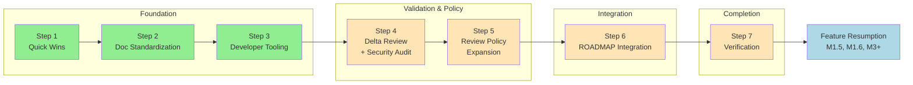

# Integrated Improvement Plan

**Document Version:** 2.0
**Created:** 2026-01-03
**Last Updated:** 2026-01-04
**Status:** ACTIVE
**Overall Completion:** 43% (3/7 steps)

---

## Document Purpose

This is the **CANONICAL** roadmap for all improvement work from the current moment until feature roadmap resumption. This document consolidates and supersedes fragmented planning documents into a single linear execution path.

**This document integrates:**
- Documentation Standardization (Phase 5-6 remaining)
- Developer Tooling Setup (Prettier, madge, knip)
- Quick Wins (.txt conversion, ADR folder)
- Architecture Refactoring (validated via Delta Review)
- Security Hardening (App Check re-enablement)

**Upon completion of this plan:**
- All documentation follows established standards
- Developer tooling enforces code quality automatically
- Architecture refactoring is validated and tracked in ROADMAP.md
- Feature development can resume (M1.5, M1.6, M3+)

---

## Status Dashboard

| Step | Title | Status | Completion | Blocking |
|------|-------|--------|------------|----------|
| Step 1 | Quick Wins & Cleanup | **COMPLETE** | 100% | None |
| Step 2 | Documentation Standardization Completion | **COMPLETE** | 100% | ~~Step 1~~ |
| Step 3 | Developer Tooling Setup | **COMPLETE** | 100% | ~~Step 2~~ |
| Step 4 | Delta Review & Security Audit | **PENDING** | 0% | ~~Step 3~~ |
| Step 5 | Review Policy Expansion | **PENDING** | 0% | Step 4 |
| Step 6 | ROADMAP.md Integration & Doc Updates | **PENDING** | 0% | Step 5 |
| Step 7 | Verification & Feature Resumption | **PENDING** | 0% | Step 6 |

**Overall Progress:** 3/7 steps complete (43%)
**Effort Tracking:** ~9 hours actual (Steps 1-3) + 12-18 hours remaining (Steps 4-7)
**Target Completion:** TBD (no costly deadlines - solo project)

---

## Dependency Map



**Legend:** 🟢 Complete | 🟡 Pending | 🔵 Future

**Critical Path:** Step 1 → Step 2 → Step 3 → Step 4 → Step 5 → Step 6 → Step 7

---

## Context & Background

### Why This Plan Exists

A comprehensive staff-engineer audit was conducted comparing:
1. Current DOCUMENTATION_STANDARDIZATION_PLAN approach (57% complete)
2. Current EIGHT_PHASE_REFACTOR_PLAN approach (0% of 8 phases complete)
3. Best practices from audit prompt recommendations

**Key decisions made:**
- **Adjust course**, not restart - existing work is valuable
- Complete documentation first (foundation for everything else)
- Add developer tooling that was missing (Prettier, madge, knip)
- Validate refactoring plans via Delta Review before execution
- Migrate valid refactor items to ROADMAP.md under M2
- Remove deprecated planning documents after migration

### What We Decided NOT To Do

| Recommendation | Decision | Reason |
|----------------|----------|--------|
| Numbered folder structure | NOT DOING | Current 5-tier hierarchy works |
| Immediate feature folder refactoring | DEFERRED | Validate via Delta Review first |
| Immediate god object splitting | DEFERRED | No friction yet; tracked in M2 |
| Aggressive doc consolidation (197→30) | NOT DOING | Too disruptive for solo project |
| Full planning restart | NOT DOING | 57% doc standardization complete |

### Items to Add to ROADMAP.md (Step 5)

These items need roadmap entries to ensure future completion:

1. **Import boundary enforcement via ESLint** (after feature folders exist)
2. **madge** - circular dependency detection (ongoing use)
3. **knip** - unused export detection (ongoing use)
4. **Prettier** - code formatting (ongoing use)
5. **Delta Review** - process for refreshing stale plans

---

## Step 1: Quick Wins & Cleanup

**Status:** COMPLETE
**Completion:** 100%
**Completed:** 2026-01-03 (Session #8)
**Actual Effort:** ~1.5 hours
**Dependencies:** None
**Risk Level:** Low

### Objectives

Address small, high-value items that unblock or simplify subsequent steps.

### Tasks

- [x] **Task 1.1**: Convert .txt files to .md (0.5 hours)
  - Converted to `docs/archive/ChatGPT_Multi_AI_Refactoring_Plan_Chat.md`
  - Converted to `docs/archive/GitHub_Code_Analysis_and_Review_Prompt.md`
  - Converted to `docs/archive/Refactoring_PR_Plan.md`
  - Added frontmatter with document type, dates, and purpose
  - Removed original .txt files

- [x] **Task 1.2**: Create ADR folder structure (0.5 hours)
  - Created `/docs/decisions/` folder
  - Created `README.md` explaining ADR format with index
  - Created `TEMPLATE.md` for new ADRs
  - Created `ADR-001-integrated-improvement-plan-approach.md`

- [x] **Task 1.3**: Audit and fix broken links in active docs (1 hour)
  - Audited ROADMAP.md and SESSION_CONTEXT.md - all links valid
  - Ran `npm run docs:check` - errors are in Tier 4/5 docs (Phase 5-6 work) or example placeholders
  - Active docs have no broken references
  - Note: EIGHT_PHASE_REFACTOR_PLAN.md migration deferred to Step 5 (after Delta Review validates items)

- [x] **Task 1.4**: Log this process pivot in AI_REVIEW_LEARNINGS_LOG.md (0.5 hours)
  - Added "Process Pivot #1" entry documenting staff-engineer audit
  - Documented decision to integrate vs restart with 4 patterns identified
  - Updated version to 1.34

### Acceptance Criteria

- [x] All 3 .txt files converted to .md with frontmatter
- [x] ADR folder exists with README and template
- [x] ADR-001 documents this plan's approach
- [x] Active docs have no broken links (Tier 4/5 issues are Phase 5-6 work)
- [x] AI_REVIEW_LEARNINGS_LOG.md updated (Process Pivot #1)

### Step 1 Completion Audit (RETROACTIVE)

**Audit performed by:** Claude
**Audit date:** 2026-01-03 (retroactive - audit process added to plan after Step 2)

#### Deliverable Verification
| Deliverable | Status | Evidence |
|-------------|--------|----------|
| 3 .txt files converted to .md | ✅ | Commit e677e1a - docs/archive/ |
| ADR folder structure | ✅ | Commit e677e1a - docs/decisions/ |
| ADR-001 created | ✅ | Commit e677e1a - integrated-improvement-plan-approach.md |
| Active docs link audit | ✅ | Manual check - all links valid |
| Process Pivot #1 logged | ✅ | Commit e677e1a - AI_REVIEW_LEARNINGS_LOG.md v1.34 |

#### Validation Results
- npm run lint: PASS (0 errors)
- npm test: 92/93 passing (98.9%)
- npm run patterns:check: PASS (0 violations)

#### Deviations from Plan
| Planned | Actual | Rationale |
|---------|--------|-----------|
| None | None | Step completed as planned |

#### Sign-off
- [x] All deliverables verified
- [x] All tasks completed
- [x] Validation scripts pass
- [x] Step marked COMPLETE in status dashboard

---

## Step 2: Documentation Standardization Completion

**Status:** COMPLETE
**Completion:** 100%
**Completed:** 2026-01-03 (Session #8)
**Actual Effort:** ~4 hours
**Dependencies:** Step 1
**Risk Level:** Medium

### Objectives

Complete the remaining phases (5-6) of DOCUMENTATION_STANDARDIZATION_PLAN.md.

### Tasks (Summary)

**Phase 5 - Tier 5 Doc Migration:** ✅ COMPLETE
- [x] Task 5.1: Merge APPCHECK_FRESH_SETUP.md into APPCHECK_SETUP.md
- [x] Task 5.2: Migrate SENTRY_INTEGRATION_GUIDE.md
- [x] Task 5.3: Migrate INCIDENT_RESPONSE.md
- [x] Task 5.4: Migrate recaptcha_removal_guide.md
- [x] Task 5.5: Migrate ANTIGRAVITY_GUIDE.md
- [x] Task 5.6: Merge TESTING_CHECKLIST.md into TESTING_PLAN.md

**Phase 6 - Archive & Cleanup:** ✅ COMPLETE (core tasks)
- [x] Task 6.1: Archive duplicate documents
- [x] Task 6.2: Archive outdated documents (RECAPTCHA_PROBLEM_SUMMARY, SUPABASE_MIGRATION_ANALYSIS, firestore-rules)
- [x] Task 6.3: AI_HANDOFF.md (done earlier)
- [x] Task 6.4: Verify cross-references, fix SERVER_SIDE_SECURITY.md
- [x] Task 6.5: Update README.md with doc inventory
- [x] Task 6.6: Final validation (lint 0 errors, tests 92/93 passing)
- [x] Task 6.12: Clean up deploy-firebase.yml (removed temp branch trigger)

**Deferred Tasks (moved to Step 3 backlog):**
- Task 6.7-6.11: Automation improvements (template consolidation, lessons learned, session hooks)
- Task 6.13-6.17: Review items (dependency graphs, dashboards, CI lint enforcement)

### Acceptance Criteria

- [x] Phase 5 marked COMPLETE in DOCUMENTATION_STANDARDIZATION_PLAN.md
- [x] Phase 6 marked COMPLETE in DOCUMENTATION_STANDARDIZATION_PLAN.md
- [x] Core docs pass validation (0 lint errors, stubs expected to fail)
- [x] DOCUMENTATION_STANDARDIZATION_PLAN.md marked 100% complete

### Step 2 Completion Audit (RETROACTIVE)

**Audit performed by:** Claude
**Audit date:** 2026-01-03 (retroactive - audit process added to plan after Step 2)

#### Deliverable Verification
| Deliverable | Status | Evidence |
|-------------|--------|----------|
| Phase 5: APPCHECK_SETUP.md merged | ✅ | Commit a202abb |
| Phase 5: SENTRY_INTEGRATION_GUIDE.md migrated | ✅ | Commit a202abb |
| Phase 5: INCIDENT_RESPONSE.md migrated | ✅ | Commit a202abb |
| Phase 5: recaptcha_removal_guide.md migrated | ✅ | Commit a202abb |
| Phase 5: ANTIGRAVITY_GUIDE.md migrated | ✅ | Commit a202abb |
| Phase 5: TESTING_PLAN.md merged | ✅ | Commit a202abb |
| Phase 6: 5 docs archived (stub strategy) | ✅ | Commit a9382a8 |
| Phase 6: SERVER_SIDE_SECURITY.md fixed | ✅ | Commit a9382a8 |
| Phase 6: README.md updated | ✅ | Commit a9382a8 |
| Phase 6: deploy-firebase.yml cleaned | ✅ | Commit 3be9640 |
| DOCUMENTATION_STANDARDIZATION_PLAN.md 100% | ✅ | Version 1.34 |

#### Validation Results
- npm run lint: PASS (0 errors)
- npm test: 92/93 passing (98.9%)
- npm run patterns:check: PASS (0 violations)
- npm run docs:check: 14 core docs passing (errors are stubs/templates - expected)

#### Deviations from Plan
| Planned | Actual | Rationale |
|---------|--------|-----------|
| All Phase 6 tasks | Core tasks only | Deferred 11 automation tasks (6.7-6.17) |
| docs:archive script | Stub file strategy | Better backward compatibility |

#### Sign-off
- [x] All deliverables verified
- [x] All tasks completed or deviation documented
- [x] Validation scripts pass
- [x] Step marked COMPLETE in status dashboard

**Note:** Retroactive Phase 5 and Phase 6 audits also added to DOCUMENTATION_STANDARDIZATION_PLAN.md.

---

## Step 3: Developer Tooling Setup

**Status:** COMPLETE
**Completion:** 100%
**Completed:** 2026-01-04 (Session #20)
**Actual Effort:** ~3.5 hours
**Dependencies:** Step 2
**Risk Level:** Low

### Objectives

Install and configure developer tooling that was identified as missing during the audit.

### Tasks

- [x] **Task 3.1**: Install and configure Prettier (1 hour)
  - `npm install --save-dev prettier`
  - Create `.prettierrc` with project config
  - Create `.prettierignore` for exclusions
  - Add `npm run format` script to package.json
  - Add `npm run format:check` for CI
  - Run initial format on codebase
  - Commit formatted changes

- [x] **Task 3.2**: Install and configure madge (0.5 hours)
  - `npm install --save-dev madge`
  - Add `npm run deps:circular` script
  - Run initial check, document any existing circular deps
  - Add to CI pipeline (warn, don't block initially)

- [x] **Task 3.3**: Install and configure knip (0.5 hours)
  - `npm install --save-dev knip`
  - Create `knip.json` config
  - Add `npm run deps:unused` script
  - Run initial check, document findings
  - Add to CI pipeline (warn, don't block initially)

- [x] **Task 3.4**: Document tooling in DEVELOPMENT.md (1 hour)
  - Add "Code Quality Tools" section
  - Document Prettier usage and configuration
  - Document madge usage for circular dep detection
  - Document knip usage for unused export detection
  - Add to "Definition of Done" checklist

- [x] **Task 3.5**: Update CI/CD pipeline (0.5 hours)
  - Add Prettier check to GitHub Actions
  - Add madge check (warning only)
  - Add knip check (warning only)

- [x] **Task 3.6**: CI-level lint enforcement (1 hour) - *from Phase 6 backlog*
  - Add `npm run lint` to GitHub Actions ci.yml workflow
  - Ensure lint runs on all PRs, not just pre-commit
  - Fail PR checks if lint errors found
  - Document in DEVELOPMENT.md

- [x] **Task 3.7**: Test coverage for new scripts (1.5 hours) - *from Sprint Backlog A3* **DO FIRST**
  - Add tests for `scripts/surface-lessons-learned.js`
  - Add tests for enhanced `scripts/phase-complete-check.js` (--auto, --plan flags)
  - Ensure tests cover core functionality and edge cases

- [x] **Task 3.8**: Lint warning baseline (0.5 hours) - *from Sprint Backlog A1*
  - Document 168 existing eslint-plugin-security warnings as baseline
  - Evaluate: accept as-is, configure plugin, or fix critical ones
  - Add baseline count to DEVELOPMENT.md for tracking

- [x] **Task 3.9**: Document location cleanup (1.5 hours) - *from Session #19 audit*
  - **Context**: Audit found docs at root that should be in `docs/` folder
  - **Move to `docs/`** (7 files):
    - AI_REVIEW_PROCESS.md
    - AI_REVIEW_LEARNINGS_LOG.md
    - DOCUMENTATION_STANDARDIZATION_PLAN.md
    - DOCUMENTATION_STANDARDS.md
    - INTEGRATED_IMPROVEMENT_PLAN.md
    - TESTING_CHECKLIST.md
    - APPCHECK_FRESH_SETUP.md (consolidate with docs/APPCHECK_SETUP.md)
  - **Archive** (3 files - duplicates/historical):
    - RECAPTCHA_PROBLEM_SUMMARY.md (already in docs/archive/)
    - SUPABASE_MIGRATION_ANALYSIS.md (already in docs/archive/)
    - local-resources-review.md
  - **Keep at root** (8 files - Tier 1-2 + special):
    - README.md, ROADMAP.md, ROADMAP_LOG.md, ARCHITECTURE.md, DEVELOPMENT.md
    - claude.md, AI_WORKFLOW.md, SESSION_CONTEXT.md
  - Update all internal links after moves
  - Verify no broken links with `npm run docs:check`

### Acceptance Criteria

- [x] Prettier installed and configured
- [x] `npm run format` works
- [x] madge installed with `npm run deps:circular`
- [x] knip installed with `npm run deps:unused`
- [x] DEVELOPMENT.md documents all tools
- [x] CI pipeline updated with all checks
- [x] CI lint enforcement active (PRs fail on lint errors)
- [x] New scripts have test coverage (A3)
- [x] Lint warning baseline documented (A1)
- [x] Root docs reorganized (7 moved to `docs/`, 3 archived)

### Step 3 Completion Audit

**Audit performed by:** Claude
**Audit date:** 2026-01-04

#### Deliverable Verification
| Deliverable | Status | Evidence |
|-------------|--------|----------|
| Prettier configured | ✅ | `.prettierrc`, `.prettierignore` created |
| madge installed | ✅ | `npm run deps:circular` - 0 circular deps |
| knip installed | ✅ | `npm run deps:unused` - baseline documented |
| DEVELOPMENT.md updated | ✅ | Commit 181bae0 - Developer Tooling section |
| CI pipeline updated | ✅ | Commit 4c04f33 - Prettier, madge, knip checks |
| Pre-commit enhanced | ✅ | Prettier check (warning) added |
| Pre-push enhanced | ✅ | Circular dependency check (blocking) added |
| Script tests added | ✅ | 23 new tests for surface-lessons-learned.js and phase-complete-check.js |
| Lint baseline documented | ✅ | 168 warnings in DEVELOPMENT.md |
| Docs reorganized | ✅ | 7 docs moved to docs/, 3 archived |

#### Validation Results
- npm run lint: PASS (0 errors, 168 warnings)
- npm test: 115/116 passing (1 skipped)
- npm run patterns:check: **0 violations** (fixed 2026-01-04, Session #23)
- npm run deps:circular: PASS (0 circular dependencies)

#### Sign-off
- [x] All deliverables verified
- [x] All tasks completed
- [x] Validation scripts pass
- [x] Step marked COMPLETE in status dashboard

---

## Step 4: Delta Review & Security Audit

**Status:** PENDING
**Completion:** 0%
**Estimated Effort:** 4-6 hours
**Dependencies:** Step 3
**Risk Level:** Medium

### Objectives

Re-evaluate the EIGHT_PHASE_REFACTOR_PLAN.md to determine which items are still valid, which are stale, and which have been completed by other work.

### Background

The EIGHT_PHASE_REFACTOR_PLAN.md was created 2025-12-30 based on a 6-AI code review. Since then:
- Documentation standardization progressed significantly
- Pattern automation scripts added
- Security fixes applied (Qodo reviews #24-27)
- App Check remains disabled (deferred)

A Delta Review will refresh this plan with current context.

### Tasks

- [ ] **Task 4.1**: Extract current CANON findings from EIGHT_PHASE_REFACTOR_PLAN.md (1 hour)
  - List all 45 CANON items with current status
  - Categorize: DONE, STILL_VALID, STALE, SUPERSEDED

- [ ] **Task 4.2**: Run fresh analysis on high-priority items (2 hours)
  - Focus on S0/S1 severity items
  - Verify file paths still exist
  - Check if issues were fixed by recent work
  - Document findings

- [ ] **Task 4.3**: Create refreshed refactor backlog (1 hour)
  - List validated items that still need work
  - Prioritize by severity and effort
  - Group by category (security, architecture, testing)
  - Format for ROADMAP.md integration

- [ ] **Task 4.4**: Document App Check re-enablement plan (1 hour)
  - Current status: DISABLED
  - Prerequisite: Throttle clearance (was Dec 31, verify status)
  - Steps to re-enable
  - Testing requirements
  - Add to Step 5 ROADMAP integration

- [ ] **Task 4.5**: Archive EIGHT_PHASE_REFACTOR_PLAN.md (0.5 hours)
  - Move full content to `docs/archive/EIGHT_PHASE_REFACTOR_PLAN.md` with superseded_by note
  - Leave stub file at original `docs/EIGHT_PHASE_REFACTOR_PLAN.md` explaining archived status and linking to ROADMAP.md M2 (prevents broken external links)
  - Update internal cross-references to point to ROADMAP.md
  - No new planning document (avoid fragmentation)

- [ ] **Task 4.6**: Key rotation policy documentation (0.5 hours) - *from Phase 6 backlog*
  - Document key rotation schedule in SECURITY.md
  - Add procedures for rotating Firebase, API keys
  - Link from GLOBAL_SECURITY_STANDARDS.md
  - Review alongside App Check re-enablement (Task 4.4)

- [ ] **Task 4.7**: Security audit (2 hours) - *from Sprint Backlog A2*
  - 6 security-sensitive files changed since last review
  - Use MULTI_AI_SECURITY_AUDIT_PLAN_TEMPLATE.md
  - Focus on: deploy-firebase.yml, SECURITY.md, SERVER_SIDE_SECURITY.md, lib/firebase.ts
  - Document findings and remediation

- [ ] **Task 4.8**: Review commit backlog (1 hour) - *from Sprint Backlog A4*
  - 133 commits since last multi-AI review (threshold: 50)
  - Combine with Delta Review (Task 4.1-4.3) for efficiency
  - Focus on high-churn files and new patterns
  - Log findings in AI_REVIEW_LEARNINGS_LOG.md

- [ ] **Task 4.9**: Create FIREBASE_CHANGE_POLICY.md (1 hour) - *foundation for Step 5*
  - Document requirements for firestore.rules changes
  - Document Cloud Functions security review process
  - Define when security-auditor agent is REQUIRED
  - Create review checklist for Firebase-related PRs
  - **Benefits Task 4.7** (provides structure for security audit)
  - **Benefits Step 5** (foundation for correction framework)

### Acceptance Criteria

- [ ] All 45 CANON items categorized
- [ ] Stale items documented and discarded
- [ ] Valid items ready for ROADMAP.md integration
- [ ] App Check plan documented
- [ ] EIGHT_PHASE_REFACTOR_PLAN.md properly archived/superseded
- [ ] Key rotation policy documented in SECURITY.md
- [ ] Security audit completed for changed files (A2)
- [ ] Commit backlog reviewed and findings logged (A4)
- [ ] FIREBASE_CHANGE_POLICY.md created (foundation for Step 5)

---

## Step 5: Review Policy Expansion

**Status:** PENDING
**Completion:** 0%
**Estimated Effort:** 4-6 hours
**Dependencies:** Step 4
**Risk Level:** Low

### Objectives

Expand review policies beyond code to cover skills, agents, procedures, and configurations. Implement event-based triggers, usage verification, and correction mechanisms.

### Background

Brainstorming session (Session #21) identified gaps in review coverage:
- Skills/agents have no usage verification
- Procedures have no correction mechanisms
- Triggers are time-based (unreliable) instead of event-based
- Detection exists but correction is missing

See: [REVIEW_POLICY_EXPANSION_DRAFT.md](./brainstorm/REVIEW_POLICY_EXPANSION_DRAFT.md) for full design.

### Design Principles

1. **Event-Based Triggers** (not time-based):
   - Count-based: After N occurrences (commits, reviews, files)
   - Threshold-based: When metric exceeds limit
   - Completion-based: When milestone reached
   - Delta-based: When change detected

2. **Correction Framework**:
   - Every detection has a corresponding correction
   - Corrections are BLOCKING, REQUIRE_ACTION, WARN, or LOG
   - Overrides require explicit justification
   - Overrides are logged and reviewed

3. **Usage Verification**:
   - Track skill/agent invocations per session
   - Verify expected usage based on activity
   - Prompt for action or justification when missing

### Tasks

- [ ] **Task 5.1**: Create session activity logging infrastructure (1 hour)
  - Create `scripts/log-session-activity.js`
  - Log: file writes, skill invocations, commits, session start/end
  - Output to `.claude/session-activity.jsonl`
  - Integrate with session-start hook

- [ ] **Task 5.2**: Create event-based trigger checker (1.5 hours)
  - Create `scripts/check-triggers.js`
  - Implement triggers: security_audit, consolidation, skill_validation
  - Integrate with pre-push hook
  - Blocking triggers prevent push, warning triggers inform

- [ ] **Task 5.3**: Create skill/agent configuration validator (1 hour)
  - Create `scripts/validate-skill-config.js`
  - Validate SKILL.md structure (required sections)
  - Check file references exist
  - Check for deprecated patterns
  - Integrate with pre-commit hook

- [ ] **Task 5.4**: Create skill usage verifier (1 hour)
  - Create `scripts/verify-skill-usage.js`
  - Define rules: code-reviewer after writing, systematic-debugging after bug fix
  - Check session activity against rules
  - Integrate with session-end

- [ ] **Task 5.5**: Create override logging system (0.5 hours)
  - Create `.claude/override-log.jsonl` format
  - Add override mechanism to blocking scripts
  - Environment variable: `SKIP_REASON="reason" npm run check`

- [ ] **Task 5.6**: Create SKILL_AGENT_POLICY.md (1 hour)
  - Document skill/agent creation requirements
  - Document expected usage patterns
  - Document override policy
  - Add examples

- [ ] **Task 5.7**: Update session-end command (0.5 hours)
  - Add skill usage verification step
  - Add override review prompt
  - Integrate with trigger checking

### Acceptance Criteria

- [ ] Session activity logging operational
- [ ] Event-based triggers replace time-based
- [ ] Skill/agent configs validated on change
- [ ] Skill usage verified at session end
- [ ] Override mechanism with logging
- [ ] SKILL_AGENT_POLICY.md created
- [ ] Pre-commit/pre-push hooks updated

---

## Step 6: ROADMAP.md Integration & Doc Updates

**Status:** PENDING
**Completion:** 0%
**Estimated Effort:** 2-3 hours
**Dependencies:** Step 5
**Risk Level:** Low

### Objectives

Integrate validated refactor items into ROADMAP.md and update all documentation to reflect the new unified approach.

### Tasks

- [ ] **Task 6.1**: Add "Developer Tooling" section to ROADMAP.md M2 (0.5 hours)
  - Add Prettier (ongoing enforcement)
  - Add madge (circular dependency detection)
  - Add knip (unused export detection)
  - Add ESLint import boundary rules (future, after feature folders)
  - Add Delta Review process documentation
  - Add Review Policy Expansion items

- [ ] **Task 6.2**: Migrate valid refactor items to ROADMAP.md M2 (1 hour)
  - Add items from Step 4 Task 4.3
  - Preserve severity and effort estimates
  - Group appropriately
  - Add dependencies where applicable

- [ ] **Task 6.3**: Add App Check re-enablement to ROADMAP.md (0.5 hours)
  - Add App Check re-enablement as M2 item (from Step 4 Task 4.4)
  - Include prerequisites and testing requirements
  - Link to detailed plan in docs/

- [ ] **Task 6.4**: Update ROADMAP.md references (0.5 hours)
  - Search and update all references to EIGHT_PHASE_REFACTOR_PLAN.md
  - Point to ROADMAP.md M2 for refactor items
  - Update Doc Standardization blocker status

- [ ] **Task 6.5**: Update SESSION_CONTEXT.md (0.5 hours)
  - Reflect completion of this improvement plan
  - Update current priorities
  - Set next session focus to feature work

- [ ] **Task 6.6**: Final cross-reference audit (0.5 hours)
  - Run `npm run docs:check`
  - Fix any broken links
  - Verify all archived docs properly referenced

### Acceptance Criteria

- [ ] ROADMAP.md M2 contains all tooling items
- [ ] ROADMAP.md M2 contains validated refactor items
- [ ] ROADMAP.md M2 contains App Check re-enablement item
- [ ] No dangling references to EIGHT_PHASE_REFACTOR_PLAN.md
- [ ] SESSION_CONTEXT.md updated
- [ ] All cross-references valid

---

## Step 7: Verification & Feature Resumption

**Status:** PENDING
**Completion:** 0%
**Estimated Effort:** 1-2 hours
**Dependencies:** Step 6
**Risk Level:** Low

### Objectives

Final verification that all improvement work is complete and feature development can resume.

### Tasks

- [ ] **Task 7.1**: Run all validation scripts (0.5 hours)
  - `npm run docs:check` - all docs pass
  - `npm run format:check` - code formatted
  - `npm run deps:circular` - no new circular deps
  - `npm run deps:unused` - baseline documented
  - `npm run lint` - no lint errors
  - `npm run build` - builds successfully
  - `npm run triggers:check` - all triggers operational

- [ ] **Task 7.2**: Verify documentation completeness (0.5 hours)
  - DOCUMENTATION_STANDARDIZATION_PLAN.md at 100%
  - This document (INTEGRATED_IMPROVEMENT_PLAN.md) at 100%
  - FIREBASE_CHANGE_POLICY.md complete
  - SKILL_AGENT_POLICY.md complete
  - All templates in place
  - AI_WORKFLOW.md current

- [ ] **Task 7.3**: Update ROADMAP.md blocker status (0.5 hours)
  - Remove "Doc Standardization" blocker
  - Update M1.5, M1.6 status to "Ready"
  - Update overall progress percentage

- [ ] **Task 7.4**: Mark this plan COMPLETE (0.5 hours)
  - Update status dashboard above
  - Set completion to 100%
  - Add completion date
  - Commit final state

### Acceptance Criteria

- [ ] All validation scripts pass
- [ ] DOCUMENTATION_STANDARDIZATION_PLAN.md 100% complete
- [ ] INTEGRATED_IMPROVEMENT_PLAN.md 100% complete
- [ ] ROADMAP.md blocker removed
- [ ] Feature work can resume

### Definition of Done

When this step completes:
- **Documentation** is standardized and maintained
- **Developer tooling** enforces code quality
- **Architecture backlog** is validated and tracked
- **Cross-references** are all valid
- **Feature development** (M1.5, M1.6, M3+) can resume

---

## AI Instructions

When implementing this plan:

1. **Work sequentially** - Complete each step before starting the next
2. **Update status** - Mark tasks complete as you finish them
3. **Commit frequently** - One logical change per commit
4. **Run validations** - Use `npm run docs:check` after doc changes
5. **Update this document** - Keep status dashboard current
6. **Reference source docs** - DOCUMENTATION_STANDARDIZATION_PLAN.md has detailed task specs
7. **Complete Step Audit** - MANDATORY before marking any step COMPLETE (see below)

### Step Completion Audit (MANDATORY)

**⚠️ Before marking ANY step as COMPLETE, you MUST complete this audit:**

```markdown
### Step [N] Completion Audit

**Audit performed by:** [Name/AI]
**Audit date:** YYYY-MM-DD

#### Deliverable Verification
| Deliverable | Status | Evidence |
|-------------|--------|----------|
| [Item 1] | ✅/❌ | Commit [hash] or description |
| [Item 2] | ✅/❌ | Commit [hash] or description |

#### Validation Results
- npm run lint: [PASS/FAIL]
- npm test: [X/Y passing]
- npm run patterns:check: [PASS/FAIL]
- npm run docs:check (if applicable): [PASS/FAIL]

#### Deviations from Plan
| Planned | Actual | Rationale |
|---------|--------|-----------|
| [original] | [what happened] | [why] |

#### Sign-off
- [ ] All deliverables verified
- [ ] All tasks completed or deviation documented
- [ ] Validation scripts pass
- [ ] Step marked COMPLETE in status dashboard
```

**Add completed audit to this document under the relevant Step section.**

### Session Handoff

After each work session:
1. Update this document's status dashboard
2. Update SESSION_CONTEXT.md with progress
3. Commit changes with descriptive message
4. Note any blockers or decisions made

---

## Update Triggers

**Update this document when:**
- Step status changes (PENDING → IN_PROGRESS → COMPLETE)
- Tasks completed within a step
- Blockers encountered or resolved
- Decisions made that affect the plan
- New items discovered that need tracking

---

## Sprint Backlog Additions

Items discovered during sprint execution that need tracking. Review at step boundaries for inclusion/deferral.

| # | Item | Discovered | Target Step | Status | Notes |
|---|------|------------|-------------|--------|-------|
| A1 | Lint warning baseline | Session #11 | Step 3 | INCLUDE | 160 warnings from eslint-plugin-security; establish baseline or configure |
| A2 | Security audit | Session #11 | Step 4 | INCLUDE | 6 security-sensitive files changed; combine with Delta Review |
| A3 | Test coverage for new scripts | Session #11 | Step 3 | INCLUDE | `surface-lessons-learned.js`, `phase-complete-check.js` need tests; do FIRST |
| A4 | Review commit backlog | Session #11 | Step 4 | INCLUDE | 133 commits since last review; combine with Delta Review |

### Disposition Options
- **INCLUDE** - Add to current/specific step
- **DEFER** - Add to ROADMAP.md M2 (post-sprint)
- **SKIP** - Not worth doing, document why

### Review Log
| Session | Items Reviewed | Decisions |
|---------|----------------|-----------|
| #11 | A1-A4 | A1,A3→Step 3; A2,A4→Step 4 |

---

## Version History

| Version | Date | Changes |
|---------|------|---------|
| 2.0 | 2026-01-04 | Major update: Step 3 COMPLETE; Added Step 5 (Review Policy Expansion); Renumbered Steps 5-6 to 6-7; Added Task 4.9 (FIREBASE_CHANGE_POLICY foundation) |
| 1.9 | 2026-01-04 | Session #20: Step 3 work completed (Prettier, madge, knip, CI updates, docs reorganization) |
| 1.8 | 2026-01-03 | Added A1-A4 from sprint backlog: Tasks 3.7-3.8 (Step 3), Tasks 4.7-4.8 (Step 4) |
| 1.7 | 2026-01-03 | Added Sprint Backlog Additions section for tracking emergent tasks |
| 1.6 | 2026-01-03 | Added Mermaid dependency graph (replaced ASCII diagram); color-coded steps showing progress |
| 1.5 | 2026-01-03 | Added mandatory Step Completion Audit process; retroactive audits for Steps 1-2; audit requirement added to AI Instructions |
| 1.4 | 2026-01-03 | Step 2 COMPLETE: Phase 5 (6/6 migrations), Phase 6 core (7 tasks); 11 deferred tasks (6.7-6.17) moved to backlog |
| 1.3 | 2026-01-03 | Step 1 COMPLETE: .txt→.md conversions, ADR folder with ADR-001, link audit passed, process pivot logged |
| 1.2 | 2026-01-03 | Added stub file strategy for archival; clarified Task 1.3 (defer migration to Step 5); improved acceptance criteria |
| 1.1 | 2026-01-03 | Added Task 5.3 for App Check tracking; fixed CANON count (45); removed ARCHITECTURE_REFACTOR_BACKLOG.md option; removed brittle line-number references |
| 1.0 | 2026-01-03 | Initial creation - consolidated improvement roadmap |

---

## References

### Source Documents
- [DOCUMENTATION_STANDARDIZATION_PLAN.md](./DOCUMENTATION_STANDARDIZATION_PLAN.md) - Detailed Phase 5-6 tasks
- [EIGHT_PHASE_REFACTOR_PLAN.md](./EIGHT_PHASE_REFACTOR_PLAN.md) - Original refactor plan (pending Delta Review)
- [ROADMAP.md](../ROADMAP.md) - Product roadmap (target for integration)
- [SESSION_CONTEXT.md](../SESSION_CONTEXT.md) - Session handoff document

### Related Documents
- [AI_WORKFLOW.md](../AI_WORKFLOW.md) - AI navigation guide
- [DEVELOPMENT.md](../DEVELOPMENT.md) - Developer setup (tooling target)
- [AI_REVIEW_LEARNINGS_LOG.md](./AI_REVIEW_LEARNINGS_LOG.md) - Review learnings
