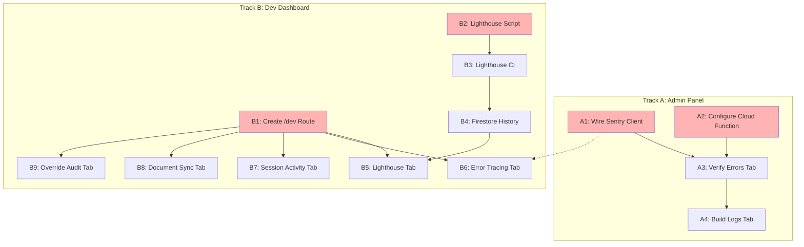

# Operational Visibility Sprint

**Document Version:** 1.0 **Created:** 2026-01-14 **Status:** ACTIVE
**Priority:** P0 - Immediate Focus **Last Updated:** 2026-01-15

---

## Overview

This sprint consolidates Admin Panel completion (Phases 4-5) and Development
Dashboard creation into a single focused effort. The goal is full operational
visibility across both production monitoring (Admin Panel) and development
tooling (Dev Dashboard).

**Sprint Goal:** Get Admin Panel Phases 4-5 and Development Dashboard MVP
operational ASAP.

---

## Quick Start

1. Review sprint goals and priorities
2. Check task status and blockers
3. Follow implementation order

## AI Instructions

When working on operational visibility:

- Prioritize P0 items first
- Update task status after each change
- Document blockers immediately

---

## Current State Assessment

| Component        | Status                     | Effort to Complete |
| ---------------- | -------------------------- | ------------------ |
| Sentry SDK       | Installed, NOT initialized | 1 hour             |
| Admin Errors Tab | UI exists, needs env vars  | Config only        |
| Admin Logs Tab   | Not built                  | 3-4 hours          |
| Dev Dashboard    | Does not exist             | 6-8 hours          |
| Lighthouse CI    | Not built                  | 3-4 hours          |
| Security Logging | Complete (25 event types)  | Done               |
| reCAPTCHA        | Complete (fail-closed)     | Done               |

---

## Sprint Tracks (Parallel Execution)

### Track A: Admin Panel Completion (Phases 4-5)

**Goal:** Production error and log visibility

```
Week 1:
┌─────────────────────────────────────────────────────────────┐
│  A1: Wire Sentry Client (1hr)                               │
│  ├─ Call initSentryClient() in app/layout.tsx               │
│  ├─ Call setSentryUser() in auth context                    │
│  └─ Verify errors appear in Sentry dashboard                │
├─────────────────────────────────────────────────────────────┤
│  A2: Configure Sentry Cloud Function (1hr)                  │
│  ├─ Set SENTRY_API_TOKEN in Firebase Functions config       │
│  ├─ Set SENTRY_ORG and SENTRY_PROJECT                       │
│  └─ Test adminGetSentryErrorSummary returns data            │
├─────────────────────────────────────────────────────────────┤
│  A3: Verify Admin Errors Tab (30min)                        │
│  ├─ Confirm error summary loads                             │
│  ├─ Confirm trend analysis displays                         │
│  └─ Test PII redaction working                              │
└─────────────────────────────────────────────────────────────┘

Week 2:
┌─────────────────────────────────────────────────────────────┐
│  A4: Admin Logs Tab - GCP Integration (3-4hr)               │
│  ├─ Create components/admin/logs-tab.tsx                    │
│  ├─ Add quick filters for security event types              │
│  ├─ Deep link to GCP Cloud Logging Console                  │
│  ├─ Recent security events display (last 24hr)              │
│  └─ Add to admin tabs navigation                            │
└─────────────────────────────────────────────────────────────┘
```

### Track B: Development Dashboard MVP

**Goal:** Developer visibility into performance, sessions, and system health

```
Week 1:
┌─────────────────────────────────────────────────────────────┐
│  B1: Create /dev Route Structure (2hr)                      │
│  ├─ Create app/dev/page.tsx                                 │
│  ├─ Create app/dev/layout.tsx with auth gate                │
│  ├─ Create components/dev/dev-dashboard.tsx                 │
│  ├─ Add navigation tabs structure                           │
│  └─ Link from Admin Panel (optional dev tools link)         │
├─────────────────────────────────────────────────────────────┤
│  B2: PERF-001 - Lighthouse Script (2hr)                     │
│  ├─ Install lighthouse, puppeteer dependencies              │
│  ├─ Create scripts/lighthouse-audit.js                      │
│  ├─ Add npm run lighthouse command                          │
│  └─ Test against all 7 routes                               │
└─────────────────────────────────────────────────────────────┘

Week 2:
┌─────────────────────────────────────────────────────────────┐
│  B3: PERF-002 - Lighthouse CI Integration (2hr)             │
│  ├─ Add start-server-and-test dependency                    │
│  ├─ Create .github/workflows/lighthouse.yml                 │
│  ├─ Upload reports as artifacts                             │
│  └─ Add PR comment with scores (optional)                   │
├─────────────────────────────────────────────────────────────┤
│  B4: PERF-003 - Firestore History Storage (2hr)             │
│  ├─ Create Firestore collection: dev/lighthouse/history     │
│  ├─ CI job writes scores after each run                     │
│  ├─ Implement regression detection (>10pt drop)             │
│  └─ Add Firestore rules for dev collection                  │
├─────────────────────────────────────────────────────────────┤
│  B5: Lighthouse Dashboard Tab (3hr)                         │
│  ├─ Create components/dev/lighthouse-tab.tsx                │
│  ├─ Display current scores table (all pages)                │
│  ├─ Historical trend chart (line graph)                     │
│  ├─ Regression alerts display                               │
│  └─ Links to full HTML reports                              │
└─────────────────────────────────────────────────────────────┘

Week 3:
┌─────────────────────────────────────────────────────────────┐
│  B6: Error Tracing Tab (2hr)                                │
│  ├─ Create components/dev/errors-tab.tsx                    │
│  ├─ Local error aggregation from console                    │
│  ├─ Link to Sentry for production errors                    │
│  └─ Filter by severity, component                           │
├─────────────────────────────────────────────────────────────┤
│  B7: Session Activity Tab (2hr)                             │
│  ├─ Create components/dev/sessions-tab.tsx                  │
│  ├─ Read from Firestore dev/sessions collection             │
│  ├─ Display event timeline                                  │
│  ├─ Session duration, files changed metrics                 │
│  └─ Detect sessions without end markers                     │
├─────────────────────────────────────────────────────────────┤
│  B8: Document Sync Tab (1hr)                                │
│  ├─ Create components/dev/docs-tab.tsx                      │
│  ├─ Run docs:sync-check and display results                 │
│  ├─ Placeholder detection status                            │
│  └─ Template/instance health overview                       │
├─────────────────────────────────────────────────────────────┤
│  B9: Override Audit Tab (1hr)                               │
│  ├─ Create components/dev/overrides-tab.tsx                 │
│  ├─ Display override log entries                            │
│  ├─ Frequency and pattern analysis                          │
│  └─ Flag unusual patterns                                   │
└─────────────────────────────────────────────────────────────┘
```

---

## Dependency Graph



**Legend:** Red = Week 1 priorities (can run in parallel)

---

## Parallel Execution Plan

### Week 1 (Parallel)

| Session   | Track A                       | Track B                     |
| --------- | ----------------------------- | --------------------------- |
| **Day 1** | A1: Wire Sentry (1hr)         | B1: /dev Route (2hr)        |
| **Day 1** | A2: Configure Cloud Fn (1hr)  | B2: Lighthouse Script (2hr) |
| **Day 2** | A3: Verify Errors Tab (30min) | Continue B2 if needed       |

**Week 1 Deliverables:**

- [ ] Sentry capturing production errors
- [ ] Admin Errors Tab showing real data
- [ ] `/dev` route accessible
- [ ] `npm run lighthouse` working

### Week 2 (Parallel)

| Session   | Track A              | Track B                     |
| --------- | -------------------- | --------------------------- |
| **Day 1** | A4: Logs Tab (3-4hr) | B3: Lighthouse CI (2hr)     |
| **Day 2** | Continue A4          | B4: Firestore History (2hr) |
| **Day 3** | -                    | B5: Lighthouse Tab (3hr)    |

**Week 2 Deliverables:**

- [ ] Admin Logs Tab with GCP deep links
- [ ] Lighthouse CI running on PRs
- [ ] Dev Dashboard showing Lighthouse scores

### Week 3 (Parallel)

| Session   | Track B                                                   |
| --------- | --------------------------------------------------------- |
| **Day 1** | B6: Error Tracing Tab (2hr)                               |
| **Day 2** | B7: Session Activity Tab (2hr)                            |
| **Day 3** | B8: Document Sync Tab (1hr), B9: Override Audit Tab (1hr) |

**Week 3 Deliverables:**

- [ ] Full Dev Dashboard MVP with all 5 tabs

---

## Technical Specifications

### Auth Model for /dev Route

```typescript
// app/dev/layout.tsx
// Option A: Same as admin - require admin claim
const isAdmin = tokenResult.claims.admin === true;

// Or Option B: Allowlist specific emails (if different from admin)
const DEV_ALLOWLIST = ["your-email@domain.com"];
const isDeveloper = DEV_ALLOWLIST.includes(user.email);
```

**Recommendation:** Use admin claim (Option A) - you're the only admin anyway.

### Firestore Schema for Dev Data

```
/dev
  /lighthouse
    /history
      - {documentId}: { timestamp, commit, branch, device, results[] }
    /budgets
      - current: { lcp, fid, cls, performance, accessibility, ... }
  /sessions
    - {sessionId}: { start, end, filesChanged, skillsUsed, commits[] }
  /overrides
    - {overrideId}: { timestamp, rule, reason, context }
```

### Environment Variables Needed

**For Sentry (Cloud Functions):**

```bash
firebase functions:config:set sentry.api_token="YOUR_TOKEN"
firebase functions:config:set sentry.org="YOUR_ORG"
firebase functions:config:set sentry.project="YOUR_PROJECT"
```

**For Sentry (Client - .env.local):**

```bash
NEXT_PUBLIC_SENTRY_DSN=https://xxx@sentry.io/xxx
NEXT_PUBLIC_SENTRY_ENABLED=true
```

---

## Success Criteria

### Admin Panel (Phases 4-5) Complete When:

- [ ] Production errors appear in Admin Errors Tab
- [ ] Error trends (24hr comparison) display correctly
- [ ] Logs Tab shows recent security events
- [ ] GCP deep links work

### Dev Dashboard MVP Complete When:

- [ ] `/dev` route accessible (admin auth)
- [ ] Lighthouse scores display for all 7 pages
- [ ] Historical trends visible (after 3+ CI runs)
- [ ] Error tracing shows recent errors
- [ ] Session activity visualized
- [ ] Document sync status displayed
- [ ] Override audit trail visible

---

## Files to Create

### Track A (Admin Panel)

```
components/admin/logs-tab.tsx          # NEW - GCP logs viewer
```

### Track B (Dev Dashboard)

```
app/dev/page.tsx                       # NEW - Dev dashboard route
app/dev/layout.tsx                     # NEW - Auth-gated layout
components/dev/dev-dashboard.tsx       # NEW - Main dashboard
components/dev/dev-tabs.tsx            # NEW - Tab navigation
components/dev/lighthouse-tab.tsx      # NEW - Lighthouse scores
components/dev/errors-tab.tsx          # NEW - Error tracing
components/dev/sessions-tab.tsx        # NEW - Session activity
components/dev/docs-tab.tsx            # NEW - Document sync
components/dev/overrides-tab.tsx       # NEW - Override audit
scripts/lighthouse-audit.js            # NEW - Lighthouse script
.github/workflows/lighthouse.yml       # NEW - CI workflow
```

### Files to Modify

```
app/layout.tsx                         # Add initSentryClient() call
lib/auth-context.tsx                   # Add setSentryUser() call
components/admin/admin-tabs.tsx        # Add Logs tab, Dev Tools link
.gitignore                             # Add .lighthouse/
package.json                           # Add lighthouse scripts
firestore.rules                        # Add /dev collection rules
```

---

## Risk Mitigation

| Risk                   | Mitigation                          |
| ---------------------- | ----------------------------------- |
| Sentry API rate limits | Cache responses, 5-min TTL          |
| GCP API complexity     | Use deep links, not API             |
| Lighthouse CI slow     | Run only on PR, not every commit    |
| Firestore costs        | Dev collection small, minimal reads |

---

## Related Documents

- [LIGHTHOUSE_INTEGRATION_PLAN.md](./LIGHTHOUSE_INTEGRATION_PLAN.md) - Detailed
  Lighthouse spec
- [ADMIN_PANEL_SECURITY_MONITORING_REQUIREMENTS.md](./ADMIN_PANEL_SECURITY_MONITORING_REQUIREMENTS.md) -
  Phase 4-5 details
- [ROADMAP.md](../ROADMAP.md) - Overall product roadmap

---

## Version History

| Version | Date       | Changes                     |
| ------- | ---------- | --------------------------- |
| 1.0     | 2026-01-14 | Initial sprint plan created |
