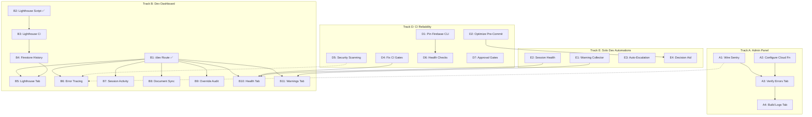

# Operational Visibility Sprint

**Document Version:** 2.1 **Created:** 2026-01-14 **Status:** ACTIVE
**Priority:** P0 - Immediate Focus **Last Updated:** 2026-01-27

---

## Overview

This sprint consolidates Admin Panel completion (Phases 4-5), Development
Dashboard creation, CI/CD reliability, and solo developer automations. The goal
is full operational visibility across production monitoring, development
tooling, and automated quality assurance.

**Sprint Goal:** Full operational visibility with sustainable automations for a
solo no-code developer using Claude Code.

**Audit Integration (Session #101):** This sprint now incorporates findings
from:

- Process Audit 2026-Q1 (CANON-0105 to CANON-0118)
- Comprehensive Audit 2026-01-24 (115 findings)

---

## Quick Start

1. Review sprint goals and priorities
2. Check task status and blockers
3. Follow implementation order by track

## AI Instructions

When working on operational visibility:

- Prioritize P0 items first (Track A, D critical items)
- Update task status after each change
- Document blockers immediately
- Run code-reviewer agent after code changes
- Update SESSION_CONTEXT.md with progress

---

## Current State Assessment

| Component               | Status                        | Effort to Complete |
| ----------------------- | ----------------------------- | ------------------ |
| Sentry SDK              | Installed, NOT initialized    | 1 hour             |
| Admin Errors Tab        | UI exists, needs env vars     | Config only        |
| Admin Logs Tab          | Not built                     | 3-4 hours          |
| Dev Dashboard           | Route exists (B1 done)        | 4-6 hours          |
| Lighthouse CI           | Script exists (B2 done)       | 2-3 hours          |
| CI Quality Gates        | 4 non-blocking (S0 issue)     | 4-8 hours          |
| Pre-commit Optimization | ~50s (target: <15s)           | 1-4 hours          |
| Warning Resolution      | No mechanism exists           | 4-6 hours          |
| Security Scanning CI    | Missing npm audit, Dependabot | 4-8 hours          |
| Deployment Safety       | No health checks/approval     | 6-10 hours         |
| Security Logging        | Complete (25 event types)     | Done               |
| reCAPTCHA               | Complete (fail-closed)        | Done               |
| Agent Tracking          | Complete (Session #101)       | Done               |

---

## Sprint Tracks (5 Parallel Tracks)

### Track A: Admin Panel Completion (Phases 4-5)

**Goal:** Production error and log visibility **Status:** 🔄 In Progress

```
Week 1:
┌─────────────────────────────────────────────────────────────┐
│  A1: Wire Sentry Client (1hr)                               │
│  ├─ Call initSentryClient() in app/layout.tsx               │
│  ├─ Call setSentryUser() in auth context                    │
│  └─ Verify errors appear in Sentry dashboard                │
├─────────────────────────────────────────────────────────────┤
│  A2: Configure Sentry Cloud Function (1hr)                  │
│  ├─ Set SENTRY_API_TOKEN in Firebase Functions config       │
│  ├─ Set SENTRY_ORG and SENTRY_PROJECT                       │
│  └─ Test adminGetSentryErrorSummary returns data            │
├─────────────────────────────────────────────────────────────┤
│  A3: Verify Admin Errors Tab (30min)                        │
│  ├─ Confirm error summary loads                             │
│  ├─ Confirm trend analysis displays                         │
│  └─ Test PII redaction working                              │
└─────────────────────────────────────────────────────────────┘

Week 2:
┌─────────────────────────────────────────────────────────────┐
│  A4: Admin Logs Tab - GCP Integration (3-4hr)               │
│  ├─ Create components/admin/logs-tab.tsx                    │
│  ├─ Add quick filters for security event types              │
│  ├─ Deep link to GCP Cloud Logging Console                  │
│  ├─ Recent security events display (last 24hr)              │
│  └─ Add to admin tabs navigation                            │
└─────────────────────────────────────────────────────────────┘
```

### Track B: Development Dashboard MVP (Expanded)

**Goal:** Developer visibility into performance, sessions, system health, and
warnings **Status:** 🔄 In Progress (B1-B2 done)

```
Week 1 (DONE):
┌─────────────────────────────────────────────────────────────┐
│  B1: Create /dev Route Structure (2hr) ✅ DONE              │
│  B2: PERF-001 - Lighthouse Script (2hr) ✅ DONE             │
└─────────────────────────────────────────────────────────────┘

Week 2:
┌─────────────────────────────────────────────────────────────┐
│  B3: PERF-002 - Lighthouse CI Integration (2hr)             │
│  B4: PERF-003 - Firestore History Storage (2hr)             │
│  B5: Lighthouse Dashboard Tab (3hr)                         │
└─────────────────────────────────────────────────────────────┘

Week 3:
┌─────────────────────────────────────────────────────────────┐
│  B6: Error Tracing Tab (2hr)                                │
│  ├─ Create components/dev/errors-tab.tsx                    │
│  ├─ Local error aggregation + Sentry link                   │
│  ├─ npm audit security results display (NEW)                │
│  └─ Filter by severity, component                           │
├─────────────────────────────────────────────────────────────┤
│  B7: Session Activity Tab (2hr)                             │
│  B8: Document Sync Tab (1hr)                                │
│  B9: Override Audit Tab (1hr)                               │
└─────────────────────────────────────────────────────────────┘

Week 4 (NEW - Process Audit Integration):
┌─────────────────────────────────────────────────────────────┐
│  B10: System Health Tab (3hr) **NEW**                       │
│  ├─ Create components/dev/health-tab.tsx                    │
│  ├─ Pattern compliance status (93 violations baseline)      │
│  ├─ CI gate status (blocking/non-blocking)                  │
│  ├─ Script test coverage metrics (2-7% → target)            │
│  ├─ Pre-commit/pre-push timing display                      │
│  ├─ Backlog health from check-backlog-health.js             │
│  ├─ Agent compliance from .session-agents.json              │
│  └─ Historical trends (track improvements)                  │
├─────────────────────────────────────────────────────────────┤
│  B11: Warnings Resolution Tab (3hr) **NEW**                 │
│  ├─ Create components/dev/warnings-tab.tsx                  │
│  ├─ Display unresolved hook warnings                        │
│  ├─ Resolution actions: Acknowledge/Resolve/Suppress        │
│  ├─ Connect to false-positive.json system                   │
│  ├─ Aging alerts (warnings > 7 days)                        │
│  └─ Session warning history                                 │
└─────────────────────────────────────────────────────────────┘
```

### Track C: UI/UX Improvements (Reserved)

**Status:** 📋 Planned - Reserved for future expansion

### Track D: CI Reliability & Automation (NEW)

**Goal:** Fix CI quality gates, optimize developer velocity, deployment safety
**Status:** 📋 Planned **Source:** Process Audit CANON-0105-0118 + Comprehensive
Audit 2026-01-24

```
Phase 1 - Quick Wins (E0-E1):
┌─────────────────────────────────────────────────────────────┐
│  D1: Pin Firebase CLI Version (30min) [CANON-0112]          │
│  ├─ Change npm install -g firebase-tools                    │
│  └─ To: npm install -g firebase-tools@14.0.1                │
├─────────────────────────────────────────────────────────────┤
│  D2: Optimize Pre-Commit Hook (2hr) [CANON-0110]            │
│  ├─ Remove duplicate test run (already in pre-push)         │
│  ├─ Run pattern check on staged files only                  │
│  ├─ Add decision aid output                                 │
│  └─ Target: ~50s → <15s                                     │
├─────────────────────────────────────────────────────────────┤
│  D3: Update Workflow Documentation (2hr) [CANON-0109]       │
│  ├─ Sync DEVELOPMENT.md triggers with actual YAML           │
│  └─ Document hook execution order                           │
└─────────────────────────────────────────────────────────────┘

Phase 2 - CI Quality Gates (E2):
┌─────────────────────────────────────────────────────────────┐
│  D4: Fix Non-Blocking CI Gates (4hr) [CANON-0105, 0111]     │
│  ├─ Convert Prettier check to blocking (already done?)      │
│  ├─ Add diff-based pattern check (PR changed files only)    │
│  ├─ Keep full-repo check non-blocking for visibility        │
│  ├─ Track baseline burn-down in Dev Dashboard               │
│  └─ Severity: S0 - Quality regressions escape to main       │
├─────────────────────────────────────────────────────────────┤
│  D5: Add Security Scanning to CI (4hr) [CANON-0107]         │
│  ├─ Add npm audit step to ci.yml                            │
│  ├─ Create .github/dependabot.yml                           │
│  ├─ Consider CodeQL for static analysis (free for public)   │
│  └─ Store audit results for Dashboard display               │
└─────────────────────────────────────────────────────────────┘

Phase 3 - Deployment Safety (E2-E3):
┌─────────────────────────────────────────────────────────────┐
│  D5.5: Golden-Path E2E Test (3hr) [CTO Advisory]            │
│  ├─ Create tests/e2e/golden-path.spec.ts                    │
│  ├─ Test critical user journey:                             │
│  │   1. Load homepage                                       │
│  │   2. Sign in (test user or mock)                         │
│  │   3. Navigate to Today page                              │
│  │   4. Create a daily entry                                │
│  │   5. Verify entry appears                                │
│  ├─ Run in CI before deploy (blocking)                      │
│  ├─ Use Playwright (already in devDependencies)             │
│  └─ Store screenshots on failure for debugging              │
├─────────────────────────────────────────────────────────────┤
│  D6: Post-Deployment Health Checks (2hr) [Comprehensive]    │
│  ├─ Add health endpoint call after deploy                   │
│  ├─ Verify app responds before marking success              │
│  └─ Alert on deployment failure                             │
├─────────────────────────────────────────────────────────────┤
│  D7: Deployment Approval Gates (2hr) [Comprehensive]        │
│  ├─ Require manual approval before production               │
│  ├─ Configure GitHub environment protection                 │
│  └─ Prevent accidental production pushes                    │
├─────────────────────────────────────────────────────────────┤
│  D8: Automated Rollback (5hr) [Comprehensive]               │
│  ├─ Detect deployment failure via health check              │
│  ├─ Trigger rollback to previous version                    │
│  └─ Notify on rollback                                      │
├─────────────────────────────────────────────────────────────┤
│  D9: Canary Deployments (6hr) [Comprehensive - Optional]    │
│  ├─ 5% → 50% → 100% traffic rollout                         │
│  ├─ Monitor error rates between stages                      │
│  └─ Auto-rollback on error spike                            │
└─────────────────────────────────────────────────────────────┘

Phase 4 - Ongoing (Multi-Session):
┌─────────────────────────────────────────────────────────────┐
│  D10: Script Test Coverage (ongoing) [CANON-0106]           │
│  ├─ Priority scripts: update-readme-status.js               │
│  ├─ validate-phase-completion.js                            │
│  ├─ check-docs-light.js, check-review-needed.js             │
│  ├─ Target: 2-7% → 30%+                                     │
│  └─ Track in Dev Dashboard B10                              │
└─────────────────────────────────────────────────────────────┘
```

### Track E: Solo Developer Automations (NEW)

**Goal:** Automations specifically for a solo no-code developer using Claude
Code **Status:** 📋 Planned **Rationale:** Everything must be automated - no
manual script running or debugging

```
Foundation:
┌─────────────────────────────────────────────────────────────┐
│  E1: Warning Collector Hook (2hr)                           │
│  ├─ Create .claude/hooks/warning-collector.js               │
│  ├─ Intercept hook stderr output                            │
│  ├─ Parse and categorize warnings                           │
│  ├─ Store in .claude/hooks/.warnings.json                   │
│  └─ Feeds B11 Warnings Resolution Tab                       │
├─────────────────────────────────────────────────────────────┤
│  E2: Session Health Summary (1hr)                           │
│  ├─ Enhance session-start.js                                │
│  ├─ Output structured JSON to .session-health.json          │
│  ├─ Include: patterns, backlog, consolidation status        │
│  └─ Dashboard can poll for live updates                     │
└─────────────────────────────────────────────────────────────┘

Escalation & Guidance:
┌─────────────────────────────────────────────────────────────┐
│  E3: Auto-Escalation System (2hr)                           │
│  ├─ S1 finding > 7 days → Notify at session start           │
│  ├─ S2 finding > 14 days → Suggest de-prioritize/resolve    │
│  ├─ 3+ warnings on same file → Suggest consolidation        │
│  └─ Store escalation state in Firestore                     │
├─────────────────────────────────────────────────────────────┤
│  E4: Pre-Commit Decision Aid (1hr)                          │
│  ├─ Analyze warnings and blockers at commit time            │
│  ├─ Output recommendation: Safe/Review/Fix First            │
│  ├─ Help Claude make informed commit decisions              │
│  └─ Reduce --no-verify bypass rate                          │
├─────────────────────────────────────────────────────────────┤
│  E5: Automated Fix Suggestions (3hr)                        │
│  ├─ Enhance suggest-pattern-automation.js                   │
│  ├─ Generate patches for known pattern violations           │
│  ├─ Store suggestions in Firestore for Dashboard            │
│  └─ Claude can apply with user approval                     │
└─────────────────────────────────────────────────────────────┘

Periodic Reports:
┌─────────────────────────────────────────────────────────────┐
│  E6: Weekly Health Digest (2hr)                             │
│  ├─ Scheduled GitHub Action (weekly)                        │
│  ├─ Aggregate: patterns, coverage, security, backlog        │
│  ├─ Identify: improvements, regressions, stale items        │
│  └─ Post to Dev Dashboard as digest entry                   │
└─────────────────────────────────────────────────────────────┘

Runbooks & Documentation:
┌─────────────────────────────────────────────────────────────┐
│  E7: Session-End Runbook (1hr)                              │
│  ├─ Create docs/runbooks/SESSION_END.md                     │
│  ├─ Document /session-end skill execution                   │
│  ├─ Checklist: commit, push, context update, PR decision    │
│  └─ Link from AI_WORKFLOW.md and SESSION_CONTEXT.md         │
├─────────────────────────────────────────────────────────────┤
│  E8: Incident Response Runbook (2hr)                        │
│  ├─ Create docs/runbooks/INCIDENT_RESPONSE.md               │
│  ├─ Severity definitions (P0-P3)                            │
│  ├─ Escalation paths (who to contact: just you)             │
│  ├─ Checklist for common incidents (see E9-E12)             │
│  └─ Post-incident template                                  │
├─────────────────────────────────────────────────────────────┤
│  E9: Broken Deploy Triage Runbook (30min)                   │
│  ├─ Create docs/runbooks/BROKEN_DEPLOY.md                   │
│  ├─ Check: GitHub Actions logs, Firebase deploy status      │
│  ├─ Common causes: build failure, env vars, function crash  │
│  ├─ Rollback steps (Firebase hosting rollback command)      │
│  └─ Prevention checklist                                    │
├─────────────────────────────────────────────────────────────┤
│  E10: Firestore Permission Denied Runbook (30min)           │
│  ├─ Create docs/runbooks/FIRESTORE_PERMISSION_DENIED.md     │
│  ├─ Check: firestore.rules syntax, auth state, user claims  │
│  ├─ Debug: Firebase Console → Firestore → Rules Playground  │
│  ├─ Common causes: missing auth, wrong collection path      │
│  └─ Emulator testing steps                                  │
├─────────────────────────────────────────────────────────────┤
│  E11: App Check Issues Runbook (30min)                      │
│  ├─ Create docs/runbooks/APP_CHECK_ISSUES.md                │
│  ├─ Check: reCAPTCHA config, App Check token refresh        │
│  ├─ Debug: Firebase Console → App Check → Metrics           │
│  ├─ Common causes: expired token, blocked domain            │
│  └─ Bypass for testing (dev only)                           │
├─────────────────────────────────────────────────────────────┤
│  E12: Cost Spike Triage Runbook (30min)                     │
│  ├─ Create docs/runbooks/COST_SPIKE.md                      │
│  ├─ Check: Firebase Usage → Firestore reads, Functions      │
│  ├─ Identify: runaway queries, missing pagination           │
│  ├─ Emergency: disable problematic function/endpoint        │
│  └─ Prevention: budget alerts, query limits                 │
├─────────────────────────────────────────────────────────────┤
│  E13: Claude Fix Bundle Format (1hr)                        │
│  ├─ Create docs/CLAUDE_FIX_BUNDLE.md                        │
│  ├─ Define standard format for exporting issues to Claude:  │
│  │   - Symptom summary (what went wrong)                    │
│  │   - Environment (prod/dev), release SHA, time window     │
│  │   - Reproduction steps                                   │
│  │   - Stack trace + breadcrumbs (PII redacted)             │
│  │   - Affected route/page                                  │
│  │   - Recent deploy changes (git diff summary)             │
│  │   - Classification (Security/Reliability/Perf/Cost)      │
│  │   - Suggested diagnostic commands                        │
│  │   - Proposed fix plan                                    │
│  ├─ Add export button to Admin Errors Tab                   │
│  └─ Template file: .claude/templates/fix-bundle.md          │
└─────────────────────────────────────────────────────────────┘
```

### Track O: Owner Actions (Zero Claude Work)

**Goal:** Essential setup tasks that require manual action in external services
**Status:** 📋 Pending **Effort:** ~10 minutes total

> **IMPORTANT:** These tasks cannot be automated by Claude. They require you to
> log into external services and configure settings manually.

```
┌─────────────────────────────────────────────────────────────┐
│  O1: Firebase Budget Alert (~2 min)                         │
│                                                             │
│  WHY: Prevent unexpected charges from runaway usage         │
│                                                             │
│  STEPS:                                                     │
│  1. Go to Firebase Console: https://console.firebase.google.com │
│  2. Select your project (sonash-app)                        │
│  3. Click gear icon → "Usage and billing"                   │
│  4. Click "Details & settings" tab                          │
│  5. Under "Budget alerts", click "Create budget"            │
│  6. Set budget amount: $25 (or your comfort level)          │
│  7. Set alert thresholds: 50%, 90%, 100%                    │
│  8. Add notification email: your email address              │
│  9. Click "Create"                                          │
│                                                             │
│  VERIFICATION: You'll receive a confirmation email          │
│                                                             │
│  NOTE: Budget alerts are warnings only - they don't stop    │
│  billing. To set a hard cap, use GCP budgets instead:       │
│  https://cloud.google.com/billing/docs/how-to/budgets       │
├─────────────────────────────────────────────────────────────┤
│  O2: UptimeRobot External Monitoring (~5 min)               │
│                                                             │
│  WHY: Get alerted when your site is down (even if Firebase  │
│  is down and can't send alerts)                             │
│                                                             │
│  STEPS:                                                     │
│  1. Go to: https://uptimerobot.com                          │
│  2. Click "Register for FREE" (50 monitors free)            │
│  3. Create account with your email                          │
│  4. Click "Add New Monitor"                                 │
│  5. Configure:                                              │
│     - Monitor Type: HTTPS                                   │
│     - Friendly Name: SoNash Production                      │
│     - URL: https://sonash-app.web.app (your prod URL)       │
│     - Monitoring Interval: 5 minutes                        │
│  6. Under "Alert Contacts", add your email                  │
│  7. Click "Create Monitor"                                  │
│                                                             │
│  OPTIONAL (recommended):                                    │
│  - Add second monitor for your API/health endpoint          │
│  - URL: https://us-central1-sonash-app.cloudfunctions.net/healthCheck │
│  - This monitors Firebase Functions independently           │
│                                                             │
│  VERIFICATION: Force a test alert from dashboard            │
├─────────────────────────────────────────────────────────────┤
│  O3: GitHub Dependabot Enable (~2 min)                      │
│                                                             │
│  WHY: Auto-detect vulnerable dependencies weekly            │
│                                                             │
│  STEPS:                                                     │
│  1. Go to your repo: github.com/[your-username]/sonash-v0   │
│  2. Click "Settings" tab                                    │
│  3. Click "Code security and analysis" in sidebar           │
│  4. Under "Dependabot", enable:                             │
│     - Dependabot alerts: ON                                 │
│     - Dependabot security updates: ON                       │
│  5. Done! GitHub will now alert you to CVEs                 │
│                                                             │
│  NOTE: D5 in Track D will add a dependabot.yml for          │
│  version updates, but security alerts work without it.      │
└─────────────────────────────────────────────────────────────┘
```

---

## Effort Summary by Track

| Track   | Description              | Total Effort  | Priority | Owner  |
| ------- | ------------------------ | ------------- | -------- | ------ |
| A       | Admin Panel              | ~6 hours      | P0       | Claude |
| B       | Dev Dashboard (expanded) | ~20 hours     | P0       | Claude |
| D       | CI Reliability           | ~31 hours     | P1       | Claude |
| E       | Solo Dev Automations     | ~17 hours     | P1       | Claude |
| **O**   | **Owner Actions**        | **~10 min**   | **P0**   | Jason  |
| **ALL** | **Total Sprint**         | **~74 hours** | -        | -      |

> **Track O Note:** Owner Actions are P0 priority because they provide critical
> external monitoring (O2) and cost protection (O1) that cannot be replicated by
> code. Complete these first - they take only 10 minutes total.

---

## Warning Resolution Mechanism

### The Problem

Currently hooks emit warnings but:

1. Warnings scroll by and are forgotten
2. No way to track which warnings have been addressed
3. No way to suppress known-acceptable warnings

### The Solution

```
┌─────────────────────────────────────────────────────────────┐
│  Hook Execution                                              │
│       │                                                      │
│       ▼                                                      │
│  ┌─────────────┐    ┌──────────────────┐                    │
│  │ Any hook    │───▶│ warning-         │                    │
│  │ (stderr)    │    │ collector.js     │                    │
│  └─────────────┘    └────────┬─────────┘                    │
│                              │                              │
│                              ▼                              │
│                     ┌──────────────────┐                    │
│                     │ .warnings.json   │                    │
│                     │ (session cache)  │                    │
│                     └────────┬─────────┘                    │
│                              │                              │
│              ┌───────────────┴───────────────┐              │
│              ▼                               ▼              │
│     ┌──────────────────┐          ┌──────────────────┐     │
│     │ session-end      │          │ Dev Dashboard    │     │
│     │ (batch sync)     │          │ (B11 tab)        │     │
│     └──────────────────┘          └──────────────────┘     │
└─────────────────────────────────────────────────────────────┘
```

### Warning States

- **active** - Warning raised, not addressed
- **acknowledged** - Seen, will address later
- **resolved** - Fixed the underlying issue
- **suppressed** - Added to false-positive.json

---

## Dependency Graph



---

## Files to Create

### Track B (New Files)

```
components/dev/health-tab.tsx          # NEW - System health dashboard
components/dev/warnings-tab.tsx        # NEW - Warning resolution
```

### Track D (New Files)

```
.github/dependabot.yml                 # NEW - Dependency updates
.github/workflows/security.yml         # NEW - npm audit workflow (optional)
```

### Track E (New Files)

```
.claude/hooks/warning-collector.js     # NEW - Intercept warnings
.claude/hooks/.warnings.json           # NEW - Warning cache
scripts/sync-warnings-to-firestore.js  # NEW - Batch sync
```

### Files to Modify

```
.github/workflows/deploy-firebase.yml  # Add health checks, approval
.github/workflows/ci.yml               # Add security scanning, diff-based checks
.husky/pre-commit                      # Optimize (remove test duplication)
.claude/hooks/session-start.js         # Add health summary JSON output
scripts/check-pattern-compliance.js    # Add staged-files-only mode
package.json                           # Add new npm scripts
```

---

## Success Criteria

### Track A Complete When:

- [ ] Production errors appear in Admin Errors Tab
- [ ] Error trends (24hr comparison) display correctly
- [ ] Logs Tab shows recent security events
- [ ] GCP deep links work

### Track B Complete When:

- [ ] `/dev` route accessible (admin auth)
- [ ] Lighthouse scores display for all 7 pages
- [ ] Historical trends visible (after 3+ CI runs)
- [ ] Error tracing shows recent errors + security audit results
- [ ] Session activity visualized
- [ ] Document sync status displayed
- [ ] Override audit trail visible
- [ ] **System Health Tab shows all metrics** (NEW)
- [ ] **Warnings Tab tracks/resolves warnings** (NEW)

### Track D Complete When:

- [ ] Pre-commit time < 15 seconds (from ~50s)
- [ ] CI quality gates block on NEW violations only
- [ ] Security scanning in CI (npm audit)
- [ ] **Golden-path E2E test runs in CI** (NEW - D5.5)
- [ ] Post-deployment health checks verify success
- [ ] Deployment requires manual approval

### Track E Complete When:

- [ ] Hook warnings captured and displayed
- [ ] Warning resolution workflow functional
- [ ] Session health summary available in Dashboard
- [ ] Auto-escalation alerts for aging issues
- [ ] **Session-end runbook created** (E7)
- [ ] **Incident response runbook created** (E8)
- [ ] **Triage runbooks created** (E9-E12: deploy, Firestore, App Check, cost)
- [ ] **Claude Fix Bundle format documented** (E13)

### Track O Complete When (Owner Checklist):

- [ ] Firebase budget alert configured (O1)
- [ ] UptimeRobot monitor active (O2)
- [ ] GitHub Dependabot alerts enabled (O3)

---

## Audit Finding Coverage

| CANON ID   | Finding                        | Track | Task    |
| ---------- | ------------------------------ | ----- | ------- |
| CANON-0105 | Non-blocking CI gates          | D     | D4      |
| CANON-0106 | Script test coverage (2-7%)    | D     | D10     |
| CANON-0107 | Security scanning gaps         | D     | D5      |
| CANON-0109 | Workflow docs don't match YAML | D     | D3      |
| CANON-0110 | Pre-commit slow (~50s)         | D     | D2      |
| CANON-0111 | Pattern checker non-blocking   | D     | D4      |
| CANON-0112 | Firebase CLI unpinned          | D     | D1      |
| Comp-001   | No post-deploy health checks   | D     | D6      |
| Comp-002   | No deployment approval         | D     | D7      |
| Comp-003   | No automated rollback          | D     | D8      |
| Comp-004   | No canary deployments          | D     | D9      |
| Comp-005   | No error rate monitoring       | B     | B6, B10 |
| Comp-006   | Hook execution slow            | D     | D2      |

---

## Related Documents

- [LIGHTHOUSE_INTEGRATION_PLAN.md](./LIGHTHOUSE_INTEGRATION_PLAN.md) -
  Lighthouse spec
- [ADMIN_PANEL_SECURITY_MONITORING_REQUIREMENTS.md](./ADMIN_PANEL_SECURITY_MONITORING_REQUIREMENTS.md) -
  Phase 4-5 details
- [PROCESS_AUDIT_FINDINGS_2026_Q1.md](./reviews/2026-Q1/PROCESS_AUDIT_FINDINGS_2026_Q1.md) -
  Process audit findings
- [AUDIT_SUMMARY.md](./audits/comprehensive/AUDIT_SUMMARY.md) - Comprehensive
  audit summary
- [ROADMAP.md](../ROADMAP.md) - Overall product roadmap

---

## Version History

| Version | Date       | Changes                                                           |
| ------- | ---------- | ----------------------------------------------------------------- |
| 2.1     | 2026-01-27 | Added Track O (Owner Actions) with Firebase budget, UptimeRobot,  |
|         |            | Dependabot setup; Added E7 (Session-End Runbook), E8 (Incident    |
|         |            | Response Runbook); Added D5.5 (Golden-Path E2E Test); ~71 hours   |
| 2.0     | 2026-01-26 | Major update: Added Track D (CI Reliability), Track E (Solo Dev), |
|         |            | B10 (Health Tab), B11 (Warnings Tab); Integrated Process Audit    |
|         |            | CANON-0105-0118 and Comprehensive Audit findings; ~65 hours total |
| 1.0     | 2026-01-14 | Initial sprint plan created                                       |
