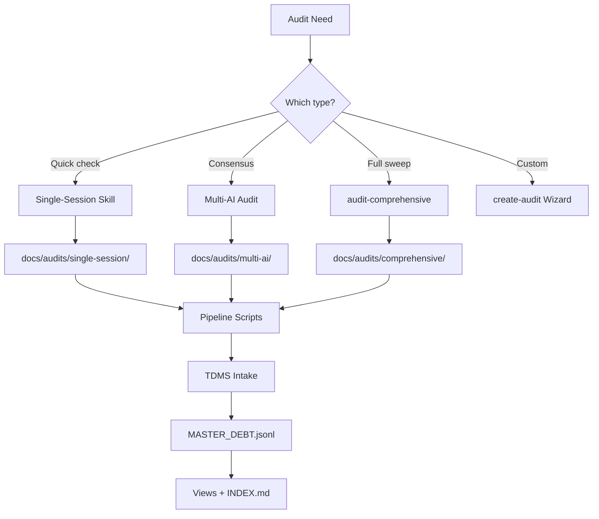

# Implementation Plan: Audit Ecosystem Codification

<!-- prettier-ignore-start -->
**Document Version:** 1.0
**Last Updated:** 2026-02-16
**Status:** COMPLETED/REFERENCE
<!-- prettier-ignore-end -->

> **Note:** This document captures the original design decisions and
> implementation plan for the audit ecosystem codification. For current
> standards see [AUDIT_STANDARDS.md](./AUDIT_STANDARDS.md). For current
> ecosystem state see [docs/audits/README.md](./README.md).

## Context

The audit system grew organically over 158 sessions into 11 skills, 10
templates, ~15 pipeline scripts, and full TDMS integration. However:

- `audit-enhancements` was never added to `audit-comprehensive`
- The ai-optimization audit (88 findings, Sessions #155-158) was done ad-hoc
  with no skill or multi-AI template
- No formal standards document exists for creating new audit types
- No framework for one-off/custom audits
- Documentation is spread across 5+ locations with no central hub
- Results pipeline is inconsistent: outputs land in 4+ different patterns
- FALSE_POSITIVES.jsonl path mismatch across 8 skill files
- audit-aggregator expects comprehensive/ dir that was never populated
- docs/audits/single-session/ai-optimization/ is an ad-hoc location outside the
  standard tree

This plan codifies the entire audit ecosystem: standards, results pipeline,
skills, templates, and documentation.

## Decision Record (from Q&A — 5 batches, 20 decisions)

| Decision                | Choice                                                    |
| ----------------------- | --------------------------------------------------------- |
| ai-optimization scope   | Broader meta-audit: 7 original + 5 new domains (12 total) |
| Comprehensive update    | Add both enhancements + ai-optimization (9 domain audits) |
| Custom audit framework  | Template-based generator skill (interactive wizard)       |
| Doc consolidation       | Create docs/audits/README.md hub (navigation, not moves)  |
| Skill name              | `audit-ai-optimization` (matches `audit-*` convention)    |
| Template size           | Full ~700-900 lines (match existing quality)              |
| Agent stages            | 3 stages: Core -> Extended -> Synthesis (~11 agents)      |
| Comprehensive placement | New Stage 2.5 between current S2 and S3                   |
| Generator scaffold      | Full: SKILL.md + template + dirs + tracker entry          |
| Visual docs             | Mermaid diagram + decision tree in README hub             |
| Categories              | Fixed 9: existing 7 + enhancements + ai-optimization      |
| Standards doc           | New standalone docs/audits/AUDIT_STANDARDS.md             |
| Priority order          | Standards first -> skills -> comprehensive -> wizard      |
| Tracker trigger         | 50 commits OR skill/hook/config file changes              |
| Results layout          | Consolidate under docs/audits/ with 3 clear paths         |
| FALSE_POSITIVES path    | Fix skill refs to point to docs/technical-debt/           |
| Aggregator fix          | Fix aggregator + comprehensive to use consistent paths    |
| Dep check scope         | Full cross-reference audit at end                         |

## Files to Create/Modify

### New Files (5)

1. **`docs/audits/AUDIT_STANDARDS.md`** — Canonical audit standards
2. **`docs/audits/README.md`** — Ecosystem hub with mermaid diagram
3. **`.claude/skills/audit-ai-optimization/SKILL.md`** — Meta-audit skill (12
   domains, 3 stages)
4. **`docs/audits/multi-ai/templates/AI_OPTIMIZATION_AUDIT.md`** — Multi-AI
   template (~700-900 lines)
5. **`.claude/skills/create-audit/SKILL.md`** — Interactive wizard skill

### Modified Files (12+)

1. **`.claude/skills/audit-comprehensive/SKILL.md`** — Add Stage 2.5, update
   output paths, update aggregator integration
2. **`.claude/skills/audit-aggregator/SKILL.md`** — Fix input paths to match
   comprehensive output structure
3. **`.claude/skills/audit-code/SKILL.md`** — Fix FALSE_POSITIVES path
4. **`.claude/skills/audit-security/SKILL.md`** — Fix FALSE_POSITIVES path
5. **`.claude/skills/audit-performance/SKILL.md`** — Fix FALSE_POSITIVES path
6. **`.claude/skills/audit-refactoring/SKILL.md`** — Fix FALSE_POSITIVES path
7. **`.claude/skills/audit-documentation/SKILL.md`** — Fix FALSE_POSITIVES path
8. **`.claude/skills/audit-process/SKILL.md`** — Fix FALSE_POSITIVES path
9. **`.claude/skills/audit-engineering-productivity/SKILL.md`** — Fix
   FALSE_POSITIVES path + fix output dir (currently writes to comprehensive/
   instead of single-session/)
10. **`.claude/skills/audit-enhancements/SKILL.md`** — Fix FALSE_POSITIVES path
11. **`docs/audits/AUDIT_TRACKER.md`** — Add ai-optimization category row
12. **`.claude/skills/SKILL_INDEX.md`** — Add new skill entries
13. **`docs/audits/multi-ai/README.md`** — Update template count + references

---

## Step 1: AUDIT_STANDARDS.md — The Foundation

**File:** `docs/audits/AUDIT_STANDARDS.md`

Canonical reference for creating, running, and extending audits.

### Sections

1. **Purpose & Scope**
2. **Audit Taxonomy** — The 3 types:
   - **Single-session** — One AI, parallel agents, fast
   - **Multi-AI consensus** — Multiple external AIs, template-driven, thorough
   - **Ad-hoc/custom** — One-off investigations (use create-audit wizard)
3. **9 Category Taxonomy** — Fixed categories with descriptions:
   - `code-quality`, `security`, `performance`, `refactoring`, `documentation`,
     `process`, `engineering-productivity`, `enhancements`, `ai-optimization`
   - Sub-category rules: domain-specific subdivisions OK, must map to parent
4. **Severity & Effort Scales** — S0-S3, E0-E3 (reference
   JSONL_SCHEMA_STANDARD.md)
5. **SKILL.md Structure Standard** — Required sections for any audit skill:
   - Frontmatter, Pre-Audit Validation, Agent Architecture, Output Format,
     Post-Audit
6. **Multi-AI Template Standard** — Required sections for any template:
   - Standard header, scope, sub-categories, output format, quality guardrails
7. **Results Pipeline & Storage Conventions** — The 3 canonical output paths:
   - Single-session: `docs/audits/single-session/<category>/audit-YYYY-MM-DD/`
   - Comprehensive: `docs/audits/comprehensive/audit-YYYY-MM-DD/`
   - Multi-AI: `docs/audits/multi-ai/<session-id>/raw/`, `canon/`, `final/`
   - **NO ad-hoc locations** — all audit output MUST use one of these 3 paths
   - Results flow: Output -> Pipeline scripts -> TDMS intake -> Views
8. **TDMS Integration Checklist** — Step-by-step intake process:
   - Schema validation, intake command, view regeneration, roadmap refs
   - Reference: `docs/technical-debt/FALSE_POSITIVES.jsonl` (canonical path)
9. **Naming Conventions** — skill: `audit-<name>`, template: `<NAME>_AUDIT.md`,
   output dir: `audit-YYYY-MM-DD/`
10. **Growth Guide** — How to add a new audit type (or use create-audit wizard)

**Fork structure from:** `JSONL_SCHEMA_STANDARD.md` and
`DOCUMENTATION_STANDARDS.md` for formatting consistency.

---

## Step 2: docs/audits/README.md — Ecosystem Hub

**File:** `docs/audits/README.md`

1. **Mermaid pipeline diagram** — Full flow with 3 branches:



2. **Skill inventory table** — All 12+ audit skills
3. **Decision tree** — When to use which audit type
4. **Pipeline script reference** — All scripts with usage
5. **Template inventory** — All multi-AI templates
6. **Quick reference links**

---

## Step 3: Results Pipeline Standardization

Fix inconsistent output locations across all audit skills.

### 3a. Fix FALSE_POSITIVES.jsonl Path (8 skills)

All 8 domain audit skills reference `docs/audits/FALSE_POSITIVES.jsonl` but the
actual file is `docs/technical-debt/FALSE_POSITIVES.jsonl`. Update all to:

```
docs/technical-debt/FALSE_POSITIVES.jsonl
```

**Files:** audit-code, audit-security, audit-performance, audit-refactoring,
audit-documentation, audit-process, audit-engineering-productivity,
audit-enhancements SKILL.md files.

### 3b. Fix audit-engineering-productivity Output Path

Currently writes to `docs/audits/comprehensive/` instead of
`docs/audits/single-session/engineering-productivity/`. Fix to match the
standard single-session path pattern.

### 3c. Fix audit-aggregator Input Paths

Update to read from `docs/audits/comprehensive/audit-YYYY-MM-DD/` (matching what
audit-comprehensive will actually produce). Add flexible input path support.

### 3d. Fix audit-comprehensive Output Paths

Ensure all 9 domain audit invocations write to a dated comprehensive directory:
`docs/audits/comprehensive/audit-YYYY-MM-DD/`. This makes each comprehensive run
self-contained and auditable.

### 3e. Standardize multi-ai-audit Session Paths

Ensure session output goes to `docs/audits/multi-ai/<session-id>/` with standard
subdirs: `raw/`, `canon/`, `final/`.

### 3f. Move docs/audits/single-session/ai-optimization/ to Standard Location

Move existing ad-hoc audit results to:
`docs/audits/single-session/ai-optimization/audit-2026-02-13/`

This establishes the canonical location. The SUMMARY.md and findings.jsonl
become the first entry in the new standard path.

---

## Step 4: audit-ai-optimization Skill

**File:** `.claude/skills/audit-ai-optimization/SKILL.md`

### 12 Domains across 3 Stages

**Stage 1: Core Efficiency (3 agents, parallel)**

| Agent           | Domains                        |
| --------------- | ------------------------------ |
| dead-assets     | Dead docs + Dead scripts       |
| fragile-parsing | Fragile parsing + Format waste |
| token-waste     | AI instruction bloat           |

**Stage 2: Extended Analysis (5 agents, parallel — 2 waves if needed)**

| Agent                | Domains                              |
| -------------------- | ------------------------------------ |
| hook-efficiency      | Hook latency + subprocess overhead   |
| skill-architecture   | Skill overlap + Agent prompt quality |
| mcp-config           | MCP config efficiency                |
| context-optimization | Context window optimization          |
| memory-state         | Memory/state management              |

**Stage 3: Synthesis (3 agents, parallel)**

| Agent           | Domains                            |
| --------------- | ---------------------------------- |
| automation-gaps | Automation coverage gaps           |
| cross-cutting   | Cross-domain patterns              |
| synthesis       | Priority ranking + recommendations |

### Key Design

- **Output:** `docs/audits/single-session/ai-optimization/audit-YYYY-MM-DD/`
- **Format:** JSONL per JSONL_SCHEMA_STANDARD.md, category=`ai-optimization`
- **Pre-audit:** Episodic memory, baselines, false positives from
  `docs/technical-debt/FALSE_POSITIVES.jsonl`
- **Post-audit:** TDMS intake command, verification steps
- **Parallel + sequential modes** supported
- **Fork from:** `audit-process/SKILL.md` (closest complexity)

---

## Step 5: Multi-AI Template

**File:** `docs/audits/multi-ai/templates/AI_OPTIMIZATION_AUDIT.md`

~700-900 lines:

1. Header: `## AI Optimization Audit Prompt (Copy for Each AI Model)`
2. Scope: `.claude/`, `scripts/`, `docs/`, hooks, skills, MCP config
3. 12 sub-categories matching skill domains (with what-to-look-for per domain)
4. Output format: JSONL schema with examples
5. Severity/effort guidelines specific to AI optimization findings
6. Quality guardrails: evidence required, confidence scoring
7. Cross-cutting analysis instructions

**Fork from:** `PROCESS_AUDIT.md` (972 lines, closest scope)

---

## Step 6: Update audit-comprehensive

**File:** `.claude/skills/audit-comprehensive/SKILL.md`

1. **Add Stage 2.5** between current Stage 2 and Stage 3:

```
Stage 2.5: Meta & Enhancement (2 agents, parallel)
  ├─ audit-enhancements
  └─ audit-ai-optimization
```

2. **Fix all output paths** to use dated comprehensive directory
3. **Add Stage 2.5 checkpoint** — verify both outputs exist
4. **Update aggregator prompt** — include 9 domain reports (was 7)
5. **Update context recovery matrix** — Stage 2.5 recovery path
6. **Update estimated times** — Parallel: ~50 -> ~65 min

---

## Step 7: Update audit-aggregator

**File:** `.claude/skills/audit-aggregator/SKILL.md`

1. **Fix input paths** to read from
   `docs/audits/comprehensive/audit-YYYY-MM-DD/`
2. **Update report count** — expects 9 domain reports (was 7)
3. **Add enhancements + ai-optimization** to the merge/dedup logic
4. **Ensure category mapping** includes `enhancements` and `ai-optimization`

---

## Step 8: create-audit Wizard Skill

**File:** `.claude/skills/create-audit/SKILL.md`

Interactive skill that scaffolds a new audit type:

1. **Ask:** Name, description, category (9 fixed), domains, agent count,
   parallel/sequential
2. **Generate:**
   - `.claude/skills/audit-<name>/SKILL.md` (from standards template)
   - `docs/audits/multi-ai/templates/<NAME>_AUDIT.md` (from standards template)
   - `docs/audits/single-session/<name>/` directory
   - Entry in `AUDIT_TRACKER.md` with threshold
3. **Optionally:** Add to audit-comprehensive staging
4. **Validate:** Run `npm run skills:validate`

References AUDIT_STANDARDS.md for all conventions.

---

## Step 9: Update Supporting Files

1. **`docs/audits/AUDIT_TRACKER.md`** — Add ai-optimization row:
   `| AI Optimization | Never | — | 50 commits OR skill/hook/config changes |`
2. **`.claude/skills/SKILL_INDEX.md`** — Add `audit-ai-optimization` and
   `create-audit`
3. **`docs/audits/multi-ai/README.md`** — Update template count (8+1 -> 8+2),
   add ai-optimization template reference, update category list

---

## Step 10: Full Cross-Reference Audit

After all changes, perform a comprehensive dependency check:

### 10a. Path Reference Verification

- Grep ALL `.claude/skills/audit-*/SKILL.md` files for path references
  (`docs/audits/`, `docs/technical-debt/`, `FALSE_POSITIVES`)
- Verify every referenced path exists on disk
- Verify every referenced script exists

### 10b. Skill Cross-References

- Verify audit-comprehensive references all 9 domain audit skill names correctly
- Verify audit-aggregator references match comprehensive output structure
- Verify multi-ai-audit template count matches actual template files
- Verify SKILL_INDEX.md lists all audit skills

### 10c. TDMS Integration Verification

- Verify `intake-audit.js` recognizes `ai-optimization` as a valid category
- Verify `extract-audits.js` category normalization includes `ai-optimization`
  and `enhancements`
- Verify `validate-schema.js` accepts category=`ai-optimization`

### 10d. Documentation Cross-References

- Run `npm run crossdoc:check` — verify no broken dependencies
- Run `npm run docs:check` — verify new docs pass checks
- Run `npm run docs:headers` — verify headers on new files
- Run `npm run skills:validate` — verify all audit skills pass
- Run `npm run patterns:check` — no new pattern violations

### 10e. AUDIT_TRACKER Consistency

- Verify all 9 categories in AUDIT_TRACKER.md match the 9-category taxonomy
- Verify threshold triggers are documented for all categories
- Run `npm run roadmap:hygiene` — verify no issues

---

## Execution Strategy

```
Wave 1 (parallel):
  [Step 1: AUDIT_STANDARDS.md]
  [Step 2: README.md hub]
  [Step 3: Results pipeline fixes — 8 skills + aggregator + comprehensive paths]

Wave 2 (parallel, after Wave 1):
  [Step 4: audit-ai-optimization skill]
  [Step 5: Multi-AI template]
  [Step 8: create-audit wizard]

Wave 3 (sequential, needs Wave 2 skill names):
  [Step 6: Update audit-comprehensive]
  [Step 7: Update audit-aggregator]

Wave 4 (sequential, needs all prior):
  [Step 9: Update supporting files]

Wave 5 (sequential, final):
  [Step 10: Full cross-reference audit]
```

---

## Verification Checklist

1. `npm run skills:validate` — all audit skills pass
2. `npm run docs:check` — new docs pass
3. `npm run docs:headers` — headers valid
4. `npm run crossdoc:check` — no broken dependencies
5. `npm run patterns:check` — no pattern violations
6. `npm run roadmap:hygiene` — no tracker issues
7. Grep audit skills for `FALSE_POSITIVES` — all point to `docs/technical-debt/`
8. Grep audit skills for output paths — all match 3 standard paths
9. AUDIT_TRACKER.md has 9 category rows
10. SKILL_INDEX.md lists all audit skills (12+)
11. multi-ai-audit/README.md template count matches reality
12. audit-comprehensive mentions 9 domain audits across 4 stages
