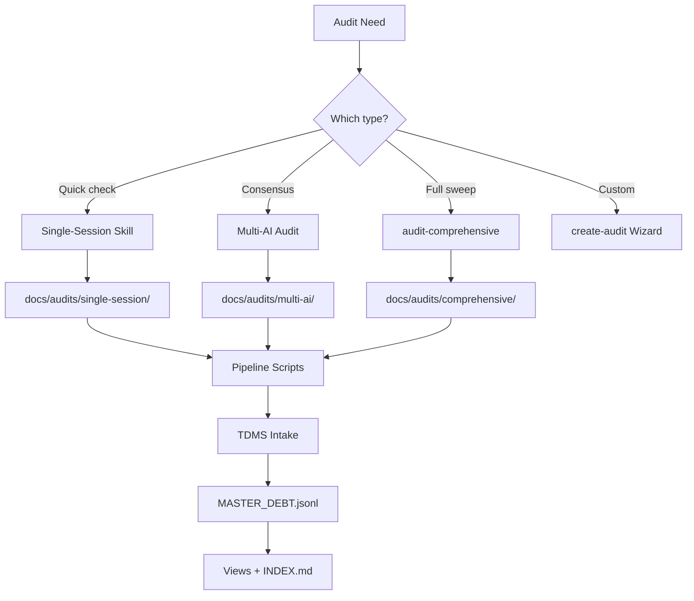

# Audit Ecosystem

<!-- prettier-ignore-start -->
**Document Version:** 1.0
**Last Updated:** 2026-02-14
**Status:** ACTIVE
<!-- prettier-ignore-end -->

Central hub for the SoNash audit ecosystem — skills, templates, pipeline, and
results.

---

## Pipeline Overview



---

## Decision Tree

```
When should I audit?
├─ Threshold triggered (see AUDIT_TRACKER.md)?
│   └─ Run /audit-<category> for that domain
├─ 100+ commits or 14+ days since last multi-AI?
│   └─ Run /multi-ai-audit (all categories)
├─ Major milestone complete?
│   └─ Run /audit-comprehensive
├─ Security concern or architecture change?
│   └─ Run /multi-ai-audit (security focus)
├─ Custom investigation needed?
│   └─ Run /create-audit to scaffold
└─ Just want to check health?
    └─ Run /alerts for dashboard overview
```

---

## Skill Inventory (12 skills)

### Domain Audit Skills (9)

| Skill                             | Category                   | Agents | Time (parallel) |
| --------------------------------- | -------------------------- | ------ | --------------- |
| `/audit-code`                     | `code-quality`             | 6      | ~15 min         |
| `/audit-security`                 | `security`                 | 5      | ~20 min         |
| `/audit-performance`              | `performance`              | 4      | ~15 min         |
| `/audit-refactoring`              | `refactoring`              | 4      | ~15 min         |
| `/audit-documentation`            | `documentation`            | 18     | ~20 min         |
| `/audit-process`                  | `process`                  | 22     | ~45 min         |
| `/audit-engineering-productivity` | `engineering-productivity` | 3      | ~15 min         |
| `/audit-enhancements`             | `enhancements`             | 8      | ~20 min         |
| `/audit-ai-optimization`          | `ai-optimization`          | 11     | ~30 min         |

### Orchestration Skills (3)

| Skill                  | Purpose                                    | Time    |
| ---------------------- | ------------------------------------------ | ------- |
| `/audit-comprehensive` | Runs all 9 domain audits in staged waves   | ~65 min |
| `/audit-aggregator`    | Merges + deduplicates multi-source results | ~10 min |
| `/create-audit`        | Interactive wizard to scaffold new audits  | ~5 min  |

---

## Multi-AI Templates (9)

Templates for running audits across multiple AI systems (Claude, GPT, Gemini).

| Template                                                                                           | Category                   |
| -------------------------------------------------------------------------------------------------- | -------------------------- |
| [CODE_REVIEW_PLAN.md](../multi-ai-audit/templates/CODE_REVIEW_PLAN.md)                             | `code-quality`             |
| [SECURITY_AUDIT_PLAN.md](../multi-ai-audit/templates/SECURITY_AUDIT_PLAN.md)                       | `security`                 |
| [PERFORMANCE_AUDIT_PLAN.md](../multi-ai-audit/templates/PERFORMANCE_AUDIT_PLAN.md)                 | `performance`              |
| [REFACTORING_AUDIT.md](../multi-ai-audit/templates/REFACTORING_AUDIT.md)                           | `refactoring`              |
| [DOCUMENTATION_AUDIT.md](../multi-ai-audit/templates/DOCUMENTATION_AUDIT.md)                       | `documentation`            |
| [PROCESS_AUDIT.md](../multi-ai-audit/templates/PROCESS_AUDIT.md)                                   | `process`                  |
| [ENGINEERING_PRODUCTIVITY_AUDIT.md](../multi-ai-audit/templates/ENGINEERING_PRODUCTIVITY_AUDIT.md) | `engineering-productivity` |
| [ENHANCEMENT_AUDIT.md](../multi-ai-audit/templates/ENHANCEMENT_AUDIT.md)                           | `enhancements`             |
| [AI_OPTIMIZATION_AUDIT.md](../multi-ai-audit/templates/AI_OPTIMIZATION_AUDIT.md)                   | `ai-optimization`          |

**Shared base:**
[SHARED_TEMPLATE_BASE.md](../multi-ai-audit/templates/SHARED_TEMPLATE_BASE.md)
**Aggregator:** [AGGREGATOR.md](../multi-ai-audit/templates/AGGREGATOR.md)

---

## Results Directory Structure

```
docs/audits/
├── AUDIT_STANDARDS.md          ← Standards reference (you are here)
├── README.md                   ← This hub
├── single-session/             ← Per-category, per-date results
│   ├── code/
│   │   └── audit-YYYY-MM-DD/
│   ├── security/
│   ├── performance/
│   ├── refactoring/
│   ├── documentation/
│   ├── process/
│   ├── engineering-productivity/
│   ├── enhancements/
│   └── ai-optimization/
├── comprehensive/              ← Full-sweep results
│   └── audit-YYYY-MM-DD/
│       ├── audit-code-report.md
│       ├── audit-security-report.md
│       ├── ...
│       └── COMPREHENSIVE_AUDIT_REPORT.md
└── multi-ai/                   ← Multi-model consensus results
    └── <session-id>/
        ├── raw/                ← Per-model outputs
        ├── canon/              ← Deduplicated canonical
        └── final/              ← Aggregated report
```

---

## Pipeline Scripts

| Script                      | Location            | Purpose                                |
| --------------------------- | ------------------- | -------------------------------------- |
| `intake-audit.js`           | `scripts/debt/`     | Ingest findings to TDMS                |
| `extract-agent-findings.js` | `scripts/multi-ai/` | Parse agent JSONL log outputs          |
| `normalize-format.js`       | `scripts/multi-ai/` | Standardize field names                |
| `aggregate-category.js`     | `scripts/multi-ai/` | Merge multi-AI results per category    |
| `unify-findings.js`         | `scripts/multi-ai/` | Cross-category deduplication           |
| `consolidate-all.js`        | `scripts/debt/`     | Full pipeline: extract → dedup → views |
| `generate-views.js`         | `scripts/debt/`     | Generate INDEX.md and METRICS.md       |
| `generate-metrics.js`       | `scripts/debt/`     | Generate metrics.json for dashboard    |
| `validate-schema.js`        | `scripts/debt/`     | Validate JSONL against schema          |

---

## Key References

| Document                                                          | Purpose                   |
| ----------------------------------------------------------------- | ------------------------- |
| [AUDIT_STANDARDS.md](./AUDIT_STANDARDS.md)                        | Canonical standards       |
| [AUDIT_TRACKER.md](../AUDIT_TRACKER.md)                           | Threshold tracking        |
| [JSONL_SCHEMA_STANDARD.md](../templates/JSONL_SCHEMA_STANDARD.md) | JSONL field definitions   |
| [FALSE_POSITIVES.jsonl](../technical-debt/FALSE_POSITIVES.jsonl)  | Known false positives     |
| [MASTER_DEBT.jsonl](../technical-debt/MASTER_DEBT.jsonl)          | All tracked findings      |
| [multi-ai-audit/README.md](../multi-ai-audit/README.md)           | Multi-AI workflow details |

---

## Version History

| Version | Date       | Change           |
| ------- | ---------- | ---------------- |
| 1.0     | 2026-02-14 | Initial creation |
