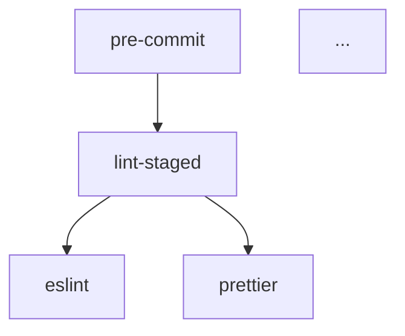

# [Project Name] Multi-AI Process & Automation Audit Plan

**Document Version:** 2.0 **Created:** 2026-01-05 **Last Updated:** 2026-01-31
**Status:** PENDING | IN_PROGRESS | COMPLETE **Overall Completion:** 0%

---

## Purpose

This document serves as the **execution plan** for running a multi-AI process
and automation quality audit on [Project Name]. Use this template when:

- Full automation health check covering all 16 automation types
- Pre-commit hooks bloated or commands getting lost
- CI/CD pipelines need review for reliability
- Script duplication or dead code suspected
- Quality gates may have gaps or false positives
- Quarterly comprehensive process health check
- TDMS integration needed for findings tracking

**Review Scope (16 Automation Types):**

| Type               | Location                   | Count |
| ------------------ | -------------------------- | ----- |
| Claude Hooks       | `.claude/hooks/`           | [X]   |
| Skills             | `.claude/skills/`          | [X]   |
| Commands           | `.claude/commands/`        | [X]   |
| npm Scripts        | `package.json`             | [X]   |
| Standalone Scripts | `scripts/*.js`             | [X]   |
| Script Libraries   | `scripts/lib/`             | [X]   |
| GitHub Actions     | `.github/workflows/`       | [X]   |
| Husky Hooks        | `.husky/`                  | [X]   |
| lint-staged        | `package.json` or config   | [X]   |
| ESLint             | `eslint.config.mjs`        | [X]   |
| Prettier           | `.prettierrc`              | [X]   |
| TypeScript Config  | `tsconfig*.json`           | [X]   |
| Firebase Functions | `functions/src/`           | [X]   |
| Scheduled Jobs     | Firebase/cron              | [X]   |
| Firebase Rules     | `*.rules`                  | [X]   |
| MCP Servers        | `.claude/mcp-servers.json` | [X]   |

**Audit Categories (12 Dimensions):**

1. Redundancy & Duplication
2. Dead/Orphaned Code
3. Effectiveness
4. Performance & Bloat
5. Error Handling
6. Dependency & Call Chain
7. Consistency
8. Coverage Gaps
9. Maintainability
10. Functionality Verification
11. Improvement Opportunities
12. Code Quality (Limited)

**7-Stage Audit Approach:**

| Stage | Focus                          | Agents |
| ----- | ------------------------------ | ------ |
| 1     | Inventory & Dependency Mapping | 6      |
| 2     | Redundancy & Dead Code         | 3      |
| 3     | Effectiveness & Functionality  | 4      |
| 4     | Performance & Bloat            | 3      |
| 5     | Quality & Consistency          | 3      |
| 6     | Coverage Gaps & Improvements   | 3      |
| 7     | Synthesis & Prioritization     | 1      |

**Expected Output:** Process findings with TDMS integration, dependency graph,
priority action plan, and automation improvements.

---

## Status Dashboard

| Step    | Description                              | Status  | Completion |
| ------- | ---------------------------------------- | ------- | ---------- |
| Step 1  | Prepare audit context                    | PENDING | 0%         |
| Step 2  | Run Stage 1: Inventory (6 agents)        | PENDING | 0%         |
| Step 3  | Run Stage 2: Redundancy (3 agents)       | PENDING | 0%         |
| Step 4  | Run Stage 3: Effectiveness (4 agents)    | PENDING | 0%         |
| Step 5  | Run Stage 4: Performance (3 agents)      | PENDING | 0%         |
| Step 6  | Run Stage 5: Quality (3 agents)          | PENDING | 0%         |
| Step 7  | Run Stage 6: Coverage (3 agents)         | PENDING | 0%         |
| Step 8  | Run Stage 7: Synthesis (sequential)      | PENDING | 0%         |
| Step 9  | Run multi-AI audit (3-4 external models) | PENDING | 0%         |
| Step 10 | Collect and validate outputs             | PENDING | 0%         |
| Step 11 | Run aggregation                          | PENDING | 0%         |
| Step 12 | Ingest to TDMS                           | PENDING | 0%         |
| Step 13 | Create canonical findings doc            | PENDING | 0%         |

**Overall Progress:** 0/13 steps complete

---

## Audit Context

### Repository Information

```
Repository URL: [GITHUB_REPO_URL]
Branch: [BRANCH_NAME or "main"]
Commit: [COMMIT_SHA or "latest"]
Last Process Audit: [YYYY-MM-DD or "Never"]
```

### Process & Automation Inventory (16 Types)

```
Claude Code:
- Hooks: [.claude/hooks/ - list hooks]
- Skills: [.claude/skills/ - count and key skills]
- Commands: [.claude/commands/ - list commands]

npm/Scripts:
- npm scripts: [package.json scripts count]
- Standalone scripts: [scripts/ count]
- Script libraries: [scripts/lib/ count]

CI/CD & Git:
- GitHub Actions: [.github/workflows/ - list workflows]
- Husky hooks: [.husky/ - list hooks]
- lint-staged: [config location and scope]

Linting & Formatting:
- ESLint: [config location, plugin count]
- Prettier: [config location]
- TypeScript: [tsconfig files count]

Firebase:
- Cloud Functions: [functions/src/ count]
- Scheduled Jobs: [cron/scheduled function count]
- Rules: [firestore.rules, storage.rules]

MCP:
- Servers: [.claude/mcp-servers.json - server count]
```

### Scope

```
Include:
- .claude/hooks/
- .claude/skills/
- .claude/commands/
- .claude/mcp-servers.json
- scripts/
- package.json (scripts section)
- .github/workflows/
- .husky/
- eslint.config.mjs
- .prettierrc
- tsconfig*.json
- functions/src/
- *.rules

Exclude:
- node_modules/
- .git/
- dist/
- build/
- coverage/
```

---

## AI Models to Use

**Recommended configuration (3-4 models for consensus):**

| Model             | Capabilities                       | Process Analysis Strength                                            |
| ----------------- | ---------------------------------- | -------------------------------------------------------------------- |
| Claude Opus 4.5   | browse_files=yes, run_commands=yes | Comprehensive process analysis, CI/CD expertise, automation patterns |
| Claude Sonnet 4.5 | browse_files=yes, run_commands=yes | Cost-effective process review, script analysis                       |
| GPT-5-Codex       | browse_files=yes, run_commands=yes | Script quality analysis, workflow optimization                       |
| Gemini 3 Pro      | browse_files=yes, run_commands=yes | Alternative process perspective                                      |

**Selection criteria:**

- At least 2 models with `run_commands=yes` for script execution testing
- At least 1 model with CI/CD pipeline expertise
- Total 3-4 models recommended for good consensus

**Note on Parallel Agents:**

The 7-stage approach with 22 parallel agents is designed for **Claude Code**
which has native Task tool support. External AI models should use the
**Sequential Approach** described below, which covers the same scope but runs
stages one at a time. Both approaches produce TDMS-compatible output.

---

## Approach Selection

### Option A: Claude Code (Parallel Agents)

Use when running audit via Claude Code CLI:

- Executes 22 parallel agents across 6 stages
- Fastest execution
- Maximum coverage in single session
- Use `/audit-process` skill

### Option B: External AI (Sequential)

Use when running audit via external AI models (GPT, Gemini, etc.):

- Run stages sequentially (one at a time)
- Same scope and categories
- Same output format
- Slower but universally compatible

### Option C: Hybrid

Use Claude Code for Stages 1-6 (parallel), then aggregate with external AI
models for Stage 7 synthesis and cross-validation.

---

## Process Audit Prompt (Copy for Each AI Model)

### Part 1: Role and Context

```markdown
ROLE

You are a DevOps and Process Engineer performing a comprehensive process and
automation quality audit. Your goal is to assess all 16 automation types across
12 audit dimensions using the 7-stage approach.

REPO

[GITHUB_REPO_URL]

PROCESS STACK

- CI/CD: [Platform, e.g., GitHub Actions]
- Claude Code: [Hooks, Skills, Commands]
- Testing: [Framework]
- Linting: [Tools]
- Deployment: [Platform]
- Firebase: [Functions, Rules, Scheduled Jobs]
- MCP: [Servers configured]

PRE-REVIEW CONTEXT (REQUIRED READING)

Before beginning process analysis, review these project-specific resources:

1. **AI Learnings** (claude.md Section 4): Process patterns and lessons from
   past reviews
2. **Pattern History** (../AI_REVIEW_LEARNINGS_LOG.md): Documented process
   issues from Reviews #1-60+
3. **Current Compliance** (npm run patterns:check output): Known anti-pattern
   violations baseline
4. **Dependency Health**:
   - Circular dependencies: npm run deps:circular (baseline: 0 expected)
   - Unused exports: npm run deps:unused (baseline documented in DEVELOPMENT.md)
5. **Static Analysis** (../analysis/sonarqube-manifest.md): Pre-identified
   script quality issues
6. **Workflow Documentation** (if available): CI/CD process docs, hook
   documentation
7. **TDMS**: docs/technical-debt/MASTER_DEBT.jsonl for existing tracked debt

These resources provide essential context about automation expectations and
known issues.

SCOPE (16 AUTOMATION TYPES)

1. Claude Hooks (.claude/hooks/)
2. Skills (.claude/skills/)
3. Commands (.claude/commands/)
4. npm Scripts (package.json)
5. Standalone Scripts (scripts/\*.js)
6. Script Libraries (scripts/lib/)
7. GitHub Actions (.github/workflows/)
8. Husky Hooks (.husky/)
9. lint-staged (package.json or config)
10. ESLint (eslint.config.mjs)
11. Prettier (.prettierrc)
12. TypeScript Configs (tsconfig\*.json)
13. Firebase Functions (functions/src/)
14. Scheduled Jobs (Firebase/cron)
15. Firebase Rules (\*.rules)
16. MCP Servers (.claude/mcp-servers.json)

AUDIT DIMENSIONS (12 CATEGORIES)

1. Redundancy & Duplication
2. Dead/Orphaned Code
3. Effectiveness
4. Performance & Bloat
5. Error Handling
6. Dependency & Call Chain
7. Consistency
8. Coverage Gaps
9. Maintainability
10. Functionality Verification
11. Improvement Opportunities
12. Code Quality (Limited)

CAPABILITIES (REQUIRED FIRST OUTPUT)

Before any findings, print exactly:

CAPABILITIES: browse_files=<yes/no>, run_commands=<yes/no>,
repo_checkout=<yes/no>, limitations="<one sentence>"

If browse_files=no OR repo_checkout=no:

- Run in "LIMITED MODE": Provide general recommendations only
- Note: Script testing requires repo access
```

### Part 2: Anti-Hallucination Rules

```markdown
NON-NEGOTIABLE EVIDENCE RULE (ANTI-HALLUCINATION)

A process finding is CONFIRMED only if it includes:

- at least one concrete file path OR workflow name AND
- at least one specific issue (missing check, false positive, coverage gap)

If you cannot provide both, put it in SUSPECTED_FINDINGS with confidence <= 40.

EVIDENCE REQUIREMENTS

Each finding MUST include:

- File path with line number
- Code snippet (3-5 lines)
- Verification method
- Standard reference (if applicable)
```

### Part 3: 7-Stage Process Audit

```markdown
STAGE 1: INVENTORY & DEPENDENCY MAPPING

For each of the 16 automation types, create complete inventory:

1.1 CLAUDE CODE INVENTORY

- List all hooks in .claude/hooks/
- List all skills in .claude/skills/
- List all commands in .claude/commands/
- Map hook triggers (PreToolUse, PostToolUse, etc.)
- Note dependencies between items

  1.2 SCRIPTS INVENTORY

- List all package.json scripts
- List all files in scripts/
- List all files in scripts/lib/
- Map npm script → standalone script relationships
- Identify call chains

  1.3 CI/CD INVENTORY

- List all GitHub Actions workflows
- List Husky hooks
- Map lint-staged configuration
- Note trigger conditions (on: push, PR, schedule)

  1.4 LINTING INVENTORY

- Document ESLint rules and plugins
- Document Prettier configuration
- Document TypeScript configs
- Note extends/references

  1.5 FIREBASE INVENTORY

- List all Cloud Functions
- List scheduled jobs
- Document Firestore rules
- Document Storage rules

  1.6 MCP INVENTORY

- List all configured servers
- Document capabilities per server

Output: INVENTORY.md with counts, locations, and dependency graph

STAGE 2: REDUNDANCY & DEAD CODE ANALYSIS

2.1 DUPLICATION DETECTION

- Find duplicated functionality across scripts
- Find overlapping npm scripts
- Find redundant CI checks
- Find skills/commands with overlapping purpose

  2.2 DEAD CODE DETECTION

- Find unused npm scripts
- Find orphaned standalone scripts
- Find unreferenced skills/commands
- Find disabled/commented workflows

  2.3 CROSS-REFERENCE ANALYSIS

- Map what calls what
- Identify unreachable code paths
- Find circular dependencies in automation

Output: STAGE2_FINDINGS.jsonl

STAGE 3: EFFECTIVENESS & FUNCTIONALITY

3.1 HOOK EFFECTIVENESS

- Test each Claude hook actually runs
- Verify hooks accomplish stated purpose
- Check for hooks that never trigger

  3.2 SCRIPT EFFECTIVENESS

- Test key scripts execute correctly
- Verify scripts accomplish stated purpose
- Check exit codes and error handling

  3.3 CI/CD EFFECTIVENESS

- Verify workflows run on correct triggers
- Check for flaky tests/jobs
- Verify quality gates actually gate

  3.4 FIREBASE EFFECTIVENESS

- Verify functions are deployed and callable
- Test scheduled jobs run on schedule
- Verify rules enforce stated permissions

Output: STAGE3_FINDINGS.jsonl

STAGE 4: PERFORMANCE & BLOAT

4.1 EXECUTION TIME ANALYSIS

- Time pre-commit hook execution
- Time CI workflow duration
- Identify slow scripts
- Find timeout risks

  4.2 BLOAT DETECTION

- Find overly complex scripts (>500 lines)
- Find workflows with unnecessary steps
- Find skills with excessive prompts
- Identify oversized configurations

  4.3 RESOURCE USAGE

- Check for memory-intensive operations
- Find parallel execution opportunities
- Identify bottlenecks in pipelines

Output: STAGE4_FINDINGS.jsonl

STAGE 5: QUALITY & CONSISTENCY

5.1 ERROR HANDLING REVIEW

- Check scripts have proper error handling
- Check functions handle failures gracefully
- Verify hooks fail safely
- Check for proper cleanup on error

  5.2 CONSISTENCY ANALYSIS

- Check naming conventions across types
- Check logging patterns
- Check exit code conventions
- Verify documentation consistency

  5.3 MAINTAINABILITY ASSESSMENT

- Check for hardcoded values
- Check for proper configuration
- Assess test coverage for scripts
- Review documentation quality

Output: STAGE5_FINDINGS.jsonl

STAGE 6: COVERAGE GAPS & IMPROVEMENTS

6.1 COVERAGE GAP ANALYSIS

- What should be automated but isn't?
- What events lack hooks?
- What scripts lack tests?
- What rules are incomplete?

  6.2 IMPROVEMENT OPPORTUNITIES

- Where can automation be simplified?
- What can be consolidated?
- Where are quick wins?
- What new automation would help?

  6.3 GOLDEN PATH ASSESSMENT

- Single command for setup?
- Single command for dev?
- Single command for test?
- Single command for deploy?
- Doctor/diagnostic script exists?

Output: STAGE6_FINDINGS.jsonl

STAGE 7: SYNTHESIS & PRIORITIZATION

Combine all findings:

1. Deduplicate across stages
2. Assign priority scores
3. Group by actionability
4. Create implementation order
5. Estimate total effort

Priority Matrix:

- P1 (Critical): Broken, blocking, or security issue
- P2 (High): Significant waste or friction
- P3 (Medium): Improvement opportunity
- P4 (Low): Nice-to-have polish

Output: FINAL_SYNTHESIS.md with prioritized action plan
```

### Part 4: Output Format

````markdown
OUTPUT FORMAT (STRICT)

Return these sections in order:

1. INVENTORY_JSON { "audit_date": "YYYY-MM-DD", "automation_counts": {
   "claude_hooks": X, "skills": X, "commands": X, "npm_scripts": X,
   "standalone_scripts": X, "script_libs": X, "github_actions": X,
   "husky_hooks": X, "lint_staged_patterns": X, "eslint_rules": X,
   "firebase_functions": X, "scheduled_jobs": X, "firebase_rules": X,
   "mcp_servers": X }, "total_automation_items": X }

2. FINDINGS_JSONL (one JSON object per line, each must be valid JSON)

Schema (TDMS-compatible): { "id": "PROC-XXX", "stage": 1-7, "category":
"Redundancy|DeadCode|Effectiveness|Performance|ErrorHandling|Dependency|Consistency|CoverageGap|Maintainability|Functionality|Improvement|CodeQuality",
"automation_type":
"hook|skill|command|npm_script|script|script_lib|github_action|husky|lint_staged|eslint|prettier|tsconfig|firebase_function|scheduled_job|firebase_rules|mcp_server",
"title": "short, specific issue", "fingerprint": "<type>::<file>::<issue_type>",
"severity": "S0|S1|S2|S3", "effort": "E0|E1|E2|E3", "confidence": 0-100,
"files": ["path1"], "line": 123, "description": "detailed description",
"recommendation": "how to fix", "evidence": ["code snippets", "test output"],
"tdms_category":
"architecture|code_quality|testing|infrastructure|security|documentation|technical_debt"
}

**⚠️ REQUIRED FIELDS:** `files`, `line`, `severity`, `effort`, `tdms_category`

3. SUSPECTED_FINDINGS_JSONL (same schema, but confidence <= 40; needs
   verification)

4. DEPENDENCY_GRAPH Mermaid diagram showing automation relationships:


````

5. PRIORITY_ACTION_PLAN { "p1_critical": [{"id": "PROC-001", "title": "...",
   "effort": "E0"}], "p2_high": [...], "p3_medium": [...], "p4_low": [...],
   "total_effort_estimate": "X days", "quick_wins": ["PROC-002", "PROC-005"] }

6. HUMAN_SUMMARY (markdown)

- Automation health overview
- Key statistics (16 types, 12 categories assessed)
- Critical issues requiring immediate attention
- Top 5 automation improvements
- Coverage gaps to address
- Recommended improvement order
- TDMS integration notes

````

### Part 5: Verification Commands

```markdown
VERIFICATION COMMANDS (run if run_commands=yes)

1. Claude Code Analysis:
ls -la .claude/hooks/
ls -la .claude/skills/
ls -la .claude/commands/
cat .claude/mcp-servers.json | jq '.mcpServers | keys'

2. Script Analysis:
npm run --list
ls -la scripts/
ls -la scripts/lib/

3. CI/CD Analysis:
ls -la .github/workflows/
cat .github/workflows/*.yml | grep -E "on:|name:" | head -50
ls -la .husky/

4. Lint Analysis:
cat eslint.config.mjs | head -50
cat .prettierrc
ls tsconfig*.json

5. Firebase Analysis:
ls -la functions/src/
grep -r "exports\." functions/src/ | head -20
cat firestore.rules | head -30

6. Pattern Checks:
npm run patterns:check 2>&1 | head -50

Paste only minimal excerpts as evidence.
````

---

## Sequential Approach (External AI Models)

For AI models that cannot run parallel agents, use this sequential approach:

### Stage-by-Stage Execution

Run each stage as a separate prompt, collecting outputs before proceeding:

**Prompt 1: Inventory (Stage 1)**

```
Using the context above, complete Stage 1 only:
- Create inventory of all 16 automation types
- Count items in each category
- Map dependencies between items
- Output: INVENTORY_JSON

Stop after completing inventory. Do not proceed to analysis.
```

**Prompt 2: Redundancy & Dead Code (Stage 2)**

```
Using the inventory from Stage 1, complete Stage 2:
- Find duplicated functionality
- Find dead/orphaned code
- Cross-reference what calls what
- Output: STAGE2_FINDINGS.jsonl (TDMS format)

Stop after Stage 2 findings.
```

**Prompt 3: Effectiveness (Stage 3)**

```
Complete Stage 3 effectiveness analysis:
- Assess hook effectiveness
- Assess script effectiveness
- Assess CI/CD effectiveness
- Assess Firebase effectiveness
- Output: STAGE3_FINDINGS.jsonl (TDMS format)
```

**Prompt 4: Performance (Stage 4)**

```
Complete Stage 4 performance analysis:
- Analyze execution times
- Detect bloat
- Assess resource usage
- Output: STAGE4_FINDINGS.jsonl (TDMS format)
```

**Prompt 5: Quality (Stage 5)**

```
Complete Stage 5 quality analysis:
- Review error handling
- Check consistency
- Assess maintainability
- Output: STAGE5_FINDINGS.jsonl (TDMS format)
```

**Prompt 6: Coverage (Stage 6)**

```
Complete Stage 6 coverage analysis:
- Identify coverage gaps
- Find improvement opportunities
- Assess Golden Path
- Output: STAGE6_FINDINGS.jsonl (TDMS format)
```

**Prompt 7: Synthesis (Stage 7)**

```
Using all findings from Stages 2-6, complete synthesis:
- Deduplicate findings
- Assign priorities (P1-P4)
- Create implementation order
- Output: PRIORITY_ACTION_PLAN, HUMAN_SUMMARY
```

### Sequential Output Collection

After each prompt, save:

- `stage[N]_[model-name].jsonl`

Then proceed to aggregation across models.

---

## TDMS Integration

### Automatic Intake

After each stage, ingest findings to TDMS:

```bash
# After Stage 2
node scripts/debt/intake-audit.js \
  docs/audits/single-session/process/stage2-findings-YYYY-MM-DD.jsonl \
  --source "process-audit-v2" \
  --batch-id "proc-audit-YYYYMMDD"

# Repeat for Stages 3-6
```

### Required TDMS Fields

Ensure all findings include:

- `title`: Short description
- `severity`: S0|S1|S2|S3
- `tdms_category`: One of the 7 TDMS categories
- `file`: Primary file path
- `line`: Line number (or 1 for file-wide)
- `description`: Full description
- `recommendation`: How to fix

---

## Aggregation Process

### Step 1: Collect Internal Stage Outputs

For each stage (2-6), collect:

- `stage[N]_findings.jsonl`

### Step 2: Collect External AI Outputs

For each external AI model, save:

- `[model-name]_inventory.json`
- `[model-name]_findings.jsonl`
- `[model-name]_suspected.jsonl`
- `[model-name]_summary.md`

### Step 3: Run Aggregator

```markdown
ROLE

You are the Process Audit Aggregator. Merge multiple AI process audit outputs
into one prioritized improvement plan.

NON-NEGOTIABLE PRINCIPLES

- You are an AGGREGATOR, not a fresh auditor
- You MUST NOT invent process issues not in auditor outputs
- Prioritize by impact on reliability and velocity
- Ensure TDMS compatibility

DEDUPLICATION RULES

1. Primary merge: same automation_type + same file + same issue
2. Secondary merge: same improvement recommendation
3. Take most complete analysis when disagreement

SEVERITY HANDLING

If models disagree on severity:

- Take HIGHER severity if 2+ models agree
- For pipeline/hook issues: Consider impact on all developers

OUTPUT

1. CONSOLIDATED_INVENTORY_JSON
2. DEDUPED_FINDINGS_JSONL (with canonical_id, TDMS-ready)
3. IMPROVEMENT_PLAN_JSON (ordered by priority)
4. TDMS_INTAKE_READY.jsonl (formatted for scripts/debt/intake-audit.js)
```

### Step 4: Ingest to TDMS

```bash
node scripts/debt/intake-audit.js \
  docs/audits/single-session/process/TDMS_INTAKE_READY.jsonl \
  --source "multi-ai-process-audit" \
  --batch-id "proc-audit-YYYYMMDD"
```

---

## Implementation Workflow

After aggregation, implement improvements using this workflow:

### Step 1: Process Improvement Implementer

```markdown
ROLE

You are a DevOps Engineer implementing improvements from a process audit.

HARD RULES

- Test all workflow/script changes before committing
- Ensure backwards compatibility
- Document all automation changes
- Verify CI still passes after changes
- Update TDMS item status after fixing

PROCESS

1. Implement improvement
2. Test locally (run script, trigger hook)
3. Test in CI (push to branch, check workflow)
4. Document changes (README, inline comments)
5. Mark TDMS item as resolved
```

### Step 2-4: Same as Code Review Template

Use R1, R2, and Between-PR checklist from MULTI_AI_CODE_REVIEW_PLAN_TEMPLATE.md.

---

## Audit History

| Date   | Type         | Trigger  | Stages Run | Models Used | Findings | TDMS Items |
| ------ | ------------ | -------- | ---------- | ----------- | -------- | ---------- |
| [Date] | Process v2.0 | [Reason] | 1-7        | [Models]    | [X]      | [X added]  |

---

## AI Instructions

When using this template:

1. **Copy this template** to `docs/reviews/PROCESS_AUDIT_PLAN_[YYYY]_Q[X].md`
2. **Fill in Audit Context** with project-specific details and counts
3. **Run 7-stage internal audit** with parallel agents per stage
4. **Run the process audit prompt** on each external model
5. **Collect outputs** in specified formats
6. **Run aggregation** for consolidated findings
7. **Ingest to TDMS** using intake script
8. **Create canonical findings doc**
9. **Prioritize by impact/effort**
10. **Update MULTI_AI_REVIEW_COORDINATOR.md** with audit results

**Quality checks before finalizing:**

- [ ] All 16 automation types inventoried
- [ ] All 12 categories assessed
- [ ] All 7 stages completed
- [ ] TDMS fields populated correctly
- [ ] Findings deduplicated
- [ ] Priority action plan created
- [ ] Dependency graph generated
- [ ] Golden Path assessed
- [ ] TDMS intake completed

---

## Related Documents

- **[JSONL_SCHEMA_STANDARD.md](./JSONL_SCHEMA_STANDARD.md)** - Canonical JSONL
  schema for all review templates
- **[.claude/skills/audit-process/SKILL.md]** - Single-session audit skill
  (v2.0)
- **[docs/technical-debt/PROCEDURE.md]** - TDMS intake procedure
- **MULTI_AI_REVIEW_COORDINATOR.md** - Master index and trigger tracking
- **MULTI_AI_CODE_REVIEW_PLAN_TEMPLATE.md** - General code review template
- **AI_WORKFLOW.md** - AI development workflow documentation
- **GitHub workflows** - CI/CD workflow files (`.github/workflows/`)

---

## Version History

| Version | Date       | Changes                                                                                                                                | Author |
| ------- | ---------- | -------------------------------------------------------------------------------------------------------------------------------------- | ------ |
| 2.0     | 2026-01-31 | **Major expansion**: 16 automation types, 12 categories, 7-stage approach, TDMS integration, parallel agents (Session #120)            | Claude |
| 1.4     | 2026-01-13 | Added Category 7 "Golden Path & Developer Experience" - from Engineering Productivity audit recommendations                            | Claude |
| 1.3     | 2026-01-11 | Session #48: Added Category 3b "Script Trigger Coverage" - checks for orphan scripts, missing npm commands, and automatic trigger gaps | Claude |
| 1.2     | 2026-01-06 | Review #68: Updated document header to 1.1; Added HUMAN_SUMMARY content description                                                    | Claude |
| 1.1     | 2026-01-06 | Review #67: Aligned category enum (Documentation → Workflow Docs) to match AGGREGATOR                                                  | Claude |
| 1.0     | 2026-01-05 | Initial template creation - Process & Automation audit category added to multi-AI review framework                                     | Claude |

---

**END OF MULTI_AI_PROCESS_AUDIT_TEMPLATE.md**
